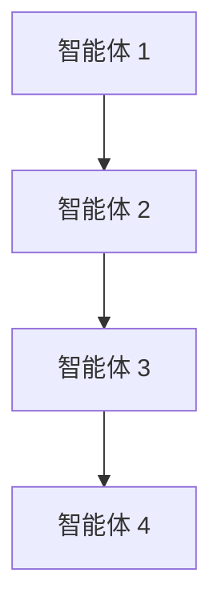
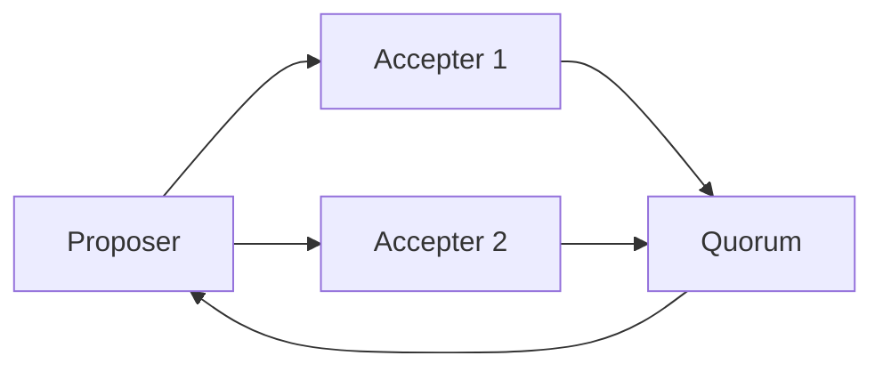
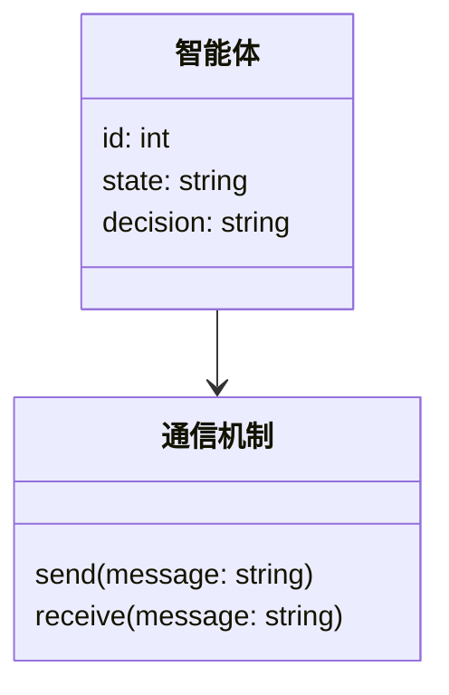
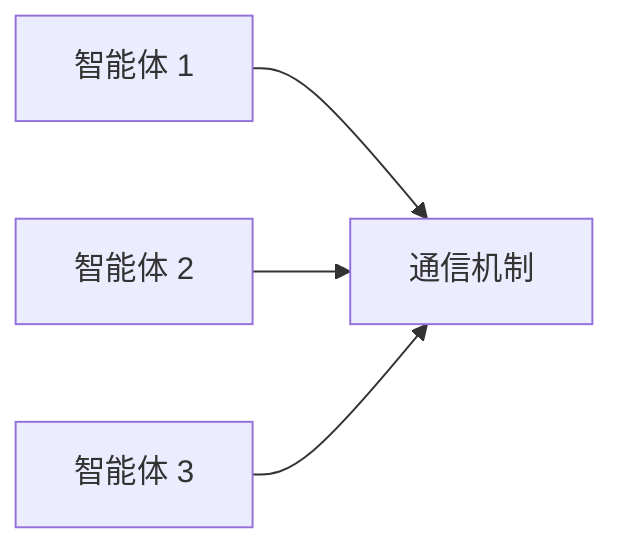

                 


# 构建具有多智能体协同决策能力的系统

**关键词：多智能体系统、协同决策、分布式计算、一致性算法、博弈论**

**摘要：**  
本文深入探讨了构建具有多智能体协同决策能力系统的各个方面，从基本概念到算法原理，再到实际应用。通过详细的理论分析和实际案例，我们揭示了多智能体系统的核心原理、协同决策的实现方法，以及分布式计算和一致性算法在系统设计中的重要性。最后，我们通过一个具体的项目实战，展示了如何将理论应用于实际场景，帮助读者全面掌握多智能体协同决策系统的构建方法。

---

# 第一部分: 多智能体协同决策系统概述

## 第1章: 多智能体协同决策系统背景介绍

### 1.1 多智能体系统（Multi-Agent System, MAS）的概念

#### 1.1.1 多智能体系统的定义

多智能体系统（MAS）是指由多个智能体（Agent）组成的分布式系统，这些智能体能够通过协同工作完成复杂任务。智能体是具有感知、决策和执行能力的实体，可以是软件程序、机器人或其他智能设备。

#### 1.1.2 多智能体系统的核心要素

| 核心要素 | 描述 |
|----------|------|
| 智能体   | 具有自主性、反应性和协作性的实体 |
| 通信机制 | 智能体之间的信息交换方式 |
| 协同决策 | 智能体基于共享目标做出的集体决策 |
| 环境     | 智能体所处的物理或数字环境 |

#### 1.1.3 多智能体系统的分类与应用场景

多智能体系统可以分为以下几类：

1. **分布式计算系统**：智能体分布在不同的节点上，通过通信机制协同完成任务。
2. **协作式机器人系统**：多个机器人通过协同完成复杂的物理任务。
3. **智能城市系统**：城市中的各种设备（如交通灯、摄像头）通过协同完成城市管理和优化。

应用场景包括自动驾驶、智能交通管理、分布式数据库一致性维护等。

### 1.2 协同决策的定义与特点

#### 1.2.1 协同决策的定义

协同决策是指多个智能体通过共享信息、协商和协作，共同制定决策的过程。与传统的单点决策不同，协同决策强调智能体之间的协作和信息共享。

#### 1.2.2 协同决策的核心特征

1. **分布式性**：决策过程分布在多个智能体之间，没有中央控制节点。
2. **自主性**：每个智能体都有一定的自主决策能力。
3. **动态性**：系统中的环境和任务需求可能动态变化，智能体需要实时调整决策。

### 1.2.3 协同决策与传统决策的区别

| 对比维度 | 协同决策 | 传统决策 |
|----------|----------|----------|
| 决策主体 | 多个智能体 | 单一决策者或机构 |
| 信息共享 | 高度共享 | 信息可能不共享 |
| 灵活性   | 高 | 低 |

### 1.3 多智能体协同决策的挑战与机遇

#### 1.3.1 协同决策中的主要挑战

1. **信息同步**：如何确保所有智能体的信息一致。
2. **通信开销**：过多的通信可能导致系统性能下降。
3. **决策冲突**：智能体之间可能因为目标不同而产生冲突。

#### 1.3.2 多智能体系统的技术难点

1. **一致性算法**：如何在分布式系统中保证数据一致性。
2. **通信机制设计**：如何高效地进行智能体之间的信息交换。
3. **博弈论应用**：如何通过博弈论模型解决决策冲突。

#### 1.3.3 协同决策的应用前景

随着人工智能和分布式计算技术的发展，多智能体协同决策在自动驾驶、智能城市、分布式计算等领域有广阔的应用前景。

### 1.4 本章小结

本章介绍了多智能体系统的基本概念、核心要素和分类，分析了协同决策的定义、特点和与传统决策的区别，最后探讨了协同决策的挑战与机遇。

---

## 第2章: 多智能体协同决策的核心概念

### 2.1 智能体（Agent）的定义与属性

#### 2.1.1 智能体的定义

智能体是指具有感知环境、自主决策和执行能力的实体。智能体可以是软件程序（如聊天机器人）或物理设备（如自动驾驶汽车）。

#### 2.1.2 智能体的核心属性

| 属性 | 描述 |
|------|------|
| 自主性 | 智能体能够自主决策，无需外部干预 |
| 反应性 | 智能体能够感知环境并实时调整行为 |
| 协作性 | 智能体能够与其他智能体协作完成任务 |
| 社会性 | 智能体能够与其他智能体进行通信和协作 |

#### 2.1.3 智能体的分类与特征对比

| 分类 | 描述 | 特征 |
|------|------|------|
| 强人工智能智能体 | 具备与人类相当或超越人类的智能 | 高度自主、复杂决策 |
| 专用智能体 | 专注于特定任务 | 高效、专用性强 |
| 反应式智能体 | 基于实时感知做出反应 | 响应速度快、适应性强 |

### 2.2 协同决策的数学模型与关系

#### 2.2.1 协同决策的数学模型

协同决策可以表示为一个优化问题，目标函数为所有智能体的目标函数之和：

$$ \text{目标函数} = \sum_{i=1}^{n} f_i(s_i) $$

其中，$s_i$ 是智能体 $i$ 的状态，$f_i$ 是智能体 $i$ 的目标函数。

#### 2.2.2 多智能体之间的关系

多智能体之间的关系可以通过以下 Mermaid 图表示：



### 2.3 本章小结

本章详细讲解了智能体的定义、属性和分类，分析了协同决策的数学模型和多智能体之间的关系。

---

## 第3章: 分布式计算与一致性算法

### 3.1 分布式计算的基本原理

#### 3.1.1 分布式系统的核心概念

分布式系统是由多个计算节点组成的系统，这些节点通过网络进行通信和协作。

#### 3.1.2 分布式计算的挑战

分布式计算的挑战包括网络延迟、节点故障和数据一致性。

### 3.2 一致性算法

#### 3.2.1 Paxos算法的原理

Paxos算法用于在分布式系统中达成一致。以下是Paxos算法的Mermaid流程图：



#### 3.2.2 Raft算法的实现

Raft算法是Paxos算法的一种实现，用于保证分布式系统中的数据一致性。以下是Raft算法的Python代码示例：

```python
class Raft:
    def __init__(self, id):
        self.id = id
        self.current_term = 0
        self.voted_for = -1
        self.log = []
```

### 3.3 本章小结

本章介绍了分布式计算的基本原理和一致性算法（Paxos和Raft），并给出了Raft算法的Python代码示例。

---

## 第4章: 系统分析与架构设计方案

### 4.1 问题场景介绍

#### 4.1.1 多智能体协同决策的典型场景

自动驾驶汽车需要通过协同决策避免碰撞。

#### 4.1.2 系统目标与约束条件

目标：实现多辆自动驾驶汽车的协同决策。约束条件：实时性、安全性、通信延迟。

### 4.2 系统功能设计

#### 4.2.1 领域模型设计

以下是领域模型的Mermaid类图：



### 4.3 系统架构设计

#### 4.3.1 系统架构图

以下是系统架构的Mermaid图：



### 4.4 本章小结

本章分析了多智能体协同决策系统的功能设计和架构设计，并给出了领域模型和系统架构的Mermaid图。

---

## 第5章: 项目实战

### 5.1 环境配置

#### 5.1.1 环境要求

Python 3.8及以上版本，安装必要的库（如numpy、pandas）。

### 5.2 核心代码实现

#### 5.2.1 协同决策算法实现

以下是协同决策算法的Python代码示例：

```python
def协同决策算法(sensors):
    状态 = 感知环境(sensors)
    决策 = 制定决策(状态)
    返回 决策
```

#### 5.2.2 一致性算法实现

以下是基于Raft算法的一致性实现：

```python
def raft算法实现(terms):
    提案者 = 提出提案(terms)
    接受者 = 接受提案(terms)
    返回 提案是否通过
```

### 5.3 案例分析

#### 5.3.1 智能交通系统案例

通过协同决策算法实现智能交通系统的优化。

#### 5.3.2 实际案例分析

分析智能交通系统案例中的协同决策过程。

### 5.4 项目总结

总结项目实现的过程、成果和经验教训。

### 5.5 本章小结

本章通过实际案例展示了多智能体协同决策系统的实现过程，并给出了核心代码和案例分析。

---

## 第6章: 总结与展望

### 6.1 总结

本文全面介绍了构建多智能体协同决策系统的各个方面，从基本概念到算法原理，再到实际应用。

### 6.2 未来展望

未来，多智能体协同决策系统将在更多领域得到应用，一致性算法和博弈论的研究将进一步发展。

### 6.3 最佳实践 tips

1. 在实际应用中，选择合适的通信机制和一致性算法。
2. 注意系统实时性和安全性的平衡。
3. 定期维护和更新系统，以应对环境变化。

### 6.4 本章小结

本章总结了全文内容，并对未来的发展方向提出了展望。

---

**摘要：**  
本文深入探讨了构建具有多智能体协同决策能力系统的各个方面，从基本概念到算法原理，再到实际应用。通过详细的理论分析和实际案例，我们揭示了多智能体系统的核心原理、协同决策的实现方法，以及分布式计算和一致性算法在系统设计中的重要性。最后，我们通过一个具体的项目实战，展示了如何将理论应用于实际场景，帮助读者全面掌握多智能体协同决策系统的构建方法。

