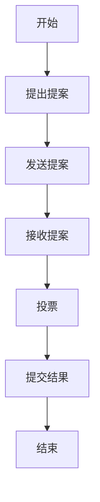
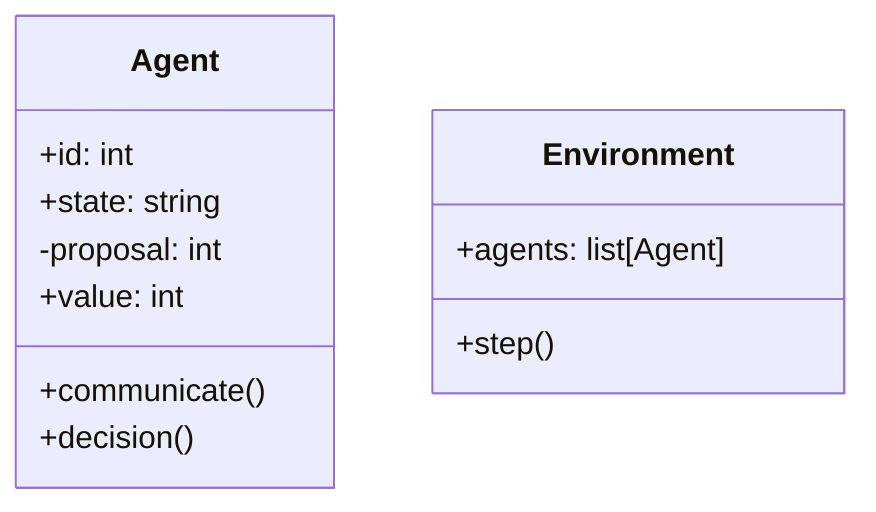
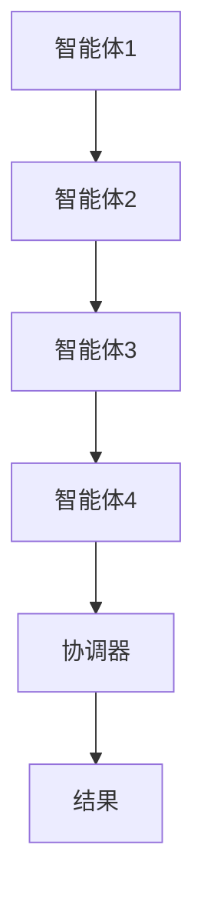
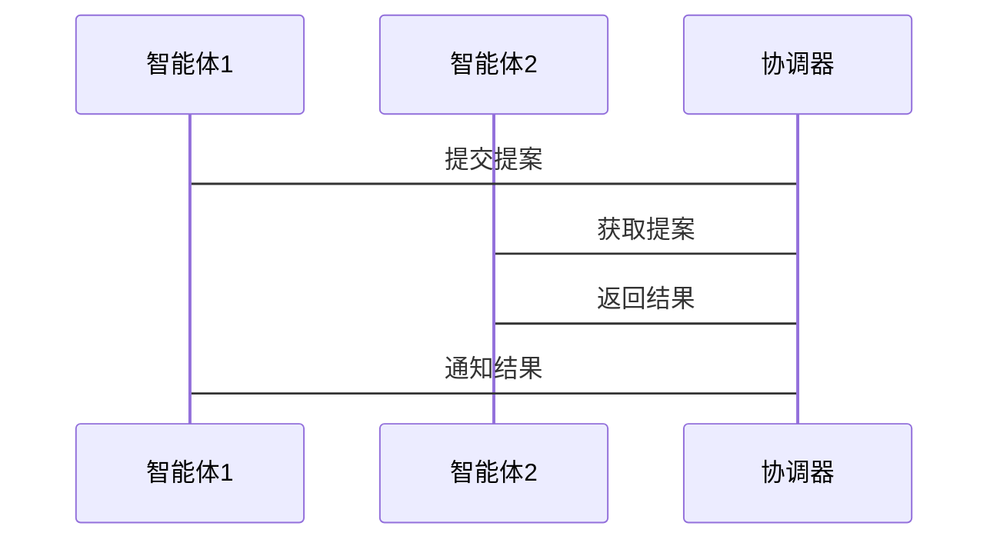

                 


# 构建具有多智能体协同决策能力的系统

> 关键词：多智能体系统，协同决策，一致性算法，分布式系统，系统架构

> 摘要：本文详细探讨了构建具有多智能体协同决策能力系统的各个方面，从核心概念到算法实现，从系统架构到项目实战，旨在帮助读者系统地理解和掌握多智能体协同决策系统的设计与实现。

---

## 第1章: 多智能体协同决策系统背景与概念

### 1.1 多智能体系统的基本概念

#### 1.1.1 多智能体系统的定义
多智能体系统（Multi-Agent System, MAS）是由多个智能体（Agent）组成的系统，这些智能体通过交互和协作完成特定任务。智能体可以是软件程序、硬件设备或其他能够感知环境并采取行动的实体。

#### 1.1.2 多智能体系统的特征
多智能体系统具有以下特征：
- **自主性**：每个智能体能够自主决策。
- **反应性**：智能体能够实时感知环境并做出反应。
- **协作性**：智能体之间能够协同工作，完成共同目标。
- **分布性**：智能体通常分布在网络中，不依赖于中心节点。

#### 1.1.3 多智能体系统与单智能体系统的区别
| 特性          | 单智能体系统         | 多智能体系统         |
|---------------|---------------------|---------------------|
| 结构          | 单一结构           | 分布式结构         |
| 决策方式      | 中央决策           | 分布式决策         |
| 可扩展性      | 有限               | 高                  |
| 故障容错性    | 低                 | 高                  |

### 1.2 多智能体协同决策的背景与问题背景

#### 1.2.1 多智能体协同决策的背景
随着分布式系统的广泛应用，单智能体系统难以满足复杂任务的需求。多智能体系统通过协作能够更好地处理分布式问题，如分布式计算、智能交通管理等。

#### 1.2.2 多智能体协同决策的核心问题
- **一致性问题**：如何保证多个智能体决策的一致性？
- **通信问题**：如何高效地进行智能体之间的通信？
- **协作问题**：如何实现智能体之间的协作？

#### 1.2.3 多智能体协同决策的应用领域
- 智能交通管理
- 分布式计算
- 智能机器人协作
- 大数据分析

### 1.3 多智能体协同决策的边界与外延

#### 1.3.1 多智能体协同决策的边界
- 系统范围：仅限于多智能体系统内部。
- 决策范围：仅涉及协同决策过程。

#### 1.3.2 多智能体协同决策的外延
- 系统扩展：可以与其他系统集成。
- 应用场景：可以应用于多个领域。

#### 1.3.3 多智能体协同决策与其他相关概念的对比
| 概念          | 分布式系统       | 群智系统         |
|---------------|-----------------|-----------------|
| 核心特征      | 分布式计算       | 群体智能         |
| 应用场景      | 网络管理、云计算 | 社交网络、群体行为分析 |

### 1.4 多智能体协同决策的核心要素与组成

#### 1.4.1 多智能体协同决策的核心要素
- 智能体：系统的主体。
- 通信机制：智能体之间的交互方式。
- 协作规则：智能体协同的规则。

#### 1.4.2 多智能体协同决策的组成结构
- **智能体层**：负责感知和决策。
- **通信层**：负责智能体之间的通信。
- **协作层**：负责协调和协作。

#### 1.4.3 多智能体协同决策的系统架构
- **分布式架构**：智能体分布在网络中。
- **层次化架构**：分为高层和低层智能体。

---

## 第2章: 多智能体协同决策的核心概念与联系

### 2.1 多智能体系统的核心概念

#### 2.1.1 智能体的定义与分类
- **定义**：智能体是能够感知环境并采取行动的实体。
- **分类**：根据智能体的智能水平可分为简单智能体和复杂智能体。

#### 2.1.2 多智能体系统的分类与特点
- **分类**：基于任务类型可分为任务协作型和学习协作型。
- **特点**：分布式、协作性强。

#### 2.1.3 多智能体系统的通信机制
- **通信方式**：基于消息传递或基于共享内存。
- **通信协议**：如HTTP、WebSocket等。

### 2.2 多智能体协同决策的核心原理

#### 2.2.1 协同决策的基本原理
- **信息共享**：智能体之间共享信息。
- **决策协调**：通过协商达成一致决策。

#### 2.2.2 多智能体协同决策的数学模型
- **数学模型**：$$ P = \sum_{i=1}^{n} p_i $$
- **一致性算法**：如Paxos算法。

#### 2.2.3 多智能体协同决策的算法框架
- **算法框架**：分布式一致性算法。

### 2.3 多智能体系统的核心概念对比

#### 2.3.1 不同多智能体系统的核心概念对比
| 概念          | 分布式系统       | 群智系统         |
|---------------|-----------------|-----------------|
| 核心概念      | 分布式计算       | 群体智能         |
| 通信机制      | 基于消息传递     | 基于信息共享     |

#### 2.3.2 多智能体系统与分布式系统的主要区别
- **核心目标**：分布式系统关注计算的分布性，多智能体系统关注智能体的协作性。

#### 2.3.3 多智能体系统与群智系统的主要区别
- **智能水平**：群智系统中的智能体更简单，多智能体系统中的智能体更复杂。

### 2.4 多智能体系统的ER实体关系图

#### 2.4.1 实体关系图的定义
- **ER图**：用于描述系统中的实体及其关系。

#### 2.4.2 多智能体系统的ER图设计
```mermaid
er
actor: 智能体
action: 行动
environment: 环境
```

#### 2.4.3 ER图与系统架构的关系
- **关系**：ER图用于设计系统的数据模型。

### 2.5 本章小结

---

## 第3章: 多智能体协同决策的算法原理

### 3.1 多智能体协同决策的核心算法

#### 3.1.1 分布式一致性算法
- **一致性算法**：如Paxos算法。

#### 3.1.2 多智能体通信协议
- **通信协议**：如HTTP、WebSocket。

#### 3.1.3 多智能体协同决策算法
- **算法框架**：如分布式一致性算法。

### 3.2 分布式一致性算法的实现

#### 3.2.1 分布式一致性算法的定义
- **一致性算法**：保证分布式系统中数据的一致性。

#### 3.2.2 分布式一致性算法的实现步骤
1. **提出提案**：一个智能体提出一个提案。
2. **投票**：其他智能体投票决定是否通过提案。
3. **提交结果**：提案通过后提交结果。

#### 3.2.3 分布式一致性算法的数学模型
- **投票机制**：$$ v_i = 1 \text{ 如果第 } i \text{ 个智能体投票通过，否则 } 0 $$

### 3.3 一致性算法的实现代码

```python
class PaxosAlgorithm:
    def __init__(self, num_agents):
        self.num_agents = num_agents
        self.proposal_number = 0
        self.accepted_proposal = {}

    def propose(self, value):
        self.proposal_number += 1
        # 发送提案到所有智能体
        for agent in range(self.num_agents):
            self.send Proposal(self.proposal_number, value, agent)

    def send Proposal(self, proposal_number, value, receiver):
        # 模拟发送提案
        pass

    def accept(self, proposal_number, value):
        # 接收提案并记录
        self.accepted_proposal[proposal_number] = value

    def decide(self):
        # 找出最大的提案号并决定
        max_proposal = max(self.accepted_proposal.keys())
        return self.accepted_proposal[max_proposal]
```

### 3.4 一致性算法的数学模型

#### 3.4.1 一致性算法的数学公式
- **一致性条件**：$$ \forall i, j \in \text{智能体}, P_i \equiv P_j $$

#### 3.4.2 一致性算法的流程图


### 3.5 一致性算法的代码实现与解读

#### 3.5.1 代码实现
```python
def paxos_algorithm_example():
    num_agents = 3
    paxos = PaxosAlgorithm(num_agents)
    paxos.propose(10)
    paxos.propose(20)
    print(paxos.decide())  # 输出 20
```

#### 3.5.2 代码解读
- **类定义**：定义了一个Paxos算法的类。
- **propose方法**：提出提案。
- **send Proposal方法**：发送提案。
- **accept方法**：接收并记录提案。
- **decide方法**：找出最大的提案号并决定。

### 3.6 一致性算法的实际案例分析

#### 3.6.1 实际案例
- **智能交通管理**：多个交通信号灯协同工作。

#### 3.6.2 案例分析
- **问题**：如何保证多个信号灯协调一致。
- **解决方案**：使用一致性算法保证信号灯状态的一致性。

### 3.7 一致性算法的优化与扩展

#### 3.7.1 性能优化
- **减少通信次数**：优化提案的发送方式。

#### 3.7.2 扩展性
- **增加智能体数量**：扩展系统规模。

### 3.8 本章小结

---

## 第4章: 系统分析与架构设计方案

### 4.1 问题场景介绍

#### 4.1.1 问题背景
- **问题描述**：多个智能体需要协同决策。

#### 4.1.2 项目介绍
- **项目名称**：多智能体协同决策系统。

### 4.2 系统功能设计

#### 4.2.1 领域模型设计
- **类图设计**：使用Mermaid图展示类的关系。



#### 4.2.2 系统架构设计
- **架构图设计**：使用Mermaid图展示系统架构。



#### 4.2.3 系统接口设计
- **接口定义**：智能体之间的通信接口。

#### 4.2.4 系统交互设计
- **交互图设计**：使用Mermaid图展示交互过程。



### 4.3 本章小结

---

## 第5章: 项目实战

### 5.1 环境安装与配置

#### 5.1.1 系统环境
- **操作系统**：Linux/Windows/MacOS
- **编程语言**：Python 3.8+
- **开发工具**：PyCharm、VSCode

#### 5.1.2 依赖安装
- **安装依赖**：`pip install mermaid.py`

### 5.2 系统核心实现

#### 5.2.1 通信模块实现
- **代码实现**：使用WebSocket实现智能体之间的通信。

```python
import websockets
import asyncio

async def agent_communicate():
    async with websockets.connect('ws://localhost:8000') as websocket:
        while True:
            message = await websocket.recv()
            print(f"收到消息: {message}")
            response = f"已收到消息：{message}"
            await websocket.send(response)
```

#### 5.2.2 协同决策模块实现
- **代码实现**：使用一致性算法实现协同决策。

```python
class ConsensusAlgorithm:
    def __init__(self, num_agents):
        self.num_agents = num_agents
        self.proposal_number = 0
        self.accepted_proposals = {}

    async def propose(self, value):
        self.proposal_number += 1
        for agent in range(self.num_agents):
            await self.send_proposal(self.proposal_number, value, agent)

    async def send_proposal(self, proposal_number, value, receiver):
        # 模拟异步通信
        pass

    async def accept(self, proposal_number, value):
        self.accepted_proposals[proposal_number] = value

    async def decide(self):
        if not self.accepted_proposals:
            return None
        max_proposal = max(self.accepted_proposals.keys())
        return self.accepted_proposals[max_proposal]
```

#### 5.2.3 系统核心功能实现
- **功能实现**：智能体之间协同决策。

### 5.3 代码实现与解读

#### 5.3.1 代码实现
```python
async def main():
    consensus = ConsensusAlgorithm(3)
    await consensus.propose(10)
    await consensus.propose(20)
    result = await consensus.decide()
    print(f"最终结果: {result}")

if __name__ == "__main__":
    asyncio.run(main())
```

#### 5.3.2 代码解读
- **主函数**：初始化一致性算法实例，提出提案并决定结果。

### 5.4 实际案例分析

#### 5.4.1 案例介绍
- **案例名称**：智能交通管理。

#### 5.4.2 案例分析
- **问题描述**：多个交通信号灯协同工作。
- **解决方案**：使用一致性算法保证信号灯状态的一致性。

### 5.5 项目小结

---

## 第6章: 最佳实践与未来展望

### 6.1 最佳实践

#### 6.1.1 性能优化
- **减少通信次数**：优化提案的发送方式。

#### 6.1.2 安全性
- **数据加密**：确保通信的安全性。

#### 6.1.3 可扩展性
- **模块化设计**：便于扩展。

### 6.2 小结

#### 6.2.1 本章内容回顾
- **核心内容**：多智能体协同决策系统的构建与优化。

### 6.3 未来展望

#### 6.3.1 技术趋势
- **人工智能与多智能体系统的结合**。

#### 6.3.2 拓展阅读
- **推荐书籍**：《Multi-Agent Systems》。

### 6.4 注意事项

#### 6.4.1 项目开发注意事项
- **代码规范**：遵循行业规范。

#### 6.4.2 项目维护注意事项
- **版本控制**：使用Git进行版本管理。

---

## 附录: 术语表

- **多智能体系统（MAS）**：由多个智能体组成的系统。
- **一致性算法**：保证分布式系统中数据一致性的算法。
- **智能体（Agent）**：能够感知环境并采取行动的实体。

---

通过以上详细的内容，我们可以系统地理解和掌握多智能体协同决策系统的构建与实现。

