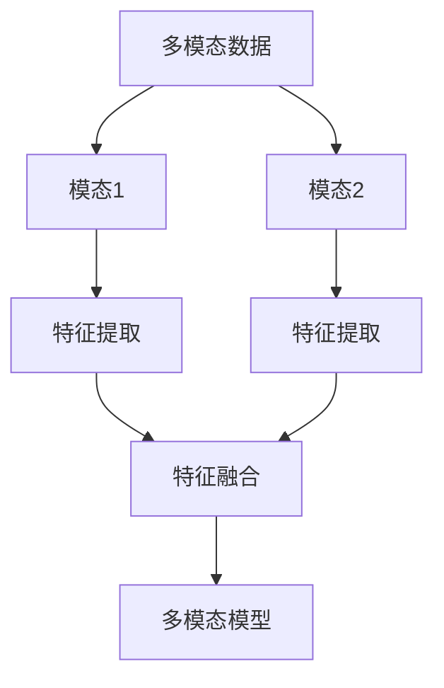
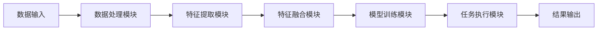
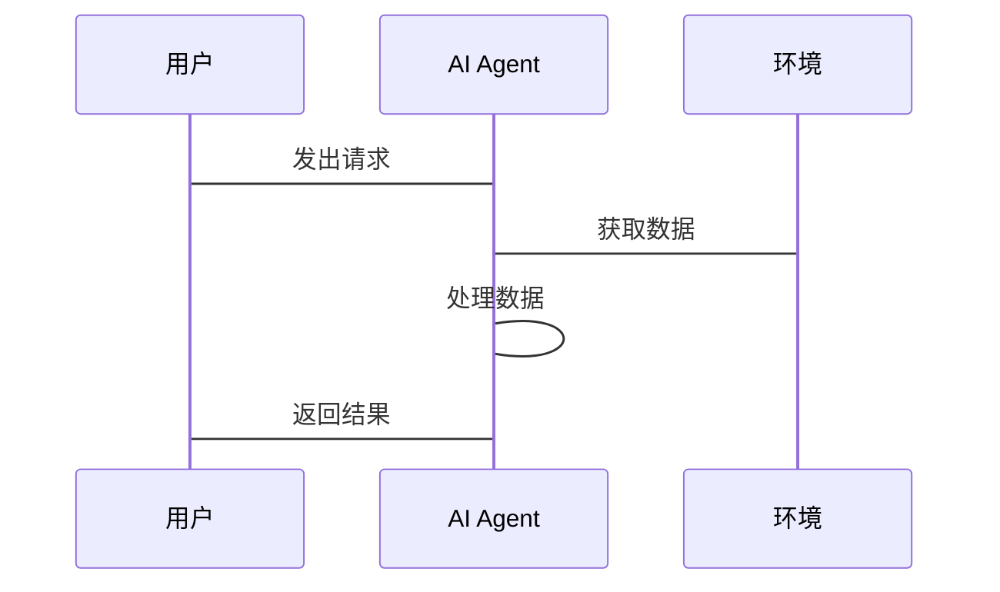

                 


# 构建具有多模态学习能力的AI Agent

> 关键词：多模态学习、AI Agent、深度学习、多模态融合、智能系统

> 摘要：本文详细探讨了如何构建具有多模态学习能力的AI Agent。首先介绍了多模态学习的背景与重要性，接着分析了多模态学习的核心概念与算法原理，最后通过系统架构设计和项目实战展示了如何实现一个多模态AI Agent。文章还提供了数学模型、代码实现和实际案例，帮助读者深入理解多模态学习在AI Agent中的应用。

---

## 第一部分: 多模态学习与AI Agent概述

### 第1章: 多模态学习的背景与重要性

#### 1.1 多模态学习的定义与特点
多模态学习是指AI系统能够同时处理和理解多种类型的数据，如文本、图像、语音、视频等。与单模态学习相比，多模态学习能够提供更全面的信息，从而提升AI系统的智能性和适应性。

- **多模态数据的定义**：多模态数据是指来自不同感官或渠道的信息，例如视觉（图像、视频）、听觉（语音、音频）、触觉（传感器数据）和语言（文本、自然语言）等。
- **多模态学习的核心特点**：
  - **信息互补性**：不同模态的数据能够互补，提供更全面的感知。
  - **任务增强性**：通过多模态数据，AI系统能够更好地完成复杂任务。
  - **学习多样性**：多模态学习能够从多种数据中提取特征，提升模型的泛化能力。

#### 1.2 AI Agent的基本概念
AI Agent（智能体）是指能够感知环境、采取行动以实现特定目标的智能系统。AI Agent可以是软件程序、机器人或其他智能系统，广泛应用于自动驾驶、智能助手、推荐系统等领域。

- **AI Agent的定义**：AI Agent是一个能够感知环境、自主决策并采取行动以实现目标的智能系统。
- **AI Agent的核心功能**：
  - 感知环境：通过传感器或数据输入获取环境信息。
  - 决策与推理：基于感知的信息，分析并做出决策。
  - 行动：执行决策，与环境互动。
- **AI Agent的应用场景**：自动驾驶、智能助手（如Siri、Alexa）、机器人、推荐系统等。

#### 1.3 多模态学习在AI Agent中的作用
多模态学习能够显著提升AI Agent的能力，使其在复杂环境中表现更出色。

- **多模态数据的整合优势**：通过整合多种模态数据，AI Agent能够更全面地理解环境，例如通过视觉和听觉数据更准确地识别物体和场景。
- **多模态学习提升AI Agent的智能性**：多模态学习使AI Agent能够从多个角度获取信息，从而提高其理解和决策能力。
- **多模态学习的挑战与未来趋势**：多模态学习需要解决数据异构性、模态间对齐等问题。未来，随着技术的进步，多模态学习将在AI Agent中发挥越来越重要的作用。

---

### 第2章: 多模态学习的核心概念与联系

#### 2.1 多模态学习的原理
多模态学习的原理涉及数据表示、特征提取和特征融合。

- **多模态数据的表示方法**：
  - **模态独立表示**：每种模态数据独立进行特征提取。
  - **联合表示**：将多种模态数据共同表示为统一的特征空间。
- **多模态特征的融合策略**：
  - **早期融合**：在特征提取阶段进行模态融合。
  - **晚期融合**：在特征提取之后进行模态融合。
  - **多阶段融合**：在特征提取和任务目标之间进行多次融合。
- **多模态模型的训练方法**：
  - **联合训练**：同时训练多个模态的模型。
  - **对齐训练**：通过对抗训练或其他方法对齐不同模态的特征。

#### 2.2 多模态学习的关键技术
多模态学习的关键技术包括多模态数据处理技术、模型融合技术和任务评估指标。

- **多模态数据处理技术**：
  - **数据预处理**：对不同模态的数据进行归一化、降维等处理。
  - **数据增强**：通过增加训练数据的多样性来提升模型的泛化能力。
- **多模态模型融合技术**：
  - **特征融合**：将不同模态的特征向量进行线性或非线性组合。
  - **注意力机制**：通过注意力机制赋予不同模态不同的权重。
  - **对比学习**：通过对比不同模态的数据，学习它们的相似性和差异性。
- **多模态任务的评估指标**：
  - **准确率**：分类任务的正确率。
  - **F1分数**：分类任务的精确率和召回率的调和平均数。
  - **困惑度**：语言模型的评估指标。

#### 2.3 多模态学习的实体关系图
以下是多模态学习的实体关系图：



---

### 第3章: 多模态学习的算法原理

#### 3.1 多模态融合算法
多模态融合算法包括对齐算法和注意力机制。

- **多模态对齐算法**：
  - **对比学习**：通过对比不同模态的数据，学习它们的相似性和差异性。
  - **对抗训练**：通过生成对抗网络（GAN）对齐不同模态的特征。
- **多模态注意力机制**：
  - **自注意力机制**：在Transformer模型中，通过自注意力机制捕捉模态内部的依赖关系。
  - **交叉注意力机制**：在多模态模型中，通过交叉注意力机制捕捉不同模态之间的依赖关系。

#### 3.2 多模态学习的数学模型
多模态学习的数学模型包括数据表示模型和特征融合模型。

- **多模态数据表示模型**：
  - **文本表示**：通过词嵌入（如Word2Vec、BERT）将文本转换为向量。
  - **图像表示**：通过卷积神经网络（CNN）提取图像的特征向量。
- **多模态特征融合模型**：
  - **线性融合**：将不同模态的特征向量进行线性组合。
  - **非线性融合**：通过深度神经网络（如多层感知机、Transformer）对特征向量进行非线性变换。

#### 3.3 算法实现与代码示例
以下是多模态融合算法的代码示例：

```python
import torch
import torch.nn as nn
import torch.nn.functional as F

class MultiModalFuse(nn.Module):
    def __init__(self, input_dim1, input_dim2, hidden_dim):
        super(MultiModalFuse, self).__init__()
        self.fc1 = nn.Linear(input_dim1, hidden_dim)
        self.fc2 = nn.Linear(input_dim2, hidden_dim)
        self.attention = nn.Linear(hidden_dim, 1)
    
    def forward(self, x1, x2):
        x1_out = F.relu(self.fc1(x1))
        x2_out = F.relu(self.fc2(x2))
        x = torch.cat([x1_out, x2_out], dim=1)
        x = F.relu(self.attention(x))
        x = F.softmax(x, dim=1)
        return x
```

---

### 第4章: 多模态学习的系统分析与架构设计

#### 4.1 系统功能设计
AI Agent的系统功能设计包括数据处理、模型训练和任务执行。

- **数据处理模块**：
  - **数据预处理**：对输入数据进行归一化、降维等处理。
  - **数据增强**：通过数据增强技术增加数据的多样性。
- **模型训练模块**：
  - **特征提取**：通过神经网络提取数据的特征。
  - **特征融合**：将不同模态的特征向量进行融合。
  - **模型优化**：通过反向传播和优化器（如Adam）优化模型参数。
- **任务执行模块**：
  - **目标检测**：对图像进行目标检测。
  - **语义理解**：对文本进行语义理解。

#### 4.2 系统架构设计
以下是AI Agent的系统架构图：



#### 4.3 系统接口设计
AI Agent的系统接口设计包括数据输入接口、模型训练接口和任务执行接口。

- **数据输入接口**：
  - **文本输入**：接收用户输入的文本。
  - **图像输入**：接收用户输入的图像。
- **模型训练接口**：
  - **训练数据输入**：接收训练数据。
  - **模型参数更新**：更新模型参数。
- **任务执行接口**：
  - **任务目标设置**：设置任务目标。
  - **任务结果输出**：输出任务结果。

#### 4.4 系统交互设计
以下是AI Agent的系统交互图：



---

### 第5章: 多模态学习的项目实战

#### 5.1 环境安装
以下是项目实战所需的环境安装命令：

```bash
pip install torch
pip install numpy
pip install matplotlib
pip install scikit-learn
```

#### 5.2 系统核心实现源代码
以下是多模态AI Agent的核心实现代码：

```python
import torch
import torch.nn as nn
import torch.nn.functional as F

class MultiModalAI:
    def __init__(self):
        self.model = MultiModalFuse(128, 128, 64)
    
    def train(self, x1, x2, labels):
        optimizer = torch.optim.Adam(self.model.parameters(), lr=0.001)
        outputs = self.model(x1, x2)
        loss = F.cross_entropy(outputs, labels)
        loss.backward()
        optimizer.step()
    
    def predict(self, x1, x2):
        with torch.no_grad():
            outputs = self.model(x1, x2)
            return F.softmax(outputs, dim=1)
```

#### 5.3 代码应用解读与分析
- **数据预处理**：将输入数据进行归一化和降维处理。
- **模型训练**：通过反向传播和优化器更新模型参数。
- **任务执行**：通过模型预测输出结果。

#### 5.4 实际案例分析
以下是多模态AI Agent的实际案例分析：

**案例：多模态图像分类**
- **任务目标**：对图像进行分类。
- **输入数据**：图像和图像的文本描述。
- **模型输出**：分类结果。

---

## 第六章: 最佳实践、小结、注意事项、拓展阅读

### 6.1 最佳实践
- **数据多样性**：确保训练数据的多样性，以提高模型的泛化能力。
- **模型调优**：通过超参数调优和模型剪枝优化模型性能。
- **实时反馈**：通过实时反馈机制优化AI Agent的决策过程。

### 6.2 小结
多模态学习能够显著提升AI Agent的智能性和适应性。通过整合多种模态数据，AI Agent能够更全面地理解环境，从而更好地完成复杂任务。

### 6.3 注意事项
- **数据异构性**：不同模态的数据可能具有不同的特征空间，需要进行数据对齐。
- **计算复杂度**：多模态学习通常需要处理大量数据，计算复杂度较高。
- **模型解释性**：多模态模型的解释性较差，需要通过可视化和分析工具提高模型的可解释性。

### 6.4 拓展阅读
- **多模态学习论文**：阅读相关领域的论文，了解最新的研究成果。
- **AI Agent书籍**：阅读AI Agent相关的书籍，深入了解AI Agent的设计与实现。

---

通过以上内容，我们详细探讨了如何构建具有多模态学习能力的AI Agent。从多模态学习的背景与重要性，到算法原理和系统架构设计，再到项目实战，本文为读者提供了全面的知识和实践指导。希望本文能够帮助读者更好地理解和应用多模态学习技术。

