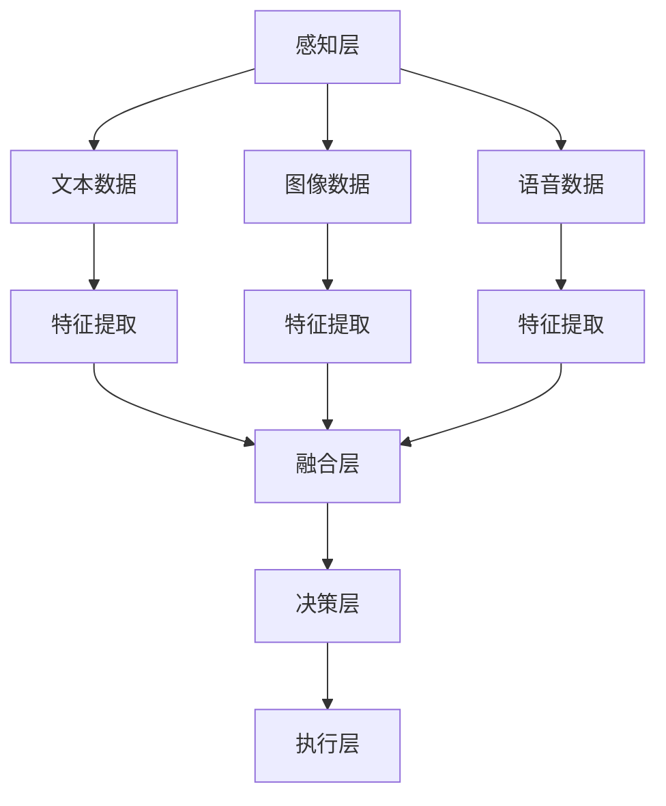
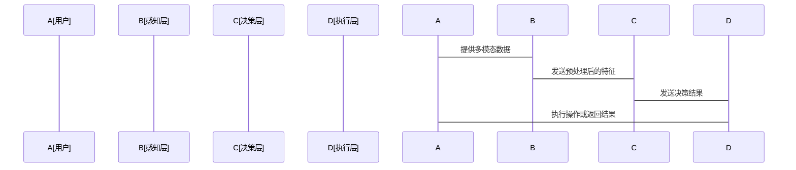

                 


# 构建具有多模态融合能力的AI Agent

## 关键词：多模态融合、AI Agent、机器学习、深度学习、多模态数据

## 摘要：本文详细介绍了如何构建具有多模态融合能力的AI Agent，涵盖了多模态数据融合的原理、算法实现、系统架构设计以及实际项目案例分析。通过本文，读者可以全面了解多模态AI Agent的核心概念、技术细节和实际应用。

---

# 第一部分: 多模态融合AI Agent的背景与基础

# 第1章: 多模态融合AI Agent概述

## 1.1 多模态AI Agent的背景与意义

### 1.1.1 多模态数据的定义与特点
多模态数据指的是来自不同感官渠道的数据，如文本、图像、语音、视频等。这些数据具有以下特点：
- **异构性**：不同模态的数据具有不同的特征和表示方式。
- **互补性**：不同模态的数据可以互补，提供更全面的信息。
- **复杂性**：多模态数据的处理需要综合考虑多种数据类型。

### 1.1.2 多模态融合的意义与价值
多模态融合能够提高AI Agent的理解能力和决策能力，使AI Agent能够更好地处理复杂场景下的任务。例如，在自动驾驶中，结合视觉、听觉和激光雷达数据可以提高环境感知的准确性。

### 1.1.3 多模态AI Agent的应用场景
多模态AI Agent广泛应用于多个领域，如智能客服、自动驾驶、智能助手、医疗诊断等。

## 1.2 多模态AI Agent的核心概念

### 1.2.1 多模态数据的类型与特点
- **文本数据**：结构化和非结构化文本，如对话、新闻等。
- **图像数据**：RGB图像、深度图像等。
- **语音数据**：音频信号，如语音识别。
- **视频数据**：连续的图像序列。

### 1.2.2 多模态融合的定义与分类
多模态融合是指将不同模态的数据进行整合，以提高信息理解和任务性能。常见的融合方法包括：
- **特征级融合**：在特征层面上进行融合，如将文本和图像的特征向量进行拼接。
- **决策级融合**：在决策层面上进行融合，如将不同模态的分类结果进行加权投票。
- **注意力机制融合**：通过注意力机制对不同模态的重要性进行动态调整。

### 1.2.3 多模态AI Agent的架构与功能
多模态AI Agent的架构通常包括感知层、决策层和执行层。感知层负责多模态数据的采集和预处理，决策层负责多模态数据的融合与推理，执行层负责根据决策结果进行操作。

## 1.3 多模态AI Agent与其他技术的对比

### 1.3.1 单模态AI Agent的局限性
单模态AI Agent只能处理一种模态的数据，无法充分利用多模态数据的优势，导致理解和决策能力受限。

### 1.3.2 多模态融合与传统AI的区别
传统AI通常基于单模态数据，而多模态融合AI能够同时处理多种模态数据，提供更全面的信息理解和更强的决策能力。

### 1.3.3 多模态AI Agent的优势与挑战
- **优势**：提高理解和决策能力，增强系统的鲁棒性和适应性。
- **挑战**：多模态数据的异构性、融合方法的选择、计算资源的需求等。

## 1.4 本章小结
本章介绍了多模态AI Agent的背景、核心概念和与其他技术的区别，为后续章节的深入分析奠定了基础。

---

# 第2章: 多模态数据融合的原理与方法

## 2.1 多模态数据融合的原理

### 2.1.1 多模态数据的特征提取
不同模态的数据需要进行特征提取，例如文本的词向量、图像的卷积特征等。

### 2.1.2 多模态数据的表示方法
将不同模态的数据表示为向量或概率分布，以便进行融合。

### 2.1.3 多模态数据融合的数学模型
多模态数据融合的数学模型通常包括线性组合、非线性变换等方法。

## 2.2 多模态数据融合的方法

### 2.2.1 基于特征级的融合方法
将不同模态的特征向量进行拼接或加权求和，例如：
$$
f_{\text{融合}} = \alpha f_{\text{文本}} + \beta f_{\text{图像}}
$$
其中，$\alpha$和$\beta$是权重系数。

### 2.2.2 基于决策级的融合方法
将不同模态的决策结果进行加权投票或融合，例如：
$$
p_{\text{融合}} = \frac{\sum \alpha_i p_i}{\sum \alpha_i}
$$

### 2.2.3 基于注意力机制的融合方法
通过注意力机制对不同模态的重要性进行动态调整，例如：
$$
\alpha_i = \frac{\exp(w_i^T x)}{\sum \exp(w_i^T x)}
$$

## 2.3 多模态数据融合的优缺点对比

| 融合方法 | 优点 | 缺点 |
|----------|------|------|
| 特征级融合 | 融合能力强，适用于多种任务 | 计算复杂度高，难以处理异构数据 |
| 决策级融合 | 计算效率高，适用于简单任务 | 融合粒度粗，可能丢失细节信息 |
| 注意力机制融合 | 动态调整权重，灵活性高 | 实现复杂，需要大量训练数据 |

## 2.4 本章小结
本章详细介绍了多模态数据融合的原理和方法，分析了各种融合方法的优缺点，为后续章节的算法实现奠定了基础。

---

# 第3章: 多模态AI Agent的算法原理

## 3.1 多模态融合的算法原理

### 3.1.1 多模态注意力机制
通过注意力机制对不同模态的重要性进行动态调整，例如：
$$
\alpha_i = \frac{\exp(w_i^T x)}{\sum \exp(w_i^T x)}
$$

### 3.1.2 多模态编码器-解码器架构
编码器负责将多模态数据编码为通用表示，解码器负责根据编码结果生成目标输出。

### 3.1.3 多模态对比学习
通过对比学习增强多模态数据之间的关联性，例如：
$$
\text{损失函数} = -\log\left(\frac{\exp(s)}{\sum \exp(s_i)}\right)
$$

## 3.2 多模态AI Agent的算法实现

### 3.2.1 基于Transformer的多模态融合
使用Transformer模型对多模态数据进行编码和解码，例如：
$$
f_{\text{融合}} = \text{Transformer}(f_{\text{文本}}, f_{\text{图像}})
$$

### 3.2.2 多模态数据的联合训练
通过联合训练多个模态的数据，提高模型的泛化能力和融合效果。

### 3.2.3 多模态模型的优化方法
使用Adam优化器对模型进行训练，例如：
$$
\theta_{t+1} = \theta_t - \eta \nabla_{\theta_t} \text{损失函数}
$$

## 3.3 多模态AI Agent的数学模型与公式

### 3.3.1 注意力机制的数学公式
$$
\alpha_i = \frac{\exp(w_i^T x)}{\sum \exp(w_i^T x)}
$$

### 3.3.2 多模态融合的损失函数
$$
\text{损失函数} = \text{交叉熵损失} + \lambda \text{融合损失}
$$

### 3.3.3 模型训练的优化算法
$$
\theta_{t+1} = \theta_t - \eta \nabla_{\theta_t} \text{损失函数}
$$

## 3.4 本章小结
本章详细介绍了多模态AI Agent的算法原理和实现方法，分析了数学模型和优化方法，为后续章节的系统设计奠定了基础。

---

# 第4章: 多模态AI Agent的系统架构与设计

## 4.1 系统架构设计

### 4.1.1 多模态AI Agent的感知层
感知层负责采集和预处理多模态数据，例如：
- 文本预处理：分词、词向量化。
- 图像预处理：特征提取、降维。

### 4.1.2 多模态AI Agent的决策层
决策层负责多模态数据的融合与推理，例如：
- 使用注意力机制对不同模态的重要性进行动态调整。
- 根据融合结果生成决策输出。

### 4.1.3 多模态AI Agent的执行层
执行层负责根据决策结果进行操作，例如：
- 自然语言处理生成回答。
- 视频处理生成动作指令。

## 4.2 系统功能设计

### 4.2.1 多模态数据采集与预处理
- 文本数据：对话、查询等。
- 图像数据：RGB图像、深度图像等。
- 语音数据：音频信号、语音识别结果等。

### 4.2.2 多模态数据融合与推理
- 使用注意力机制对不同模态的重要性进行动态调整。
- 根据融合结果生成决策输出。

### 4.2.3 多模态决策与执行
- 根据决策结果进行操作，例如生成回答、执行动作等。

## 4.3 系统架构图（Mermaid）



## 4.4 系统交互图（Mermaid）



## 4.5 本章小结
本章详细介绍了多模态AI Agent的系统架构与功能设计，通过Mermaid图展示了系统的各个部分及其交互流程。

---

# 第5章: 多模态AI Agent的项目实战

## 5.1 项目背景与需求分析

### 5.1.1 项目背景
本项目旨在构建一个具有多模态融合能力的AI Agent，用于智能客服领域。

### 5.1.2 项目需求
- 实现多模态数据的采集与预处理。
- 实现多模态数据的融合与推理。
- 实现多模态决策与执行。

## 5.2 项目环境安装

### 5.2.1 安装Python
```bash
python --version
pip install --upgrade pip
```

### 5.2.2 安装深度学习框架
```bash
pip install tensorflow==2.5.0
pip install numpy==1.21.0
pip install matplotlib==3.5.0
pip install pytorch==1.9.0
```

### 5.2.3 安装NLP库
```bash
pip install transformers==4.15.0
pip install sentence-transformers==2.2.0
```

## 5.3 项目核心实现

### 5.3.1 多模态数据预处理
```python
import numpy as np
from transformers import BertTokenizer, BertModel

def preprocess_text(text):
    tokenizer = BertTokenizer.from_pretrained('bert-base-uncased')
    inputs = tokenizer(text, return_tensors='np', padding=True, truncation=True)
    return inputs

def preprocess_image(image_path):
    # 假设使用预训练的图像模型进行特征提取
    model = load_image_model('resnet50')
    features = model(image_path)
    return features
```

### 5.3.2 多模态融合模型实现
```python
import torch
import torch.nn as nn
import torch.nn.functional as F

class MultiModalFuse(nn.Module):
    def __init__(self, text_dim, image_dim, hidden_dim):
        super().__init__()
        self.text_layer = nn.Linear(text_dim, hidden_dim)
        self.image_layer = nn.Linear(image_dim, hidden_dim)
        self.attn = nn.MultiheadAttention(hidden_dim, 1)

    def forward(self, text_feat, image_feat):
        text_out = self.text_layer(text_feat)
        image_out = self.image_layer(image_feat)
        fused_feat, _ = self.attn(torch.cat([text_out, image_out], dim=1))
        return fused_feat
```

### 5.3.3 多模态AI Agent实现
```python
class MultiModalAgent:
    def __init__(self, text_model, image_model, fuse_model):
        self.text_model = text_model
        self.image_model = image_model
        self.fuse_model = fuse_model

    def perceive(self, input_data):
        text_feat = self.text_model(input_data['text'])
        image_feat = self.image_model(input_data['image'])
        fused_feat = self.fuse_model(text_feat, image_feat)
        return fused_feat

    def decide(self, fused_feat):
        # 假设决策函数为分类任务
        outputs = F.softmax(fused_feat, dim=1)
        return outputs

    def execute(self, decision):
        # 假设执行函数为生成回答
        response = self.text_model.generate(decision)
        return response
```

## 5.4 项目实战分析

### 5.4.1 项目实现细节
- 使用BERT进行文本特征提取。
- 使用ResNet进行图像特征提取。
- 使用自定义的多模态融合模型进行数据融合。

### 5.4.2 实际案例分析
- 输入：用户查询“如何预约服务？”（文本）和相关界面截图（图像）。
- 输出：生成的回答“请通过我们的在线系统进行预约”。

### 5.4.3 代码实现解读
- 多模态数据预处理：将文本和图像分别进行特征提取。
- 多模态融合：使用注意力机制对文本和图像特征进行融合。
- 多模态决策：根据融合结果生成决策输出。
- 多模态执行：根据决策结果生成回答或执行动作。

## 5.5 项目小结
本章通过一个具体的项目案例，详细介绍了多模态AI Agent的实现过程，包括环境安装、核心代码实现和实际案例分析。

---

# 第6章: 多模态AI Agent的最佳实践

## 6.1 小结

### 6.1.1 多模态AI Agent的核心概念
- 多模态数据的融合方法。
- 多模态AI Agent的系统架构。

### 6.1.2 项目实现的关键点
- 数据预处理与特征提取。
- 多模态融合模型的设计与实现。
- 系统架构与交互流程。

## 6.2 注意事项

### 6.2.1 数据质量
- 确保多模态数据的质量和一致性。
- 处理数据中的噪声和异常值。

### 6.2.2 模型选择
- 根据任务需求选择合适的融合方法。
- 考虑模型的计算效率和资源需求。

### 6.2.3 系统优化
- 优化系统的计算效率。
- 提高系统的鲁棒性和适应性。

## 6.3 未来的发展方向

### 6.3.1 多模态数据的进一步融合
- 研究更高效的多模态融合方法。
- 探索多模态数据的联合学习。

### 6.3.2 多模态AI Agent的智能增强
- 提高AI Agent的自主学习能力。
- 增强AI Agent的推理和决策能力。

### 6.3.3 多模态AI Agent的应用扩展
- 推动多模态AI Agent在更多领域的应用。
- 拓展多模态AI Agent的功能和性能。

## 6.4 拓展阅读

### 6.4.1 推荐书籍
- 《Deep Learning》—— Ian Goodfellow
- 《Natural Language Processing with PyTorch》—— 罗德尼· MILLER等

### 6.4.2 推荐论文
- "Attention Is All You Need" —— Vaswani et al.
- "A Unified Architecture for NLP Tasks" —— Devlin et al.

## 6.5 本章小结
本章总结了多模态AI Agent的核心概念和项目实现的关键点，提出了未来的发展方向和推荐的拓展阅读资料。

---

# 结语

本文详细介绍了如何构建具有多模态融合能力的AI Agent，涵盖了多模态数据融合的原理、算法实现、系统架构设计以及实际项目案例分析。通过本文，读者可以全面了解多模态AI Agent的核心概念、技术细节和实际应用。未来，随着技术的不断进步，多模态AI Agent将在更多领域展现出强大的潜力和应用价值。

