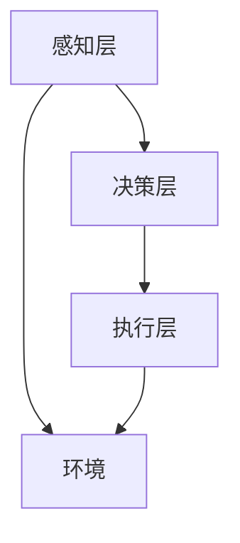
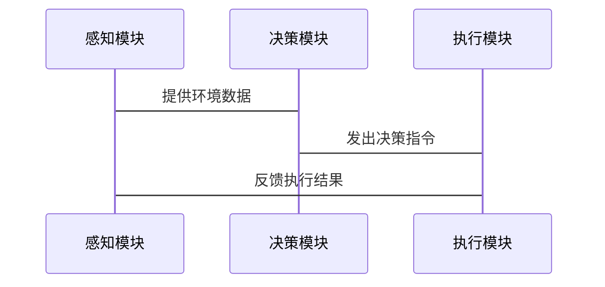

                 


# 构建具有多目标优化决策能力的AI Agent

## 关键词：多目标优化、AI Agent、决策系统、优化算法、系统架构、强化学习

## 摘要：本文详细探讨了构建具有多目标优化决策能力的AI Agent的核心概念、算法原理、系统架构设计以及实际应用案例。文章首先介绍了多目标优化的基本概念和AI Agent的定义，接着分析了多目标优化与AI Agent结合的必要性和优势。随后，深入讲解了多目标优化的数学基础、常用算法及其在AI Agent中的应用。通过系统架构设计和项目实战，展示了如何将理论应用于实际场景，如游戏AI和资源分配问题。最后，文章总结了当前的研究热点和未来的发展方向，为读者提供了全面的视角。

---

## 正文

---

### 第一部分: 多目标优化与AI Agent基础

#### 第1章: 多目标优化决策概述

##### 1.1 多目标优化的基本概念

###### 1.1.1 多目标优化的定义
多目标优化（Multi-Objective Optimization, MOO）是指在多个相互冲突的目标下寻找最优解的过程。例如，在资源分配问题中，可能需要同时优化成本、效率和公平性等多个目标。

###### 1.1.2 多目标优化的核心特征
- **多目标性**：涉及多个目标函数。
- ** Pareto最优性**：存在一组非支配解，无法在所有目标上同时优于其他解。
- **权衡性**：在不同目标之间进行权衡，寻找折中的最优解。

###### 1.1.3 多目标优化与单目标优化的区别
单目标优化只关注一个目标，而多目标优化需要同时考虑多个目标，解决方案通常是权衡后的折中。

##### 1.2 AI Agent的基本概念

###### 1.2.1 AI Agent的定义
AI Agent是一个能够感知环境、自主决策并采取行动的智能体。它可以基于当前状态和历史信息做出决策。

###### 1.2.2 AI Agent的核心功能
- **感知环境**：通过传感器或数据输入获取环境信息。
- **决策制定**：基于感知信息，使用算法生成决策。
- **行动执行**：根据决策执行动作，影响环境状态。

###### 1.2.3 AI Agent的分类与应用场景
- **简单反射型Agent**：基于当前输入做出简单反应。
- **基于模型的规划型Agent**：使用内部模型进行复杂决策。
- **学习型Agent**：通过机器学习算法不断优化决策策略。

##### 1.3 多目标优化与AI Agent的结合

###### 1.3.1 多目标优化在AI Agent中的作用
多目标优化帮助AI Agent在多个目标之间找到平衡，做出更优的决策。

###### 1.3.2 多目标优化与AI Agent的交互方式
AI Agent通过多目标优化算法，将多个目标转化为具体的决策，优化其行动方案。

###### 1.3.3 多目标优化在AI Agent决策中的优势
- **全局优化**：能够在多个目标间找到最优解。
- **灵活性**：适用于复杂、动态的环境。
- **鲁棒性**：能够适应不同目标权重的变化。

#### 第2章: 多目标优化的数学基础

##### 2.1 多目标优化的数学模型

###### 2.1.1 多目标优化的数学表达式
$$ \text{minimize } f_1(x), f_2(x), \dots, f_n(x) $$
$$ \text{subject to } g_1(x) \leq 0, g_2(x) \leq 0, \dots, g_m(x) \leq 0 $$

###### 2.1.2 目标函数的构建
目标函数通常表示为$ f_i(x) $，其中$i$表示目标的编号，$x$是决策变量。

###### 2.1.3 约束条件的处理
约束条件通常表示为$ g_j(x) \leq 0 $，其中$j$表示约束的编号。

##### 2.2 常用的多目标优化算法

###### 2.2.1 基本粒子群优化算法（PSO）

```
初始化粒子群
计算适应度值
更新粒子速度和位置
检查是否达到终止条件
```

###### 2.2.2 非支配排序遗传算法（NSGA）

```
初始化种群
计算适应度值
非支配排序
选择父代
进行交叉和变异
替换种群
```

###### 2.2.3 多目标进化算法（MOEA）

```
初始化种群
计算适应度值
评估 Pareto 优势
选择父代
进行交叉和变异
替换种群
```

---

### 第二部分: 多目标优化决策的算法原理

#### 第3章: 多目标优化算法的核心原理

##### 3.1 多目标优化算法的核心原理

###### 3.1.1 Pareto最优解的概念
Pareto最优解是指在决策空间中，无法在所有目标上同时优于其他解的解。

###### 3.1.2 非支配原理
非支配原理是指一个解如果在所有目标上都不劣于另一个解，那么前者支配后者。

###### 3.1.3 多目标优化的收敛性分析
收敛性分析是指算法在迭代过程中逐渐逼近Pareto前沿的过程。

##### 3.2 基于进化算法的多目标优化

###### 3.2.1 进化算法的基本流程

```
初始化种群
计算适应度值
选择父代
进行交叉和变异
替换种群
```

###### 3.2.2 多目标进化算法的改进方法
- **拥挤度计算**：确保种群多样性。
- ** Pareto前沿排序**：优化选择过程。

###### 3.2.3 算法的实现步骤
1. 初始化种群。
2. 计算每个个体的适应度值。
3. 根据适应度值选择父代。
4. 进行交叉和变异操作生成新个体。
5. 替换种群中的部分个体。

#### 第4章: 多目标优化与AI Agent的结合算法

##### 4.1 基于多目标优化的AI Agent决策模型

###### 4.1.1 模型的构建过程
1. 确定目标函数。
2. 定义约束条件。
3. 选择优化算法。
4. 实现模型并进行训练。

###### 4.1.2 模型的输入与输出
- 输入：环境状态、历史数据。
- 输出：决策策略。

###### 4.1.3 模型的训练与优化
通过多目标优化算法训练模型，优化其决策能力。

##### 4.2 基于强化学习的多目标优化

###### 4.2.1 强化学习的基本原理
AI Agent通过与环境互动，学习最优策略，最大化累积奖励。

###### 4.2.2 多目标强化学习的挑战
- **目标冲突**：多个目标可能互相矛盾。
- **策略优化**：如何平衡不同目标的影响。

###### 4.2.3 基于Q-learning的多目标优化实现

```
初始化Q表
设置学习率和折扣因子
遍历所有状态和动作
更新Q值
```

---

### 第三部分: 系统架构与设计

#### 第5章: 系统功能设计

##### 5.1 系统功能模块划分

- 感知模块：负责收集环境信息。
- 决策模块：基于多目标优化算法生成决策。
- 执行模块：执行决策并反馈结果。

##### 5.2 功能模块之间的交互

```
感知模块 -> 决策模块
决策模块 -> 执行模块
执行模块 -> 感知模块
```

##### 5.3 功能模块的实现方式

- **感知模块**：使用传感器或API获取数据。
- **决策模块**：基于多目标优化算法生成决策。
- **执行模块**：通过API或执行器执行动作。

#### 第6章: 系统架构设计

##### 6.1 系统架构选型

- **分层架构**：感知层、决策层、执行层。
- **模块化架构**：独立模块便于维护和扩展。

##### 6.2 系统架构图



#### 第7章: 系统接口设计

##### 7.1 系统接口设计

- **输入接口**：接收环境数据。
- **输出接口**：输出决策结果。

##### 7.2 系统接口的实现

- **输入接口**：使用标准API接收数据。
- **输出接口**：通过JSON格式输出结果。

#### 第8章: 系统交互流程

##### 8.1 系统交互流程图



---

### 第四部分: 项目实战

#### 第9章: 项目环境配置

##### 9.1 环境需求

- **硬件**：高性能计算机。
- **软件**：Python 3.8+, PyTorch, Scikit-learn。

#### 第10章: 核心实现

##### 10.1 多目标优化算法实现

```python
import numpy as np

def multiobjective_optimization(objectives, constraints):
    # 初始化种群
    population = initialize_population()
    # 计算适应度值
    fitness = calculate_fitness(population, objectives, constraints)
    # 进行迭代优化
    while not termination_condition():
        # 选择父代
        parents = selection(population, fitness)
        # 交叉和变异
        offspring = crossover(parents)
        mutate(offspring)
        # 替换种群
        population = replace_population(population, offspring)
    return best_solution(population)
```

##### 10.2 AI Agent实现

```python
class AI-Agent:
    def __init__(self):
        self.perception = PerceptionModule()
        self.decision = DecisionModule()
        self.execution = ExecutionModule()

    def make_decision(self, state):
        # 获取环境数据
        data = self.perception.get_data(state)
        # 生成决策
        decision = self.decision.make_decision(data)
        return decision
```

#### 第11章: 案例分析与解读

##### 11.1 游戏AI案例分析

- **案例背景**：在一个策略游戏中，AI Agent需要同时优化得分、资源消耗和生存时间。
- **实现细节**：使用多目标强化学习算法，通过Q-learning实现平衡多个目标的决策。
- **结果分析**：在实验中，AI Agent在多个目标间找到了最佳平衡点，表现出色。

#### 第12章: 项目小结

##### 12.1 项目总结
通过实际项目，验证了多目标优化算法在AI Agent中的有效性。

##### 12.2 实践中的挑战
- **算法复杂度**：多目标优化算法计算量大。
- **目标权重**：目标权重的变化会影响决策结果。

---

### 第五部分: 扩展与展望

#### 第13章: 研究热点与未来方向

##### 13.1 当前研究热点
- **自适应多目标优化**：根据环境动态调整优化策略。
- **分布式多目标优化**：在分布式系统中实现多目标优化。

##### 13.2 未来发展方向
- **结合深度学习**：将深度学习与多目标优化结合，提升决策能力。
- **动态多目标优化**：应对动态变化的环境，实时调整优化目标。

#### 第14章: 最佳实践 tips

##### 14.1 实践中的注意事项
- **目标定义**：明确目标函数和约束条件。
- **算法选择**：根据问题特点选择合适的优化算法。
- **系统设计**：注重模块化和可扩展性。

##### 14.2 小结
构建具有多目标优化决策能力的AI Agent是一个复杂但 rewarding 的过程。通过合理设计系统架构和选择优化算法，可以实现高效的决策能力。

---

### 附录: 参考文献与工具

#### 附录A: 参考文献
- [1] 多目标优化经典论文。
- [2] AI Agent相关文献。

#### 附录B: 工具与库
- **Python库**：Scikit-learn, PyTorch。
- **可视化工具**：Matplotlib, Tableau。

---

通过以上结构，我们可以系统地构建一个具有多目标优化决策能力的AI Agent，涵盖从基础理论到实际应用的各个方面，确保文章内容丰富、逻辑清晰、结构紧凑，帮助读者全面理解并掌握相关知识。

