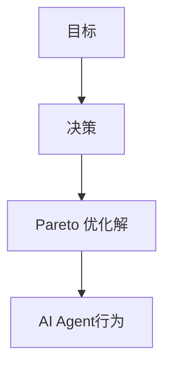
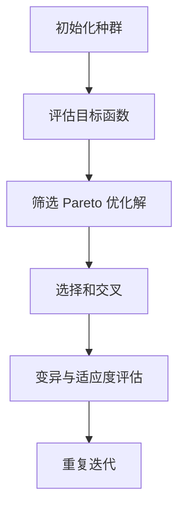
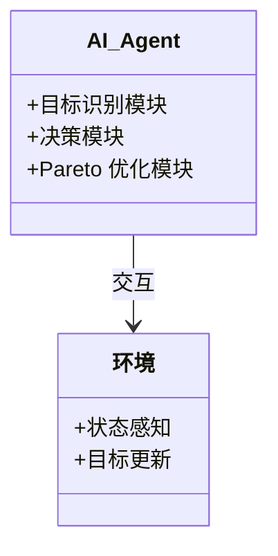
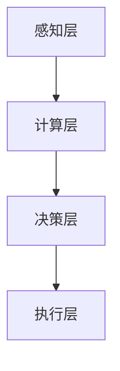
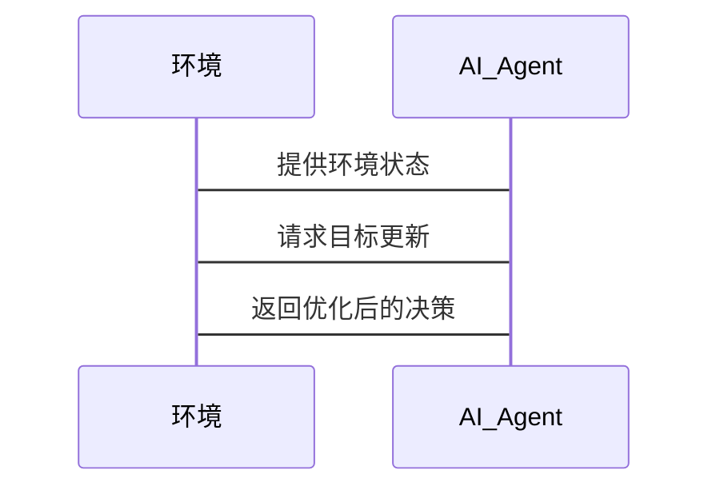

                 


# 构建具有多目标优化能力的AI Agent

> 关键词：多目标优化、AI Agent、Pareto 前沿、算法原理、系统架构

> 摘要：多目标优化在AI Agent的设计中扮演着关键角色，尤其是在需要同时优化多个相互冲突的目标时。本文将详细探讨多目标优化的核心概念、算法原理、系统架构设计以及实际应用案例。通过逐步分析，读者将能够理解如何构建一个具有多目标优化能力的AI Agent，并掌握其在实际项目中的应用方法。

---

## 第一部分：多目标优化AI Agent的背景与基础

### 第1章：多目标优化AI Agent概述

#### 1.1 多目标优化的背景与意义

##### 1.1.1 传统单目标优化的局限性  
在传统的AI Agent设计中，通常采用单目标优化方法。然而，这种方法在面对多个相互冲突的目标时显得力不从心。例如，在自动驾驶中，既要保证行驶速度，又要确保安全，单目标优化难以同时满足这两个目标。

##### 1.1.2 多目标优化的核心概念  
多目标优化是指在优化过程中考虑多个目标，并找到一个最优的平衡点。这些目标之间可能存在冲突，因此需要通过数学方法来寻找 Pareto 优化解。

##### 1.1.3 多目标优化在AI Agent中的应用价值  
多目标优化能够帮助AI Agent在复杂环境中做出更合理的决策，提升系统的灵活性和适应性。

#### 1.2 AI Agent的基本概念与分类

##### 1.2.1 AI Agent的定义与特征  
AI Agent是一种智能体，能够感知环境并采取行动以实现目标。其核心特征包括自主性、反应性、目标导向性和社交能力。

##### 1.2.2 基于多目标优化的AI Agent特点  
多目标优化AI Agent能够同时优化多个目标，找到 Pareto 优化解，并在复杂环境中做出更优决策。

##### 1.2.3 多目标优化与单目标优化的对比分析  
通过对比分析，明确多目标优化在AI Agent设计中的优势和适用场景。

#### 1.3 多目标优化问题的数学模型与特点

##### 1.3.1 多目标优化问题的数学表达  
$$ \text{minimize } f_1(x), f_2(x), \dots, f_n(x) $$
$$ \text{subject to } g_1(x) \leq 0, \dots, g_m(x) \leq 0 $$

##### 1.3.2 多目标优化的核心属性对比表格  
| 属性       | 单目标优化 | 多目标优化 |
|------------|------------|------------|
| 目标数量   | 1          | ≥2         |
| 解空间      | 单点解     | Pareto 前沿 |
| 决策难度    | 较低       | 较高       |

##### 1.3.3 多目标优化的ER实体关系图架构（Mermaid流程图）


#### 1.4 本章小结  
本章介绍了多目标优化的核心概念及其在AI Agent中的重要性，为后续章节奠定了基础。

---

## 第二部分：多目标优化算法原理与实现

### 第2章：多目标优化算法概述

#### 2.1 常见多目标优化算法

##### 2.1.1 基于权重的多目标优化算法  
通过为每个目标分配权重，将多目标问题转化为单目标问题。例如，使用加权和方法：
$$ f(x) = \sum_{i=1}^{n} w_i f_i(x) $$

##### 2.1.2 基于 Pareto 前沿的多目标优化算法  
通过生成 Pareto 优化解集，找到目标之间的平衡点。常用算法包括NSGA-II。

##### 2.1.3 其他多目标优化算法对比  
对比分析不同算法的优缺点，选择最适合应用场景的算法。

#### 2.2 基于 Pareto 前沿的多目标优化原理

##### 2.2.1 Pareto 前沿的基本概念  
Pareto 优化解是指在不损害一个目标的情况下无法进一步优化另一个目标的解。

##### 2.2.2 基于 Pareto 前沿的优化流程（Mermaid流程图）


#### 2.3 多目标优化的数学模型与公式

##### 2.3.1 多目标优化问题的数学表达  
$$ \text{minimize } (f_1(x), f_2(x), \dots, f_n(x)) $$
$$ \text{subject to } g_1(x) \leq 0, \dots, g_m(x) \leq 0 $$

##### 2.3.2 常见多目标优化算法的数学推导  
以NSGA-II为例，详细推导其适应度分配和排序过程。

##### 2.3.3 Pareto 优化的数学证明  
证明 Pareto 优化解的存在性和唯一性。

#### 2.4 本章小结  
本章详细讲解了多目标优化算法的原理和实现方法，为后续章节的系统设计提供了理论基础。

---

## 第三部分：多目标优化AI Agent的系统架构与设计

### 第3章：多目标优化AI Agent的系统架构

#### 3.1 系统功能设计

##### 3.1.1 多目标优化问题场景介绍  
以自动驾驶为例，说明多目标优化在AI Agent中的应用场景。

##### 3.1.2 系统功能模块划分  
包括目标识别、Pareto 优化计算、决策制定等模块。

##### 3.1.3 系统功能的领域模型（Mermaid类图）


#### 3.2 系统架构设计

##### 3.2.1 系统架构的分层设计  
将系统分为感知层、计算层和决策层。

##### 3.2.2 系统架构的模块交互（Mermaid架构图）


#### 3.3 系统接口设计

##### 3.3.1 系统接口的定义与规范  
定义AI Agent与环境之间的接口，如数据输入输出格式。

##### 3.3.2 系统接口的交互流程（Mermaid序列图）


#### 3.4 本章小结  
本章详细设计了多目标优化AI Agent的系统架构，为实际实现提供了指导。

---

## 第四部分：多目标优化AI Agent的项目实战

### 第4章：多目标优化AI Agent的项目实战

#### 4.1 环境安装与配置

##### 4.1.1 安装Python环境  
使用Anaconda或虚拟环境，安装所需的库，如numpy、pymoo。

#### 4.2 系统核心实现源代码

##### 4.2.1 多目标优化算法实现  
以NSGA-II为例，提供Python代码实现。

```python
import numpy as np

# 定义目标函数
def f1(x):
    return x**2

def f2(x):
    return (x-2)**2

# 多目标优化问题
problem = {
    "variables": ["x", (0, 4)],
    "objectives": [f1, f2],
    "constraints": None,
}

# NSGA-II算法实现（简化版）
class NSGAII:
    def optimize(problem, pop_size=100, generations=50):
        pass

# 运行优化
opt = NSGAII()
opt.optimize(problem)
```

##### 4.2.2 AI Agent的行为实现  
根据优化结果，生成AI Agent的行为策略。

#### 4.3 代码应用解读与分析

##### 4.3.1 代码结构分析  
详细解读代码的每一部分，说明其功能。

##### 4.3.2 优化结果分析  
展示优化后的Pareto前沿，并分析其在AI Agent中的应用。

#### 4.4 实际案例分析

##### 4.4.1 案例背景介绍  
以自动驾驶为例，说明多目标优化的应用场景。

##### 4.4.2 案例实现与结果展示  
展示优化后的决策过程，并分析其在实际场景中的效果。

#### 4.5 本章小结  
本章通过实际案例，展示了多目标优化AI Agent的实现过程和应用效果。

---

## 第五部分：总结与展望

### 第5章：总结与展望

#### 5.1 本篇总结  
回顾全文，总结多目标优化AI Agent的核心内容和主要结论。

#### 5.2 未来展望  
探讨多目标优化技术在AI Agent中的未来发展方向，如动态多目标优化、分布式优化等。

#### 5.3 最佳实践 Tips  
提供一些实际应用中的注意事项和优化建议。

#### 5.4 本章小结  
本章总结了全文内容，并展望了未来的研究方向。

---

通过以上目录结构，您可以逐步撰写完整的文章。每一部分都需要详细展开，确保内容全面且易于理解。

