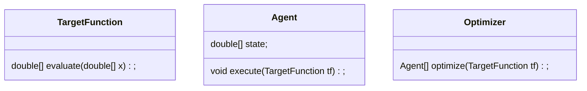
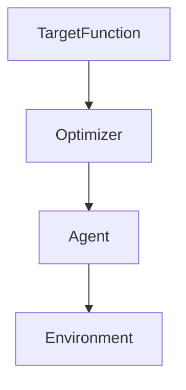
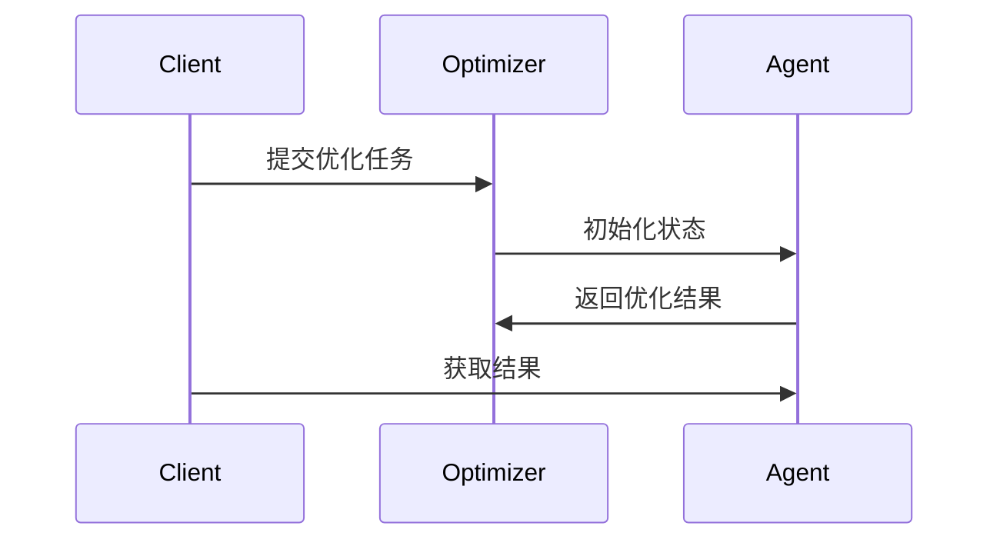

                 


# 构建具有多目标平衡能力的AI Agent

> 关键词：AI Agent、多目标优化、Pareto最优、算法实现、系统架构设计、项目实战

> 摘要：本文详细探讨了如何构建具有多目标平衡能力的AI Agent。通过分析多目标优化的基本原理、算法实现、系统架构设计以及项目实战，为读者提供全面的技术指导。文章从背景介绍入手，逐步深入，结合数学模型、流程图和代码示例，帮助读者掌握构建多目标平衡AI Agent的核心方法和实际应用。

---

## 第一部分: 构建具有多目标平衡能力的AI Agent背景介绍

### 第1章: AI Agent的基本概念与多目标优化背景

#### 1.1 AI Agent的定义与核心要素

##### 1.1.1 AI Agent的定义
AI Agent（智能体）是指能够感知环境、做出决策并执行动作的智能实体。AI Agent的核心目标是通过优化多个目标函数，在复杂环境中实现平衡与最优。

##### 1.1.2 多目标优化的背景与重要性
在实际应用中，AI Agent通常需要同时优化多个目标，例如在自动驾驶中，既要考虑安全，又要考虑效率。传统的单目标优化无法满足这种复杂需求，因此多目标优化成为必要。

##### 1.1.3 多目标平衡能力的定义与特点
多目标平衡能力是指AI Agent能够在多个相互冲突的目标之间找到平衡点，避免某一方的目标过度优化而忽视其他目标的能力。其特点是全局性、动态性和适应性。

#### 1.2 多目标优化的背景与问题描述

##### 1.2.1 多目标优化的基本概念
多目标优化是指在多个目标函数之间寻找最优解的过程，通常用于解决复杂的决策问题。

##### 1.2.2 多目标优化问题的描述
多目标优化问题通常表现为多个目标函数之间的冲突，例如在资源分配中，既要最大化利润，又要最小化成本。

##### 1.2.3 多目标平衡能力的实现目标
实现多目标平衡能力的目标是在多个目标之间找到一个合理的权衡点，使AI Agent能够在不同场景下灵活调整策略。

##### 1.2.4 多目标优化的边界与外延
多目标优化的边界通常由问题的约束条件和目标函数的权重决定。外延则涉及动态环境下的实时优化。

##### 1.2.5 多目标优化的概念结构与核心要素组成
多目标优化的核心要素包括目标函数、约束条件、优化算法和决策空间。

---

### 第2章: 多目标优化的基本原理与数学模型

#### 2.1 多目标优化的基本原理

##### 2.1.1 多目标优化的核心概念
多目标优化的核心概念包括Pareto最优、支配关系和非支配排序。

##### 2.1.2 多目标优化的数学模型
多目标优化的数学模型通常表示为多个目标函数的优化问题：

$$ \text{目标函数} = f(x) = (f_1(x), f_2(x), ..., f_n(x)) $$

##### 2.1.3 多目标优化的算法流程
多目标优化的算法流程包括初始化、评估目标函数、计算支配关系和更新解集。

##### 2.1.4 多目标优化与单目标优化的对比
通过对比单目标优化和多目标优化，可以发现多目标优化的复杂性和灵活性是其独特优势。

#### 2.2 多目标优化的数学模型

##### 2.2.1 帕累托最优解的数学定义
Pareto最优解是指在解集中，不存在其他解能够同时在所有目标上优于当前解。

$$ \text{Pareto最优解} = \{x | \nexists y \text{ 使得 } y \geq x \text{ 且 } y \neq x\} $$

##### 2.2.2 多目标优化的拥挤度计算公式
拥挤度计算用于评估解的分布密度：

$$ \text{拥挤度}(x_i) = \frac{1}{\sum_{j \in N_i} |x_j - x_i|} $$

---

## 第三部分: 多目标优化算法的原理与实现

### 第3章: 多目标优化算法的原理与实现

#### 3.1 非支配排序遗传算法（NSGA-II）的原理

##### 3.1.1 NSGA-II的核心思想
NSGA-II通过非支配排序和拥挤度计算，逐步优化解集，确保解的多样性和收敛性。

##### 3.1.2 NSGA-II的算法流程
```mermaid
graph TD
    A[开始] --> B[初始化参数]
    B --> C[计算目标函数]
    C --> D[判断是否满足收敛条件]
    D -->|不满足| C
    D -->|满足| E[输出最优解]
    E -->
```

##### 3.1.3 NSGA-II的代码实现
以下是一个简单的Python实现：

```python
import numpy as np

def evaluate(x):
    # 目标函数
    return (x[0], x[1])

def nsga_ii(population_size, generations):
    population = np.random.rand(population_size, 2)
    for _ in range(generations):
        # 计算目标函数
        objectives = evaluate(population)
        # 非支配排序
        dominated = np.zeros(population_size, dtype=bool)
        for i in range(population_size):
            for j in range(population_size):
                if i != j and not dominated[j]:
                    if objectives[i][0] <= objectives[j][0] and objectives[i][1] <= objectives[j][1]:
                        dominated[i] = True
                        break
        # 计算拥挤度
        crowd = np.zeros(population_size)
        for i in range(population_size):
            if not dominated[i]:
                count = 0
                for j in range(population_size):
                    if not dominated[j] and i != j:
                        if objectives[i][0] > objectives[j][0] and objectives[i][1] > objectives[j][1]:
                            count += 1
                crowd[i] = 1 / count
        # 选择和更新
        new_population = np.empty_like(population)
        for i in range(population_size):
            select = np.random.randint(population_size)
            new_population[i] = population[select]
        population = new_population
    return population, objectives
```

#### 3.2 多目标优化算法的数学模型与公式

##### 3.2.1 多目标优化的数学表达
$$ \text{目标函数} = f(x) = (f_1(x), f_2(x), ..., f_n(x)) $$

##### 3.2.2 帕累托最优解的数学定义
$$ \text{Pareto最优解} = \{x | \nexists y \text{ 使得 } y \geq x \text{ 且 } y \neq x\} $$

##### 3.2.3 多目标优化的拥挤度计算公式
$$ \text{拥挤度}(x_i) = \frac{1}{\sum_{j \in N_i} |x_j - x_i|} $$

---

## 第四部分: 系统分析与架构设计

### 第4章: 系统分析与架构设计

#### 4.1 问题场景介绍

##### 4.1.1 多目标优化的应用场景
多目标优化广泛应用于资源分配、路径规划、投资决策等领域。

##### 4.1.2 系统功能设计
系统功能模块包括目标解析、优化计算、策略执行和结果反馈。

##### 4.1.3 系统交互流程
系统交互流程包括需求输入、目标解析、优化计算和结果输出。

#### 4.2 系统架构设计

##### 4.2.1 领域模型类图


##### 4.2.2 系统架构图


##### 4.2.3 接口设计与交互流程图


---

## 第五部分: 项目实战

### 第5章: 项目实战

#### 5.1 环境配置与安装

##### 5.1.1 Python环境的安装与配置
安装Python和必要的库：

```bash
pip install numpy matplotlib
```

##### 5.1.2 代码运行环境的搭建
确保Python版本为3.x，安装必要的依赖库。

#### 5.2 核心代码实现

##### 5.2.1 多目标优化算法实现
完整的Python代码实现：

```python
import numpy as np

def evaluate(x):
    return (x[0], x[1])

def nsga_ii(population_size, generations):
    population = np.random.rand(population_size, 2)
    for _ in range(generations):
        objectives = evaluate(population)
        dominated = np.zeros(population_size, dtype=bool)
        for i in range(population_size):
            for j in range(population_size):
                if i != j and not dominated[j]:
                    if objectives[i][0] <= objectives[j][0] and objectives[i][1] <= objectives[j][1]:
                        dominated[i] = True
                        break
        crowd = np.zeros(population_size)
        for i in range(population_size):
            if not dominated[i]:
                count = 0
                for j in range(population_size):
                    if not dominated[j] and i != j:
                        if objectives[i][0] > objectives[j][0] and objectives[i][1] > objectives[j][1]:
                            count += 1
                crowd[i] = 1 / count
        new_population = np.empty_like(population)
        for i in range(population_size):
            select = np.random.randint(population_size)
            new_population[i] = population[select]
        population = new_population
    return population, objectives
```

##### 5.2.2 AI Agent的框架实现
AI Agent的框架实现：

```python
class Agent:
    def __init__(self, state):
        self.state = state

    def execute(self, target_func):
        objectives = target_func(self.state)
        # 根据多目标优化算法更新状态
        # ...
        return objectives
```

#### 5.3 实际案例分析与解读

##### 5.3.1 案例背景介绍
以资源分配问题为例，目标是最大化利润和最小化成本。

##### 5.3.2 数据处理与分析
对资源分配问题进行建模，确定目标函数和约束条件。

##### 5.3.3 多目标优化算法的应用
使用NSGA-II算法进行优化，得到Pareto最优解。

##### 5.3.4 结果分析与优化调整
分析优化结果，调整算法参数，进一步优化解的质量。

#### 5.4 项目总结与经验分享

##### 5.4.1 项目实现的关键点
关键点包括算法实现、系统设计和结果分析。

##### 5.4.2 实践中的注意事项
注意事项包括算法收敛性、计算效率和结果验证。

##### 5.4.3 项目优化与改进
通过参数调整和算法改进，进一步提升优化效果。

---

## 第六部分: 总结与展望

### 第6章: 总结与展望

#### 6.1 总结

##### 6.1.1 核心内容回顾
本文详细介绍了多目标优化的基本原理、算法实现和系统设计。

##### 6.1.2 最佳实践 tips
建议在实际应用中结合具体场景调整算法参数，注重系统的可扩展性和可维护性。

#### 6.2 展望

##### 6.2.1 未来研究方向
未来可以研究动态多目标优化和高维多目标优化问题。

##### 6.2.2 技术发展趋势
多目标优化技术将在自动驾驶、机器人控制等领域发挥重要作用。

##### 6.2.3 应用前景分析
多目标优化技术将在工业自动化、智能城市等领域得到广泛应用。

---

## 第七部分: 附录

### 第7章: 附录

#### 7.1 附录内容

##### 7.1.1 常用多目标优化算法列表
包括NSGA-II、MOEA/D等算法。

##### 7.1.2 相关技术术语解释
解释Pareto最优、支配关系等术语。

##### 7.1.3 进一步阅读的推荐资料
推荐相关书籍和论文，供读者深入学习。

---

通过以上目录结构，我们可以清晰地看到构建具有多目标平衡能力的AI Agent的完整过程，从理论到实践，从算法到系统设计，帮助读者全面掌握这一技术的核心方法和实际应用。

