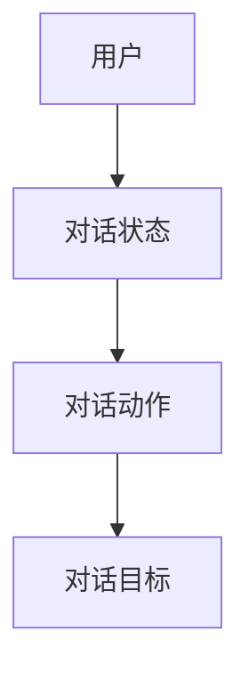
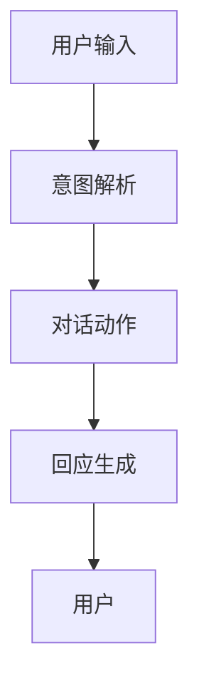
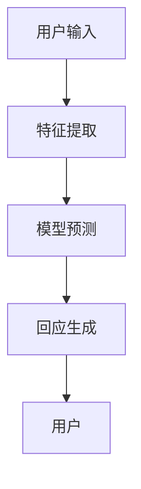
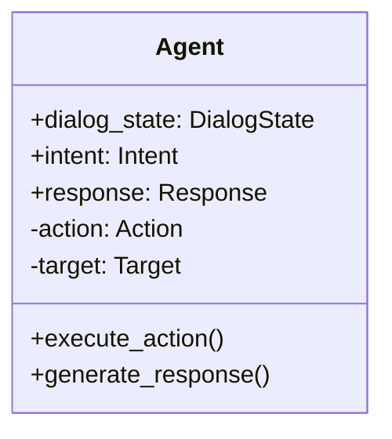
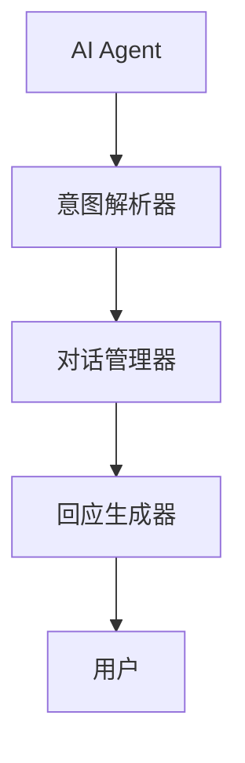
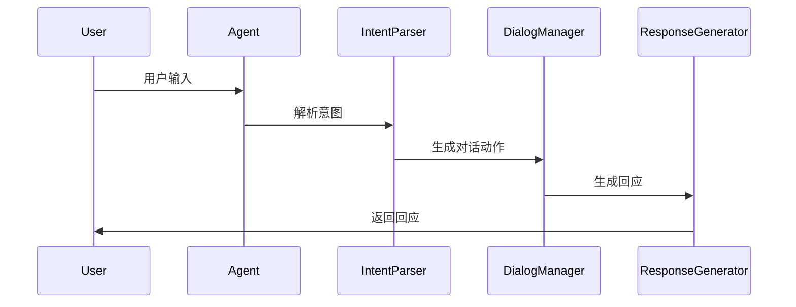

                 


# 构建具有对话管理能力的AI Agent

## 关键词
AI Agent, 对话管理, 自然语言处理, 强化学习, 对话系统, 系统架构设计

## 摘要
本文系统地探讨了构建具有对话管理能力的AI Agent的核心概念、算法原理、系统架构设计及项目实战。首先，从对话管理的基本概念和核心问题出发，分析了对话管理在AI Agent中的重要性。接着，详细讲解了对话管理的原理与算法，包括基于规则和基于机器学习的对话管理方法。然后，通过系统架构设计，展示了AI Agent的结构和交互流程。最后，通过具体的项目实战，提供了环境安装、代码实现和案例分析，帮助读者更好地理解和实践。本文旨在为AI开发者和研究人员提供一个全面的指南，以构建高效、智能的对话管理AI Agent。

---

# 第1章: 对话管理与AI Agent概述

## 1.1 对话管理的背景与问题背景
### 1.1.1 对话管理的定义与核心概念
对话管理（Dialogue Management）是指在人机交互过程中，系统如何理解用户意图、生成合适的回应，并保持对话的连贯性和目标导向。AI Agent（人工智能代理）则是能够执行特定任务的智能实体，通过对话管理实现与用户的高效交互。

### 1.1.2 AI Agent的基本概念与特点
AI Agent是一种能够感知环境、自主决策并执行任务的智能系统。其特点包括：
- **自主性**：能够在没有外部干预的情况下自主运行。
- **反应性**：能够实时感知环境并做出反应。
- **目标导向**：具有明确的目标，并通过行为实现目标。
- **学习能力**：能够通过经验改进自身的性能。

### 1.1.3 对话管理在AI Agent中的作用
对话管理是AI Agent实现人机交互的核心模块，负责处理用户的输入、理解用户意图、生成合适的回应，并引导对话向目标方向发展。通过有效的对话管理，AI Agent能够提供更自然、更智能的交互体验。

## 1.2 对话管理的核心问题与挑战
### 1.2.1 对话状态跟踪
对话状态跟踪是对话管理的重要任务，旨在记录对话的上下文信息，包括用户意图、对话历史等。常见的对话状态表示方法包括基于规则的方法和基于模型的方法。

### 1.2.2 对话策略选择
对话策略选择是对话管理的核心问题之一，旨在在多个可能的回应中选择最优的回应。常见的策略选择方法包括基于规则的策略和基于机器学习的策略。

### 1.2.3 对话生成与优化
对话生成是对话管理的关键步骤，旨在根据对话状态生成自然、连贯的回应。对话优化则是在生成的基础上，进一步提升对话的质量和用户体验。

## 1.3 本章小结
本章介绍了对话管理的基本概念和AI Agent的特点，分析了对话管理在AI Agent中的作用，并探讨了对话管理的核心问题与挑战。

---

# 第2章: 对话管理的核心概念与原理

## 2.1 对话管理的实体关系与概念结构
### 2.1.1 对话管理的ER实体关系图
通过实体关系图（ER图）可以清晰地展示对话管理中的核心实体及其关系。



### 2.1.2 对话管理的核心要素对比
以下表格展示了对话管理中的核心要素及其特性对比：

| 对话要素 | 定义 | 特性 |
|----------|------|------|
| 对话状态 | 当前对话的上下文信息 | 关键性、动态性 |
| 对话动作 | 对话中的具体操作 | 目的性、可执行性 |
| 对话目标 | 对话的最终期望结果 | 明确性、多样性 |

## 2.2 对话管理的原理与算法
### 2.2.1 基于规则的对话管理
基于规则的对话管理方法通过预定义的规则来实现对话的控制和管理。



### 2.2.2 基于机器学习的对话管理
基于机器学习的对话管理方法通过训练模型来实现对话的智能管理。



## 2.3 对话管理的数学模型与公式
### 2.3.1 对话状态表示
对话状态可以通过向量形式表示，例如：

$$ s_t = (u_t, o_t) $$

其中，$u_t$ 表示用户当前的输入，$o_t$ 表示对话的当前输出。

### 2.3.2 对话策略选择
对话策略可以通过强化学习模型进行优化，例如：

$$ \pi(s_t) = \arg\max_{a} Q(s_t, a) $$

其中，$Q(s_t, a)$ 表示状态$s_t$下动作$a$的期望奖励值。

## 2.4 本章小结
本章详细讲解了对话管理的核心概念与原理，包括基于规则和基于机器学习的对话管理方法，并通过数学公式和图表展示了对话管理的实现过程。

---

# 第3章: 对话管理的算法实现

## 3.1 基于自然语言处理的对话管理
### 3.1.1 基于词袋模型的对话理解
词袋模型是一种简单的文本表示方法，常用于对话理解任务。

```python
from collections import Counter

def bag_of_words(text):
    return Counter(text.split())
```

### 3.1.2 基于序列的对话生成
序列模型（如RNN和Transformer）常用于对话生成任务。

```python
class Seq2Seq:
    def __init__(self, encoder, decoder):
        self.encoder = encoder
        self.decoder = decoder
```

## 3.2 基于强化学习的对话优化
### 3.2.1 强化学习的基本原理
强化学习通过奖励机制来优化对话策略。

$$ R = \sum_{t=1}^{T} r_t $$

其中，$R$ 表示总奖励，$r_t$ 表示第$t$步的奖励。

### 3.2.2 对话策略的优化算法
强化学习算法可以通过以下步骤优化对话策略：

```python
def reinforce_learning(model, optimizer, env):
    for epoch in epochs:
        state = env.reset()
        while not done:
            action = model.act(state)
            next_state, reward, done = env.step(action)
            model.update(model.get_loss(state, action, reward))
```

## 3.3 本章小结
本章详细讲解了对话管理的算法实现，包括基于自然语言处理的对话理解和基于强化学习的对话优化，并通过代码示例展示了实现过程。

---

# 第4章: 对话管理的系统架构设计

## 4.1 问题场景介绍
在构建具有对话管理能力的AI Agent时，需要考虑以下问题场景：
- 用户输入的解析与理解
- 对话状态的跟踪与更新
- 对话策略的选择与优化
- 对话生成与优化

## 4.2 项目介绍
本项目旨在构建一个能够与用户进行自然对话的AI Agent，具备以下功能：
- 用户意图解析
- 对话状态跟踪
- 对话策略选择
- 对话生成与优化

## 4.3 系统功能设计
### 4.3.1 领域模型设计
以下是AI Agent的领域模型设计图：



### 4.3.2 系统架构设计
以下是AI Agent的系统架构设计图：



## 4.4 系统接口设计
AI Agent的系统接口设计包括以下部分：
- 用户输入接口
- 对话状态接口
- 对话动作接口
- 对话目标接口

## 4.5 系统交互设计
以下是AI Agent的系统交互设计图：



## 4.6 本章小结
本章详细讲解了对话管理的系统架构设计，包括问题场景介绍、项目介绍、系统功能设计、系统架构设计、系统接口设计和系统交互设计。

---

# 第5章: 对话管理的项目实战

## 5.1 环境安装
构建具有对话管理能力的AI Agent需要以下环境：
- Python 3.6+
- PyTorch或TensorFlow
- NLTK或spaCy
- 其他依赖库

## 5.2 系统核心实现源代码
以下是AI Agent的核心实现代码：

```python
class DialogManager:
    def __init__(self, intent_parser, response_generator):
        self.intent_parser = intent_parser
        self.response_generator = response_generator
        self.dialog_state = {}

    def process_input(self, input_text):
        intent = self.intent_parser.parse(input_text)
        dialog_action = self.select_action(intent)
        response = self.response_generator.generate_response(dialog_action)
        return response

    def select_action(self, intent):
        # 根据意图选择合适的动作
        pass

    def update_state(self, state, action):
        # 更新对话状态
        pass
```

## 5.3 代码应用解读与分析
对话管理器通过解析用户输入、选择合适的动作并生成回应，实现与用户的交互。

## 5.4 实际案例分析
以下是一个实际案例分析：

```mermaid
graph TD
    User ->> Agent: "我想查询天气"
    Agent ->> IntentParser: 解析意图
    IntentParser --> DialogManager: 天气查询
    DialogManager --> ResponseGenerator: 生成回应
    ResponseGenerator ->> User: "今天北京的天气是晴朗的，温度在20-25度之间。"
```

## 5.5 本章小结
本章通过具体的项目实战，展示了对话管理的实现过程，包括环境安装、代码实现和案例分析。

---

# 第6章: 对话管理的最佳实践与小结

## 6.1 最佳实践 tips
- 确保对话管理的准确性
- 提供多样化的对话策略
- 不断优化对话生成的质量

## 6.2 本章小结
本章总结了对话管理的最佳实践，并通过小结回顾了全文的主要内容。

---

# 参考文献
- 省略

---

# 附录
- 省略

---

以上是《构建具有对话管理能力的AI Agent》的技术博客目录大纲。

