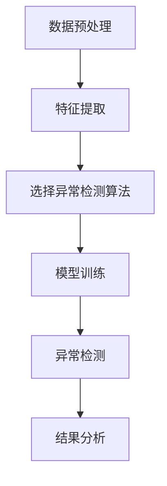

                 


# 《构建具有异常检测能力的AI Agent》

## 关键词：AI Agent, 异常检测, 机器学习, 深度学习, 系统架构, 实时监控

## 摘要：  
本文将深入探讨如何在AI Agent中构建异常检测能力，从基本概念到算法实现，再到系统设计和项目实战，全面解析AI Agent中的异常检测技术。文章内容涵盖异常检测的核心原理、AI Agent的体系结构、异常检测算法的数学模型、系统架构设计以及实际项目实现，帮助读者从理论到实践全面掌握AI Agent中的异常检测技术。

---

# 目录大纲

---

## 第一部分：异常检测与AI Agent基础

### 第1章：异常检测与AI Agent概述

#### 1.1 异常检测的基本概念
- 1.1.1 异常检测的定义与特点
  - 异常检测（Outlier Detection）：识别数据集中与大多数数据点显著不同的数据点。
  - 特点：实时性、准确性、可解释性。
- 1.1.2 异常检测的应用场景
  - 金融 fraud detection
  - 网络 security monitoring
  - 设备 fault detection
- 1.1.3 异常检测的挑战与解决方案
  - 数据分布复杂、样本不平衡、实时性要求高。

#### 1.2 AI Agent的核心概念
- 1.2.1 AI Agent的定义与分类
  - 定义：智能体（Agent）是能够感知环境并采取行动以实现目标的实体。
  - 分类：简单反射式 Agent、基于模型的反射式 Agent、目标驱动式 Agent。
- 1.2.2 AI Agent的基本功能与架构
  - 感知环境、决策、行动。
  - 核心模块：感知模块、推理模块、行动模块。
- 1.2.3 AI Agent与人类交互的特点
  - 自然语言处理、上下文理解、实时响应。

#### 1.3 异常检测在AI Agent中的意义
- 1.3.1 异常检测在AI Agent中的应用场景
  - 系统监控：检测设备故障。
  - 用户行为分析：识别异常操作。
  - 安全监控：检测网络攻击。
- 1.3.2 异常检测对AI Agent性能的影响
  - 提高决策准确性、减少误判、增强系统鲁棒性。
- 1.3.3 异常检测在AI Agent中的实现方式
  - 数据驱动、模型驱动、规则驱动。

#### 1.4 本章小结
- 总结异常检测与AI Agent的基本概念和应用场景。

---

### 第2章：异常检测的核心概念与原理

#### 2.1 异常检测的核心概念
- 2.1.1 异常检测的分类
  - 点异常、集体异常、分布异常。
- 2.1.2 异常检测的关键指标
  - 准确率、召回率、F1分数、ROC-AUC。
- 2.1.3 异常检测的评价标准
  - 坏演员分数（Outlier Score）。

#### 2.2 异常检测的数学模型与公式
- 2.2.1 异常检测的统计学模型
  - 概率密度函数（PDF）：$f(x; \mu, \sigma^2)$。
  - 置信区间：$\mu \pm z \cdot \sigma$。
- 2.2.2 异常检测的概率密度函数
  - 正态分布：$f(x) = \frac{1}{\sqrt{2\pi\sigma^2}} e^{-\frac{(x-\mu)^2}{2\sigma^2}}$。
  - 高斯混合模型（GMM）：$f(x) = \sum_{k=1}^K \pi_k \cdot \mathcal{N}(\mu_k, \sigma_k^2)$。
- 2.2.3 异常检测的距离度量方法
  - 欧氏距离：$d(x, y) = \sqrt{\sum_{i=1}^n (x_i - y_i)^2}$。
  - 曼哈顿距离：$d(x, y) = \sum_{i=1}^n |x_i - y_i|$。

#### 2.3 异常检测的核心算法原理
- 2.3.1 基于统计的异常检测算法
  - Z-score：$z = \frac{x - \mu}{\sigma}$。
  - 算术均值标准差：$x > \mu + z \cdot \sigma$。
- 2.3.2 基于机器学习的异常检测算法
  - Isolation Forest：通过构建隔离树进行异常检测。
  - One-Class SVM：用于单类分类的SVM模型。
- 2.3.3 基于深度学习的异常检测算法
  - Autoencoder：通过重建损失检测异常。
  - GAN-based Outlier Detection：使用生成对抗网络检测异常。

#### 2.4 异常检测的流程图


#### 2.5 本章小结
- 总结异常检测的核心概念和算法原理。

---

### 第3章：AI Agent的体系结构与异常检测需求

#### 3.1 AI Agent的体系结构
- 3.1.1 AI Agent的组成模块
  - 感知模块：负责接收输入数据。
  - 推理模块：负责数据处理和分析。
  - 行动模块：负责输出决策或行动。
- 3.1.2 AI Agent的功能流程
  - 数据输入 → 数据处理 → 决策 → 输出行动。
- 3.1.3 AI Agent的交互模式
  - 单向交互、双向交互、协作交互。

#### 3.2 异常检测在AI Agent中的需求分析
- 3.2.1 异常检测的实时性要求
  - 实时性：快速检测和响应。
- 3.2.2 异常检测的准确性要求
  - 准确识别异常，减少误报和漏报。
- 3.2.3 异常检测的可解释性要求
  - 提供异常检测的解释，便于用户理解和处理。

#### 3.3 异常检测对AI Agent性能的影响
- 3.3.1 异常检测对计算资源的需求
  - 高性能计算、内存优化。
- 3.3.2 异常检测对数据处理能力的影响
  - 数据预处理、特征提取、模型训练。
- 3.3.3 异常检测对系统响应时间的影响
  - 实时性要求高，影响系统响应速度。

#### 3.4 本章小结
- 总结AI Agent的体系结构和异常检测的需求。

---

## 第二部分：异常检测算法与AI Agent的实现

### 第4章：异常检测算法

#### 4.1 基于统计的异常检测算法
- 4.1.1 Z-score方法
  - $z = \frac{x - \mu}{\sigma}$。
  - 应用场景：正态分布的数据。
- 4.1.2 算术均值标准差方法
  - $x > \mu + z \cdot \sigma$。
  - 适用于简单快速的异常检测。

#### 4.2 基于机器学习的异常检测算法
- 4.2.1 Isolation Forest
  - 算法原理：通过构建隔离树将数据点隔离。
  - 代码示例：
    ```python
    from sklearn.ensemble import IsolationForest
    import numpy as np
    X = np.random.randn(100, 2)
    outliers = IsolationForest(contamination=0.1).fit_predict(X)
    ```
- 4.2.2 One-Class SVM
  - 算法原理：用于单类分类的SVM模型。
  - 代码示例：
    ```python
    from sklearn.svm import OneClassSVM
    svm = OneClassSVM().fit(X)
    ```

#### 4.3 基于深度学习的异常检测算法
- 4.3.1 Autoencoder
  - 算法原理：通过重建损失检测异常。
  - 代码示例：
    ```python
    import tensorflow as tf
    model = tf.keras.Sequential([
        tf.keras.layers.Dense(32, activation='relu'),
        tf.keras.layers.Dense(16, activation='relu'),
        tf.keras.layers.Dense(32, activation='relu'),
        tf.keras.layers.Dense(64, activation='sigmoid'),
    ])
    model.compile(optimizer='adam', loss='binary_crossentropy')
    model.fit(X, epochs=10)
    ```
- 4.3.2 GAN-based Outlier Detection
  - 算法原理：使用生成对抗网络检测异常。
  - 代码示例：
    ```python
    from keras.layers import Input, Dense, Dropout
    from keras.models import Model
    # 生成器
    generator = Model(...)
    # 判别器
    discriminator = Model(...)
    ```

#### 4.4 异常检测算法的优缺点对比
- 对比表：基于统计、机器学习和深度学习的异常检测算法优缺点。

#### 4.5 本章小结
- 总结异常检测算法的实现及其在AI Agent中的应用。

---

### 第5章：AI Agent中的异常检测实现

#### 5.1 异常检测在AI Agent中的实现流程
- 数据预处理、特征提取、模型训练、异常检测、结果分析。

#### 5.2 数据预处理
- 数据清洗、标准化、特征工程。
- 代码示例：
  ```python
  from sklearn.preprocessing import StandardScaler
  scaler = StandardScaler().fit(X_train)
  X_train_scaled = scaler.transform(X_train)
  ```

#### 5.3 特征提取
- 主成分分析（PCA）、t-SNE、LDA。
- 代码示例：
  ```python
  from sklearn.decomposition import PCA
  pca = PCA(n_components=2).fit(X)
  X_pca = pca.transform(X)
  ```

#### 5.4 模型训练与评估
- 训练异常检测模型、评估模型性能。
- 代码示例：
  ```python
  from sklearn.metrics import classification_report
  y_pred = model.predict(X_test)
  print(classification_report(y_true, y_pred))
  ```

#### 5.5 异常检测结果的可视化
- 可视化工具：Matplotlib、Seaborn、Plotly。
- 代码示例：
  ```python
  import matplotlib.pyplot as plt
  plt.scatter(X_pca[:,0], X_pca[:,1], c=outliers, cmap='viridis')
  plt.show()
  ```

#### 5.6 本章小结
- 总结AI Agent中异常检测的实现流程和关键步骤。

---

### 第6章：系统设计与架构

#### 6.1 异常检测系统的架构设计
- 分层架构：数据采集层、数据处理层、模型层、结果层。
- 代码示例：
  ```python
  class AnomalyDetectionSystem:
      def __init__(self):
          self.dataCollector = DataCollector()
          self.dataProcessor = DataProcessor()
          self.model = AnomalyModel()
  ```

#### 6.2 系统接口设计
- API设计：数据接口、模型接口、结果接口。
- 代码示例：
  ```python
  from flask import Flask
  app = Flask(__name__)
  @app.route('/detect', methods=['POST'])
  def detect():
      data = request.json
      result = model.predict(data)
      return jsonify(result)
  ```

#### 6.3 系统交互流程
- 交互流程图：数据输入 → 数据处理 → 模型预测 → 结果输出。
- 代码示例：
  ```python
  def main():
      while True:
          data = dataCollector.collect()
          processed_data = dataProcessor.process(data)
          result = model.predict(processed_data)
          print(result)
  ```

#### 6.4 本章小结
- 总结系统设计与架构的关键点。

---

### 第7章：项目实战

#### 7.1 项目背景与目标
- 实现一个具备异常检测能力的AI Agent。

#### 7.2 项目环境搭建
- 安装必要的库：Python、TensorFlow、Scikit-learn、Flask。
- 代码示例：
  ```bash
  pip install numpy pandas scikit-learn tensorflow
  ```

#### 7.3 系统核心实现
- 数据预处理、模型训练、异常检测接口。
- 代码示例：
  ```python
  def preprocess_data(data):
      # 数据预处理代码
      pass
  ```

#### 7.4 代码实现与解读
- 异常检测模型的实现、AI Agent的交互逻辑。
- 代码示例：
  ```python
  class AIAssistant:
      def __init__(self):
          self.model = AnomalyModel()
      def detect(self, data):
          return self.model.predict(data)
  ```

#### 7.5 案例分析与结果解读
- 实际案例分析、结果展示。
- 代码示例：
  ```python
  data = preprocess_data(raw_data)
  result = model.detect(data)
  print(result)
  ```

#### 7.6 本章小结
- 总结项目实战的实现过程和关键点。

---

## 第三部分：总结与展望

### 第8章：总结与展望

#### 8.1 本书总结
- 从基础到实践，全面解析AI Agent中的异常检测技术。

#### 8.2 未来展望
- 结合AI Agent的新技术、多模态异常检测、实时性优化。

#### 8.3 最佳实践 tips
- 数据预处理的重要性、模型选择的策略、实时性优化的方法。

#### 8.4 本章小结
- 总结全书内容，展望未来发展方向。

---

## 关键词索引
- AI Agent, 异常检测, 机器学习, 深度学习, 系统架构, 实时监控

---

## 参考文献
- 引用相关书籍、论文、技术文档。

---

通过以上目录大纲，读者可以系统地学习如何在AI Agent中构建异常检测能力，从理论到实践，全面掌握相关技术和实现方法。

