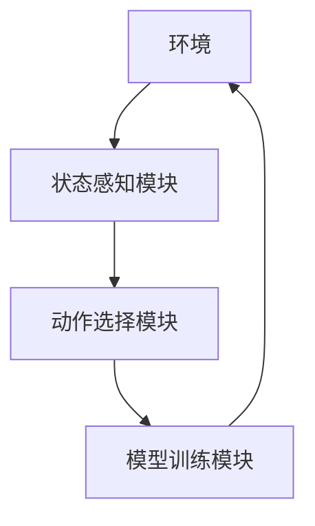
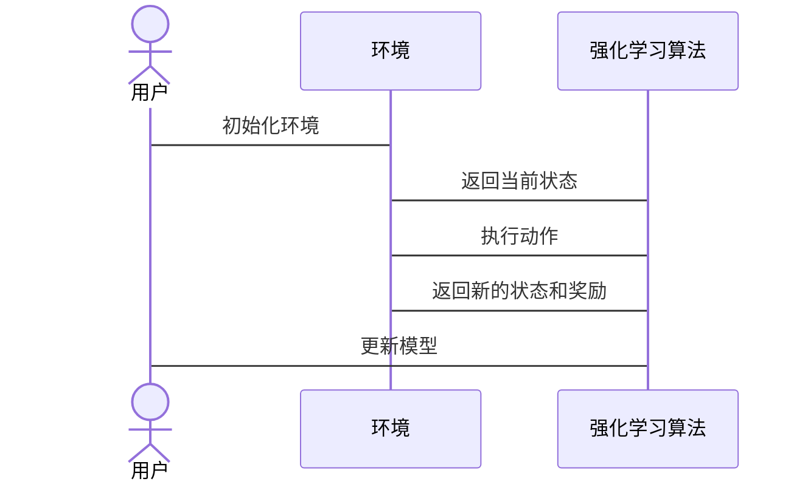

                 


# 《构建具有强化学习能力的AI Agent》

> 关键词：强化学习，AI Agent，Q-learning，DQN，深度强化学习

> 摘要：本文详细介绍了如何构建具有强化学习能力的AI Agent。首先，从强化学习的基本概念和AI Agent的定义入手，分析了强化学习在AI Agent中的应用。接着，详细讲解了Q-learning和DQN等经典强化学习算法的原理和实现。然后，通过设计状态空间、动作空间和奖励机制，构建了一个完整的AI Agent框架。最后，通过一个实际案例，演示了如何使用Python和深度学习技术实现一个强化学习AI Agent，并给出了代码实现和性能优化的建议。

---

## 第1章: 强化学习与AI Agent概述

### 1.1 强化学习的基本概念

#### 1.1.1 什么是强化学习

强化学习（Reinforcement Learning, RL）是一种机器学习范式，其中智能体（Agent）通过与环境交互，学习如何采取最优行动以最大化累积奖励。与监督学习不同，强化学习不需要明确的标签数据，而是通过奖励信号来指导学习过程。

#### 1.1.2 AI Agent的定义与特点

AI Agent是一种能够感知环境、做出决策并采取行动的智能实体。AI Agent的特点包括自主性、反应性、目标导向性和社交能力。AI Agent的核心目标是通过感知环境和采取行动来实现其目标。

#### 1.1.3 强化学习在AI Agent中的作用

强化学习为AI Agent提供了决策机制，使其能够通过与环境交互，学习最优策略。强化学习使得AI Agent能够在动态和不确定的环境中自适应地调整行为，以实现长期目标。

### 1.2 强化学习的核心概念

#### 1.2.1 状态、动作、奖励的定义

- **状态（State）**：环境在某一时刻的观测，表示智能体所处的环境情况。
- **动作（Action）**：智能体可以采取的行动，用于改变环境的状态。
- **奖励（Reward）**：对智能体采取动作的反馈，用于指导智能体学习最优策略。

#### 1.2.2 策略与价值函数的关系

- **策略（Policy）**：策略是智能体在给定状态下选择动作的概率分布，表示智能体如何根据当前状态做出决策。
- **价值函数（Value Function）**：价值函数用于衡量某个状态下智能体采取特定动作后的预期回报。

#### 1.2.3 探索与利用的平衡

强化学习中的探索（Exploration）是指智能体尝试新动作以发现更好的策略，而利用（Exploitation）是指智能体利用已知的最优策略。平衡探索与利用是强化学习的关键问题。

### 1.3 强化学习的数学模型

#### 1.3.1 状态空间与动作空间的数学表示

状态空间（State Space）可以表示为$S$，动作空间（Action Space）表示为$A$。状态转移可以通过概率分布$P(s' | s, a)$表示，表示从状态$s$采取动作$a$后转移到状态$s'$的概率。

#### 1.3.2 奖励函数的数学公式

奖励函数通常表示为$r(s, a, s')$，表示在状态$s$采取动作$a$后转移到状态$s'$时获得的奖励。

#### 1.3.3 Q-learning算法的数学推导

Q-learning算法通过学习Q值函数$Q(s, a)$，表示在状态$s$采取动作$a$后的预期回报。Q-learning的更新公式为：

$$ Q(s, a) = Q(s, a) + \alpha \left( r + \gamma \max_{a'} Q(s', a') - Q(s, a) \right) $$

其中，$\alpha$是学习率，$\gamma$是折扣因子。

### 1.4 本章小结

本章介绍了强化学习的基本概念和AI Agent的定义，分析了强化学习在AI Agent中的作用，并详细讲解了强化学习的核心概念和数学模型。

---

## 第2章: 强化学习的核心算法

### 2.1 Q-learning算法

#### 2.1.1 Q-learning的基本原理

Q-learning是一种基于值的强化学习算法，通过学习Q值表来选择最优动作。Q-learning适用于离散状态和动作空间的问题。

#### 2.1.2 Q-learning的数学公式

Q-learning的更新公式为：

$$ Q(s, a) = Q(s, a) + \alpha \left( r + \gamma \max_{a'} Q(s', a') - Q(s, a) \right) $$

#### 2.1.3 Q-learning的实现步骤

1. 初始化Q值表为零。
2. 与环境交互，获取当前状态$s$和动作$a$。
3. 执行动作$a$，观察新的状态$s'$和奖励$r$。
4. 更新Q值表：$Q(s, a) = Q(s, a) + \alpha (r + \gamma \max Q(s', a') - Q(s, a))$。
5. 重复步骤2-4，直到收敛。

### 2.2 Deep Q-Network (DQN)算法

#### 2.2.1 DQN算法的改进点

DQN通过使用深度神经网络近似Q值函数，解决了Q-learning在高维状态空间和动作空间中的局限性。

#### 2.2.2 DQN的网络结构与训练过程

DQN的网络结构包括输入层、隐藏层和输出层。输出层的大小等于动作空间的大小。DQN通过经验回放和目标网络来稳定训练过程。

#### 2.2.3 DQN的数学推导

DQN的目标是最小化预测Q值与目标Q值之间的误差：

$$ \min \mathbb{E} \left[ (r + \gamma Q(s', \pi(s')) - Q(s, a))^2 \right] $$

其中，$\pi(s')$是目标网络的策略。

### 2.3 Policy Gradient方法

#### 2.3.1 Policy Gradient的基本原理

Policy Gradient方法通过直接优化策略的参数，使目标函数的梯度指向奖励增加的方向。

#### 2.3.2 Policy Gradient的数学公式

Policy Gradient的更新公式为：

$$ \theta = \theta + \alpha \nabla_\theta \mathbb{E} [ r + \gamma Q(s', \pi(s')) ] $$

#### 2.3.3 Policy Gradient的实现步骤

1. 初始化策略参数$\theta$。
2. 与环境交互，获取当前状态$s$。
3. 根据策略$\pi(s, \theta)$选择动作$a$。
4. 执行动作$a$，观察新的状态$s'$和奖励$r$。
5. 计算策略的梯度，并更新策略参数。
6. 重复步骤2-5，直到收敛。

### 2.4 Actor-Critic算法

#### 2.4.1 Actor-Critic的基本原理

Actor-Critic算法同时学习策略（Actor）和价值函数（Critic），通过策略梯度和价值梯度的结合来优化策略。

#### 2.4.2 Actor-Critic的网络结构与训练过程

Actor-Critic的网络结构包括两个神经网络：策略网络和价值网络。策略网络用于生成动作，价值网络用于评估状态的价值。

#### 2.4.3 Actor-Critic的数学推导

Actor-Critic的损失函数为：

$$ L = \mathbb{E} [ (r + \gamma Q(s', \pi(s')) - Q(s, a))^2 ] + \lambda \mathbb{E} [ - \nabla_\theta \log \pi(a|s, \theta) \cdot Q(s, a) ] $$

其中，$\lambda$是调节参数。

### 2.5 本章小结

本章详细讲解了Q-learning、DQN、Policy Gradient和Actor-Critic等经典强化学习算法的原理和实现步骤，为构建AI Agent提供了理论基础。

---

## 第3章: AI Agent的设计与实现

### 3.1 状态空间的设计

#### 3.1.1 状态空间的定义与选择

状态空间的设计需要考虑环境的特征和任务的需求。选择合适的状态表示可以提高AI Agent的性能。

#### 3.1.2 状态空间的维度与复杂度

状态空间的维度决定了AI Agent的复杂度。高维状态空间可能导致计算开销过大，而低维状态空间可能导致信息丢失。

#### 3.1.3 状态空间的表示方法

状态空间可以通过向量、图像或其他形式进行表示。选择合适的表示方法可以提高AI Agent的学习效率。

### 3.2 动作空间的设计

#### 3.2.1 动作空间的定义与选择

动作空间的设计需要考虑任务的需求和环境的约束。选择合适的行为可以提高AI Agent的性能。

#### 3.2.2 动作空间的维度与复杂度

动作空间的维度决定了AI Agent的复杂度。高维动作空间可能导致计算开销过大，而低维动作空间可能导致动作选择不够精细。

#### 3.2.3 动作空间的表示方法

动作空间可以通过向量、图像或其他形式进行表示。选择合适的表示方法可以提高AI Agent的学习效率。

### 3.3 奖励机制的设计

#### 3.3.1 奖励函数的定义与设计原则

奖励函数的设计需要考虑任务的目标和环境的约束。设计合理的奖励函数可以引导AI Agent学习正确的行为。

#### 3.3.2 奖励函数的实现方法

奖励函数可以通过简单的标量值或复杂的函数形式进行实现。选择合适的实现方法可以提高AI Agent的性能。

#### 3.3.3 奖励函数的优化策略

奖励函数的优化需要考虑任务的动态性和环境的不确定性。设计灵活的奖励机制可以提高AI Agent的适应能力。

### 3.4 本章小结

本章详细讲解了AI Agent设计中的状态空间、动作空间和奖励机制的设计原则和实现方法，为构建具有强化学习能力的AI Agent提供了设计指导。

---

## 第4章: 系统架构设计与实现

### 4.1 问题场景介绍

本章通过一个实际案例，演示如何构建一个具有强化学习能力的AI Agent。我们选择CartPole问题作为案例，使用OpenAI Gym库中的CartPole环境进行训练。

### 4.2 项目介绍

项目名称：强化学习AI Agent实现

目标：通过强化学习算法，训练一个能够在CartPole环境中保持平衡的AI Agent。

### 4.3 系统功能设计

#### 4.3.1 系统功能模块

- 状态感知模块：接收环境的状态信息。
- 动作选择模块：根据当前状态选择动作。
- 奖励计算模块：计算奖励值。
- 模型训练模块：更新强化学习模型。

#### 4.3.2 系统功能流程

1. 初始化AI Agent。
2. 与环境交互，获取当前状态。
3. 根据当前状态选择动作。
4. 执行动作，观察新的状态和奖励。
5. 更新强化学习模型。
6. 重复步骤2-5，直到收敛。

### 4.4 系统架构设计

#### 4.4.1 系统架构图



#### 4.4.2 系统接口设计

- 输入接口：环境状态。
- 输出接口：动作选择。

### 4.5 系统交互流程

#### 4.5.1 交互流程图



### 4.6 本章小结

本章通过一个实际案例，详细讲解了如何设计和实现一个具有强化学习能力的AI Agent，包括系统架构设计、接口设计和交互流程。

---

## 第5章: 项目实战与代码实现

### 5.1 环境安装与配置

#### 5.1.1 安装Python和必要的库

```bash
pip install numpy matplotlib gym keras-tensorflow
```

#### 5.1.2 配置OpenAI Gym环境

```bash
pip install gym[atari]
```

### 5.2 核心代码实现

#### 5.2.1 强化学习算法实现

```python
import gym
import numpy as np
import tensorflow as tf

# 定义环境
env = gym.make('CartPole-v1')
state_space = env.observation_space.shape[0]
action_space = env.action_space.n

# 定义神经网络
model = tf.keras.Sequential([
    tf.keras.layers.Dense(24, activation='relu', input_dim=state_space),
    tf.keras.layers.Dense(24, activation='relu'),
    tf.keras.layers.Dense(action_space, activation='linear')
])

# 定义损失函数和优化器
loss_fn = tf.keras.losses.MeanSquaredError()
optimizer = tf.keras.optimizers.Adam(learning_rate=0.001)

# 定义经验回放缓冲区
buffer = []

# 定义训练过程
def train_step(batch_size):
    states = np.array([x[0] for x in buffer])
    actions = np.array([x[1] for x in buffer])
    rewards = np.array([x[2] for x in buffer])
    next_states = np.array([x[3] for x in buffer])
    
    targets = model.predict_on_batch(states)
    next_q_values = model.predict_on_batch(next_states)
    targets[0][actions] += rewards + 0.99 * np.max(next_q_values, axis=1)
    
    loss = model.train_on_batch(states, targets)
    buffer = []

# 开始训练
for episode in range(1000):
    state = env.reset()
    while True:
        # 选择动作
        prediction = model.predict(np.array([state]))
        action = np.argmax(prediction[0])
        
        # 执行动作
        next_state, reward, done, _ = env.step(action)
        
        # 存储经验
        buffer.append((state, action, reward, next_state))
        
        # 训练模型
        if len(buffer) >= batch_size:
            train_step(batch_size)
        
        state = next_state
        if done:
            break
```

#### 5.2.2 代码实现解读

1. 初始化环境和神经网络模型。
2. 使用经验回放缓冲区存储状态、动作、奖励和下一个状态。
3. 训练过程包括从缓冲区中抽取批次数据，计算目标Q值，更新神经网络模型。
4. 通过反复与环境交互，更新模型，直到收敛。

### 5.3 实际案例分析

通过在CartPole环境中训练AI Agent，我们可以观察到AI Agent如何通过强化学习算法逐步学习最优策略。随着训练的进行，AI Agent能够保持杆子的平衡时间越来越长，最终达到稳定的控制效果。

### 5.4 性能优化与分析

1. 调整学习率和折扣因子，优化训练效果。
2. 使用经验回放和目标网络，提高训练稳定性。
3. 增加网络层数和神经元数量，提高模型表达能力。

### 5.5 本章小结

本章通过实际案例，详细讲解了如何使用Python和深度学习技术实现一个强化学习AI Agent，包括环境配置、代码实现和性能优化等内容。

---

## 第6章: 总结与展望

### 6.1 总结

本文详细介绍了如何构建具有强化学习能力的AI Agent，包括强化学习的基本概念、经典算法、系统设计和实际实现。通过理论与实践相结合，我们成功构建了一个能够在CartPole环境中保持平衡的AI Agent。

### 6.2 最佳实践Tips

- 选择合适的状态和动作表示，提高学习效率。
- 设计合理的奖励机制，引导智能体学习正确的行为。
- 使用经验回放和目标网络，提高训练稳定性。

### 6.3 注意事项

- 强化学习算法需要反复迭代和优化，才能达到最佳效果。
- 在实际应用中，需要考虑环境的动态性和不确定性。

### 6.4 拓展阅读

- 《Deep Reinforcement Learning》
- 《Reinforcement Learning: Theory and Algorithms》

### 6.5 本章小结

本文总结了构建具有强化学习能力的AI Agent的核心内容，并给出了实际应用中的注意事项和未来研究方向。

---

## 附录: 参考文献与工具资源

### 附录A: 参考文献

1. Mnih, V., et al. "Human-level control through deep reinforcement learning." Nature, 2015.
2. Sutton, R. S., & Barto, A. G. "Reinforcement learning: An introduction." MIT Press, 2018.
3. LeCun, Y., et al. "Deep learning." Nature, 2015.

### 附录B: 工具资源

1. OpenAI Gym: https://gym.openai.com/
2. TensorFlow: https://tensorflow.org/
3. PyTorch: https://pytorch.org/

---

# 结语

通过本文的学习，读者可以掌握如何构建具有强化学习能力的AI Agent，并能够将其应用于实际问题中。希望本文的内容能够为读者提供有价值的参考和启发。

