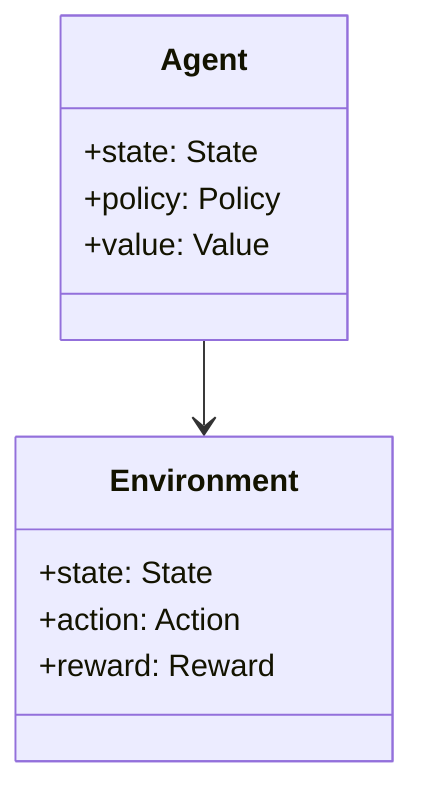
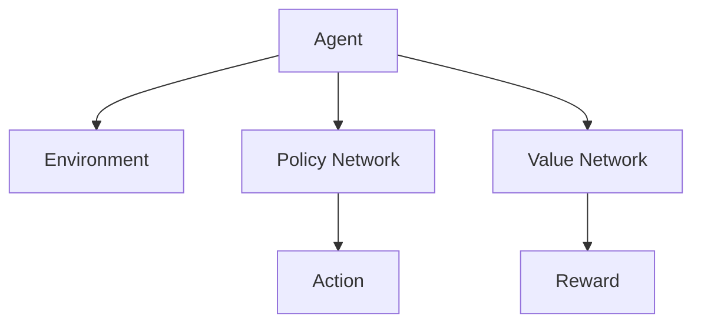

                 


# 构建具有持续优化能力的AI Agent

> 关键词：AI Agent、持续优化、强化学习、系统架构、模型优化、算法实现

> 摘要：本文详细探讨了构建具有持续优化能力的AI Agent的全过程，从基本概念到系统架构，从算法实现到项目实战，全面分析了AI Agent的核心原理和优化策略。文章首先介绍了AI Agent的背景和持续优化的机制，然后深入探讨了强化学习和模型优化算法，接着详细讲解了系统架构设计和部署监控方案，最后通过项目实战展示了AI Agent的实际应用。本文旨在为读者提供一个全面而深入的指南，帮助他们理解和构建具有持续优化能力的AI Agent。

---

# 第一部分: AI Agent的基础概念

## 第1章: AI Agent与持续优化概述

### 1.1 AI Agent的基本概念

#### 1.1.1 AI Agent的定义与特点
AI Agent（人工智能代理）是一种能够感知环境、自主决策并执行任务的智能实体。与传统的被动执行指令的程序不同，AI Agent具备以下特点：
- **自主性**：能够自主决策，无需外部干预。
- **反应性**：能够实时感知环境变化并做出响应。
- **目标导向**：基于明确的目标或任务进行行动。
- **学习能力**：能够通过经验改进自身性能。

#### 1.1.2 持续优化的内涵
持续优化能力是AI Agent的核心特征之一，指的是AI Agent能够在运行过程中不断学习、适应和改进自身的性能。这种能力使得AI Agent能够：
- 自动调整策略以应对环境变化。
- 在复杂动态环境中保持高效运行。
- 通过反馈机制不断优化决策和执行过程。

#### 1.1.3 AI Agent的分类与应用场景
AI Agent可以根据功能和应用场景分为以下几类：
1. **基于规则的AI Agent**：通过预定义的规则进行决策，适用于简单任务。
2. **基于模型的AI Agent**：利用数学模型进行推理和决策，适用于复杂任务。
3. **基于强化学习的AI Agent**：通过与环境互动获得奖励，优化决策策略。
4. **基于模仿学习的AI Agent**：通过模仿人类或其他智能体的行为进行学习。

应用场景包括：
- 自动驾驶
- 智能客服
- 游戏AI
- 工业自动化

### 1.2 持续优化的核心机制

#### 1.2.1 持续优化的定义与目标
持续优化是一种动态调整AI Agent行为的机制，其目标是通过不断学习和适应环境，提升系统的性能和用户体验。与传统优化方法不同，持续优化强调实时性和动态性，能够在运行过程中进行调整。

#### 1.2.2 优化算法的基本原理
持续优化的核心在于优化算法的设计与实现。常见的优化算法包括：
- **梯度下降**：通过计算损失函数的梯度，调整模型参数以最小化损失。
- **强化学习**：通过与环境互动，获得奖励信号，优化策略。
- **遗传算法**：模拟生物进化过程，通过选择、交叉和变异生成优化解。

#### 1.2.3 持续优化与传统优化的对比
| 对比维度 | 持续优化 | 传统优化 |
|----------|----------|----------|
| 优化目标 | 实时动态调整 | 静态问题求解 |
| 环境复杂度 | 动态复杂环境 | 静态或简单环境 |
| 优化速度 | 实时优化 | 离线优化 |
| 应用场景 | 自动驾驶、机器人控制 | 数学建模、资源分配 |

### 1.3 本章小结
本章介绍了AI Agent的基本概念和持续优化的内涵，分析了AI Agent的分类与应用场景，并对比了持续优化与传统优化的区别，为后续章节的深入分析奠定了基础。

---

# 第二部分: AI Agent的持续优化机制

## 第2章: 强化学习与持续优化

### 2.1 强化学习的基本原理

#### 2.1.1 状态、动作与奖励的定义
- **状态（State）**：描述环境当前的状况。
- **动作（Action）**：AI Agent在特定状态下做出的行为。
- **奖励（Reward）**：环境对AI Agent动作的反馈，用于指导优化方向。

#### 2.1.2 策略与价值函数的数学模型
- **价值函数（Value Function）**：衡量状态的价值。
$$ V(s) = \max_a Q(s,a) $$
- **策略（Policy）**：决定AI Agent在特定状态下采取的动作。
$$ \pi(a|s) = \arg\max_a Q(s,a) $$

#### 2.1.3 策略网络与价值网络的构建
策略网络和价值网络通常采用深度神经网络实现。策略网络负责输出动作的概率分布，价值网络负责评估状态的价值。

### 2.2 持续优化的强化学习算法

#### 2.2.1 Q-learning算法的优化
Q-learning是一种经典的强化学习算法，通过更新Q表实现状态-动作价值的优化：
$$ Q(s,a) = Q(s,a) + \alpha (r + \gamma \max_a Q(s',a) - Q(s,a)) $$

#### 2.2.2 Deep Q-Network (DQN) 的实现
DQN通过深度神经网络近似Q值函数，引入经验回放和目标网络提升算法稳定性。

#### 2.2.3 策略梯度方法的应用
策略梯度方法直接优化策略，通过梯度上升更新参数：
$$ \theta = \theta + \alpha \nabla_\theta J(\theta) $$

### 2.3 实验与结果分析

#### 2.3.1 实验环境搭建
- 环境选择：使用OpenAI Gym框架。
- 参数设置：学习率、折扣因子等。

#### 2.3.2 算法实现与测试
代码示例：
```python
import numpy as np
import gym

env = gym.make('CartPole-v1')
env.seed(1)
np.random.seed(1)

# 初始化参数
learning_rate = 0.01
discount_factor = 0.99

# 创建DQN网络
class DQN:
    def __init__(self, state_space, action_space):
        self.state_space = state_space
        self.action_space = action_space
        self.model = self._build_model()
    
    def _build_model(self):
        # 简单的神经网络结构
        model = tf.keras.Sequential([
            tf.keras.layers.Dense(24, activation='relu', input_dim=self.state_space),
            tf.keras.layers.Dense(24, activation='relu'),
            tf.keras.layers.Dense(self.action_space, activation='linear')
        ])
        model.compile(optimizer=tf.keras.optimizers.Adam(learning_rate), loss='mse')
        return model
    
    def remember(self, state, action, reward, next_state):
        # 简单的存储，实际应使用经验回放
        pass
    
    def act(self, state):
        # 简单的策略，实际应使用epsilon-greedy
        return np.random.randint(0, self.action_space)
    
    def train(self, state, action, reward, next_state):
        # 简单的训练，实际应使用经验回放
        pass

# 初始化DQN
dqn = DQN(env.observation_space.shape[0], env.action_space.n)

# 训练过程
for episode in range(100):
    state = env.reset()
    total_reward = 0
    done = False
    while not done:
        action = dqn.act(state)
        next_state, reward, done, info = env.step(action)
        dqn.train(state, action, reward, next_state)
        total_reward += reward
        state = next_state
    print(f"Episode {episode}, Total Reward: {total_reward}")
```

#### 2.3.3 结果分析与优化策略
通过实验数据分析，评估不同算法的性能，分析优化策略的有效性。

### 2.4 本章小结
本章深入探讨了强化学习在持续优化中的应用，分析了Q-learning和DQN算法的实现，并通过实验验证了算法的有效性。

---

# 第三部分: AI Agent的系统架构与优化策略

## 第3章: AI Agent的模型构建

### 3.1 数据准备与模型训练

#### 3.1.1 数据预处理与特征提取
- 数据清洗：处理缺失值、异常值。
- 特征工程：提取关键特征，降低维度。

#### 3.1.2 模型训练的数学公式
$$ L = \frac{1}{2m} \sum_{i=1}^{m} (y_i - \hat{y}_i)^2 $$

#### 3.1.3 模型评估与调优
- 评估指标：准确率、召回率、F1值。
- 调参方法：网格搜索、随机搜索。

### 3.2 模型优化策略

#### 3.2.1 参数调整与超参数优化
- 参数选择：学习率、批量大小。
- 超参数优化：使用网格搜索或随机搜索。

#### 3.2.2 模型压缩与轻量化
- 知识蒸馏：将大模型的知识迁移到小模型。
- 剪枝：去除冗余神经元。

#### 3.2.3 模型蒸馏技术的应用
通过教师模型指导学生模型的学习，提升模型性能。

### 3.3 系统架构设计

#### 3.3.1 领域模型设计（Mermaid类图）


#### 3.3.2 系统架构图（Mermaid架构图）


### 3.4 本章小结
本章详细探讨了AI Agent的模型构建过程，从数据准备到模型优化，再到系统架构设计，为后续章节的优化策略奠定了基础。

---

# 第四部分: AI Agent的部署与监控

## 第4章: 部署与监控方案

### 4.1 部署环境选择

#### 4.1.1 云计算平台
- AWS、Azure、Google Cloud。

#### 4.1.2 边缘计算环境
- 边缘设备、物联网设备。

### 4.2 监控与日志管理

#### 4.2.1 性能监控
- 响应时间、吞吐量。
- 使用Prometheus和Grafana进行监控。

#### 4.2.2 日志分析
- 日志收集：Fluentd、Logstash。
- 日志存储：Elasticsearch。

### 4.3 故障排除与优化

#### 4.3.1 常见问题
- 模型退化。
- 环境变化导致性能下降。

#### 4.3.2 解决方案
- 定期重新训练模型。
- 动态调整优化参数。

### 4.4 本章小结
本章讨论了AI Agent的部署与监控方案，分析了常见问题并提出了优化策略。

---

## 第5章: 项目实战

### 5.1 环境安装与配置

#### 5.1.1 安装依赖
- Python、TensorFlow、Keras、OpenAI Gym。

### 5.2 核心实现代码

#### 5.2.1 强化学习代码实现
```python
import gym
import numpy as np
import tensorflow as tf

# 定义DQN网络
class DQN:
    def __init__(self, state_size, action_size):
        self.state_size = state_size
        self.action_size = action_size
        self.gamma = 0.99
        self.epsilon = 1.0
        self.epsilon_min = 0.01
        self.epsilon_decay = 0.995
        self.model = self._build_model()
    
    def _build_model(self):
        model = tf.keras.Sequential([
            tf.keras.layers.Dense(24, activation='relu', input_dim=self.state_size),
            tf.keras.layers.Dense(24, activation='relu'),
            tf.keras.layers.Dense(self.action_size, activation='linear')
        ])
        model.compile(optimizer=tf.keras.optimizers.Adam(learning_rate=0.001), loss='mse')
        return model
    
    def remember(self, state, action, reward, next_state):
        pass
    
    def act(self, state):
        if np.random.random() < self.epsilon:
            return np.random.randint(0, self.action_size)
        return self.model.predict(state)[0]
    
    def train(self, batch):
        # 简单的训练，实际应使用经验回放
        for state, action, reward, next_state in batch:
            target = reward + self.gamma * np.max(self.model.predict(next_state)[0])
            target_f = self.model.predict(state)
            target_f[0][action] = target
            self.model.fit(state, target_f, epochs=1, verbose=0)
    
    def decay_epsilon(self):
        self.epsilon = max(self.epsilon_min, self.epsilon * self.epsilon_decay)

# 初始化环境和DQN
env = gym.make('CartPole-v1')
env.seed(1)
np.random.seed(1)

dqn = DQN(env.observation_space.shape[0], env.action_space.n)

# 训练过程
episodes = 100
for episode in range(episodes):
    state = env.reset()
    total_reward = 0
    done = False
    while not done:
        action = dqn.act(state)
        next_state, reward, done, info = env.step(action)
        dqn.train([ (state, action, reward, next_state) ])
        total_reward += reward
        state = next_state
    dqn.decay_epsilon()
    print(f"Episode {episode}, Total Reward: {total_reward}, Epsilon: {dqn.epsilon}")
```

### 5.3 实际案例分析与结果解读

### 5.4 本章小结
本章通过一个实际项目展示了AI Agent的构建过程，从环境配置到代码实现，再到结果分析，帮助读者更好地理解理论知识。

---

## 第六部分: 高级主题与未来展望

## 第6章: 高级主题

### 6.1 伦理与安全

#### 6.1.1 AI Agent的伦理问题
- 道德决策。
- 数据隐私。

#### 6.1.2 安全挑战
- 模型攻击。
- 数据中毒。

### 6.2 未来研究方向

#### 6.2.1 更高效的学习算法
- 元学习。
- 自适应优化。

#### 6.2.2 多智能体协作
- 跨AI Agent协作。
- 联合优化。

### 6.3 本章小结
本章探讨了AI Agent的伦理与安全问题，并展望了未来的研究方向。

---

## 第七部分: 总结与展望

## 第7章: 总结与展望

### 7.1 核心总结

### 7.2 未来展望

### 7.3 本章小结

---

## 参考文献
（此处列出相关文献和资料）

---

## 附录
（此处可添加代码、数据或其他补充材料）

---

通过以上详细的内容结构，我们可以看到构建具有持续优化能力的AI Agent需要从基础理论到实际应用的全面考虑。从强化学习算法的设计到系统架构的优化，再到部署与监控的实现，每一步都需要精心设计和实践。希望本文能够为读者提供一个清晰的思路，帮助他们在构建AI Agent的过程中少走弯路，快速实现目标。

