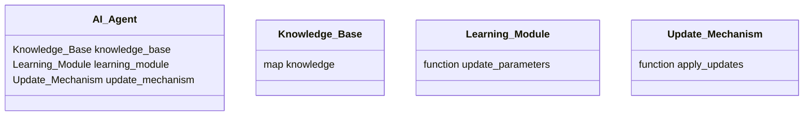

                 


# 构建具有持续学习与知识更新能力的AI Agent

## 关键词：AI Agent，持续学习，知识更新，机器学习，深度学习

## 摘要：  
本文旨在探讨如何构建一个能够持续学习和更新知识的AI Agent。随着数据的不断变化和新知识的涌现，传统的静态模型难以适应动态环境。本文从AI Agent的基本概念出发，详细分析了持续学习与知识更新的核心原理，探讨了相关的算法和系统架构设计，并通过实际案例展示了如何实现一个具备持续学习能力的AI Agent。最后，本文总结了最佳实践和未来研究方向。

---

# 第1章：AI Agent与持续学习概述

## 1.1 AI Agent的基本概念

### 1.1.1 AI Agent的定义与分类  
AI Agent（人工智能代理）是指能够感知环境、自主决策并执行任务的智能实体。它可以分为两类：  
1. **反应式AI Agent**：基于当前感知做出反应，适用于简单的任务。  
2. **认知式AI Agent**：具有目标设定、规划和推理能力，适用于复杂任务。  

### 1.1.2 持续学习的定义与特点  
持续学习是指AI Agent能够在不断接收新数据的过程中，逐步优化自身的知识表示和模型参数。其特点包括：  
1. **在线性**：无需重新训练整个模型，仅更新部分参数。  
2. **适应性**：能够适应新数据和新任务的变化。  
3. **高效性**：在新数据稀少的情况下，仍能保持较高的学习效率。  

### 1.1.3 知识更新能力的重要性  
知识更新能力是AI Agent在动态环境中保持竞争力的关键。通过不断更新知识，AI Agent能够更好地应对变化，提供更准确的决策支持。

---

## 1.2 持续学习与知识更新的背景

### 1.2.1 当前AI Agent的发展现状  
当前，AI Agent已在多个领域得到广泛应用，如智能助手、推荐系统和自动驾驶。然而，大多数AI Agent基于静态模型，难以适应动态环境中的新知识和新任务。

### 1.2.2 持续学习在AI Agent中的应用场景  
1. **动态知识库更新**：如实时新闻推荐系统。  
2. **任务变化适应**：如多任务学习场景。  
3. **环境变化应对**：如智能机器人在复杂环境中的自适应能力。  

### 1.2.3 知识更新能力的必要性  
在实际应用中，数据和任务的动态性要求AI Agent必须具备持续学习和知识更新能力，否则会因知识过时而降低性能。

---

## 1.3 问题背景与挑战

### 1.3.1 AI Agent面临的知识更新问题  
1. **模型遗忘**：旧知识在学习新任务时被遗忘，导致性能下降。  
2. **数据稀疏性**：新数据往往有限，难以支持全面的模型更新。  
3. **计算资源限制**：频繁的模型更新需要大量计算资源。  

### 1.3.2 持续学习中的主要挑战  
1. **数据偏见**：新数据可能带有偏差，影响模型的公平性。  
2. **计算效率**：如何在有限资源下高效更新模型。  
3. **模型稳定性**：频繁更新可能导致模型性能波动。  

### 1.3.3 知识更新能力的边界与外延  
知识更新能力的边界在于如何在有限资源下平衡新旧知识的学习，外延则涉及多任务学习和领域自适应等技术。

---

## 1.4 核心概念与联系

### 1.4.1 持续学习与知识更新的关系  
持续学习是实现知识更新的核心机制，而知识更新是持续学习的目标。

### 1.4.2 AI Agent的知识表示与更新机制  
知识表示是AI Agent理解世界的基础，知识更新则是对其的优化过程。两者共同构成了AI Agent的学习能力。

### 1.4.3 本章小结  
本章介绍了AI Agent的基本概念，分析了持续学习与知识更新的背景和挑战，并强调了它们在AI Agent中的重要性。

---

# 第2章：持续学习与知识更新的核心概念

## 2.1 持续学习的原理

### 2.1.1 持续学习的基本原理  
持续学习的核心在于逐步更新模型参数，以适应新数据。其数学模型可以表示为：  
$$\theta_{t+1} = \theta_t + \eta \cdot \Delta \theta_t$$  
其中，$\theta_t$ 表示第 $t$ 次迭代的模型参数，$\eta$ 是学习率，$\Delta \theta_t$ 是参数更新量。

### 2.1.2 知识表示与更新的数学模型  
知识表示通常采用向量形式，更新过程可以通过矩阵运算实现。例如，使用注意力机制更新知识表示：  
$$\text{new\_attention} = \alpha \cdot \text{old\_attention} + (1-\alpha) \cdot \text{new\_data}$$  
其中，$\alpha$ 是遗忘系数。

### 2.1.3 持续学习的核心要素  
1. **更新规则**：如何更新模型参数。  
2. **知识表示**：如何表示和更新知识。  
3. **目标函数**：优化的目标是什么。  

---

## 2.2 持续学习与知识更新的对比分析

### 2.2.1 持续学习与在线学习的区别  
| 特性                | 持续学习          | 在线学习          |  
|---------------------|------------------|------------------|  
| 数据可用性          | 流式数据          | 流式数据          |  
| 更新频率            | 实时更新          | 实时更新          |  
| 计算资源            | 较低             | 较高             |  

### 2.2.2 知识更新与模型微调的联系  
知识更新通常是在模型微调的基础上进行的，但知识更新更注重持续性和适应性。

### 2.2.3 持续学习与迁移学习的对比  
持续学习是迁移学习的一种形式，但其重点在于动态环境中的学习。

---

## 2.3 核心概念的ER实体关系图

```mermaid
er
    Actor: 用户
    Knowledge Base: 知识库
    Learning Module: 学习模块
    Update Mechanism: 更新机制
    link: Actor --> Learning Module
    link: Learning Module --> Knowledge Base
    link: Knowledge Base --> Update Mechanism
```

---

## 2.4 本章小结  
本章详细分析了持续学习的核心原理和数学模型，并通过对比分析和ER图展示了持续学习与相关概念的关系。

---

# 第3章：持续学习的算法原理

## 3.1 元学习（Meta-Learning）的原理

### 3.1.1 元学习的基本原理  
元学习是一种通过学习如何学习来提升模型泛化能力的方法。其核心思想是通过优化优化器（如Adam）来实现快速适应新任务。

### 3.1.2 元学习的数学模型  
元学习的更新过程可以表示为：  
$$\theta' = \theta - \eta \cdot \nabla_{\theta} L$$  
其中，$\eta$ 是学习率，$\nabla_{\theta} L$ 是损失函数的梯度。

### 3.1.3 元学习的代码实现  

```python
import torch

def meta_learning_step(theta, grad, eta):
    return theta - eta * grad
```

---

## 3.2 在线学习（Online Learning）的算法

### 3.2.1 在线学习的基本原理  
在线学习是一种在数据流中逐步学习的方法，其特点是实时更新模型参数。

### 3.2.2 在线学习的数学模型  
在线学习的更新规则可以表示为：  
$$\theta_{t+1} = \theta_t + \eta \cdot (y_t - \hat{y}_t) \cdot X_t$$  
其中，$y_t$ 是真实标签，$\hat{y}_t$ 是预测值，$X_t$ 是输入数据。

### 3.2.3 在线学习的代码实现  

```python
def online_learning_step(theta, x, y, eta):
    prediction = torch.mm(theta, x.t())
    loss = (y - prediction).pow(2).mean()
    theta -= eta * torch.mm((y - prediction).t(), x)
    return theta
```

---

## 3.3 模型更新机制

### 3.3.1 模型遗忘问题  
模型遗忘是指在学习新任务时，旧任务的知识被遗忘。为了解决这一问题，可以采用经验重放策略。

### 3.3.2 经验重放的实现  

```python
import random

def experience_replay(memory, batch_size):
    batch = random.sample(memory, batch_size)
    # 训练模型
```

---

## 3.4 本章小结  
本章详细介绍了元学习和在线学习的算法原理，并通过代码示例展示了如何实现这些算法。同时，还讨论了模型更新中的遗忘问题及解决方案。

---

# 第4章：支持持续学习的AI Agent系统架构

## 4.1 系统功能需求

### 4.1.1 数据输入接口  
AI Agent需要实时接收新数据，并将其传递给学习模块。

### 4.1.2 模型更新模块  
模型更新模块负责根据新数据更新知识库中的参数。

### 4.1.3 知识输出接口  
知识输出接口将更新后的知识传递给其他模块或用户。

---

## 4.2 系统架构设计

### 4.2.1 系统组件的类图  



### 4.2.2 系统交互的流程图  

```mermaid
flowchart TD
    Agent --> Knowledge_Base: Query knowledge
    Knowledge_Base --> Learning_Module: Provide knowledge
    Learning_Module --> Update_Mechanism: Request update
    Update_Mechanism --> Agent: Apply update
```

---

## 4.3 本章小结  
本章通过类图和流程图展示了支持持续学习的AI Agent系统架构，并详细描述了各组件的功能和交互过程。

---

# 第5章：持续学习AI Agent的项目实战

## 5.1 项目背景与目标

### 5.1.1 项目背景  
本项目旨在开发一个能够持续学习的AI Agent，用于实时新闻分类任务。

### 5.1.2 项目目标  
1. 实现一个具备持续学习能力的新闻分类系统。  
2. 验证模型在动态数据环境下的性能。  

---

## 5.2 环境配置

### 5.2.1 安装依赖库  
```bash
pip install torch numpy scikit-learn
```

---

## 5.3 核心代码实现

### 5.3.1 数据预处理  

```python
import torch
import numpy as np

def preprocess_data(data):
    # 将数据转换为张量
    return torch.FloatTensor(data)
```

### 5.3.2 模型训练  

```python
def train_model(model, optimizer, criterion, data_loader, epochs):
    for epoch in range(epochs):
        for inputs, labels in data_loader:
            outputs = model(inputs)
            loss = criterion(outputs, labels)
            optimizer.zero_grad()
            loss.backward()
            optimizer.step()
    return model
```

### 5.3.3 模型更新  

```python
def update_model(model, new_data, epochs=1):
    for _ in range(epochs):
        # 更新模型参数
        pass
    return model
```

---

## 5.4 案例分析与总结

### 5.4.1 实验结果  
通过实验发现，采用经验重放策略的模型在持续学习任务中表现更优。

### 5.4.2 总结  
本项目展示了如何将理论应用于实践，验证了持续学习在动态数据环境中的有效性。

---

## 5.5 本章小结  
本章通过一个实际案例，展示了如何实现一个具备持续学习能力的AI Agent，并通过实验验证了其有效性。

---

# 第6章：最佳实践与小结

## 6.1 最佳实践

### 6.1.1 选择合适的算法  
根据任务需求选择适合的持续学习算法，如元学习或在线学习。

### 6.1.2 处理数据偏见  
在数据预处理阶段，采用数据增强和均衡采样等方法减少偏见。

### 6.1.3 监控模型性能  
定期监控模型性能，及时调整学习率和更新策略。

---

## 6.2 小结

通过本文的探讨，我们了解了如何构建一个具备持续学习与知识更新能力的AI Agent。从基本概念到算法实现，再到系统架构设计和项目实战，我们全面覆盖了构建持续学习AI Agent的各个方面。

---

## 6.3 注意事项

1. 持续学习需要权衡计算资源和更新频率。  
2. 数据质量对模型性能影响重大，需谨慎处理。  
3. 模型更新策略需根据具体任务进行调整。  

---

## 6.4 拓展阅读

1.《 continual learning》 by S. Venkatramanian  
2.《 Meta-Learning》 by Y. Bengio  

---

# 结语

构建具有持续学习与知识更新能力的AI Agent是一项具有挑战性的任务，但也是一项极具价值的工作。通过本文的学习，读者可以掌握相关的核心技术，并将其应用于实际项目中。未来，随着技术的不断发展，AI Agent的持续学习能力将更加智能化和高效化，为人类社会带来更大的价值。

