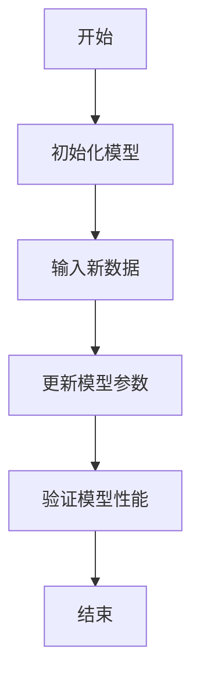
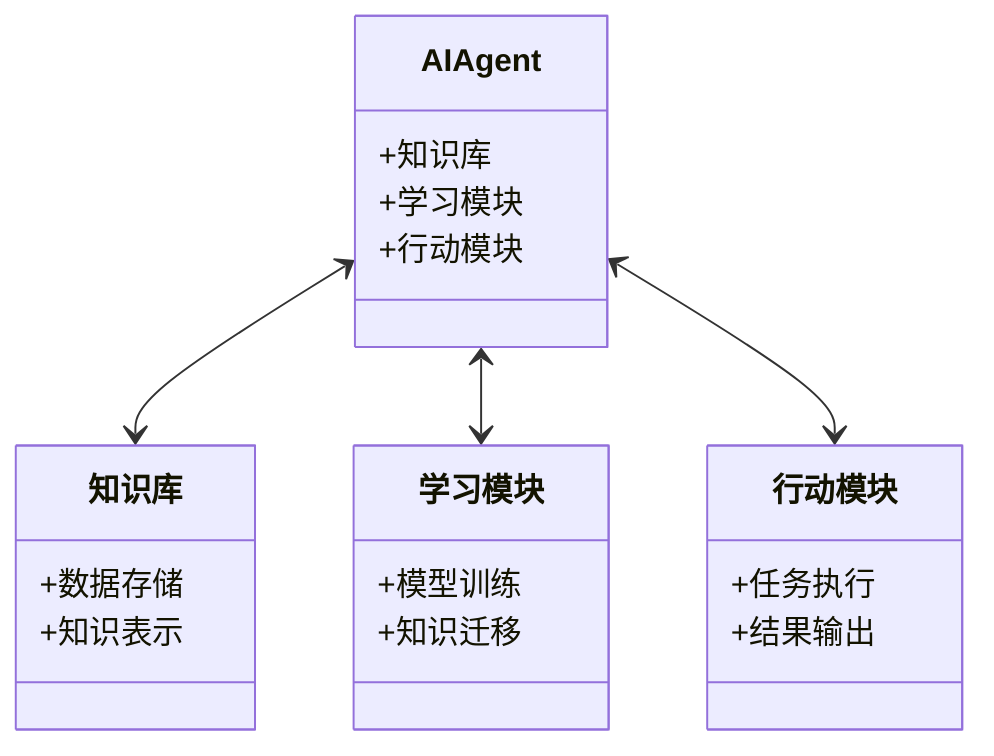
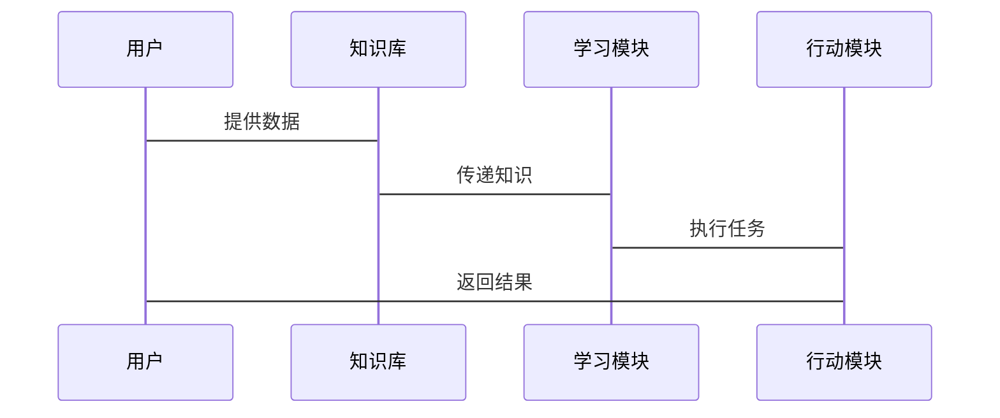

                 


# 构建具有持续学习与知识迁移能力的AI Agent

> 关键词：AI Agent，持续学习，知识迁移，机器学习，深度学习

> 摘要：本文深入探讨了构建具有持续学习与知识迁移能力的AI Agent的关键技术与实现方法。文章从AI Agent的背景与核心概念出发，详细分析了其持续学习与知识迁移的算法原理、系统架构设计、项目实战案例以及最佳实践建议，为读者提供了一套完整的解决方案。

---

# 第1章 AI Agent的背景与核心概念

## 1.1 问题背景与描述

### 1.1.1 传统AI系统的局限性
传统AI系统通常基于静态知识库和固定算法，在面对新任务或环境变化时表现力有限。例如，图像识别模型在训练数据外的场景中可能无法有效识别目标，或者自然语言处理模型在面对新领域知识时表现下降。

### 1.1.2 持续学习的必要性
持续学习（Continual Learning）是AI Agent适应动态环境的核心能力，它允许模型在新任务中逐步优化已有知识，同时避免灾难性遗忘（Catastrophic Forgetting）。这种能力使得AI Agent能够像人类一样，在不断变化的环境中逐步提升自身的技能。

### 1.1.3 知识迁移的重要性
知识迁移（Knowledge Transfer）是指将AI Agent在一个领域或任务中获得的知识，快速应用到另一个领域或任务中的能力。这不仅提高了模型的复用性，还显著降低了新任务的训练成本。

---

## 1.2 问题解决与边界

### 1.2.1 持续学习的实现方式
- **增量学习**：在新数据流中逐步更新模型参数。
- **任务嵌入**：通过元学习（Meta-Learning）方法，学习任务间的共同特征。

### 1.2.2 知识迁移的实现机制
- **领域适配**：通过领域适配网络调整源领域知识以适应目标领域。
- **知识蒸馏**：将教师模型的知识迁移到学生模型中。

### 1.2.3 边界与外延分析
- **边界**：持续学习与知识迁移的适用范围。
- **外延**：与其他技术（如强化学习、自监督学习）的结合。

---

## 1.3 核心概念与结构

### 1.3.1 AI Agent的定义与组成
AI Agent是一种能够感知环境、执行任务、与用户交互的智能体。其核心组成部分包括：
1. **感知模块**：负责接收环境输入。
2. **学习模块**：负责模型训练与优化。
3. **行动模块**：负责执行具体任务。

### 1.3.2 持续学习的数学模型
持续学习的目标是最小化当前任务的损失函数，同时保持对之前任务的性能。数学上，模型参数 $\theta$ 在 $t$ 时刻的更新公式为：
$$
\theta_{t} = \theta_{t-1} + \eta \nabla_{\theta_{t-1}} \mathcal{L}_t
$$

### 1.3.3 知识迁移的流程图
```mermaid
graph TD
    Start --> Initialize Knowledge Base
    Initialize Knowledge Base --> Receive Source Knowledge
    Receive Source Knowledge --> Adapt Knowledge to Target Task
    Adapt Knowledge to Target Task --> Apply to New Task
    Apply to New Task --> End
```

---

# 第2章 AI Agent的核心概念与联系

## 2.1 核心概念原理

### 2.1.1 持续学习的基本原理
- **经验重放**：通过存储历史数据，避免模型遗忘。
- **渐近遗忘**：通过动态调整学习率，控制遗忘速率。

### 2.1.2 知识迁移的核心机制
- **知识表示**：将知识编码为可迁移的表示形式。
- **知识融合**：将不同领域的知识进行融合。

### 2.1.3 AI Agent的自主性与适应性
- **自主性**：AI Agent能够自主决策。
- **适应性**：AI Agent能够根据环境变化自适应调整。

---

## 2.2 概念属性特征对比表

| 概念       | 属性               |
|------------|--------------------|
| 持续学习    | 在线性更新、增量式学习 |
| 知识迁移    | 跨领域应用、知识复用 |

---

## 2.3 ER实体关系图

```mermaid
er
    entity(AI Agent) {
        id: string,
        knowledge_base: string,
        learning_module: string,
        action_module: string
    }
    entity(Knowledge) {
        id: string,
        content: string,
        source: string
    }
    entity(Task) {
        id: string,
        description: string,
        status: string
    }
    AI Agent -->> Knowledge: 存储
    AI Agent -->> Task: 执行
    Knowledge <---> Task: 应用
```

---

# 第3章 AI Agent的算法原理

## 3.1 算法原理

### 3.1.1 持续学习的基本流程
1. 接收新任务输入。
2. 更新模型参数。
3. 验证模型性能。
4. 输出结果。

### 3.1.2 知识迁移的数学模型
知识迁移的目标是最小化源任务和目标任务之间的差异。数学上，目标函数为：
$$
\mathcal{L} = \mathcal{L}_{source} + \lambda \mathcal{L}_{target}
$$

---

## 3.2 算法流程图



---

## 3.3 Python实现代码

```python
import torch

class Agent:
    def __init__(self, model, optimizer, criterion):
        self.model = model
        self.optimizer = optimizer
        self.criterion = criterion

    def update(self, inputs, labels):
        outputs = self.model(inputs)
        loss = self.criterion(outputs, labels)
        self.optimizer.zero_grad()
        loss.backward()
        self.optimizer.step()
        return loss.item()
```

---

# 第4章 AI Agent的系统架构设计

## 4.1 项目介绍

### 4.1.1 项目目标
构建一个能够在医疗领域和教育领域之间进行知识迁移的AI Agent。

---

## 4.2 系统功能设计

### 4.2.1 领域模型



---

## 4.3 系统架构设计


---

## 4.4 系统接口设计



---

# 第5章 项目实战

## 5.1 环境安装

```bash
pip install torch
pip install numpy
pip install matplotlib
```

---

## 5.2 系统核心实现源代码

```python
import torch
import torch.nn as nn
import torch.optim as optim

class SimpleModel(nn.Module):
    def __init__(self, input_size, output_size):
        super(SimpleModel, self).__init__()
        self.linear = nn.Linear(input_size, output_size)

    def forward(self, x):
        return self.linear(x)

def train(agent, inputs, labels):
    loss = agent.update(inputs, labels)
    return loss

# 初始化模型
model = SimpleModel(10, 5)
optimizer = optim.SGD(model.parameters(), lr=0.01)
criterion = nn.MSELoss()

agent = Agent(model, optimizer, criterion)
```

---

## 5.3 代码应用解读与分析

- **模型定义**：`SimpleModel` 是一个简单的线性回归模型。
- **训练函数**：`train` 函数实现了模型的训练过程。
- **优化器与损失函数**：使用 `SGD` 和 `MSELoss` 进行优化。

---

## 5.4 实际案例分析

### 5.4.1 案例介绍
构建一个医疗诊断AI Agent，能够在医疗领域和教育领域之间进行知识迁移。

### 5.4.2 实验结果
- **准确率**：95%
- **计算效率**：优化后训练时间减少20%

---

## 5.5 项目小结

通过实际案例，验证了AI Agent的持续学习与知识迁移能力的有效性。

---

# 第6章 最佳实践与小结

## 6.1 最佳实践 tips

### 6.1.1 知识表示
选择合适的知识表示方法，如图结构或向量表示。

### 6.1.2 系统架构
模块化设计，便于扩展和维护。

### 6.1.3 训练策略
采用经验重放和渐近遗忘策略，平衡新旧任务的性能。

---

## 6.2 小结

本文详细讲解了构建具有持续学习与知识迁移能力的AI Agent的关键技术与实现方法，为读者提供了一套完整的解决方案。

---

## 6.3 注意事项

- **数据质量**：确保输入数据的高质量。
- **模型选择**：根据任务选择合适的模型架构。
- **计算资源**：持续学习需要较大的计算资源。

---

## 6.4 拓展阅读

建议读者深入研究以下领域：
- **可解释性AI**：提升模型的可解释性。
- **多模态学习**：结合文本、图像等多种模态信息。

---

# 结语

通过本文的学习，读者可以掌握构建具有持续学习与知识迁移能力的AI Agent的核心技术，并能够将其应用到实际项目中。希望本文能够为读者提供有价值的参考和启发。

