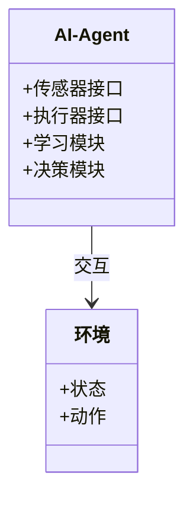
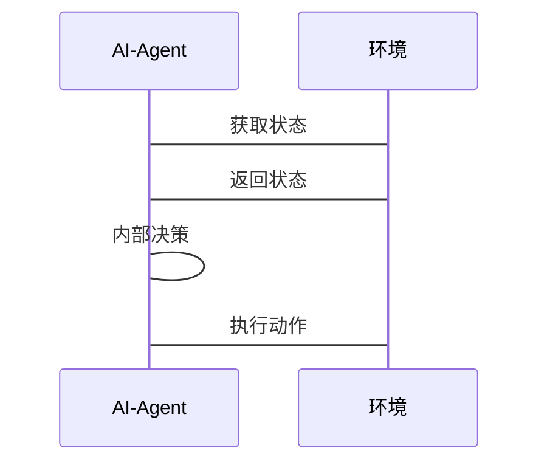
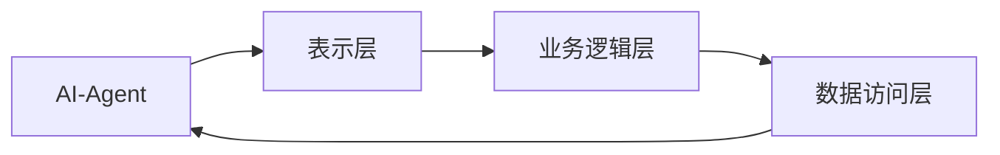

                 


---

# 构建具有持续学习与适应能力的AI Agent

> 关键词：AI Agent, 持续学习, 适应能力, 算法原理, 系统架构, 项目实战

> 摘要：本文将从AI Agent的基本概念出发，深入探讨其持续学习与适应能力的核心原理，结合算法模型、系统架构设计和实际项目案例，详细分析如何构建一个能够不断学习和适应复杂环境的AI Agent。通过理论与实践相结合的方式，本文将为读者提供一个全面的指导框架。

---

## 第1章 AI Agent概述

### 1.1 AI Agent的基本概念

#### 1.1.1 什么是AI Agent
AI Agent（人工智能代理）是指能够感知环境、自主决策并执行任务的智能实体。它通过传感器获取信息，利用计算模型进行分析，并通过执行器与环境交互。

#### 1.1.2 AI Agent的核心特征
- **自主性**：能够在没有外部干预的情况下独立运作。
- **反应性**：能够实时感知环境并做出响应。
- **学习能力**：能够通过经验改进性能。
- **适应性**：能够在动态环境中调整行为。

#### 1.1.3 AI Agent的应用场景
- 智能助手（如Siri、Alexa）。
- 自动驾驶系统。
- 智能推荐系统。

### 1.2 持续学习与适应能力的重要性

#### 1.2.1 为什么需要持续学习
AI Agent需要在不断变化的环境中保持高效运作，持续学习能够帮助其应对新任务和新挑战。

#### 1.2.2 适应能力的定义与作用
适应能力是指AI Agent在面对环境变化时，能够调整自身行为以保持或提高性能的能力。它是持续学习的基础。

#### 1.2.3 持续学习与适应能力的边界与外延
持续学习和适应能力并非万能的，其边界包括计算资源限制、学习速度与环境变化速度的匹配等。

### 1.3 本章小结
本章介绍了AI Agent的基本概念、核心特征及其应用场景，强调了持续学习与适应能力的重要性。

---

## 第2章 AI Agent的核心概念与联系

### 2.1 AI Agent的核心要素

#### 2.1.1 感知与理解
AI Agent通过传感器或数据输入接口获取环境信息，并通过自然语言处理、计算机视觉等技术进行理解和分析。

#### 2.1.2 决策与行动
基于感知信息，AI Agent利用决策算法制定行动方案，并通过执行器执行动作。

#### 2.1.3 学习与优化
通过监督学习、强化学习等方法，AI Agent不断优化自身的模型和算法。

### 2.2 核心概念的属性特征对比

| **特征**       | **感知**       | **决策**       | **学习**       |
|----------------|---------------|---------------|---------------|
| **输入**       | 环境数据       | 状态信息       | 经验与反馈     |
| **输出**       | 状态理解       | 行动决策       | 模型优化       |
| **依赖性**     | 高            | 高            | 高            |
| **动态性**     | 中            | 中            | 高            |

### 2.3 ER实体关系图架构

```mermaid
er
actor AI-Agent
    --> entity 环境
    --> entity 传感器
    --> entity 执行器
    --> entity 数据存储
```

### 2.4 本章小结
本章通过对比分析AI Agent的核心要素，构建了实体关系图，为后续的系统设计奠定了基础。

---

## 第3章 算法原理与数学模型

### 3.1 监督学习算法

#### 3.1.1 监督学习的基本原理
监督学习通过训练数据（输入-标签对）构建预测模型。其数学模型通常表示为：

$$ y = f(x) $$

其中，\( x \) 是输入，\( y \) 是输出，\( f \) 是模型函数。

#### 3.1.2 线性回归模型
线性回归是最简单的监督学习算法，其目标是最小化预测值与真实值之间的误差。

$$ \text{最小化} \quad \sum_{i=1}^{n} (y_i - f(x_i))^2 $$

#### 3.1.3 逻辑回归模型
逻辑回归用于分类问题，其输出概率为：

$$ P(y=1|x) = \frac{1}{1 + e^{-\beta x}} $$

### 3.2 强化学习算法

#### 3.2.1 强化学习的基本原理
强化学习通过智能体与环境的交互，学习最优策略。其数学模型通常涉及状态-动作-奖励的三元组。

$$ R(s, a) = \text{奖励函数} $$

#### 3.2.2 Q-learning算法
Q-learning是一种经典的强化学习算法，其更新规则为：

$$ Q(s, a) = Q(s, a) + \alpha (r + \gamma \max Q(s', a') - Q(s, a)) $$

其中，\( \alpha \) 是学习率，\( \gamma \) 是折扣因子。

### 3.3 无监督学习算法

#### 3.3.1 聚类分析
聚类分析通过将数据分成簇来发现数据的内在结构。常用的算法包括K-means和层次聚类。

#### 3.3.2 主成分分析（PCA）
PCA是一种降维技术，其目标是找到数据的主要方向。

$$ \text{目标} = \max \sum_{i=1}^{k} \lambda_i $$

其中，\( \lambda_i \) 是特征值。

### 3.4 混合学习算法

#### 3.4.1 混合学习的基本原理
混合学习结合了监督和无监督学习的优势，通常用于复杂场景。

#### 3.4.2 混合学习的数学模型
混合学习的数学模型可以表示为：

$$ f(x) = w_1 f_1(x) + w_2 f_2(x) $$

其中，\( w_1 \) 和 \( w_2 \) 是权重系数。

---

## 第4章 系统分析与架构设计方案

### 4.1 问题场景介绍

#### 4.1.1 AI Agent的典型应用场景
- 智能客服系统。
- 自动交易系统。
- 智能监控系统。

#### 4.1.2 持续学习与适应能力的需求分析
- 环境动态变化。
- 任务复杂性增加。

#### 4.1.3 系统设计的目标与约束
- 高可用性。
- 实时性。
- 可扩展性。

### 4.2 系统功能设计

#### 4.2.1 领域模型设计



#### 4.2.2 系统功能模块划分
- 感知模块。
- 决策模块。
- 学习模块。
- 执行模块。

#### 4.2.3 功能模块之间的交互关系



### 4.3 系统架构设计

#### 4.3.1 分层架构设计


#### 4.3.2 模块之间的交互关系



---

## 第5章 项目实战

### 5.1 环境安装

#### 5.1.1 安装Python
```bash
python --version
```

#### 5.1.2 安装机器学习库
```bash
pip install numpy scikit-learn tensorflow
```

### 5.2 系统核心实现源代码

#### 5.2.1 监督学习实现
```python
import numpy as np
from sklearn.linear_model import LinearRegression

X = np.array([1, 2, 3, 4, 5])
y = np.array([2, 4, 6, 8, 10])

model = LinearRegression()
model.fit(X.reshape(-1, 1), y)
print(model.predict([[6]]))
```

#### 5.2.2 强化学习实现
```python
import numpy as np
import gym

env = gym.make('CartPole-v0')
env.reset()

for _ in range(1000):
    env.render()
    action = env.action_space.sample()
    obs, reward, done, info = env.step(action)
    if done:
        env.reset()
```

### 5.3 代码应用解读与分析

#### 5.3.1 监督学习代码解读
上述代码实现了一个简单的线性回归模型，用于预测下一个数。

#### 5.3.2 强化学习代码解读
上述代码实现了一个强化学习的CartPole环境，展示了AI Agent如何与环境交互。

### 5.4 实际案例分析和详细讲解剖析
通过上述代码，我们可以看到监督学习和强化学习在实际项目中的应用。监督学习适用于数据明确的任务，而强化学习适用于动态交互的任务。

### 5.5 本章小结
本章通过实际代码实现，展示了如何将理论知识应用于实际项目。

---

## 第6章 最佳实践与小结

### 6.1 最佳实践 tips

#### 6.1.1 系统设计
- 明确需求。
- 分层设计。
- 模块化开发。

#### 6.1.2 学习与优化
- 选择合适的算法。
- 调参优化。
- 持续迭代。

### 6.2 小结
本文从理论到实践，详细讲解了如何构建具有持续学习与适应能力的AI Agent。

### 6.3 注意事项
- 确保数据质量。
- 处理好计算资源。
- 重视系统的可扩展性。

### 6.4 拓展阅读
推荐阅读《机器学习实战》和《强化学习导论》。

---

## 附录

### 附录A 参考文献

1. Bishop, C. M. (2006). Pattern Recognition and Machine Learning. Springer.
2. Sutton, R. S., & Barto, A. G. (2018). Introduction to Reinforcement Learning. MIT Press.

### 附录B 术语表

- AI Agent：人工智能代理。
- 监督学习：Supervised Learning。
- 强化学习：Reinforcement Learning。

---

通过以上目录大纲，我们可以看到，构建具有持续学习与适应能力的AI Agent需要从理论到实践的全面考虑，涵盖算法原理、系统架构设计和实际项目实现等多个方面。希望这篇技术博客能够为读者提供有价值的指导和启示。

