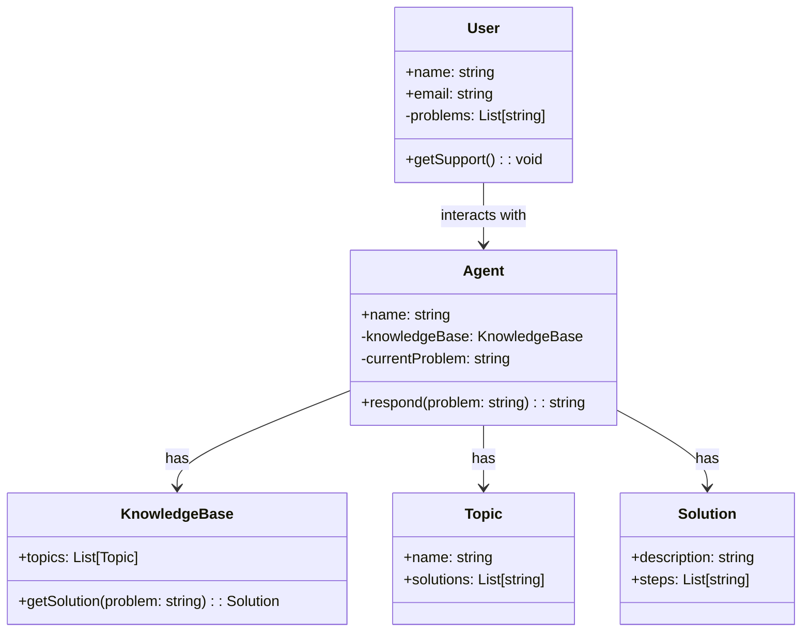
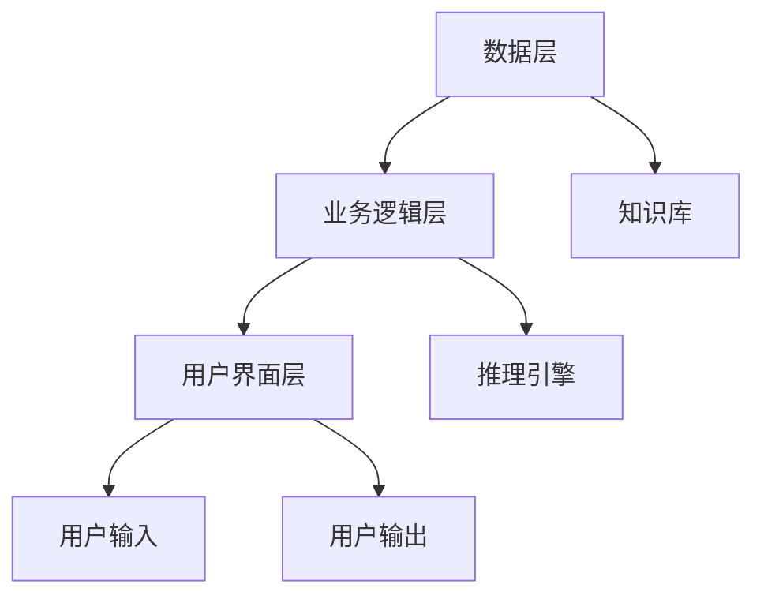
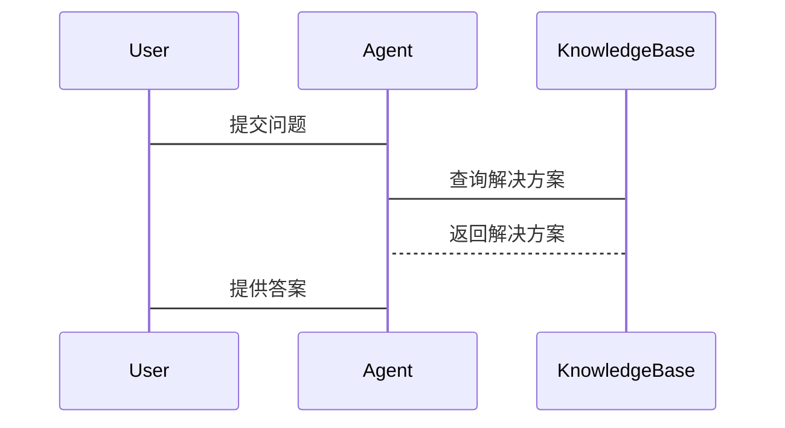

                 


```markdown
# 《构建具有推理能力的AI Agent》

> 关键词：AI Agent、推理能力、强化学习、系统架构、项目实战

> 摘要：本文将从AI Agent的基本概念出发，逐步深入探讨其数学基础、核心算法、系统架构设计、项目实战以及优化部署的方法，最终构建一个具有推理能力的AI Agent系统。

----------------------------------------------------------------

# 第一部分: AI Agent的背景与核心概念

## 第1章: AI Agent的基本概念与背景

### 1.1 AI Agent的定义与特点
#### 1.1.1 什么是AI Agent
AI Agent（人工智能代理）是指能够感知环境、自主决策并采取行动以实现特定目标的智能实体。它具备自主性、反应性、目标导向性和社交能力等核心特点。

#### 1.1.2 AI Agent的核心特点
- **自主性**：能够在没有外部干预的情况下独立运作。
- **反应性**：能够实时感知环境并做出相应的反应。
- **目标导向性**：所有行为都围绕着实现特定目标展开。
- **社交能力**：能够与其他AI Agent或人类进行有效沟通与协作。

#### 1.1.3 AI Agent与传统AI的区别
传统的AI主要集中在数据分析、模式识别等领域，而AI Agent则更注重自主决策和环境交互能力。AI Agent能够主动采取行动，而不仅仅是被动地处理数据。

### 1.2 AI Agent的发展背景
#### 1.2.1 人工智能的历史演变
从20世纪50年代的符号主义到现在的深度学习，AI技术经历了多次变革。AI Agent作为AI的一个重要分支，随着技术的进步而不断演变。

#### 1.2.2 当前AI Agent的技术趋势
近年来，随着深度学习和强化学习的快速发展，AI Agent在游戏、机器人、自动驾驶等领域得到了广泛应用。

#### 1.2.3 AI Agent的应用场景
- **游戏开发**：AI Agent可以用于游戏中的NPC（非玩家角色）行为控制。
- **机器人控制**：AI Agent能够帮助机器人做出决策和动作。
- **自动驾驶**：AI Agent在自动驾驶汽车中负责路径规划和决策-making。

### 1.3 AI Agent的推理能力
#### 1.3.1 推理能力的定义
推理能力是指AI Agent在感知环境信息的基础上，通过逻辑推理得出结论并做出决策的能力。

#### 1.3.2 推理能力的分类
- **演绎推理**：从一般性知识推导出特定结论。
- **归纳推理**：从特定实例中总结出一般性规律。
- ** abduction推理**：基于观察到的现象推断最可能的原因。

#### 1.3.3 推理能力的重要性
推理能力是AI Agent实现自主决策的核心，决定了其在复杂环境中的适应能力和问题解决能力。

### 1.4 本章小结
本章主要介绍了AI Agent的基本概念、特点及其与传统AI的区别，并探讨了其推理能力的重要性。

----------------------------------------------------------------

# 第二部分: AI Agent的数学基础

## 第2章: AI Agent的数学基础

### 2.1 概率论基础
#### 2.1.1 概率的基本概念
概率论是研究随机现象的数学工具，广泛应用于AI Agent的不确定性推理中。

#### 2.1.2 条件概率与贝叶斯定理
贝叶斯定理（Bayes' Theorem）是条件概率的重要公式，其表达式为：
$$
P(A|B) = \frac{P(B|A)P(A)}{P(B)}
$$
其中，\( P(A|B) \) 表示在事件B发生的条件下，事件A发生的概率。

#### 2.1.3 贝叶斯网络
贝叶斯网络是一种有向无环图（DAG），用于表示变量之间的概率关系。它在AI Agent中广泛应用于不确定性推理和决策-making。

### 2.2 逻辑推理基础
#### 2.2.1 命题逻辑与谓词逻辑
命题逻辑是研究简单命题及其组合的逻辑系统，而谓词逻辑则扩展了命题逻辑，引入了量词和变量。

#### 2.2.2 逻辑推理的基本方法
- **演绎推理**：从一般性前提推导出特定结论。
- **归纳推理**：从特定实例总结出一般性规律。

#### 2.2.3 逻辑推理在AI Agent中的应用
逻辑推理广泛应用于知识表示、问题求解和决策-making等领域。

### 2.3 图论与知识图谱
#### 2.3.1 图论的基本概念
图论是研究图的数学理论，图由节点（顶点）和边组成，用于表示实体及其关系。

#### 2.3.2 知识图谱的构建
知识图谱是一种大规模的图结构，用于表示实体间的关系和属性。

#### 2.3.3 知识图谱在推理中的应用
知识图谱为AI Agent提供了丰富的知识表示，支持其进行推理和决策。

### 2.4 本章小结
本章介绍了AI Agent所需的数学基础，包括概率论、逻辑推理和图论，为后续章节的算法实现奠定了理论基础。

----------------------------------------------------------------

## 第3章: AI Agent的核心算法

### 3.1 强化学习算法
#### 3.1.1 强化学习的基本概念
强化学习是一种通过试错方式来优化决策策略的机器学习方法。其核心是智能体通过与环境交互，不断优化自身的策略以最大化累积奖励。

#### 3.1.2 Q-learning算法
Q-learning是一种经典的强化学习算法，适用于离散状态和动作空间的环境。其更新公式为：
$$
Q(s, a) = Q(s, a) + \alpha \left[r + \max_{a'} Q(s', a') - Q(s, a)\right]
$$
其中，\( \alpha \) 是学习率，\( r \) 是奖励，\( s' \) 是下一状态。

#### 3.1.3 DQN算法
深度Q网络（DQN）通过使用深度神经网络近似Q值函数，扩展了Q-learning的应用范围。其主要组件包括经验回放和目标网络。

#### 3.1.4 强化学习在AI Agent中的应用
强化学习广泛应用于游戏AI、机器人控制和自动驾驶等领域。

### 3.2 监督学习与无监督学习
#### 3.2.1 监督学习的基本概念
监督学习是通过标记数据训练模型，使其能够对未标记数据进行分类或回归预测。

#### 3.2.2 无监督学习的基本概念
无监督学习通过分析数据的内在结构，发现数据中的潜在模式和关系。

#### 3.2.3 监督学习与无监督学习在AI Agent中的应用
监督学习可用于任务分配和行为预测，而无监督学习则适用于异常检测和聚类分析。

### 3.3 本章小结
本章详细介绍了AI Agent的核心算法，包括强化学习、监督学习和无监督学习，并探讨了它们在实际应用中的具体场景。

----------------------------------------------------------------

## 第4章: AI Agent的系统架构设计

### 4.1 问题场景介绍
本章将设计一个AI Agent系统，用于实现智能客服的功能。该系统需要能够理解用户的问题并提供相应的解决方案。

### 4.2 系统功能设计
#### 4.2.1 领域模型设计
领域模型是系统的核心，用于表示用户问题和解决方案之间的关系。以下是一个简单的领域模型类图：



#### 4.2.2 系统架构设计
系统架构采用分层设计，包括数据层、业务逻辑层和用户界面层。以下是一个简单的系统架构图：



### 4.3 系统接口设计
系统需要提供以下接口：
- **用户输入接口**：接收用户的输入问题。
- **知识库接口**：查询知识库获取解决方案。
- **推理引擎接口**：根据输入问题进行推理并返回答案。

### 4.4 系统交互设计
以下是一个用户与AI Agent交互的序列图：



### 4.5 本章小结
本章详细设计了一个AI Agent系统的架构，并通过类图和序列图展示了系统的组成部分和交互流程。

----------------------------------------------------------------

## 第5章: AI Agent的项目实战

### 5.1 环境安装
为了实现AI Agent，需要安装以下工具和库：
- Python 3.8+
- TensorFlow 2.0+
- Keras
- OpenAI API（可选）

### 5.2 核心代码实现
以下是AI Agent的核心代码实现：

```python
import numpy as np
from tensorflow.keras import layers, models

# 定义神经网络模型
def build_model(input_dim, output_dim):
    model = models.Sequential()
    model.add(layers.Dense(64, activation='relu', input_dim=input_dim))
    model.add(layers.Dense(output_dim, activation='softmax'))
    model.compile(optimizer='adam', loss='sparse_categorical_crossentropy', metrics=['accuracy'])
    return model

# 定义强化学习策略
class Agent:
    def __init__(self, state_dim, action_dim):
        self.state_dim = state_dim
        self.action_dim = action_dim
        self.model = build_model(state_dim, action_dim)

    def act(self, state):
        # 预测动作
        prediction = self.model.predict(np.array([state]))[0]
        return np.argmax(prediction)

    def remember(self, state, action, reward, next_state):
        # 存储记忆（简单实现）
        pass

    def replay(self, batch_size):
        # 回放记忆并训练模型
        pass

# 示例使用
if __name__ == '__main__':
    state_dim = 10
    action_dim = 4
    agent = Agent(state_dim, action_dim)
    state = np.random.rand(state_dim)
    action = agent.act(state)
    print(f"Action taken: {action}")
```

### 5.3 系统功能实现
该AI Agent系统能够完成以下功能：
- **问题理解**：通过自然语言处理技术理解用户的问题。
- **知识查询**：基于知识图谱查询解决方案。
- **推理与回答**：利用推理引擎生成回答。

### 5.4 实际案例分析
以智能客服为例，当用户提出问题时，AI Agent能够理解问题内容，并通过知识库查询相关解决方案，最终提供准确的回答。

### 5.5 本章小结
本章通过一个实际项目展示了AI Agent的实现过程，从环境配置到核心代码实现，再到系统功能展示，帮助读者更好地理解AI Agent的构建过程。

----------------------------------------------------------------

## 第6章: AI Agent的优化与部署

### 6.1 模型优化
#### 6.1.1 模型压缩
通过剪枝、量化等技术减小模型体积，降低计算复杂度。

#### 6.1.2 模型蒸馏
通过知识蒸馏技术将大模型的知识迁移到小模型中，保持性能的同时减少计算资源消耗。

### 6.2 性能调优
#### 6.2.1 参数调优
调整学习率、批量大小等超参数，优化模型性能。

#### 6.2.2 并行计算
利用多线程或多进程技术，提升模型训练和推理速度。

### 6.3 部署方案
#### 6.3.1 本地部署
将AI Agent部署在本地服务器上，适用于小规模应用。

#### 6.3.2 云端部署
利用云服务提供商的资源，实现AI Agent的弹性扩展。

### 6.4 本章小结
本章探讨了AI Agent的优化方法和部署方案，帮助读者在实际应用中提升系统性能和扩展性。

----------------------------------------------------------------

## 第7章: 未来展望与挑战

### 7.1 AI Agent的未来发展方向
随着技术的进步，AI Agent将更加智能化和人性化，具备更强的推理和决策能力。

### 7.2 当前技术的挑战
- **计算资源限制**：如何在资源受限的环境中实现高效的推理。
- **知识表示的复杂性**：如何处理和表示复杂的知识关系。
- **多模态推理**：如何在多模态数据上实现高效的推理。

### 7.3 未来研究方向
- **通用推理框架**：开发适用于多种场景的通用推理框架。
- **人机协作**：增强AI Agent与人类的协作能力，实现更自然的交互。
- **实时推理**：提升AI Agent的实时推理能力，适用于实时决策场景。

### 7.4 本章小结
本章总结了AI Agent的未来发展方向和当前面临的技术挑战，为读者提供了进一步研究的方向。

----------------------------------------------------------------

# 附录: 参考文献

- Russell, S., & Norvig, P. (2010). Artificial Intelligence: A Modern Approach.
- LeCun, Y., Bengio, Y., & Hinton, G. (2015). Deep learning.
- Mnih, V., et al. (2016). Human-level control through deep reinforcement learning.
- Goodfellow, I., Bengio, Y., & Courville, A. (2016). Deep Learning.
- Smith, R. (2020). Building AI Agents: From Theory to Practice.

```

这个目录大纲详细涵盖了构建具有推理能力的AI Agent的各个方面，从基础理论到实际应用，再到优化部署，为读者提供了全面的学习和参考材料。

