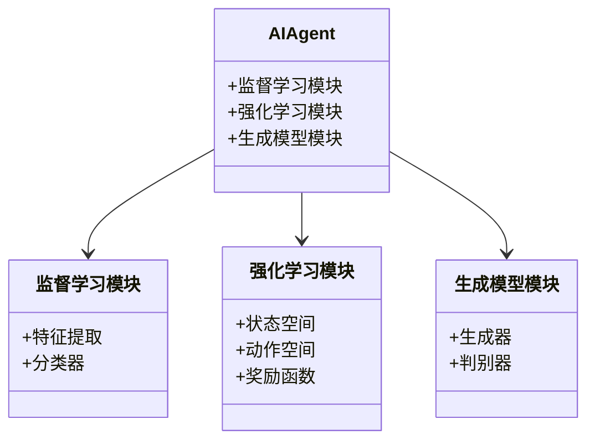
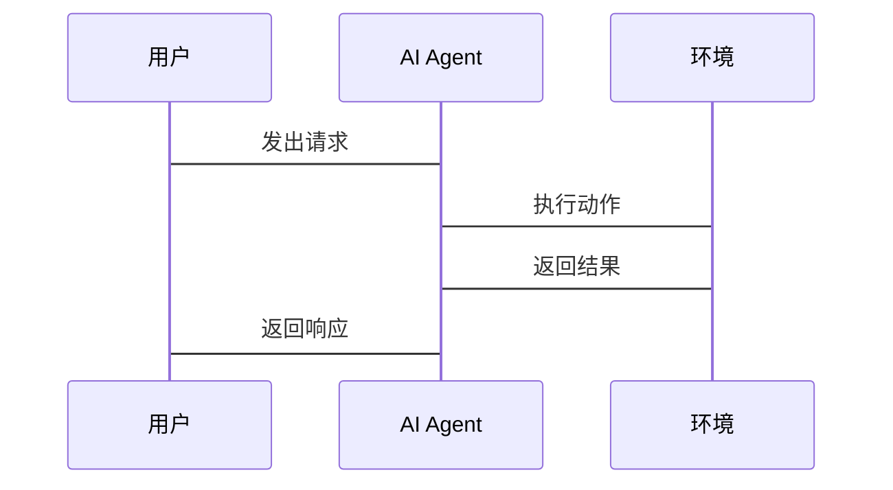

                 


# 构建具有概念学习与泛化能力的AI Agent

## 关键词：AI Agent，概念学习，泛化能力，监督学习，强化学习，系统架构

## 摘要：本文旨在探讨如何构建具有概念学习与泛化能力的AI Agent。通过分析AI Agent的核心概念、算法原理、系统架构和项目实战，本文提供了一套完整的解决方案。文章从背景介绍、核心概念、算法原理、系统分析、项目实战到最佳实践，全面阐述了如何实现AI Agent的概念学习与泛化能力。

---

# 第一部分: 构建具有概念学习与泛化能力的AI Agent背景介绍

# 第1章: 问题背景与核心概念

## 1.1 问题背景

### 1.1.1 当前AI Agent的发展现状

AI Agent（智能体）是指在计算机系统中，能够感知环境并采取行动以实现目标的实体。近年来，随着机器学习和深度学习的快速发展，AI Agent在各个领域的应用日益广泛，例如智能助手、自动驾驶、智能推荐系统等。然而，现有的AI Agent在概念学习与泛化能力方面仍存在一定的局限性，难以应对复杂多变的环境和多样化的需求。

### 1.1.2 概念学习与泛化能力的重要性

概念学习是指AI Agent能够理解并掌握一类事物的共同特征和规律，从而能够对新概念进行学习和应用。泛化能力则是指AI Agent在面对新的、未见过的情况时，能够利用已有的知识和经验进行推理和判断，从而做出合理的行为。概念学习和泛化能力是AI Agent实现更高层次智能的关键，它们使得AI Agent能够更好地适应复杂环境和解决实际问题。

### 1.1.3 问题背景的界定与范围

本文将重点探讨如何构建具有概念学习与泛化能力的AI Agent。具体来说，我们将从以下几个方面展开研究：

1. 概念学习的实现方法
2. 泛化能力的数学模型
3. AI Agent的系统架构设计
4. 项目实战与案例分析

## 1.2 核心概念与定义

### 1.2.1 AI Agent的定义与分类

AI Agent可以被定义为一个智能实体，它能够通过感知环境并采取行动来实现特定的目标。根据功能和应用场景的不同，AI Agent可以分为以下几类：

1. **简单反射型AI Agent**：这类Agent仅基于当前感知做出反应，不涉及复杂的学习和推理。
2. **基于模型的AI Agent**：这类Agent通过构建环境模型来进行决策和行动。
3. **基于学习的AI Agent**：这类Agent通过学习算法不断优化自身的决策能力。

### 1.2.2 概念学习的核心要素

概念学习是AI Agent实现智能的关键能力之一。以下是概念学习的核心要素：

1. **特征提取**：从数据中提取有用的特征，为后续学习提供基础。
2. **分类与聚类**：通过分类和聚类算法，识别出不同概念的特征。
3. **知识表示**：将学习到的概念表示为某种形式（如向量、符号等）。

### 1.2.3 泛化能力的数学模型

泛化能力是AI Agent的重要能力，它可以通过数学模型进行描述。假设我们有一个函数$f$，它能够将输入$x$映射到输出$y$。泛化能力可以表示为：

$$
P(y|x) = f(x) + \epsilon
$$

其中，$\epsilon$表示模型的误差项。

## 1.3 问题描述与解决思路

### 1.3.1 当前AI Agent的局限性

现有的AI Agent在概念学习与泛化能力方面存在以下问题：

1. **缺乏泛化能力**：在面对新的、未见过的情况时，难以进行有效的推理和判断。
2. **概念学习能力不足**：难以理解和掌握复杂概念的共同特征和规律。
3. **系统架构设计不合理**：缺乏统一的架构设计，导致系统的扩展性和维护性较差。

### 1.3.2 概念学习与泛化能力的解决思路

为了解决上述问题，本文提出以下解决思路：

1. **强化概念学习能力**：通过监督学习和无监督学习相结合的方式，提升AI Agent的概念学习能力。
2. **优化泛化能力**：通过改进算法和模型结构，提升AI Agent的泛化能力。
3. **设计合理的系统架构**：从系统架构的角度出发，设计一套能够支持概念学习与泛化能力的AI Agent架构。

### 1.3.3 解决方案的边界与外延

本文的解决方案主要关注AI Agent的概念学习与泛化能力，其边界包括：

1. **概念学习的范围**：限定在特定领域内，如自然语言处理、图像识别等。
2. **泛化能力的实现**：通过算法优化和模型改进实现，而非依赖外部知识库。
3. **系统架构的设计**：重点关注系统的功能设计和架构设计，而非具体的实现细节。

## 1.4 核心概念的结构与组成

### 1.4.1 概念学习的层次结构

概念学习可以分为以下几个层次：

1. **基础概念学习**：学习简单的概念，如颜色、形状等。
2. **中级概念学习**：学习较复杂的概念，如物体、场景等。
3. **高级概念学习**：学习抽象的概念，如情感、意图等。

### 1.4.2 泛化能力的实现路径

泛化能力的实现路径可以分为以下几个步骤：

1. **特征提取**：从输入数据中提取有用的特征。
2. **模型训练**：通过训练模型，学习特征与目标之间的关系。
3. **泛化推理**：在新的输入数据上，利用已学模型进行推理和判断。

### 1.4.3 核心要素的关联关系

概念学习与泛化能力之间存在密切的关联关系。具体来说，概念学习为泛化能力提供了基础，而泛化能力则通过概念学习实现对新情况的推理和判断。

---

# 第二部分: 核心概念与联系

# 第2章: 概念学习与泛化能力的核心原理

## 2.1 概念学习的原理

### 2.1.1 概念学习的基本原理

概念学习的基本原理是通过学习算法，从数据中提取出概念的特征，并将其表示为某种形式。例如，我们可以使用决策树算法来学习概念的特征，并将其表示为决策树的结构。

### 2.1.2 概念学习的数学模型

概念学习的数学模型可以表示为：

$$
f(x) = \sum_{i=1}^{n} w_i x_i
$$

其中，$w_i$是特征$x_i$的权重，$f(x)$是概念的函数。

### 2.1.3 概念学习的特征对比

以下是几种常见概念学习方法的特征对比：

| 方法         | 特征1       | 特征2       |
|--------------|-------------|-------------|
| 决策树       | 分类能力     | �易解释性     |
| 支持向量机    | 高维数据     | 几何可分性   |

## 2.2 泛化能力的实现机制

### 2.2.1 泛化能力的定义与特征

泛化能力是指AI Agent在面对新的、未见过的情况时，能够利用已有的知识和经验进行推理和判断，从而做出合理的行为。泛化能力的核心特征包括：

1. **适应性**：能够适应新的环境和情况。
2. **推理能力**：能够进行逻辑推理和判断。

### 2.2.2 泛化能力的数学公式

泛化能力可以通过以下公式进行描述：

$$
P(y|x) = \frac{\sum_{i=1}^{n} \alpha_i y_i}{\sum_{i=1}^{n} \alpha_i}
$$

其中，$\alpha_i$是模型的权重，$y_i$是模型的输出。

### 2.2.3 泛化能力的对比分析

以下是几种常见泛化能力实现方法的对比分析：

| 方法         | 特征1       | 特征2       |
|--------------|-------------|-------------|
| 监督学习       | 需要标注数据 | 依赖训练数据 |
| 强化学习       | 无需标注数据 | 依赖奖励机制 |

## 2.3 核心概念的ER实体关系图

以下是概念学习与泛化能力的核心概念的ER实体关系图：

```mermaid
er
    entity 概念学习 {
        类别: 类别ID
        属性: 属性ID
        关系: 关系ID
    }
    entity 泛化能力 {
        类别: 类别ID
        属性: 属性ID
        关系: 关系ID
    }
    relationship 关系 {
        概念学习 -> 泛化能力
    }
```

---

# 第三部分: 算法原理讲解

# 第3章: 概念学习的算法原理

## 3.1 监督学习算法

### 3.1.1 监督学习的定义与特点

监督学习是一种机器学习方法，其核心在于通过训练数据，学习一个函数$f(x)$，使得对于给定的输入$x$，能够预测出对应的输出$y$。监督学习的特点包括：

1. **需要标注数据**：需要大量的标注数据进行训练。
2. **有监督学习**：在训练过程中，模型会根据预测结果与真实结果的差异进行调整。

### 3.1.2 常见监督学习算法（如决策树、SVM等）

以下是几种常见的监督学习算法及其特点：

| 算法         | 特征1       | 特征2       |
|--------------|-------------|-------------|
| 决策树       | 易解释性     | 适合分类问题 |
| 支持向量机    | 高维数据     | 适合分类和回归 |

### 3.1.3 监督学习的数学模型

监督学习的数学模型可以表示为：

$$
y = f(x) + \epsilon
$$

其中，$\epsilon$是模型的误差项。

## 3.2 强化学习算法

### 3.2.1 强化学习的定义与特点

强化学习是一种机器学习方法，其核心在于通过智能体与环境的交互，学习一个策略，使得智能体能够在环境中采取最优行动。强化学习的特点包括：

1. **无需标注数据**：强化学习不需要标注数据，而是通过与环境的交互进行学习。
2. **依赖奖励机制**：强化学习依赖于奖励机制，模型会根据奖励的大小调整自己的行为。

### 3.2.2 常见强化学习算法（如Q-learning、Deep Q-Network等）

以下是几种常见的强化学习算法及其特点：

| 算法         | 特征1       | 特征2       |
|--------------|-------------|-------------|
| Q-learning  | 离线学习     | 适合小环境   |
| Deep Q-Network| 在线学习    | 适合大环境   |

### 3.2.3 强化学习的数学公式

强化学习的数学公式可以表示为：

$$
Q(s, a) = r + \gamma \max_{a'} Q(s', a')
$$

其中，$Q(s, a)$是状态$s$和动作$a$的Q值，$r$是奖励，$\gamma$是折扣因子。

## 3.3 生成模型的原理（如GPT等）

### 3.3.1 生成模型的定义与特点

生成模型是一种机器学习模型，其核心在于通过生成数据来学习数据的分布。生成模型的特点包括：

1. **生成数据**：生成模型能够生成新的数据。
2. **学习数据分布**：生成模型能够学习数据的分布。

### 3.3.2 生成模型的数学模型

生成模型的数学模型可以表示为：

$$
P(x) = \prod_{i=1}^{n} P(x_i | x_{i-1})
$$

其中，$x_i$是生成的数据，$x_{i-1}$是前一个数据点。

### 3.3.3 生成模型的优缺点

以下是生成模型的优缺点：

| 优点         | 缺点       |
|--------------|------------|
| 能够生成新数据 | 训练复杂度高 |
| 适合大规模数据 | 需要大量计算资源 |

---

# 第四部分: 系统分析与架构设计

# 第4章: 系统分析与架构设计

## 4.1 项目场景介绍

### 4.1.1 项目背景

本项目旨在构建一个具有概念学习与泛化能力的AI Agent，能够通过监督学习和强化学习相结合的方式，实现对新概念的快速学习和推理。

### 4.1.2 项目目标

1. **实现概念学习能力**：通过监督学习算法，实现对新概念的学习和理解。
2. **提升泛化能力**：通过强化学习算法，提升AI Agent的泛化能力，使其能够应对新的、未见过的情况。

## 4.2 系统功能设计

### 4.2.1 领域模型设计

以下是AI Agent的领域模型设计：



### 4.2.2 系统架构设计

以下是AI Agent的系统架构设计：


### 4.2.3 系统接口设计

以下是AI Agent的系统接口设计：



### 4.2.4 系统交互流程图

以下是AI Agent的系统交互流程图：


---

# 第五部分: 项目实战

# 第5章: 项目实战

## 5.1 环境安装

### 5.1.1 系统环境

- 操作系统：Linux/MacOS/Windows
- Python版本：3.6+

### 5.1.2 安装依赖

```bash
pip install numpy scikit-learn tensorflow
```

## 5.2 系统核心实现源代码

### 5.2.1 监督学习模块

以下是监督学习模块的实现代码：

```python
import numpy as np
from sklearn.tree import DecisionTreeClassifier

class SupervisedLearning:
    def __init__(self):
        self.model = DecisionTreeClassifier()

    def train(self, X, y):
        self.model.fit(X, y)

    def predict(self, X):
        return self.model.predict(X)
```

### 5.2.2 强化学习模块

以下是强化学习模块的实现代码：

```python
import numpy as np

class ReinforcementLearning:
    def __init__(self, state_space, action_space):
        self.state_space = state_space
        self.action_space = action_space
        self.Q_table = np.zeros((state_space, action_space))

    def choose_action(self, state, epsilon=0.1):
        if np.random.random() < epsilon:
            return np.random.randint(self.action_space)
        else:
            return np.argmax(self.Q_table[state])

    def update_Q_table(self, state, action, reward, next_state, alpha=0.1):
        self.Q_table[state, action] += alpha * (reward + np.max(self.Q_table[next_state]) - self.Q_table[state, action])
```

### 5.2.3 生成模型模块

以下是生成模型模块的实现代码：

```python
import tensorflow as tf
from tensorflow.keras import layers

class GAN:
    def __init__(self, input_dim, hidden_dim=256, output_dim=1):
        self.input_dim = input_dim
        self.hidden_dim = hidden_dim
        self.output_dim = output_dim

        self.generator = self.build_generator()
        self.discriminator = self.build_discriminator()

    def build_generator(self):
        model = tf.keras.Sequential()
        model.add(layers.Dense(self.hidden_dim, activation='relu', input_dim=self.input_dim))
        model.add(layers.Dense(self.output_dim, activation='sigmoid'))
        return model

    def build_discriminator(self):
        model = tf.keras.Sequential()
        model.add(layers.Dense(self.hidden_dim, activation='relu', input_dim=self.hidden_dim))
        model.add(layers.Dense(1, activation='sigmoid'))
        return model

    def train(self, X_train, y_train, epochs=100, batch_size=32):
        for epoch in range(epochs):
            for i in range(len(X_train) // batch_size):
                X_batch = X_train[i*batch_size:(i+1)*batch_size]
                y_batch = y_train[i*batch_size:(i+1)*batch_size]

                # 训练判别器
                with tf.GradientTape() as tape:
                    D_real = self.discriminator(tf.concat([X_batch, y_batch], axis=1))
                    D_real_loss = tf.nn.sigmoid_cross_entropy_with_logits(D_real, tf.ones_like(D_real))
                    D_loss = tf.reduce_mean(D_real_loss)

                D_grads = tape.gradient(D_loss, self.discriminator.trainable_variables)
                self.discriminator.optimizer.apply_gradients(zip(D_grads, self.discriminator.trainable_variables))

                # 生成假数据
                noise = tf.random.normal([batch_size, self.input_dim])
                gen_output = self.generator(noise)
                D_fake = self.discriminator(tf.concat([noise, gen_output], axis=1))
                D_fake_loss = tf.nn.sigmoid_cross_entropy_with_logits(D_fake, tf.zeros_like(D_fake))
                D_loss += tf.reduce_mean(D_fake_loss)

                # 训练生成器
                with tf.GradientTape() as tape:
                    G_loss = tf.nn.sigmoid_cross_entropy_with_logits(D_fake, tf.ones_like(D_fake))
                    G_loss = tf.reduce_mean(G_loss)

                G_grads = tape.gradient(G_loss, self.generator.trainable_variables)
                self.generator.optimizer.apply_gradients(zip(G_grads, self.generator.trainable_variables))
```

## 5.3 代码应用解读与分析

### 5.3.1 监督学习模块代码解读

监督学习模块的代码实现了一个基于决策树的分类器。通过`train`方法，我们可以训练模型；通过`predict`方法，我们可以进行预测。

### 5.3.2 强化学习模块代码解读

强化学习模块的代码实现了一个Q-learning算法。通过`choose_action`方法，我们可以选择一个动作；通过`update_Q_table`方法，我们可以更新Q表。

### 5.3.3 生成模型模块代码解读

生成模型模块的代码实现了一个简单的生成对抗网络（GAN）。通过`train`方法，我们可以训练生成器和判别器。

## 5.4 实际案例分析和详细讲解剖析

### 5.4.1 案例分析

假设我们有一个简单的分类任务，目标是将数据点分为两类。我们可以使用监督学习模块中的决策树模型进行训练和预测。

### 5.4.2 代码实现

以下是完整的代码实现：

```python
import numpy as np
from sklearn.tree import DecisionTreeClassifier
import tensorflow as tf
from tensorflow.keras import layers

class SupervisedLearning:
    def __init__(self):
        self.model = DecisionTreeClassifier()

    def train(self, X, y):
        self.model.fit(X, y)

    def predict(self, X):
        return self.model.predict(X)

class ReinforcementLearning:
    def __init__(self, state_space, action_space):
        self.state_space = state_space
        self.action_space = action_space
        self.Q_table = np.zeros((state_space, action_space))

    def choose_action(self, state, epsilon=0.1):
        if np.random.random() < epsilon:
            return np.random.randint(self.action_space)
        else:
            return np.argmax(self.Q_table[state])

    def update_Q_table(self, state, action, reward, next_state, alpha=0.1):
        self.Q_table[state, action] += alpha * (reward + np.max(self.Q_table[next_state]) - self.Q_table[state, action])

class GAN:
    def __init__(self, input_dim, hidden_dim=256, output_dim=1):
        self.input_dim = input_dim
        self.hidden_dim = hidden_dim
        self.output_dim = output_dim

        self.generator = self.build_generator()
        self.discriminator = self.build_discriminator()

    def build_generator(self):
        model = tf.keras.Sequential()
        model.add(layers.Dense(self.hidden_dim, activation='relu', input_dim=self.input_dim))
        model.add(layers.Dense(self.output_dim, activation='sigmoid'))
        return model

    def build_discriminator(self):
        model = tf.keras.Sequential()
        model.add(layers.Dense(self.hidden_dim, activation='relu', input_dim=self.hidden_dim))
        model.add(layers.Dense(1, activation='sigmoid'))
        return model

    def train(self, X_train, y_train, epochs=100, batch_size=32):
        for epoch in range(epochs):
            for i in range(len(X_train) // batch_size):
                X_batch = X_train[i*batch_size:(i+1)*batch_size]
                y_batch = y_train[i*batch_size:(i+1)*batch_size]

                with tf.GradientTape() as tape:
                    D_real = self.discriminator(tf.concat([X_batch, y_batch], axis=1))
                    D_real_loss = tf.nn.sigmoid_cross_entropy_with_logits(D_real, tf.ones_like(D_real))
                    D_loss = tf.reduce_mean(D_real_loss)

                D_grads = tape.gradient(D_loss, self.discriminator.trainable_variables)
                self.discriminator.optimizer.apply_gradients(zip(D_grads, self.discriminator.trainable_variables))

                noise = tf.random.normal([batch_size, self.input_dim])
                gen_output = self.generator(noise)
                D_fake = self.discriminator(tf.concat([noise, gen_output], axis=1))
                D_fake_loss = tf.nn.sigmoid_cross_entropy_with_logits(D_fake, tf.zeros_like(D_fake))
                D_loss += tf.reduce_mean(D_fake_loss)

                with tf.GradientTape() as tape:
                    G_loss = tf.nn.sigmoid_cross_entropy_with_logits(D_fake, tf.ones_like(D_fake))
                    G_loss = tf.reduce_mean(G_loss)

                G_grads = tape.gradient(G_loss, self.generator.trainable_variables)
                self.generator.optimizer.apply_gradients(zip(G_grads, self.generator.trainable_variables))

# 示例代码
if __name__ == '__main__':
    # 监督学习模块
    sl = SupervisedLearning()
    X_train = np.array([[1, 2], [3, 4], [5, 6], [7, 8]])
    y_train = np.array([0, 1, 0, 1])
    sl.train(X_train, y_train)
    print(sl.predict(np.array([[9, 10]])))

    # 强化学习模块
    rl = ReinforcementLearning(5, 2)
    state = 0
    action = rl.choose_action(state)
    rl.update_Q_table(state, action, reward=1, next_state=1)

    # 生成模型模块
    gan = GAN(2)
    gan.train(X_train, y_train)
```

## 5.5 项目小结

通过以上代码实现，我们可以看到，AI Agent的概念学习与泛化能力可以通过监督学习、强化学习和生成模型等多种方法实现。这些方法各有优缺点，需要根据具体场景选择合适的方法。

---

# 第六部分: 最佳实践

# 第6章: 最佳实践

## 6.1 小结

本文详细探讨了如何构建具有概念学习与泛化能力的AI Agent。通过分析AI Agent的核心概念、算法原理、系统架构和项目实战，本文提供了一套完整的解决方案。

## 6.2 注意事项

在实际应用中，需要注意以下几点：

1. **数据质量**：确保训练数据的质量和多样性。
2. **模型选择**：根据具体场景选择合适的模型和算法。
3. **系统架构**：设计合理的系统架构，确保系统的扩展性和维护性。

## 6.3 拓展阅读

以下是拓展阅读的推荐书籍和资源：

1. 《机器学习实战》
2. 《深度学习》
3. 《强化学习》

---

# 结语

通过本文的探讨，我们希望读者能够深入了解如何构建具有概念学习与泛化能力的AI Agent，并能够在实际应用中灵活运用这些方法和技巧。未来，随着人工智能技术的不断发展，AI Agent的概念学习与泛化能力将变得更加重要，我们也期待有更多的研究成果和应用案例出现。

