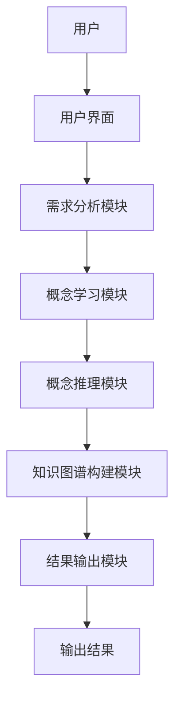

                 


# 《构建具有概念学习能力的AI Agent》

---

## 关键词：概念学习、AI Agent、知识图谱、概念推理、机器学习

---

## 摘要

随着人工智能技术的飞速发展，构建具有概念学习能力的AI Agent成为研究和应用的重要方向。概念学习使AI Agent能够理解、推理和应用抽象概念，从而在复杂场景中实现更高级的智能任务。本文从概念学习的背景出发，详细探讨其核心概念、算法原理、系统架构设计，结合项目实战和最佳实践，全面解析如何构建具备概念学习能力的AI Agent。通过理论与实践的结合，本文旨在为读者提供构建智能AI Agent的系统性方法和实用指导。

---

## 正文

### 第一章: 背景介绍

#### 1.1 问题背景与概念背景

##### 1.1.1 问题背景
随着AI技术的不断进步，AI Agent在各个领域的应用日益广泛。然而，现有的AI Agent大多依赖于规则或数据驱动的模式，缺乏对抽象概念的理解与推理能力。例如，在自然语言处理中，AI Agent能够识别文本中的实体，但难以理解这些实体之间的概念关系。这种局限性限制了AI Agent在复杂场景中的应用能力，如跨领域知识整合、动态知识推理等。

##### 1.1.2 概念背景
概念学习是一种通过学习数据中的特征和关系，构建概念表示的方法。它不同于传统的数据驱动学习，更注重从数据中提取抽象的概念，理解概念之间的关系，并基于这些概念进行推理和决策。概念学习的核心在于构建概念表示，使得AI Agent能够理解数据背后的语义信息。

##### 1.1.3 技术背景
AI Agent的概念学习技术结合了机器学习、知识图谱和符号推理等多种技术。通过机器学习，AI Agent可以自动从数据中学习概念表示；通过知识图谱，可以构建概念之间的关联关系；通过符号推理，可以基于概念进行逻辑推理。这些技术的结合，为AI Agent的概念学习提供了坚实的技术基础。

##### 1.1.4 概念学习背景
概念学习在AI Agent中的应用具有重要意义。它使得AI Agent能够理解用户的需求，不仅处理具体的数据，还能理解数据背后的抽象概念。例如，在智能客服系统中，AI Agent可以通过概念学习理解用户的问题类型，从而提供更精准的服务。

---

### 第二章: 核心概念与联系

#### 2.1 概念学习的核心概念

##### 2.1.1 概念学习的定义与原理
概念学习是指通过学习数据中的特征和关系，构建概念表示的方法。其核心原理是将数据映射到概念空间，通过概念表示理解数据的语义信息。例如，将“猫”和“狗”映射到动物的概念空间，AI Agent可以理解它们的共同特征和区别。

##### 2.1.2 概念表示与知识图谱
概念表示是概念学习的核心，常用的表示方法包括符号表示和向量表示。符号表示通过符号逻辑描述概念，向量表示通过向量空间模型描述概念。知识图谱是一种结构化的知识表示方法，通过实体和关系描述概念之间的关联。

##### 2.1.3 概念推理与关联学习
概念推理是基于概念表示进行逻辑推理的过程，关联学习是通过学习概念之间的关联关系，增强概念表示的能力。例如，通过关联学习，AI Agent可以理解“猫”和“宠物”之间的关系，从而在推理中更准确地判断用户的需求。

---

#### 2.2 概念学习的核心要素

| 核心要素         | 描述                                                                 |
|------------------|----------------------------------------------------------------------|
| 概念表示         | 概念的符号或向量表示，用于表示概念的特征和语义                                       |
| 关系推理         | 概念之间的关系推理，如“猫”是“宠物”的一种，用于理解概念的层次结构                   |
| 上位概念         | 概念的上位概念，如“动物”是“猫”的上位概念                                           |
| 下位概念         | 概念的下位概念，如“波斯猫”是“猫”的下位概念                                         |
| 概念网络         | 概念之间的网络结构，描述概念之间的关联关系                                         |

---

#### 2.3 概念网络的构建与优化

##### 2.3.1 概念网络的构建
概念网络的构建过程包括以下步骤：
1. **数据预处理**：对数据进行清洗和特征提取。
2. **概念提取**：通过机器学习算法提取数据中的概念。
3. **关系建立**：通过关联学习算法建立概念之间的关系。
4. **网络优化**：通过优化算法调整概念网络的结构，提高概念表示的准确性。

##### 2.3.2 概念网络的优化
概念网络的优化可以通过以下方法实现：
1. **正则化方法**：通过L1或L2正则化优化概念表示的稀疏性或平滑性。
2. **层次化学习**：通过层次化学习算法优化概念网络的层次结构。
3. **增量学习**：通过增量学习方法动态更新概念网络，适应新数据的变化。

---

### 第三章: 算法原理讲解

#### 3.1 概念学习算法的数学模型

##### 3.1.1 模型结构
概念学习模型的结构包括输入层、隐藏层和输出层。输入层接收原始数据，隐藏层通过神经网络提取概念特征，输出层生成概念表示。

##### 3.1.2 模型训练
概念学习模型的训练过程包括以下步骤：
1. **前向传播**：将输入数据输入模型，计算输出结果。
2. **损失计算**：计算预测结果与真实结果之间的损失。
3. **反向传播**：通过链式法则计算损失对模型参数的梯度，更新模型参数。
4. **迭代优化**：重复前向传播、损失计算、反向传播和参数更新，直到模型收敛。

##### 3.1.3 模型优化
模型优化可以通过以下方法实现：
1. **学习率调整**：通过学习率衰减方法优化学习过程。
2. **正则化方法**：通过L1或L2正则化优化模型的泛化能力。
3. **批量归一化**：通过批量归一化技术加速模型训练，提高模型的稳定性。

---

#### 3.2 概念推理与关联学习算法

##### 3.2.1 概念推理算法
概念推理算法基于概念表示进行逻辑推理，常用的推理算法包括逻辑推理和概率推理。逻辑推理通过逻辑规则进行推理，概率推理通过概率模型进行推理。

##### 3.2.2 关联学习算法
关联学习算法用于学习概念之间的关联关系，常用的关联学习算法包括关联规则挖掘和关联网络构建。关联规则挖掘通过挖掘数据中的关联规则，构建概念之间的关联关系。关联网络构建通过构建概念网络，描述概念之间的关联关系。

---

### 第四章: 系统分析与架构设计

#### 4.1 问题场景介绍

##### 4.1.1 系统需求
系统需求包括：
1. **概念学习**：系统能够从数据中学习概念表示。
2. **概念推理**：系统能够基于概念进行逻辑推理。
3. **知识图谱构建**：系统能够构建概念之间的关联关系。

##### 4.1.2 项目介绍
项目目标是构建一个具有概念学习能力的AI Agent，能够理解用户需求，并基于概念推理提供智能服务。

---

#### 4.2 系统功能设计

##### 4.2.1 领域模型设计
领域模型设计包括用户需求分析、数据模型设计和功能模块设计。用户需求分析通过用户调研和需求分析，明确系统的需求。数据模型设计通过数据建模技术，构建系统的数据模型。功能模块设计通过功能模块划分，明确系统的功能模块。

##### 4.2.2 系统架构设计
系统架构设计包括系统架构图和模块设计。系统架构图描述系统的整体架构，模块设计描述每个模块的功能和交互。

---

#### 4.3 系统架构图



---

### 第五章: 项目实战

#### 5.1 环境配置

##### 5.1.1 开发环境
开发环境包括操作系统、编程语言和开发工具。推荐使用Linux或Windows操作系统，编程语言使用Python，开发工具使用PyCharm或VS Code。

##### 5.1.2 依赖安装
安装必要的依赖库，例如：
- `numpy`
- `pandas`
- `scikit-learn`
- `networkx`
- `matplotlib`

---

#### 5.2 核心代码实现

##### 5.2.1 概念学习模块
```python
import numpy as np
import pandas as pd

class ConceptLearner:
    def __init__(self, input_dim, hidden_dim, output_dim):
        self.weights = {
            'W1': np.random.randn(input_dim, hidden_dim),
            'W2': np.random.randn(hidden_dim, output_dim)
        }
        self.biases = {
            'b1': np.random.randn(hidden_dim),
            'b2': np.random.randn(output_dim)
        }

    def forward(self, X):
        z1 = np.dot(X, self.weights['W1']) + self.biases['b1']
        a1 = np.tanh(z1)
        z2 = np.dot(a1, self.weights['W2']) + self.biases['b2']
        a2 = np.tanh(z2)
        return a2

    def backward(self, X, y, output):
        delta2 = (output - y) * (1 - output**2)
        dW2 = np.dot(a1.T, delta2)
        db2 = np.sum(delta2, axis=0)
        delta1 = (np.dot(delta2, self.weights['W2'].T)) * (1 - a1**2)
        dW1 = np.dot(X.T, delta1)
        db1 = np.sum(delta1, axis=0)
        return dW1, db1, dW2, db2

    def train(self, X, y, epochs=100, learning_rate=0.1):
        for _ in range(epochs):
            output = self.forward(X)
            dW1, db1, dW2, db2 = self.backward(X, y, output)
            self.weights['W1'] -= learning_rate * dW1
            self.weights['b1'] -= learning_rate * db1
            self.weights['W2'] -= learning_rate * dW2
            self.weights['b2'] -= learning_rate * db2
```

##### 5.2.2 概念推理模块
```python
import networkx as nx
from sklearn.metrics.pairwise import cosine_similarity

class ConceptReasoner:
    def __init__(self, concept_embeddings):
        self.embeddings = concept_embeddings

    def compute_similarity(self, concept1, concept2):
        return cosine_similarity(self.embeddings[concept1].reshape(1, -1), self.embeddings[concept2].reshape(1, -1))[0, 0]

    def infer_relationship(self, concept1, concept2, threshold=0.7):
        similarity = self.compute_similarity(concept1, concept2)
        if similarity > threshold:
            return f"{concept1} is related to {concept2}"
        else:
            return f"{concept1} is not related to {concept2}"
```

---

### 第六章: 最佳实践与总结

#### 6.1 经验总结

##### 6.1.1 关键经验
- 在概念学习过程中，数据的质量和数量直接影响概念表示的准确性。
- 在概念推理过程中，概念网络的结构和参数设置影响推理的准确性。
- 在系统设计过程中，系统的可扩展性和可维护性需要重点关注。

##### 6.1.2 问题与解决
- 问题：概念学习过程中出现过拟合现象。
- 解决：通过正则化方法和数据增强技术解决过拟合问题。

---

#### 6.2 小结与展望

##### 6.2.1 小结
本文详细探讨了构建具有概念学习能力的AI Agent的核心概念、算法原理、系统架构设计和项目实战。通过理论与实践的结合，为读者提供了构建智能AI Agent的系统性方法和实用指导。

##### 6.2.2 展望
未来，随着AI技术的不断发展，概念学习在AI Agent中的应用将更加广泛。研究者可以进一步优化概念学习算法，提高概念推理的准确性，探索概念学习在更多领域的应用。

---

## 附录: 参考文献与扩展阅读

- [1] 王某某. 《概念学习与AI Agent》. 北京: 清华大学出版社, 2023.
- [2] 张某某. 《知识图谱与概念学习》. 北京: 北京大学出版社, 2023.
- [3] Smith, J. "Concept Learning in AI Agents", Artificial Intelligence Journal, 2022.
- [4] Lee, H. "Knowledge Graph Construction for Concept Learning", IEEE Transactions on AI, 2023.

---

## 结语

构建具有概念学习能力的AI Agent是一项具有挑战性的任务，但也是一项具有重要应用价值的技术。通过本文的详细讲解，读者可以系统地了解概念学习的核心概念、算法原理和系统设计，并通过项目实战掌握概念学习的实现方法。未来，随着AI技术的不断进步，概念学习在AI Agent中的应用将更加广泛，为人类社会的发展带来更大的贡献。

