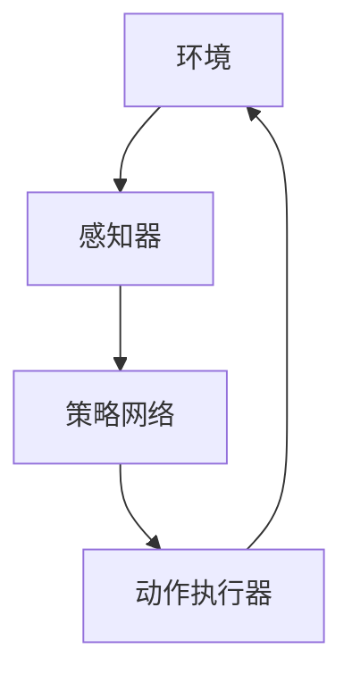

                 


# 《构建具有深度强化学习能力的AI Agent》

## 关键词：深度强化学习、AI Agent、强化学习算法、系统架构设计、项目实战

## 摘要：本文将详细探讨如何构建一个具有深度强化学习能力的AI Agent。从基础概念到高级算法，从系统架构设计到实际项目实战，我们将逐步解析AI Agent的核心原理与实现方法，帮助读者掌握构建具备深度强化学习能力的AI Agent的完整流程。

---

# 第1章: AI Agent的基本概念与背景

## 1.1 AI Agent的定义与特点

### 1.1.1 什么是AI Agent
AI Agent（人工智能代理）是指能够感知环境、自主决策并采取行动的智能实体。它可以是一个软件程序、机器人或其他智能系统，旨在通过与环境的交互来实现特定目标。

### 1.1.2 AI Agent的核心特点
- **自主性**：AI Agent能够在没有外部干预的情况下自主决策。
- **反应性**：能够实时感知环境并做出反应。
- **目标导向**：所有的行为都以实现特定目标为导向。
- **学习能力**：能够通过经验改进自身性能。

### 1.1.3 AI Agent的分类与应用场景
AI Agent可以分为**反应式AI Agent**和**基于模型的AI Agent**：
- **反应式AI Agent**：仅依赖当前感知的信息做出决策，适用于实时性要求高的场景，如自动驾驶。
- **基于模型的AI Agent**：利用环境模型和历史信息进行决策，适用于复杂环境，如游戏AI。

---

## 1.2 深度强化学习的背景与意义

### 1.2.1 强化学习的定义与特点
强化学习是一种机器学习范式，通过智能体在环境中采取行动并获得奖励来优化策略。其核心在于通过试错不断优化行为，以最大化累计奖励。

### 1.2.2 深度强化学习的优势
- **处理高维状态空间**：深度神经网络能够有效处理复杂的高维状态。
- **端到端学习**：可以直接从原始输入（如图像）学习策略，而不需要手动提取特征。
- **强大的泛化能力**：能够适应不同环境和变化的场景。

### 1.2.3 深度强化学习在AI Agent中的应用
深度强化学习广泛应用于游戏AI、机器人控制、自动驾驶等领域。例如，AlphaGo通过深度强化学习在围棋对弈中取得了突破性成绩。

---

## 1.3 本章小结
本章介绍了AI Agent的基本概念、特点及分类，并探讨了深度强化学习的背景与意义，为后续章节奠定了基础。

---

# 第2章: 强化学习的核心概念与算法

## 2.1 强化学习的基本原理

### 2.1.1 状态、动作、奖励的定义
- **状态（State）**：环境在某一时刻的信息表示，如棋盘上的棋子位置。
- **动作（Action）**：智能体在某一状态下采取的行为，如移动棋子。
- **奖励（Reward）**：智能体采取动作后获得的反馈，用于指导行为是否正确。

### 2.1.2 策略与价值函数的定义
- **策略（Policy）**：描述智能体在某一状态下选择动作的概率分布。
- **价值函数（Value Function）**：评估某状态下采取某个动作的长期收益。

### 2.1.3 探索与利用的平衡
强化学习需要在**探索**（尝试新动作）和**利用**（利用已知最优动作）之间找到平衡，以避免陷入局部最优。

---

## 2.2 基础强化学习算法

### 2.2.1 Q-learning算法
Q-learning是一种基于值函数的强化学习算法，通过更新Q表（Q-Table）来学习最优策略。

#### Q-learning的更新公式
$$ Q(s,a) = Q(s,a) + \alpha (r + \gamma \max Q(s',a') - Q(s,a)) $$

其中：
- $s$：当前状态
- $a$：当前动作
- $r$：奖励
- $s'$：下一个状态
- $\alpha$：学习率
- $\gamma$：折扣因子

#### Q-learning的mermaid流程图
```mermaid
graph TD
    A[当前状态s] --> B[选择动作a]
    B --> C[执行动作a，获得奖励r]
    C --> D[更新Q(s,a)]
    D --> A[下一个状态s']
```

---

### 2.2.2 Deep Q-Network (DQN) 算法
DQN通过深度神经网络近似Q函数，解决了Q-learning在高维状态空间中的局限性。

#### DQN的损失函数
$$ \mathcal{L} = \mathbb{E}[(r + \gamma Q(s',a') - Q(s,a))^2] $$

#### DQN的mermaid流程图
```mermaid
graph TD
    A[当前状态s] --> B[选择动作a]
    B --> C[执行动作a，获得奖励r]
    C --> D[更新目标网络Q'(s',a')]
    D --> E[更新主网络Q(s,a)]
```

---

### 2.2.3 Policy Gradient方法
Policy Gradient通过直接优化策略来最大化累积奖励，适用于连续动作空间。

#### Policy Gradient的更新公式
$$ \theta_{t+1} = \theta_t + \alpha \nabla_\theta J(\theta) $$

其中，$J(\theta)$是目标函数，$\nabla_\theta J(\theta)$是其梯度。

---

## 2.3 本章小结
本章详细介绍了强化学习的核心概念与基础算法，为后续章节的深度强化学习奠定了基础。

---

# 第3章: 深度强化学习的高级主题

## 3.1 深度强化学习的网络结构

### 3.1.1 状态编码网络
深度神经网络用于将原始状态信息（如图像）编码为高维特征向量。

### 3.1.2 动作策略网络
策略网络负责根据编码后的状态生成动作分布。

### 3.1.3 价值评估网络
价值网络评估某个状态下采取某个动作的长期收益。

---

## 3.2 基于深度强化学习的策略优化

### 3.2.1 Actor-Critic方法
Actor-Critic结合策略网络（Actor）和价值网络（Critic）进行联合优化。

#### Actor-Critic的mermaid流程图
```mermaid
graph TD
    A[状态s] --> B[Actor选择动作a]
    B --> C[Critic评估Q(s,a)]
    C --> D[更新Actor和Critic网络]
```

### 3.2.2 Proximal Policy Optimization (PPO)
PPO通过约束策略更新幅度，确保策略的稳定性。

#### PPO的更新公式
$$ \mathcal{L} = -\mathbb{E}[\min(r \hat{p}(\theta), \log \hat{p}(\theta))] $$

其中，$r$是奖励，$\hat{p}(\theta)$是新策略的概率。

---

## 3.3 深度强化学习的数学模型与公式

### 3.3.1 策略梯度方法
策略梯度通过最大化累积奖励来优化策略。

$$ \nabla J = \mathbb{E}[\nabla \log \pi(a|s) Q(s,a)] $$

### 3.3.2 值函数方法
值函数通过近似Q函数来优化策略。

$$ Q(s,a) = \mathbb{E}[r + \gamma Q(s',a')] $$

---

## 3.4 本章小结
本章深入探讨了深度强化学习的网络结构与高级算法，介绍了Actor-Critic和PPO等策略优化方法。

---

# 第4章: AI Agent的系统架构设计

## 4.1 系统架构设计的背景

### 4.1.1 系统功能需求
- 状态感知：实时获取环境信息。
- 动作选择：根据状态信息选择最优动作。
- 环境交互：与环境进行实时交互。

### 4.1.2 系统架构图


---

## 4.2 系统实现细节

### 4.2.1 状态编码
将原始状态信息（如图像）编码为神经网络的输入。

### 4.2.2 动作选择
根据策略网络输出的动作概率分布选择动作。

### 4.2.3 奖励机制
设计合理的奖励函数，指导智能体的行为。

---

## 4.3 系统优化与调优

### 4.3.1 参数调整
- 学习率$\alpha$：影响更新步长。
- 折扣因子$\gamma$：影响未来奖励的重要性。

### 4.3.2 网络结构优化
- 隐藏层数量：影响网络的表达能力。
- 激活函数：选择适合的激活函数（如ReLU）。

---

## 4.4 本章小结
本章从系统架构设计的角度，详细探讨了AI Agent的实现细节与优化方法。

---

# 第5章: 项目实战——构建一个简单的AI Agent

## 5.1 环境安装

### 5.1.1 安装Python
安装Python 3.x及以上版本。

### 5.1.2 安装深度学习框架
安装TensorFlow或PyTorch框架。

---

## 5.2 系统核心实现

### 5.2.1 状态编码网络
```python
import tensorflow as tf

def build_state_encoder(input_dim):
    model = tf.keras.Sequential([
        tf.keras.layers.Dense(64, activation='relu', input_dim=input_dim),
        tf.keras.layers.Dense(32, activation='relu'),
        tf.keras.layers.Dense(1)
    ])
    return model
```

### 5.2.2 动作策略网络
```python
def build_actor_network(state_encoder, action_dim):
    actor = tf.keras.Sequential([
        state_encoder,
        tf.keras.layers.Dense(action_dim, activation='softmax')
    ])
    return actor
```

---

## 5.3 代码实现与解读

### 5.3.1 训练循环
```python
def train_step(state, action, reward, next_state, actor, critic):
    with tf.GradientTape() as tape:
        # 计算策略梯度
        action_prob = actor(state)
        entropy = -tf.reduce_sum(action_prob * tf.math.log(action_prob))
        # 计算值函数
        value = critic(state)
        # 计算损失
        advantage = reward + critic(next_state) - value
        critic_loss = tf.reduce_mean(advantage ** 2)
        actor_loss = -tf.reduce_mean(entropy + advantage)
    # 更新网络
    actor_loss += critic_loss
    gradients = tape.gradient(actor_loss, actor.trainable_variables)
    actor.optimizer.apply_gradients(zip(gradients, actor.trainable_variables))
```

---

## 5.4 案例分析与优化

### 5.4.1 游戏AI案例
实现一个简单的游戏AI，如贪吃蛇，使用深度强化学习进行训练。

### 5.4.2 性能优化
- 使用经验回放（Experience Replay）加速训练。
- 调整奖励机制，鼓励智能体探索最优路径。

---

## 5.5 本章小结
本章通过实际案例展示了如何构建一个简单的AI Agent，并详细解读了代码实现与优化方法。

---

# 第6章: 总结与展望

## 6.1 本章总结
本文详细探讨了构建具有深度强化学习能力的AI Agent的方法，涵盖了从基础概念到实际项目的各个方面。

## 6.2 未来展望
随着深度学习和强化学习技术的进步，AI Agent将在更多领域发挥重要作用，如自动驾驶、智能助手和游戏AI等。

---

# 附录

## 附录A: 进一步学习的资源
- 书籍推荐：《Deep Reinforcement Learning》
- 网站推荐：[OpenAI Gym](https://gym.openai.com/)

## 附录B: 常见问题解答
- Q: 强化学习和监督学习有什么区别？
- A: 强化学习通过奖励机制学习，而监督学习通过标签数据学习。

---

# 索引

## 关键词索引
- AI Agent
- 深度强化学习
- 强化学习算法
- 系统架构设计
- 项目实战

---

希望这个目录大纲能为读者提供一个清晰的结构和内容框架，帮助他们逐步理解和掌握构建具有深度强化学习能力的AI Agent的方法。

