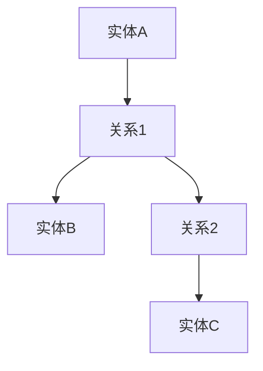
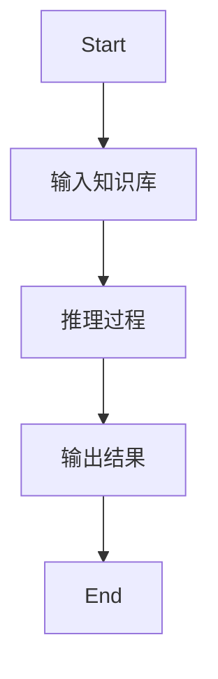
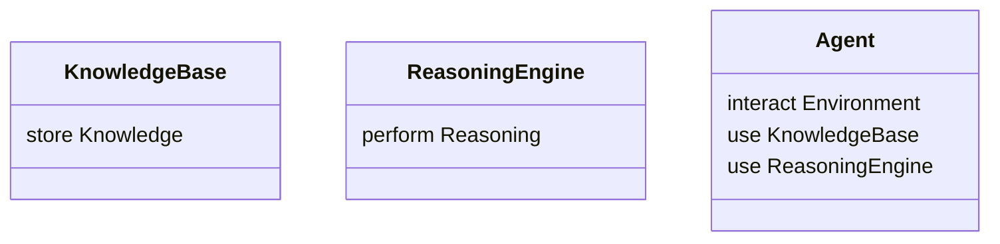
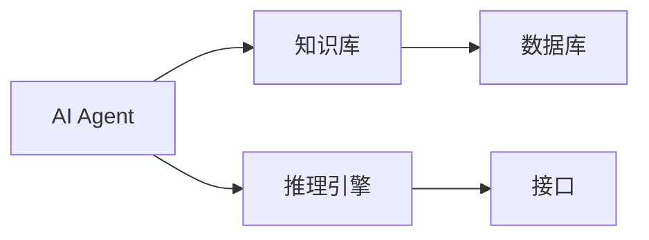
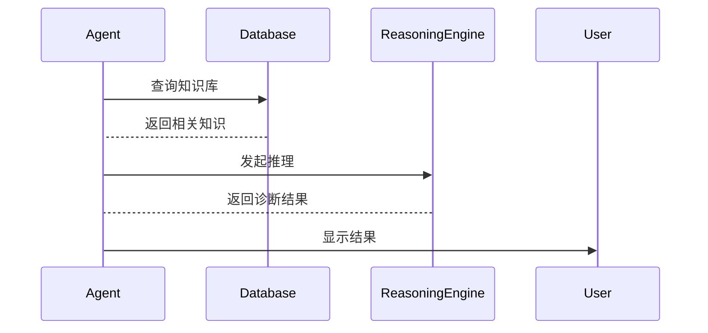

                 


# 构建具有知识推理能力的AI Agent

> **关键词**: AI Agent, 知识推理, 知识图谱, 推理算法, 系统架构, 项目实战

> **摘要**: 本文旨在探讨如何构建一个具有知识推理能力的AI Agent。通过详细分析知识推理的核心概念、算法原理、系统架构，并结合实际项目案例，帮助读者理解AI Agent的构建过程，掌握知识推理的关键技术，最终实现一个能够进行有效知识推理的智能代理系统。

---

## 第一部分: AI Agent概述

### 第1章: AI Agent的基本概念

#### 1.1 AI Agent的定义与分类

##### 1.1.1 什么是AI Agent
AI Agent（人工智能代理）是指在计算机系统中，能够感知环境、自主决策并执行任务的智能实体。AI Agent通过与环境交互，利用感知信息进行推理和学习，以实现特定目标。

##### 1.1.2 AI Agent的分类
AI Agent可以根据不同的标准进行分类：

1. **按智能水平**:
   - **反应式AI Agent**: 基于当前感知做出反应，不依赖历史信息。
   - **认知式AI Agent**: 具备复杂推理和规划能力，能够处理长期任务。
2. **按应用场景**:
   - **服务型AI Agent**: 提供特定服务，如智能助手。
   - **监控型AI Agent**: 实时监控并处理异常情况。
3. **按智能层次**:
   - **弱AI Agent**: 专注于特定任务。
   - **强AI Agent**: 具备广泛认知能力，接近人类智能。

##### 1.1.3 AI Agent与传统程序的区别
AI Agent的核心区别在于其自主性、反应性和学习能力。传统程序依赖预设规则，而AI Agent能够通过感知和推理动态调整行为。

---

#### 1.2 AI Agent的发展历程

##### 1.2.1 从专家系统到AI Agent
专家系统是早期的知识推理系统，通过规则库进行推理。AI Agent的出现，结合了专家系统的知识处理能力，具备更强的自主性和适应性。

##### 1.2.2 知识推理技术的演进
从基于规则的推理到基于概率和机器学习的推理，知识推理技术不断进步，推动了AI Agent的能力提升。

##### 1.2.3 当前AI Agent的最新进展
现代AI Agent结合了深度学习、强化学习等技术，具备更强的知识处理和决策能力。

---

#### 1.3 知识推理能力的核心作用

##### 1.3.1 知识推理的定义
知识推理是指AI Agent通过已有知识库中的信息，推导出新的结论或决策的能力。

##### 1.3.2 知识推理在AI Agent中的应用
知识推理广泛应用于问题解决、决策优化、数据分析等领域，使AI Agent能够更好地理解和处理复杂任务。

##### 1.3.3 知识推理能力的评估标准
评估标准包括推理的准确性、效率、鲁棒性和可解释性。

---

## 第2章: 知识推理的背景与问题背景

### 2.1 知识推理的背景介绍

#### 2.1.1 知识推理的定义与特点
知识推理是AI Agent实现智能决策的核心技术，其特点是基于知识库进行逻辑推理或概率推理。

#### 2.1.2 知识推理的核心要素
知识推理涉及知识表示、推理算法和知识库管理三个核心要素。

#### 2.1.3 知识推理的边界与外延
知识推理的边界在于其知识库的范围和推理算法的能力，外延则涉及数据挖掘、自然语言处理等技术。

---

### 2.2 知识推理问题的描述

#### 2.2.1 知识推理的基本问题
知识推理的基本问题是如何从已知事实和规则中推导出新的结论。

#### 2.2.2 知识推理的挑战与难点
- **知识表示的复杂性**: 如何高效表示和组织知识。
- **推理算法的效率**: 如何在大规模数据中快速推理。
- **不确定性处理**: 如何处理不完整或模糊的知识。

#### 2.2.3 知识推理的应用场景
知识推理应用于医疗诊断、金融分析、自动驾驶等领域。

---

## 第3章: 知识推理的核心概念与联系

### 3.1 核心概念原理

#### 3.1.1 知识表示的原理
知识表示是将知识以计算机可理解的形式存储的过程，常用的方法包括谓词逻辑、语义网络和知识图谱。

#### 3.1.2 知识推理的机制
知识推理通过推理算法，从知识库中提取信息，推导出新的结论。

#### 3.1.3 知识图谱的构建
知识图谱是一种结构化的知识表示形式，通过实体和关系描述世界。

---

### 3.2 核心概念属性特征对比表

#### 3.2.1 知识表示方法对比
| 方法          | 优点                     | 缺点                     |
|---------------|--------------------------|--------------------------|
|谓词逻辑       | 表达清晰，逻辑性强       | 无法处理模糊信息         |
|语义网络       | 可视化能力强             | 难以形式化               |
|知识图谱       | 支持大规模知识存储       | 构建和维护成本较高       |

#### 3.2.2 推理算法的性能对比
| 算法类型       | 优点                     | 缺点                     |
|---------------|--------------------------|--------------------------|
|逻辑推理        | 结果确定，可解释性强       | 无法处理不确定性         |
|概率推理        | 能处理不确定性           | 计算复杂度高             |
|机器学习推理    | 高效处理大规模数据       | 结果解释性较差           |

#### 3.2.3 知识图谱构建方法对比
| 方法          | 优点                     | 缺点                     |
|---------------|--------------------------|--------------------------|
|自底向上       | 结构清晰                 | 需要大量人工干预         |
|自顶向下       | 快速构建                 | 结构不够灵活             |
|混合方法       | 结合两者优点             | 实施复杂度高             |

---

### 3.3 ER实体关系图架构



实体关系图展示了实体之间的关系，帮助理解知识库的结构。

---

## 第4章: 知识推理算法原理

### 4.1 知识推理算法概述

#### 4.1.1 知识推理算法的分类
知识推理算法主要分为基于逻辑的推理、基于概率的推理和基于机器学习的推理。

---

#### 4.1.2 算法流程图



---

#### 4.1.3 算法代码实现

##### 逻辑推理算法

```python
def logical_reasoning(facts, rules):
    # facts是已知事实，rules是推理规则
    # 返回推理结果
    result = []
    for rule in rules:
        # 检查事实是否满足规则的前提
        if all(fact in facts for fact in rule['premise']):
            result.append(rule['conclusion'])
    return result
```

##### 概率推理算法

```python
def probabilistic_reasoning(evidence, model):
    # evidence是证据，model是概率模型
    # 返回概率结果
    result = model.predict(evidence)
    return result
```

---

#### 4.1.4 算法的数学模型

##### 逻辑推理的数学公式

$$
\text{如果 } A \land B \text{ 为真，则 } C \text{ 也为真}
$$

##### 概率推理的数学公式

$$
P(C|E) = \frac{P(E|C)P(C)}{P(E)}
$$

---

## 第5章: 系统架构设计方案

### 5.1 问题场景介绍

#### 5.1.1 项目背景
以医疗诊断系统为例，构建一个具备知识推理能力的AI Agent，辅助医生进行诊断。

---

### 5.2 系统功能设计

#### 5.2.1 系统功能模块



---

### 5.3 系统架构设计

#### 5.3.1 系统架构图



---

### 5.4 系统接口设计

#### 5.4.1 接口描述
- **输入接口**: 接收患者症状和检查结果。
- **输出接口**: 输出诊断建议。

---

### 5.5 系统交互设计

#### 5.5.1 交互流程图



---

## 第6章: 项目实战

### 6.1 环境安装

#### 6.1.1 安装Python和必要的库
安装Python和以下库：
- `numpy`
- `pandas`
- `scikit-learn`
- `networkx`

---

### 6.2 系统核心实现源代码

#### 6.2.1 知识库构建代码

```python
from networkx import DiGraph

def build_knowledge_base():
    kb = DiGraph()
    kb.add_edges_from([('A', 'B'), ('B', 'C')])
    return kb
```

#### 6.2.2 推理引擎实现代码

```python
def inference_engine(kb, query):
    # 简单的推理实现，返回相关节点
    return [node for node in kb.nodes() if query in node]
```

---

### 6.3 系统测试与优化

#### 6.3.1 系统测试
测试AI Agent的推理能力，确保其能够正确推理诊断结果。

#### 6.3.2 性能优化
优化知识库的存储和查询效率。

---

### 6.4 案例分析与总结

#### 6.4.1 实际案例分析
以医疗诊断为例，展示AI Agent如何利用知识推理辅助诊断。

#### 6.4.2 总结
知识推理是构建智能AI Agent的核心技术，通过不断优化知识库和推理算法，可以显著提升AI Agent的能力。

---

## 第7章: 扩展阅读

### 7.1 相关书籍推荐
1. 《人工智能: 一种现代的方法》
2. 《知识图谱: 理论与应用》

### 7.2 相关论文推荐
1. "A Survey on Knowledge Graph Construction" by J. Gu et al.
2. "Probabilistic Reasoning in AI" by D. Poole

---

## 第8章: 最佳实践与注意事项

### 8.1 最佳实践
- 定期更新知识库，确保知识的准确性和时效性。
- 选择合适的推理算法，根据具体任务需求进行优化。

### 8.2 注意事项
- 避免知识库的冗余，确保知识表示的简洁性。
- 注意推理算法的计算效率，优化系统性能。

---

## 第9章: 总结与展望

### 9.1 总结
构建具有知识推理能力的AI Agent是一个复杂而有趣的任务，需要综合运用知识表示、推理算法和系统架构等技术。

### 9.2 展望
未来，随着人工智能技术的不断发展，AI Agent的知识推理能力将更加智能化和人性化，应用场景也将更加广泛。

---

**感谢您的耐心阅读！希望本文对您理解如何构建具有知识推理能力的AI Agent有所帮助。**

