                 


# 构建具有群体智能决策能力的多Agent系统

## 关键词：多Agent系统、群体智能、分布式计算、共识算法、博弈论、系统架构

## 摘要：  
本文详细探讨了如何构建具有群体智能决策能力的多Agent系统，从多Agent系统的基本概念到群体智能的核心原理，再到实际的系统设计和项目实现，逐步分析了构建过程中的关键技术和挑战。通过理论与实践相结合的方式，本文旨在为读者提供一个全面而深入的理解，帮助他们在实际项目中应用群体智能决策技术。

---

## 第一部分: 多Agent系统与群体智能决策基础

### 第1章: 多Agent系统概述

#### 1.1 多Agent系统的基本概念

##### 1.1.1 什么是多Agent系统
多Agent系统（Multi-Agent System, MAS）是由多个智能体（Agent）组成的分布式系统，这些智能体能够通过通信和协作完成复杂的任务。每个Agent都是一个独立的实体，具有自主性、反应性和社会性。

##### 1.1.2 多Agent系统的特点
| 特性 | 描述 |
|------|------|
| 自主性 | Agent能够自主决策，无需外部干预 |
| 反应性 | Agent能够感知环境并做出实时反应 |
| 分布式 | Agent之间通过分布式计算协同工作 |
| 社会性 | Agent之间能够通过通信和协作完成任务 |

##### 1.1.3 多Agent系统中的Agent分类
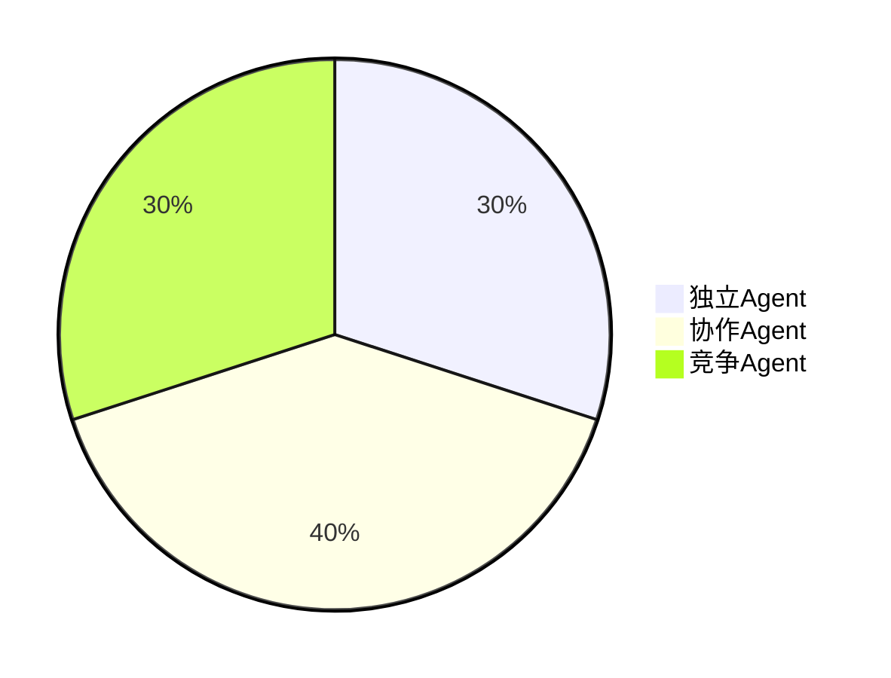

---

#### 1.2 群体智能的基本概念

##### 1.2.1 群体智能的定义
群体智能（Swarm Intelligence, SI）是指通过大量简单个体的协作，实现复杂问题的解决。这些个体通常具有简单的规则，但通过局部信息交换能够涌现出复杂的全局行为。

##### 1.2.2 群体智能的核心特征
| 特性 | 描述 |
|------|------|
| 去中心化 | 群体智能系统没有中心节点，个体之间通过分布式计算协作 |
| 自组织 | 群体智能系统能够在无外部干预的情况下自组织、自适应 |
| 并行性 | 群体智能系统能够通过并行计算提高效率 |

##### 1.2.3 多Agent系统与群体智能的关系
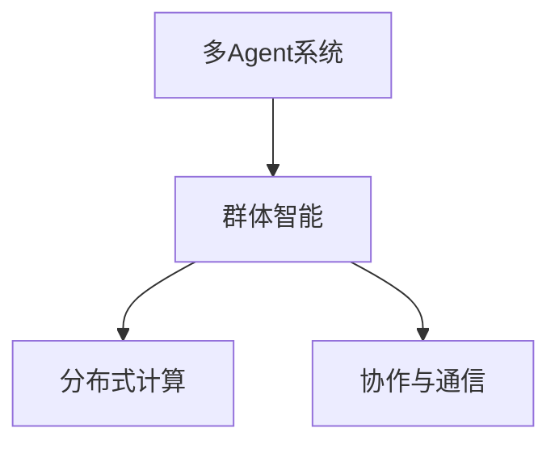

---

#### 1.3 多Agent系统中群体智能的应用场景

##### 1.3.1 分布式任务分配
在多Agent系统中，群体智能可以通过分布式任务分配算法，将任务分配给最合适的Agent。

##### 1.3.2 自适应协作
群体智能能够让多Agent系统在动态环境中自适应协作，实时调整策略以应对变化。

##### 1.3.3 集群决策
通过群体智能，多Agent系统可以实现集群决策，例如在无人机编队中的路径规划。

---

### 第2章: 多Agent系统的核心概念与联系

#### 2.1 多Agent系统的核心概念

##### 2.1.1 Agent的基本属性
| 属性 | 描述 |
|------|------|
| 自主性 | Agent能够自主决策 |
| 反应性 | Agent能够感知环境并做出反应 |
| 目标导向 | Agent的行为基于明确的目标 |

##### 2.1.2 多Agent系统中的通信机制
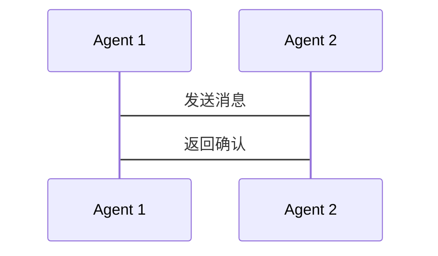

##### 2.1.3 多Agent系统中的协作机制
```mermaid
graph TD
    A1 --> C[任务协调器]
    A2 --> C
    C --> A1: 分配任务1
    C --> A2: 分配任务2
```

---

#### 2.2 群体智能的核心概念

##### 2.2.1 群体智能的决策模型
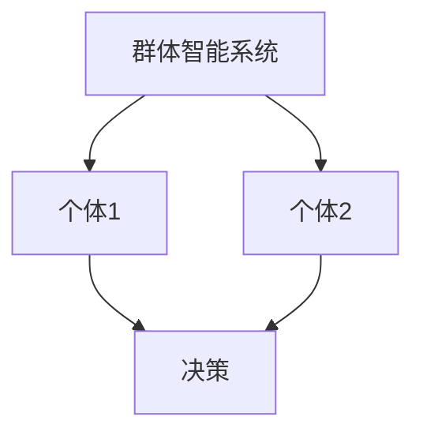

##### 2.2.2 群体智能的通信协议
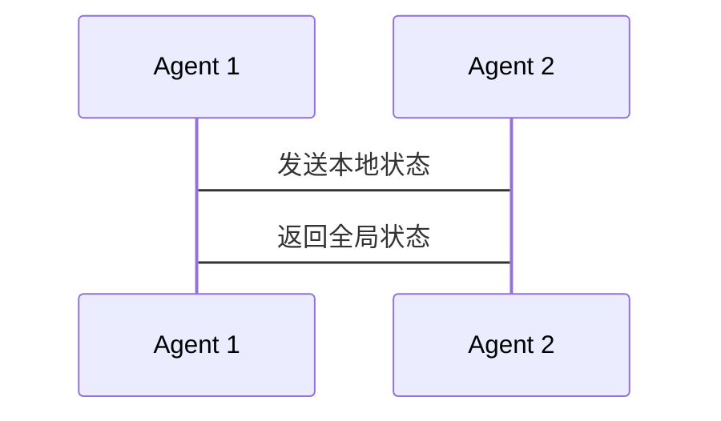

##### 2.2.3 群体智能的自组织特性
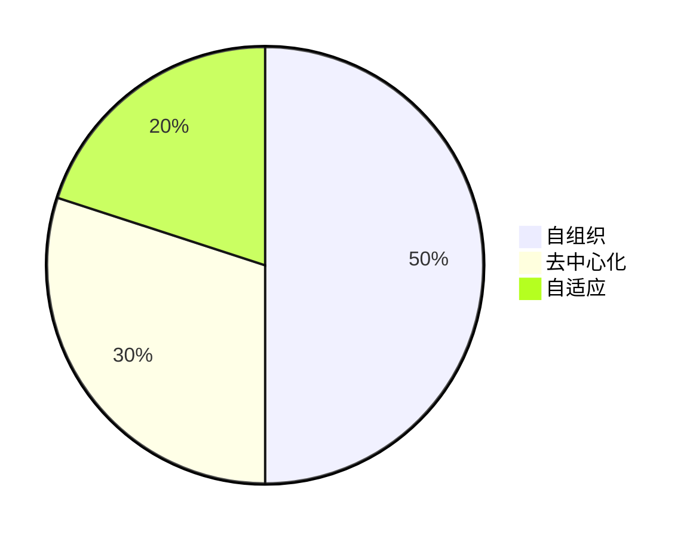

---

#### 2.3 多Agent系统与群体智能的协同优化

##### 2.3.1 多Agent系统中的群体智能模型
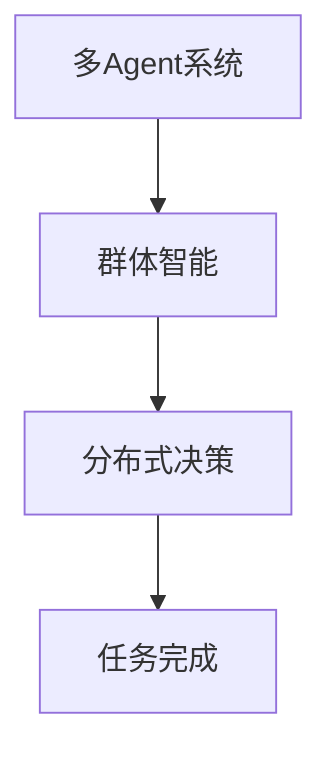

##### 2.3.2 群体智能对多Agent系统的影响
| 影响 | 描述 |
|------|------|
| 提高效率 | 群体智能通过并行计算提高了多Agent系统的效率 |
| 增强适应性 | 群体智能使多Agent系统能够更好地适应动态环境 |
| 降低复杂性 | 群体智能通过去中心化降低了多Agent系统的复杂性 |

---

### 第3章: 多Agent系统中的群体智能算法原理

#### 3.1 分布式计算与多Agent系统

##### 3.1.1 分布式计算的基本概念
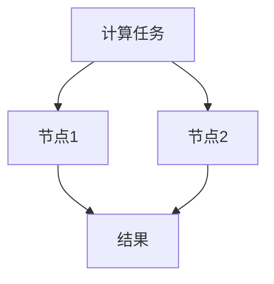

##### 3.1.2 多Agent系统中的分布式计算模型
| 模型 | 描述 |
|------|------|
| 分布式计算 | 任务分布在多个节点上并行执行 |
| 并行计算 | 多个任务同时在多个节点上执行 |

##### 3.1.3 分布式计算在群体智能中的应用
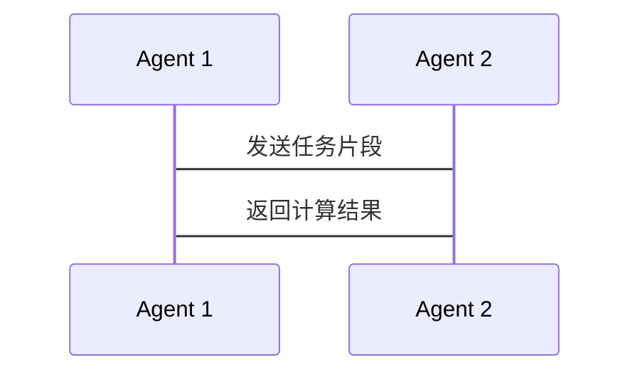

---

#### 3.2 共识算法与多Agent系统

##### 3.2.1 共识算法的基本原理
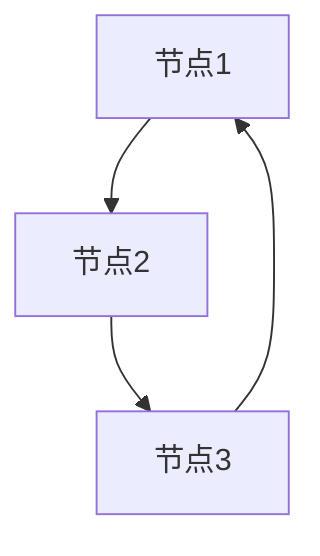

##### 3.2.2 多Agent系统中的共识机制
```python
def consensus(nodes, target_value):
    for node in nodes:
        node.value = target_value
    while not all(nodes.value == target_value):
        pass
    return nodes.value
```

##### 3.2.3 共识算法在群体智能中的应用
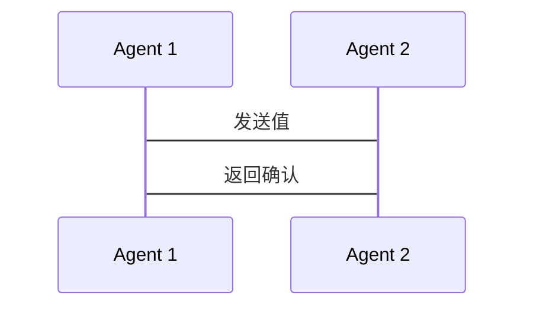

---

#### 3.3 博弈论与群体智能决策

##### 3.3.1 博弈论的基本概念
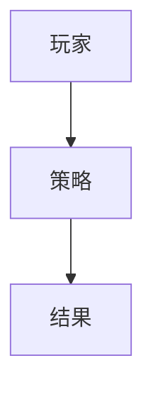

##### 3.3.2 博弈论在多Agent系统中的应用
```python
def gameTheory(agent1, agent2):
    if agent1.move == '左':
        if agent2.move == '右':
            return 'agent1胜'
        else:
            return '平局'
    else:
        return 'agent2胜'
```

##### 3.3.3 博弈论在群体智能决策中的作用
| 作用 | 描述 |
|------|------|
| 模型构建 | 博弈论为群体智能决策提供数学模型 |
| 策略优化 | 博弈论帮助优化群体智能的决策策略 |
| 结果分析 | 博弈论用于分析群体智能决策的结果 |

---

## 总结

通过以上章节的详细分析，我们可以看到，构建具有群体智能决策能力的多Agent系统需要从基础概念到实际应用的全面考虑。从分布式计算、共识算法到博弈论，每一步都需要深入理解并精心设计。希望本文能够为读者提供有价值的见解和指导，帮助他们在实际项目中成功应用这些技术。

---

**参考文献**  
1. "Multi-Agent Systems" by Michael Wooldridge  
2. "Swarm Intelligence: A Tutorial" by Frank D. Steffen  
3. "Distributed Computing" by Alan W. Boege  
4. "Game Theory and Decision Making" by Dan Kahan

