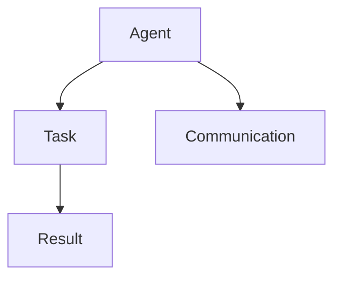
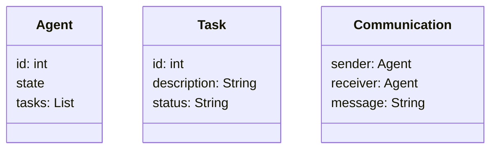
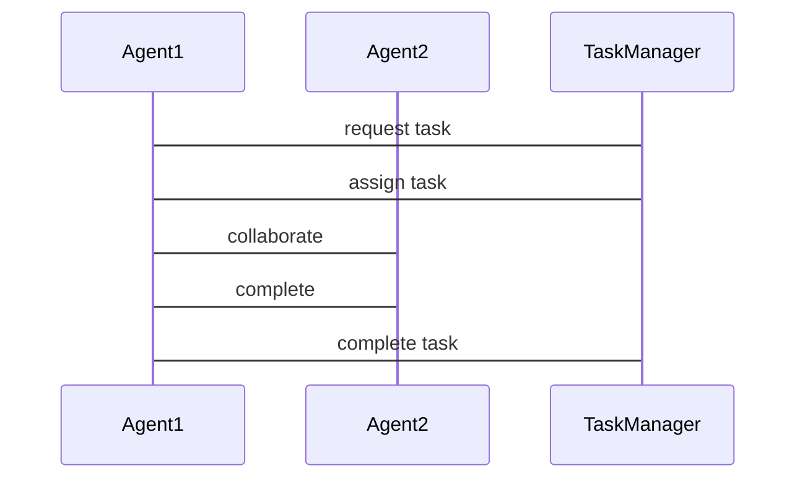

                 


# 构建具有群体智能的多Agent协作系统

## 关键词：多Agent系统，群体智能，协作算法，分布式计算，人工智能，系统架构

## 摘要：本文将详细介绍如何构建一个具有群体智能的多Agent协作系统。首先，我们从多Agent协作系统的概念和应用场景入手，逐步分析其核心概念和算法原理。接着，我们将讨论系统的架构设计与实现方案，并通过实际案例分析，展示如何在实践中应用这些理论。最后，我们将分享最佳实践和开发经验，帮助读者构建高效、可靠的多Agent协作系统。

---

# 第1章: 多Agent协作系统概述

## 1.1 多Agent系统的基本概念

### 1.1.1 什么是Agent

Agent，即智能体，是一个能够感知环境、自主决策并采取行动的实体。它具有以下核心特征：

1. **自主性**：Agent能够在没有外部干预的情况下自主运行。
2. **反应性**：Agent能够感知环境并实时调整行为。
3. **协作性**：Agent能够与其他Agent或系统进行交互和协作。

### 1.1.2 多Agent系统的特点

多Agent系统由多个独立但协作的Agent组成，具有以下特点：

1. **分布性**：Agent分布在不同的位置，独立运行。
2. **协作性**：Agent之间通过协作完成复杂任务。
3. **动态性**：环境和任务可能动态变化，Agent需灵活应对。

### 1.1.3 多Agent系统的分类

多Agent系统可以根据以下标准进行分类：

1. **任务驱动型**：Agent协作完成特定任务。
2. **知识共享型**：Agent通过共享知识提高协作效率。
3. **分布式计算型**：Agent在分布式环境中协作。

## 1.2 群体智能的定义与特点

### 1.2.1 群体智能的定义

群体智能是指多个简单个体通过协作实现复杂智能行为的特性。它依赖于个体之间的局部交互，无需全局协调。

### 1.2.2 群体智能的核心特征

1. **去中心化**：没有中央控制，个体自主决策。
2. **涌现性**：群体智能是局部行为的涌现结果。
3. **鲁棒性**：群体智能对单个个体的故障具有鲁棒性。

### 1.2.3 群体智能与多Agent系统的联系

群体智能通过多Agent协作实现复杂的智能行为，而多Agent系统为群体智能提供了实现平台。

## 1.3 多Agent协作系统的应用场景

### 1.3.1 分布式计算中的多Agent协作

多Agent系统在分布式计算中广泛应用，例如分布式数据库、分布式任务调度等。

### 1.3.2 群体智能在人工智能中的应用

群体智能在机器人协作、智能交通系统、分布式问题求解等领域有广泛应用。

### 1.3.3 多Agent协作系统的实际案例

1. **机器人协作**：多台机器人协作完成搬运、组装等任务。
2. **分布式推荐系统**：多个Agent协作推荐个性化内容。
3. **智能交通系统**：车辆、交通信号灯等通过协作优化交通流量。

## 1.4 本章小结

---

# 第2章: 多Agent协作系统的核心概念与联系

## 2.1 多Agent协作系统的核心要素

### 2.1.1 Agent的智能性

Agent的智能性体现在感知、推理和行动能力上。

### 2.1.2 Agent的自主性

Agent在没有外部干预的情况下，能够自主完成任务。

### 2.1.3 Agent的协作性

Agent通过协作完成复杂任务，协作方式包括通信、协商和任务分配。

## 2.2 群体智能与多Agent协作系统的联系

### 2.2.1 群体智能的实现机制

群体智能通过个体之间的局部交互实现全局智能行为。

### 2.2.2 多Agent协作系统的实现机制

多Agent系统通过通信、协商和协作完成复杂任务。

### 2.2.3 两者的核心区别与联系

1. **核心区别**：
   - 群体智能侧重于个体协作产生的智能行为。
   - 多Agent系统侧重于多个Agent协作完成任务。
2. **联系**：
   - 群体智能可以通过多Agent协作实现。
   - 多Agent系统为群体智能提供实现平台。

## 2.3 多Agent协作系统的ER实体关系图



## 2.4 本章小结

---

# 第3章: 多Agent协作系统的算法原理

## 3.1 多Agent协作的基本算法

### 3.1.1 分布式协调算法

分布式协调算法用于多个Agent之间的任务分配和资源协调。

### 3.1.2 基于规则的协作算法

基于规则的协作算法通过预定义规则实现Agent之间的协作。

### 3.1.3 基于博弈论的协作算法

基于博弈论的协作算法通过模拟博弈过程实现Agent之间的协作。

## 3.2 群体智能的算法实现

### 3.2.1 遗传算法

遗传算法是一种基于自然选择和遗传机制的优化算法。

### 3.2.2 粒子群优化算法

粒子群优化算法是一种基于鸟群觅食行为的优化算法。

### 3.2.3 蚁群算法

蚁群算法是一种基于蚂蚁觅食行为的优化算法。

## 3.3 算法的数学模型与公式

### 3.3.1 遗传算法的数学模型

$$f(x) = \sum_{i=1}^{n} x_i$$

### 3.3.2 粒子群优化算法的数学模型

$$v_i = w v_i + c_1 r_1 (p_i - x_i) + c_2 r_2 (p_g - x_i)$$

## 3.4 本章小结

---

# 第4章: 多Agent协作系统的系统分析与架构设计

## 4.1 系统问题场景介绍

### 4.1.1 分布式协作问题

系统需要解决多个Agent在分布式环境下的协作问题。

### 4.1.2 群体智能的应用场景

系统需要实现多个Agent通过协作完成复杂任务。

## 4.2 系统功能设计

### 4.2.1 领域模型设计



## 4.3 系统架构设计

### 4.3.1 分层架构

系统采用分层架构，包括数据层、逻辑层和应用层。

### 4.3.2 通信架构

系统采用异步通信机制，通过消息队列实现Agent之间的通信。

## 4.4 系统接口设计

### 4.4.1 Agent接口

```python
class Agent:
    def receive_message(self, message):
        pass
    def send_message(self, message, receiver):
        pass
```

### 4.4.2 任务分配接口

```python
class TaskManager:
    def assign_task(self, agent, task):
        pass
    def get_available_tasks(self):
        pass
```

## 4.5 系统交互序列图



## 4.6 本章小结

---

# 第5章: 项目实战

## 5.1 环境安装

### 5.1.1 安装Python

安装Python 3.8或更高版本。

### 5.1.2 安装第三方库

安装`numpy`、`scipy`等库。

## 5.2 核心代码实现

### 5.2.1 Agent类实现

```python
class Agent:
    def __init__(self, id):
        self.id = id
        self.state = "idle"
    def receive_message(self, message):
        pass
    def send_message(self, message, receiver):
        pass
```

### 5.2.2 任务管理器实现

```python
class TaskManager:
    def __init__(self):
        self.tasks = []
    def assign_task(self, agent, task):
        pass
    def get_available_tasks(self):
        pass
```

## 5.3 案例分析与实现

### 5.3.1 任务分配案例

```python
def assign_task(agent, task):
    agent.state = "busy"
    print(f"Agent {agent.id} is working on task {task.id}")
```

### 5.3.2 通信案例

```python
def send_message(self, message, receiver):
    print(f"Agent {self.id} sends message '{message}' to Agent {receiver.id}")
```

## 5.4 项目小结

---

# 第6章: 扩展与优化

## 6.1 多Agent协作系统的关键技术

### 6.1.1 分布式计算

### 6.1.2 通信协议

### 6.1.3 任务分配算法

## 6.2 群体智能的优化策略

### 6.2.1 算法优化

### 6.2.2 系统优化

### 6.2.3 通信优化

## 6.3 本章小结

---

# 第7章: 最佳实践与总结

## 7.1 开发经验分享

### 7.1.1 设计经验

### 7.1.2 实现经验

## 7.2 编写高质量代码的技巧

### 7.2.1 设计原则

### 7.2.2 编码规范

## 7.3 系统部署与维护

### 7.3.1 部署策略

### 7.3.2 维护经验

## 7.4 总结与展望

---

## 附录

### 附录A: 常见问题解答

### 附录B: 参考文献

---

## 关键词：多Agent系统，群体智能，协作算法，分布式计算，人工智能，系统架构

