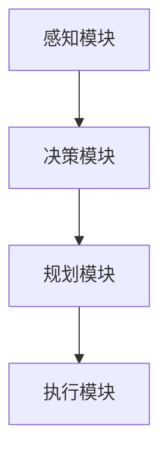
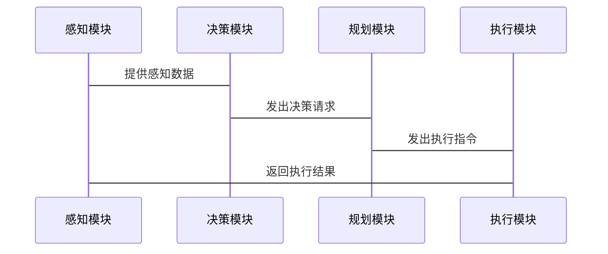

                 


# 《构建具有联邦学习能力的AI Agent》

## 关键词：联邦学习, AI Agent, 联邦学习算法, 分布式数据, 智能决策

## 摘要：本文深入探讨了如何将联邦学习技术应用于AI Agent的构建，详细分析了联邦学习的核心原理、AI Agent的决策机制、关键算法及其在系统中的应用。通过理论分析和实际案例，展示了如何在分布式数据环境中实现高效、安全的AI Agent设计。

---

# 第1章：联邦学习与AI Agent概述

## 1.1 联邦学习的基本概念

### 1.1.1 数据分布与联邦学习的定义

联邦学习（Federated Learning）是一种分布式机器学习技术，允许多个数据源在不共享原始数据的情况下协同训练模型。数据分布是联邦学习的核心，数据可以分布在不同的设备、服务器或机构中，保持数据的局部性和隐私性。

### 1.1.2 联邦学习的核心思想

联邦学习的核心思想是通过在分布式数据源上进行模型训练，避免数据泄露，同时保持模型的整体性能。其核心在于通信协议的设计和模型更新策略的优化。

### 1.1.3 联邦学习与传统分布式学习的区别

传统的分布式学习通常假设数据可以集中到一个中心服务器进行训练，而联邦学习则强调数据的本地化和模型的分布式更新，更适合隐私保护和数据孤岛场景。

## 1.2 AI Agent的基本概念

### 1.2.1 AI Agent的定义与分类

AI Agent是一种能够感知环境、自主决策并执行任务的智能实体。根据智能水平，AI Agent可以分为反应式、基于模型和混合式三种类型。

### 1.2.2 AI Agent的核心功能与特点

AI Agent的核心功能包括感知、决策、规划和执行。其特点在于自主性、反应性、目标导向和学习能力。

### 1.2.3 AI Agent的应用场景与挑战

AI Agent广泛应用于自动驾驶、智能助手、机器人等领域。挑战包括数据异构性、模型更新效率和隐私保护等问题。

## 1.3 联邦学习与AI Agent的结合

### 1.3.1 联邦学习在AI Agent中的作用

联邦学习为AI Agent提供了分布式数据上的协同学习能力，使其能够在不共享数据的情况下提升模型性能。

### 1.3.2 联邦学习如何增强AI Agent的能力

通过联邦学习，AI Agent可以在多个数据源上进行联合训练，增强其决策能力和泛化能力。

### 1.3.3 联邦学习与AI Agent结合的典型应用

例如，在医疗领域，多个医院的数据源可以通过联邦学习训练一个共享的医疗模型，同时保护各医院的患者数据隐私。

## 1.4 本章小结

本章介绍了联邦学习和AI Agent的基本概念，并探讨了它们结合的意义和应用场景，为后续章节奠定了基础。

---

# 第2章：联邦学习的数学基础

## 2.1 联邦学习的优化目标

### 2.1.1 联邦学习的损失函数

在联邦学习中，损失函数通常定义为各个数据源上的损失之和，即：

$$ L = \sum_{i=1}^{n} L_i $$

其中，$L_i$ 是第i个数据源的损失函数。

### 2.1.2 联邦学习的优化算法

常见的优化算法包括随机梯度下降（SGD）和Adam优化器。例如，使用Adam优化器的更新规则为：

$$ \theta_{t+1} = \theta_t - \eta \frac{\nabla L}{\|\nabla L\|} $$

其中，$\theta$ 是模型参数，$\eta$ 是学习率。

## 2.2 联邦学习的通信协议

### 2.2.1 联邦平均（FedAvg）算法

FedAvg算法的核心是将各个数据源上的模型参数进行平均，公式如下：

$$ \theta_{avg} = \frac{1}{n}\sum_{i=1}^{n} \theta_i $$

其中，$n$ 是数据源的数量，$\theta_i$ 是第i个数据源的模型参数。

### 2.2.2 联邦学习的通信协议

通信协议决定了模型参数的更新和同步方式。例如，FedAvg的通信协议包括：

1. 服务器向各个数据源发送全局模型参数。
2. 各数据源在本地数据上训练模型，并更新参数。
3. 数据源将更新后的模型参数发送回服务器。
4. 服务器聚合所有数据源的参数，生成新的全局模型。

## 2.3 联邦学习的安全性与隐私保护

### 2.3.1 联邦学习中的数据隐私保护

通过加密通信和差分隐私技术，可以保护数据的隐私性。例如，使用同态加密技术对模型参数进行加密传输。

### 2.3.2 联邦学习中的安全性挑战

主要挑战包括模型参数被攻击者窃取、数据源的身份认证和防止数据投毒攻击。

## 2.4 本章小结

本章详细讲解了联邦学习的数学基础，包括优化目标、通信协议和安全性挑战，为后续章节的算法实现提供了理论支持。

---

# 第3章：AI Agent的决策机制

## 3.1 AI Agent的决策模型

### 3.1.1 基于联邦学习的决策模型构建

决策模型通常采用深度学习框架，例如使用神经网络进行分类或回归任务。

### 3.1.2 决策模型的训练与优化

在联邦学习环境下，决策模型的训练需要考虑数据分布的异构性和模型更新的效率。

## 3.2 联邦学习中的数据异构性处理

### 3.2.1 数据异构性的定义与分类

数据异构性指的是不同数据源之间的数据分布差异，可以分为数据特征异构性和数据量异构性。

### 3.2.2 数据异构性对联邦学习的影响

数据异构性可能导致模型更新的困难，影响模型的收敛性和性能。

## 3.3 联邦学习中的模型更新策略

### 3.3.1 模型更新的频率与粒度

模型更新的频率可以是同步或异步，粒度可以是全模型或部分模型。

### 3.3.2 模型更新的收敛性分析

通过数学分析可以证明，合理的模型更新策略可以保证模型的收敛性。

## 3.4 本章小结

本章探讨了AI Agent的决策机制，重点分析了数据异构性和模型更新策略对决策能力的影响。

---

# 第4章：AI Agent的系统架构设计

## 4.1 系统功能设计

### 4.1.1 系统功能模块

AI Agent系统通常包括感知模块、决策模块、规划模块和执行模块。

### 4.1.2 功能模块之间的关系

感知模块负责数据采集，决策模块基于感知数据进行推理，规划模块制定执行计划，执行模块完成具体任务。

## 4.2 系统架构设计

### 4.2.1 系统架构图

使用Mermaid绘制系统架构图，展示各个模块之间的交互关系。



### 4.2.2 系统接口设计

系统接口通常包括数据接口、模型接口和控制接口，分别用于数据传输、模型更新和任务调度。

## 4.3 系统交互设计

### 4.3.1 系统交互流程

使用Mermaid绘制系统交互流程图，展示系统各模块的协作过程。



## 4.4 本章小结

本章详细描述了AI Agent的系统架构设计，包括功能模块、架构图和交互流程，为系统的实现提供了指导。

---

# 第5章：项目实战

## 5.1 环境安装与配置

### 5.1.1 环境要求

需要安装Python、TensorFlow和通信库（如gRPC）。

### 5.1.2 环境配置示例

```bash
pip install tensorflow grpcio
```

## 5.2 联邦学习框架实现

### 5.2.1 模型定义

定义一个简单的神经网络模型，例如：

```python
import tensorflow as tf

class Model(tf.keras.Model):
    def __init__(self):
        super(Model, self).__init__()
        self.Dense1 = tf.keras.layers.Dense(64, activation='relu')
        self.Dense2 = tf.keras.layers.Dense(10, activation='softmax')
    
    def call(self, inputs):
        x = self.Dense1(inputs)
        x = self.Dense2(x)
        return x
```

### 5.2.2 模型训练与更新

实现模型的训练和更新逻辑，例如：

```python
def train_step(model, optimizer, inputs, labels):
    with tf.GradientTape() as tape:
        predictions = model(inputs)
        loss = compute_loss(labels, predictions)
    gradients = tape.gradient(loss, model.trainable_variables)
    optimizer.apply_gradients(zip(gradients, model.trainable_variables))
    return loss
```

## 5.3 AI Agent实现

### 5.3.1 感知模块实现

实现数据采集和预处理功能。

### 5.3.2 决策模块实现

基于联邦学习模型进行推理和决策。

## 5.4 项目测试与优化

### 5.4.1 测试用例设计

设计合理的测试用例，验证系统的功能和性能。

### 5.4.2 系统优化

优化模型训练效率和通信延迟，提升系统整体性能。

## 5.5 本章小结

本章通过实际项目实战，详细讲解了联邦学习框架和AI Agent的实现过程，帮助读者掌握实际应用中的关键步骤。

---

# 第6章：高级主题与未来展望

## 6.1 联邦学习的安全增强

### 6.1.1 加密通信技术

使用同态加密和安全多方计算技术，进一步提升数据隐私保护能力。

## 6.2 联邦学习的可扩展性

### 6.2.1 分层联邦学习

通过分层设计，提升系统的可扩展性和灵活性。

## 6.3 联邦学习的监管与合规性

### 6.3.1 合规性要求

确保系统符合相关法律法规和数据保护要求。

## 6.4 未来展望

随着技术的发展，联邦学习将在更多领域得到应用，AI Agent的能力也将不断提升。

## 6.5 本章小结

本章探讨了联邦学习的高级主题，展望了未来的发展方向，为读者提供了更广阔的视野。

---

# 第7章：最佳实践与总结

## 7.1 实践中的注意事项

### 7.1.1 数据预处理的重要性

数据预处理是影响模型性能的关键因素，需仔细处理。

### 7.1.2 模型选择与调优

合理选择模型架构，并进行充分的调优，以获得最佳性能。

## 7.2 总结与展望

总结全文内容，强调联邦学习在AI Agent中的重要性，并展望未来的发展方向。

## 7.3 小结

通过本文的学习，读者将能够系统地理解联邦学习与AI Agent的结合，掌握实际应用中的关键技术和方法。

---

# 附录

## 附录A：相关数学公式汇总

汇总本文中涉及的主要数学公式，方便读者查阅。

## 附录B：系统架构图

提供系统架构的Mermaid图，方便读者理解和实现。

## 附录C：代码示例汇总

汇总本文中的代码示例，方便读者快速上手。

---

通过以上目录大纲，我们可以系统地构建具有联邦学习能力的AI Agent，从基础概念到实际应用，全面覆盖相关技术和方法。

