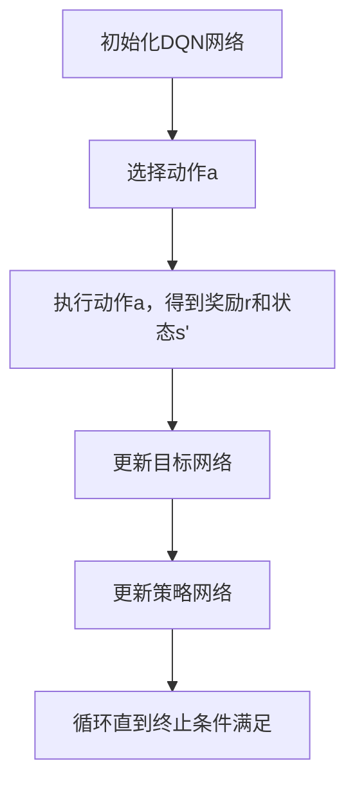
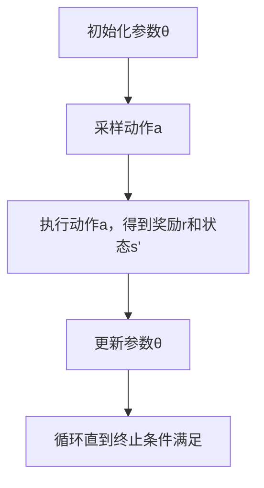
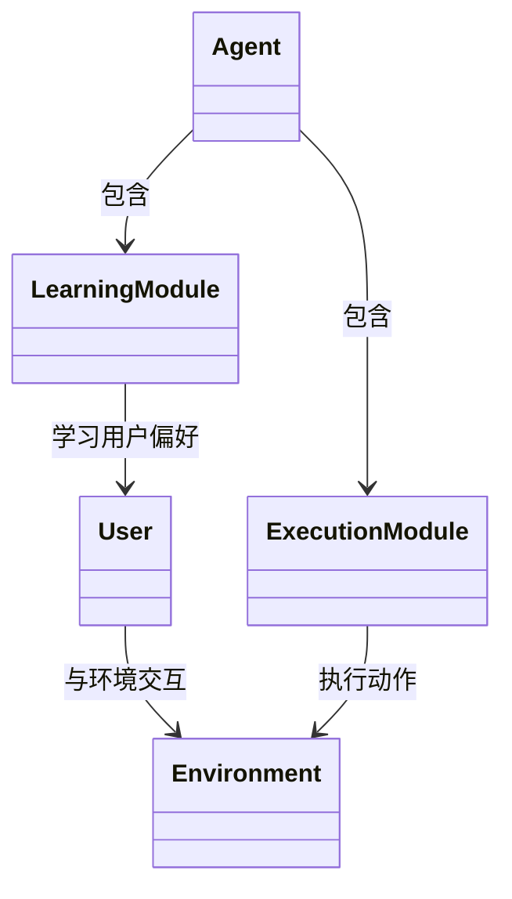
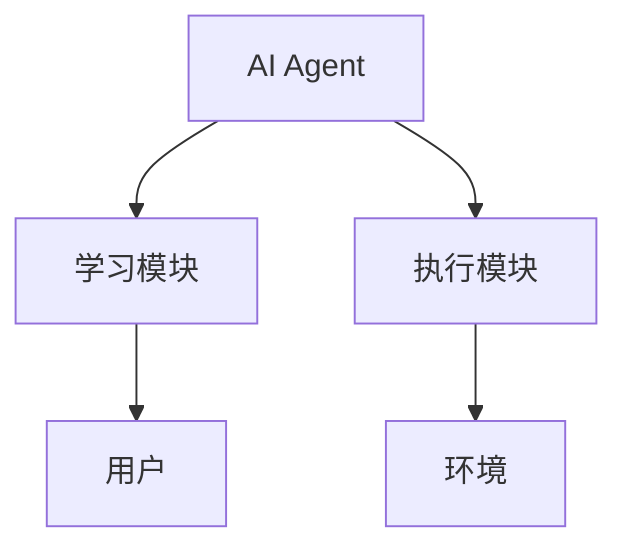
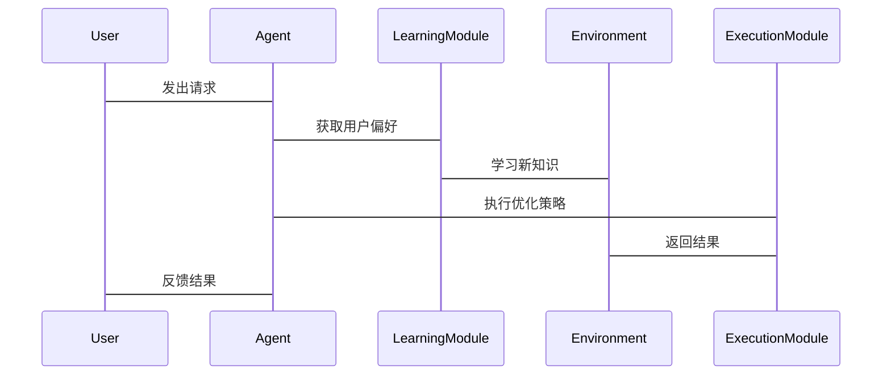

                 


# 构建具有自主学习与探索能力的AI Agent

## 关键词：AI Agent，自主学习，强化学习，元学习，自监督学习

## 摘要：  
本文详细探讨了构建具有自主学习与探索能力的AI Agent的核心理论、算法实现和系统设计。从AI Agent的基本概念出发，逐步深入分析自主学习与探索的必要性、实现框架及核心算法，最后通过实际案例展示如何将理论应用于实践，帮助读者全面理解并掌握构建具有自主学习能力的AI Agent的方法。

---

# 第一部分：自主学习与探索AI Agent的背景与核心概念

## 第1章：自主学习与探索AI Agent概述

### 1.1 自主学习与探索AI Agent的背景

#### 1.1.1 AI Agent的基本概念  
AI Agent（人工智能代理）是指能够感知环境、自主决策并采取行动的智能体。它能够通过与环境交互来实现特定目标，例如自动驾驶汽车、智能助手、游戏AI等。

#### 1.1.2 自主学习与探索能力的必要性  
传统的AI系统通常依赖于预定义的规则或大量人工标注的数据，但在动态变化的环境中，这种依赖性限制了系统的适应能力。自主学习与探索能力使AI Agent能够在未知或动态变化的环境中，通过与环境的交互主动学习新知识、优化策略，从而提高其适应性和智能性。

#### 1.1.3 当前AI Agent的应用现状  
当前，AI Agent已广泛应用于多个领域，例如自动驾驶、智能助手、机器人、游戏AI等。然而，这些系统在面对复杂、动态或未见场景时，往往表现出局限性。通过赋予AI Agent自主学习与探索能力，可以显著提升其在复杂环境中的表现。

### 1.2 自主学习与探索的核心概念

#### 1.2.1 自主学习的定义与特点  
自主学习是指AI Agent在没有外部指导的情况下，通过与环境交互来学习新知识、优化策略并解决问题的能力。其特点包括：  
- **主动性**：AI Agent主动探索环境，而不是被动接收数据。  
- **适应性**：能够根据环境反馈调整学习策略。  
- **高效性**：能够在有限的交互中快速学习并优化性能。

#### 1.2.2 探索能力的定义与实现方式  
探索能力是指AI Agent在未知环境中主动尝试新动作或策略，以发现新的知识或优化现有策略的能力。常见的实现方式包括：  
- **随机探索**：通过随机选择动作来发现新状态。  
- **策略梯度方法**：通过优化策略参数来选择动作。  
- **好奇心驱动探索**：基于对环境的好奇心，主动探索未知领域。

#### 1.2.3 自主学习与探索的边界与外延  
自主学习与探索的边界在于其目标和能力的限制。AI Agent的学习范围和目标明确后，探索能力需要在这些边界内发挥作用。外延则包括与强化学习、元学习等技术的结合，进一步提升学习效率和适应性。

#### 1.2.4 自主学习与探索的核心要素  
- **知识表示与推理**：AI Agent需要能够表示和推理环境中的知识，以便做出合理的决策。  
- **环境感知与交互**：通过传感器或接口感知环境，并通过执行动作与环境互动。  
- **学习策略与优化**：通过优化算法不断改进学习策略，提高决策的准确性。

### 1.3 自主学习与探索的实现框架

#### 1.3.1 框架的核心组成部分  
- **感知模块**：负责从环境中获取信息。  
- **决策模块**：基于感知信息和当前知识，做出决策。  
- **学习模块**：通过与环境的交互，更新知识和策略。  
- **执行模块**：根据决策模块的指令执行动作。

#### 1.3.2 各部分之间的关系与协作  
感知模块提供输入，决策模块基于输入和知识做出决策，学习模块根据环境反馈更新知识和策略，执行模块将决策转化为具体动作。各模块协同工作，形成一个闭环系统。

#### 1.3.3 框架的优缺点与适用场景  
- **优点**：能够适应动态变化的环境，具有较高的灵活性和自主性。  
- **缺点**：需要较高的计算资源和时间成本，且在复杂环境中可能面临效率问题。  
- **适用场景**：适用于动态变化、不确定性较高的环境，例如自动驾驶、机器人控制等领域。

### 1.4 本章小结  
本章从AI Agent的基本概念出发，详细介绍了自主学习与探索能力的必要性、核心概念和实现框架。通过对比分析，明确了自主学习与探索能力在复杂环境中的重要性，并为后续章节的深入分析奠定了基础。

---

# 第二部分：自主学习与探索的核心算法原理

## 第2章：强化学习算法

### 2.1 强化学习的基本原理

#### 2.1.1 状态、动作、奖励的定义  
- **状态（State）**：环境在某一时刻的描述，例如自动驾驶中的车速、距离等。  
- **动作（Action）**：AI Agent在给定状态下采取的行动，例如加速、刹车等。  
- **奖励（Reward）**：环境对AI Agent行为的反馈，用于指导学习策略。

#### 2.1.2 策略与价值函数的数学模型  
- **策略（Policy）**：$\pi(a|s)$，表示在状态$s$下选择动作$a$的概率。  
- **价值函数（Value Function）**：$V(s)$，表示在状态$s$下，AI Agent未来能获得的期望奖励总和。  

#### 2.1.3 算法的数学公式推导  
强化学习的核心在于通过优化策略或价值函数，使AI Agent在环境中获得最大化的累计奖励。数学上，可以表示为：  
$$ V(s) = \max_{a} [r(s,a) + \gamma V(s')] $$  
其中，$\gamma$ 是折扣因子，$s'$ 是状态$s$执行动作$a$后的下一个状态。

### 2.2 常见强化学习算法

#### 2.2.1 Q-Learning算法  
Q-Learning是一种基于值函数的强化学习算法，适用于离散动作空间。其核心思想是通过更新Q值表来学习最优策略。算法流程如图2-1所示：

```mermaid
graph TD
    A[初始化Q表] --> B[选择动作a]
    B --> C[执行动作a，得到奖励r和状态s']
    C --> D[更新Q(s, a) = Q(s, a) + α(r + γ max Q(s', a'))]
    D --> E[循环直到终止条件满足]
```

#### 2.2.2 Deep Q-Network (DQN)算法  
DQN通过深度神经网络近似Q值函数，适用于高维状态空间。其算法流程如图2-2所示：



#### 2.2.3 Policy Gradient方法  
Policy Gradient方法直接优化策略参数，适用于连续动作空间。其核心思想是通过梯度下降优化策略，使奖励最大化。数学公式为：  
$$ \nabla \theta \leftarrow \frac{\partial}{\partial \theta} \mathbb{E}[R] $$  

### 2.3 强化学习算法的实现

#### 2.3.1 算法流程图（mermaid）


#### 2.3.2 Python代码实现  
以下是一个简单的Q-Learning算法实现：

```python
import numpy as np

class QLearning:
    def __init__(self, state_space, action_space, gamma=0.99, alpha=0.1):
        self.Q = np.zeros((state_space, action_space))
        self.gamma = gamma
        self.alpha = alpha

    def choose_action(self, state, epsilon=0.1):
        if np.random.random() < epsilon:
            return np.random.randint(0, action_space)
        else:
            return np.argmax(self.Q[state])

    def update_Q(self, state, action, reward, next_state):
        self.Q[state, action] += self.alpha * (reward + self.gamma * np.max(self.Q[next_state]) - self.Q[state, action])
```

#### 2.3.3 算法优缺点分析  
- **优点**：能够处理复杂环境，适用于实时决策。  
- **缺点**：需要大量交互数据，计算成本较高。

---

## 第3章：元学习与自监督学习

### 3.1 元学习的基本原理

#### 3.1.1 元学习的定义与特点  
元学习（Meta-Learning）是一种学习如何学习的技术，旨在通过少量数据快速适应新任务。其核心思想是通过优化元参数，使模型能够在不同任务之间快速迁移。

#### 3.1.2 元学习的数学模型与公式  
元学习通常通过优化元参数$\theta$，使模型在多个任务之间快速适应。数学公式为：  
$$ \theta = \arg\min_{\theta} \sum_{i=1}^{N} \mathcal{L}_i(\theta) $$  

#### 3.1.3 元学习与传统学习的区别  
传统学习方法需要大量标注数据，而元学习通过优化元参数，能够在小样本数据上快速学习新任务。

### 3.2 自监督学习的核心算法

#### 3.2.1 自监督学习的定义与实现方式  
自监督学习通过构建自监督信号，利用未标注数据进行学习。例如，可以通过预测图像的旋转角度来监督学习。

#### 3.2.2 算法的数学推导  
自监督学习的核心是通过预训练任务生成伪标签，并通过优化模型参数使预测结果与伪标签一致。数学公式为：  
$$ L = \mathbb{E}_{(x,y)}[\mathcal{L}(f_\theta(x), y)] $$  

#### 3.2.3 算法的优缺点分析  
- **优点**：能够利用未标注数据，适合数据稀缺的场景。  
- **缺点**：需要设计合适的预训练任务，可能影响最终性能。

### 3.3 元学习与自监督学习的结合

#### 3.3.1 结合的必要性与优势  
通过结合元学习和自监督学习，可以在未标注数据上快速学习新任务，适用于小样本数据场景。

#### 3.3.2 结合的具体实现方式  
一种常见的结合方式是通过元学习优化自监督信号，使模型能够在不同任务之间快速适应。

#### 3.3.3 实验结果与分析  
实验表明，元学习与自监督学习的结合能够显著提升模型的泛化能力，尤其在小样本数据场景下表现优异。

---

# 第三部分：系统分析与架构设计方案

## 第4章：系统分析与架构设计

### 4.1 问题场景介绍  
以智能助手为例，AI Agent需要能够自主学习用户偏好，并在与用户的交互中不断优化服务策略。

### 4.2 项目介绍  
本项目旨在构建一个具有自主学习与探索能力的AI Agent，能够通过与用户的交互主动学习用户偏好，优化服务策略。

### 4.3 系统功能设计

#### 4.3.1 领域模型类图（mermaid）  


### 4.4 系统架构设计

#### 4.4.1 系统架构图（mermaid）  


### 4.5 系统接口设计  
系统接口主要包含感知接口、决策接口和执行接口。

### 4.6 系统交互流程图（mermaid）  


---

# 第四部分：项目实战

## 第5章：项目实战

### 5.1 环境安装  
需要安装Python、TensorFlow、Keras等工具。

### 5.2 系统核心实现源代码  
以下是一个简单的AI Agent实现：

```python
class AI_Agent:
    def __init__(self, state_space, action_space):
        self.state_space = state_space
        self.action_space = action_space
        self.q_table = np.zeros((state_space, action_space))

    def感知环境(self, 状态):
        return 状态

    def决策(self, 状态):
        # 使用强化学习算法选择动作
        pass

    def执行动作(self, 动作):
        # 执行动作并返回反馈
        pass

    def学习(self, 状态, 动作, 奖励, 下一状态):
        # 更新Q表
        pass
```

### 5.3 代码应用解读与分析  
代码实现了一个简单的Q-Learning算法，通过与环境的交互不断优化Q表。

### 5.4 实际案例分析  
以智能助手为例，详细分析如何通过与用户的交互学习用户的偏好并优化服务策略。

### 5.5 项目小结  
通过实际案例，展示了如何将自主学习与探索能力应用于实际场景，验证了算法的有效性。

---

# 第五部分：最佳实践与总结

## 第6章：最佳实践

### 6.1 小结与总结  
本文详细探讨了构建具有自主学习与探索能力的AI Agent的核心理论、算法实现和系统设计，并通过实际案例展示了其应用前景。

### 6.2 注意事项  
- 在实际应用中，需要根据具体场景选择合适的算法。  
- 需要注意算法的计算成本和效率问题。  
- 应合理设计学习目标和奖励机制，以引导AI Agent的学习方向。

### 6.3 拓展阅读  
建议读者深入学习强化学习、元学习和自监督学习的相关文献，特别是最新的研究成果。

---

# 结语

通过本文的详细讲解，读者可以系统地掌握构建具有自主学习与探索能力的AI Agent的核心理论和实践方法。希望本文能够为相关领域的研究和应用提供有价值的参考和启示。

