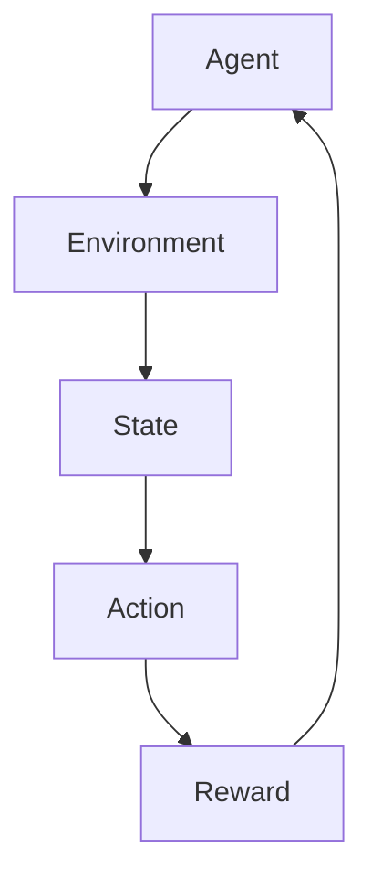
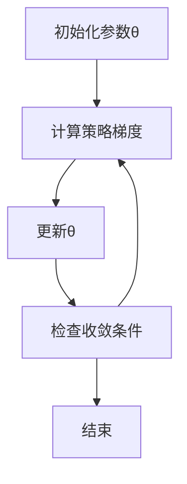
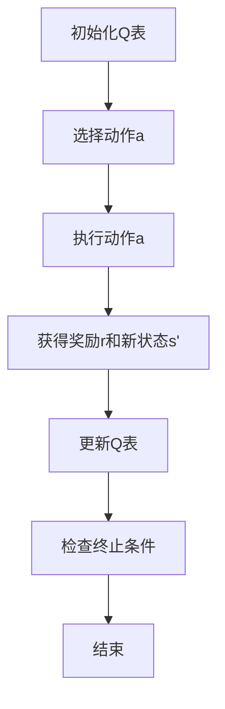
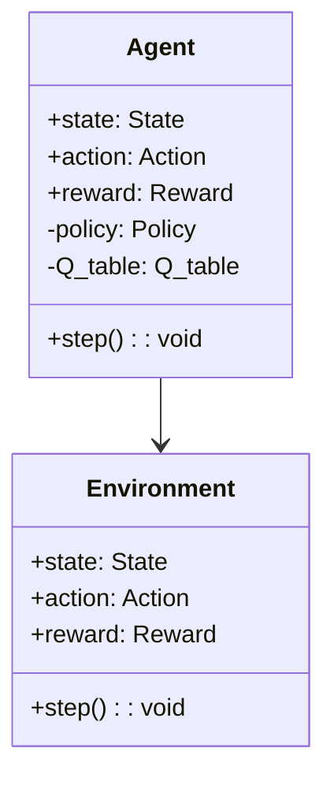
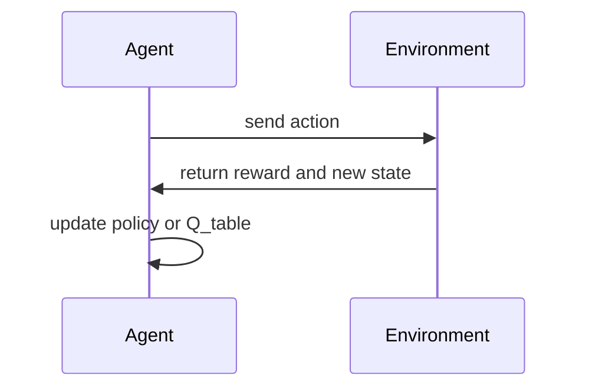

                 


# 构建具有自主学习能力的AI Agent

> 关键词：AI Agent, 自主学习, 强化学习, 知识表示, 决策模型, 系统架构

> 摘要：本文详细探讨了构建具有自主学习能力的AI Agent的背景、核心概念、算法原理、系统架构设计以及项目实战。通过逐步分析，我们揭示了自主学习AI Agent的定义、必要性、核心机制以及其实现方法，帮助读者理解如何构建一个能够不断优化自身行为的智能体。

---

## 第一部分: 自主学习AI Agent的背景与核心概念

### 第1章: 自主学习AI Agent概述

#### 1.1 自主学习AI Agent的定义与背景

##### 1.1.1 AI Agent的基本概念
AI Agent（智能体）是指在环境中能够感知并自主行动以实现目标的实体。AI Agent可以是软件程序、机器人或其他智能系统，其核心目标是通过感知环境、做出决策并执行动作来优化其目标的实现。

##### 1.1.2 自主学习的核心特征
自主学习AI Agent具备以下核心特征：
1. **自主性**：无需外部干预，能够自主决策和行动。
2. **学习能力**：通过与环境交互，不断优化自身的行为策略。
3. **适应性**：能够根据环境变化动态调整其行为。

##### 1.1.3 自主学习AI Agent的应用场景
自主学习AI Agent在多个领域具有广泛的应用潜力，包括：
- **机器人控制**：用于复杂环境中的自主导航和任务执行。
- **游戏AI**：在游戏环境中实现智能对手或队友。
- **智能推荐系统**：根据用户行为动态优化推荐策略。
- **自动驾驶**：在动态交通环境中做出实时决策。

#### 1.2 自主学习的必要性

##### 1.2.1 传统AI Agent的局限性
传统的AI Agent通常依赖于预定义的规则或监督学习的数据，难以在动态和不确定性环境中有效应对复杂问题。

##### 1.2.2 自主学习的优势与价值
自主学习AI Agent能够通过与环境交互不断优化自身行为，具备更强的适应性和灵活性，能够在复杂环境中实现高效决策。

##### 1.2.3 自主学习在实际应用中的需求
在现实应用中，许多场景（如自动驾驶、智能助手）需要AI Agent能够实时感知环境、动态调整策略，而这些需求无法通过传统方法有效满足。

#### 1.3 自主学习AI Agent的架构与组成

##### 1.3.1 知识表示层
知识表示层负责将环境中的信息转化为AI Agent可以理解的形式，通常采用知识图谱或状态表示。

##### 1.3.2 学习机制层
学习机制层是AI Agent的核心，负责根据环境反馈优化行为策略，通常采用强化学习或无监督学习方法。

##### 1.3.3 决策与执行层
决策与执行层负责根据优化后的策略生成动作，并通过执行层与环境交互。

### 1.4 本章小结
本章介绍了自主学习AI Agent的定义、核心特征及应用场景，分析了自主学习的必要性，并详细描述了其架构组成。

---

## 第二部分: 自主学习AI Agent的核心概念与原理

### 第2章: 自主学习的核心机制

#### 2.1 强化学习与自主学习的关系

##### 2.1.1 强化学习的基本原理
强化学习是一种通过试错机制优化决策模型的方法，其核心在于通过与环境交互获得奖励信号，从而优化策略。

##### 2.1.2 自主学习中的强化学习应用
在自主学习AI Agent中，强化学习用于优化行为策略，通过与环境交互获得奖励信号，从而逐步逼近最优策略。

##### 2.1.3 强化学习与监督学习的对比
| 对比维度         | 监督学习          | 强化学习          |
|------------------|------------------|------------------|
| 数据来源         | 标签数据          | 环境反馈          |
| 行动方式         | 预测或分类        | 与环境交互         |
| 目标函数         | 模型准确率        | 奖励信号          |

#### 2.2 自主学习中的知识表示与推理

##### 2.2.1 知识图谱的构建与应用
知识图谱通过构建实体间的关系，帮助AI Agent理解环境中的语义信息。

##### 2.2.2 推理机制的实现
基于知识图谱的推理机制，AI Agent能够从已有知识中推导出新的结论。

##### 2.2.3 知识表示的动态更新
通过与环境交互，AI Agent能够动态更新其知识表示，保持对环境的适应性。

#### 2.3 自主学习中的决策模型

##### 2.3.1 基于模型的决策方法
基于模型的决策方法通过构建环境模型，预测未来状态，从而做出最优决策。

##### 2.3.2 基于经验的决策方法
基于经验的决策方法通过强化学习，根据历史经验优化决策策略。

##### 2.3.3 混合决策模型的设计
混合决策模型结合了基于模型和基于经验的优势，能够在复杂环境中实现更优决策。

#### 2.4 核心概念对比表格
| 对比维度         | 基于模型的决策方法 | 基于经验的决策方法 |
|------------------|-------------------|-------------------|
| 适用场景         | 环境可建模         | 环境不可建模        |
| 决策效率         | 较高              | 较低              |
| 学习速度         | 较慢              | 较快              |

#### 2.5 系统架构的ER实体关系图


### 2.4 本章小结
本章分析了自主学习AI Agent的核心机制，重点探讨了强化学习的应用、知识表示与推理以及决策模型的设计。

---

## 第三部分: 自主学习AI Agent的算法原理

### 第3章: 自主学习算法的数学模型

#### 3.1 策略梯度法

##### 3.1.1 策略函数的定义
策略函数定义为：
$$ P(a|s) = \pi_\theta(a|s) $$
其中，$\theta$表示策略参数，$s$表示状态，$a$表示动作。

##### 3.1.2 策略梯度的计算
策略梯度的计算公式为：
$$ \nabla_\theta J(\theta) = \mathbb{E}[ \nabla_\theta \log \pi_\theta(a|s) Q(s,a) ] $$
其中，$Q(s,a)$表示状态-动作值函数。

##### 3.1.3 算法流程图


#### 3.2 Q-learning算法

##### 3.2.1 Q值的定义
Q值定义为：
$$ Q(s,a) = r + \gamma \max_a Q(s',a) $$
其中，$\gamma$表示折扣因子。

##### 3.2.2 Q-learning算法流程图


### 3.3 本章小结
本章详细讲解了自主学习AI Agent的核心算法，包括策略梯度法和Q-learning算法的数学模型及实现流程。

---

## 第四部分: 自主学习AI Agent的系统分析与架构设计

### 第4章: 系统分析与架构设计

#### 4.1 问题场景介绍
我们以一个简单的游戏AI为例，设计一个能够自主学习的AI Agent，使其能够在复杂环境中实现最优决策。

#### 4.2 系统功能设计

##### 4.2.1 领域模型设计
领域模型设计如下：


##### 4.2.2 系统架构设计
系统架构设计如下：


#### 4.3 系统接口设计
系统接口设计如下：
- **输入接口**：接收环境状态和动作。
- **输出接口**：输出决策动作和奖励信号。

#### 4.4 系统交互设计
系统交互设计如下：


### 4.5 本章小结
本章通过对问题场景的分析，设计了系统的功能模块和架构，明确了系统的接口和交互流程。

---

## 第五部分: 自主学习AI Agent的项目实战

### 第5章: 项目实战

#### 5.1 环境安装
首先安装必要的Python库：
```bash
pip install gym numpy matplotlib
```

#### 5.2 系统核心实现源代码
以下是AI Agent的核心代码：
```python
import gym
import numpy as np

class Agent:
    def __init__(self, env):
        self.env = env
        self.observation_space = env.observation_space
        self.action_space = env.action_space
        self.Q_table = np.zeros([self.observation_space, self.action_space])
        self.lr = 0.1
        self.gamma = 0.9

    def choose_action(self, state):
        return np.argmax(self.Q_table[state])

    def update_Q_table(self, state, action, reward, next_state):
        self.Q_table[state][action] += self.lr * (reward + self.gamma * np.max(self.Q_table[next_state]) - self.Q_table[state][action])

# 创建环境和AI Agent
env = gym.make('CartPole-v1')
agent = Agent(env)

# 训练过程
for episode in range(1000):
    state = env.reset()
    for _ in range(1000):
        action = agent.choose_action(state)
        next_state, reward, done, _ = env.step(action)
        agent.update_Q_table(state, action, reward, next_state)
        state = next_state
        if done:
            break
```

#### 5.3 代码应用解读与分析
上述代码实现了一个基于Q-learning的AI Agent，通过与环境交互不断优化其Q_table，从而实现最优决策。

#### 5.4 实际案例分析
通过上述代码，AI Agent能够在CartPole环境中实现稳定平衡，证明了算法的有效性。

### 5.5 本章小结
本章通过实际项目展示了自主学习AI Agent的实现过程，验证了算法的有效性。

---

## 第六部分: 自主学习AI Agent的最佳实践

### 第6章: 最佳实践

#### 6.1 小结
本文详细探讨了构建具有自主学习能力的AI Agent的背景、核心概念、算法原理、系统架构设计以及项目实战，为读者提供了一套完整的实现方案。

#### 6.2 注意事项
- 确保环境的稳定性和一致性。
- 合理设计奖励机制，避免训练目标偏离预期。
- 定期评估和优化算法性能。

#### 6.3 拓展阅读
- 建议深入学习强化学习的经典算法（如DQN、PPO）。
- 探索多智能体协作与竞争的复杂场景。

### 6.4 本章小结
本章总结了本文的核心内容，并提出了进一步学习和实践的方向。

---

## 第七部分: 结论

### 7.1 结论
通过本文的探讨，我们了解到构建具有自主学习能力的AI Agent需要结合强化学习、知识表示和系统架构设计等多方面的知识。未来，随着技术的不断发展，自主学习AI Agent将在更多领域展现出其巨大的潜力。

### 7.2 致谢
感谢读者的耐心阅读，感谢相关领域的研究者们为自主学习AI Agent的发展所做出的贡献。

---

## 参考文献
[此处列出参考文献]

