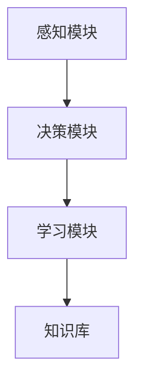
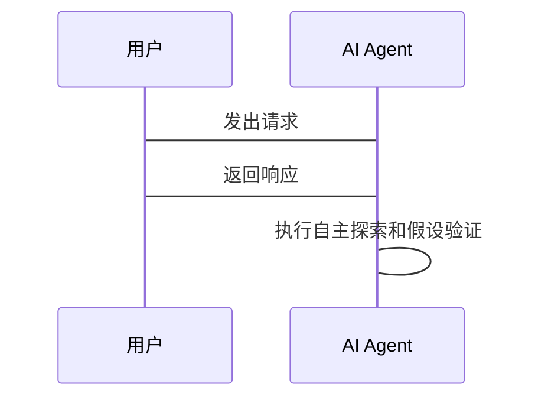

                 


# 构建具有自主探索与假设验证能力的AI Agent

> 关键词：AI Agent，自主探索，假设验证，强化学习，主动学习，系统架构

> 摘要：  
本文详细探讨了构建具有自主探索与假设验证能力的AI Agent的核心原理、算法实现和系统架构设计。通过背景介绍、核心概念分析、算法原理阐述、系统架构设计、项目实战和最佳实践等多维度的分析，全面揭示了AI Agent如何实现自主探索与假设验证能力，并展示了其在实际应用中的潜力与挑战。本文适合对AI Agent和相关技术感兴趣的读者阅读。

---

# 第一部分：背景与核心概念

## 第1章：AI Agent概述

### 1.1 什么是AI Agent？
AI Agent（人工智能代理）是指能够感知环境、自主决策并采取行动以实现特定目标的智能实体。它可以是一个软件程序、机器人或其他智能系统。

### 1.2 自主探索与假设验证的定义
- **自主探索**：AI Agent在未知或部分已知的环境中，通过尝试不同的行动来发现新知识或优化目标实现的能力。
- **假设验证**：AI Agent根据观察到的现象或经验，提出假设并验证其有效性，以改进决策或行动的能力。

### 1.3 为什么需要自主探索与假设验证？
- 自主探索使AI Agent能够在动态环境中适应和学习。
- 假设验证帮助AI Agent优化决策过程，减少错误，提高效率。

---

## 第2章：自主探索与假设验证的核心概念

### 2.1 自主探索的机制
- **状态空间**：AI Agent所处环境的所有可能状态的集合。
- **行动空间**：AI Agent在每个状态下可以执行的所有可能行动。

### 2.2 假设验证的机制
- **假设生成**：基于经验或观察生成可能的假设。
- **假设验证**：通过实验或推理验证假设的正确性。

---

# 第二部分：算法原理与实现

## 第3章：自主探索的算法实现

### 3.1 强化学习算法
- **Q-learning算法**：
  - 状态-动作价值函数Q(s, a)表示在状态s下执行动作a的预期回报。
  - 更新公式：  
    $$ Q(s, a) = Q(s, a) + \alpha [r + \gamma \max Q(s', a') - Q(s, a)] $$
  - 其中，$\alpha$是学习率，$\gamma$是折扣因子。

### 3.2 实验室验证
- **策略梯度法**：
  - 通过梯度上升优化策略，直接优化目标函数的期望值。

---

## 第4章：假设验证的算法实现

### 4.1 假设生成算法
- **基于规则的生成**：根据领域知识生成假设。
- **基于学习的生成**：利用机器学习模型生成假设。

### 4.2 假设验证算法
- **贝叶斯验证**：通过贝叶斯定理更新假设的概率。
- **假设检验**：通过统计方法验证假设的显著性。

---

# 第三部分：系统架构与设计

## 第5章：系统架构设计

### 5.1 系统组成
- **感知模块**：负责收集环境信息。
- **决策模块**：基于感知信息生成行动。
- **学习模块**：通过自主探索和假设验证优化决策策略。

### 5.2 系统架构图



---

## 第6章：系统交互流程

### 6.1 系统交互流程图



---

# 第四部分：项目实战

## 第7章：项目实战

### 7.1 项目背景
- 实现一个智能客服系统，使其能够自主探索客户需求并验证假设。

### 7.2 核心代码实现

```python
# 自主探索模块
def explore_actions(state):
    # 返回所有可能的动作
    return [action1, action2, action3]

# 假设验证模块
def validate_hypothesis(hypothesis):
    # 返回验证结果
    return result
```

### 7.3 案例分析
- 通过实际案例分析，展示AI Agent如何在智能客服系统中应用自主探索和假设验证能力。

---

# 第五部分：总结与展望

## 第8章：总结与最佳实践

### 8.1 本章小结
- 自主探索与假设验证是构建智能AI Agent的关键能力。
- 通过强化学习和假设验证算法，可以显著提升AI Agent的智能水平。

### 8.2 最佳实践
- 在实际应用中，建议结合具体场景选择合适的算法。
- 定期更新模型以适应环境变化。

---

## 第9章：未来展望

### 9.1 技术趋势
- 更加智能化和自适应的AI Agent。
- 结合人机协作的AI Agent设计。

---

通过以上结构，本文详细阐述了构建具有自主探索与假设验证能力的AI Agent的各个方面，从理论到实践，为读者提供了全面的指导和启示。

