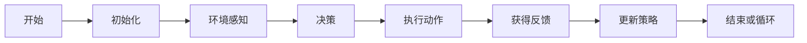
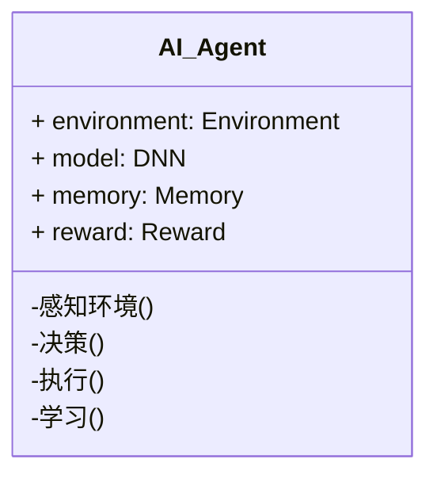
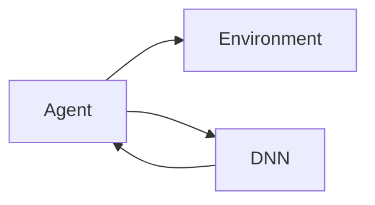
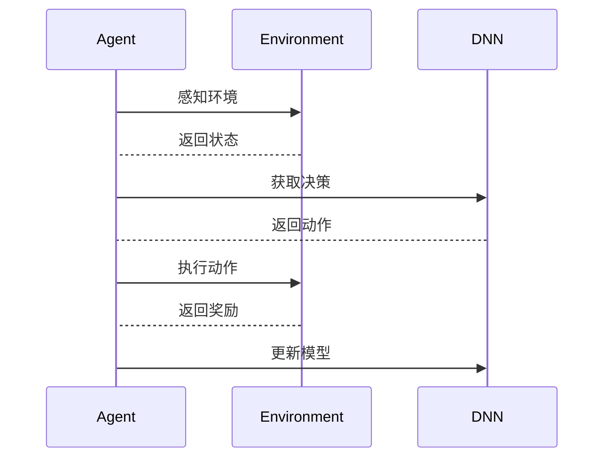

                 


# 构建具有自主探索能力的AI Agent

> 关键词：AI Agent，自主探索，算法原理，系统架构，项目实战，强化学习

> 摘要：本文详细探讨了如何构建一个具备自主探索能力的AI Agent，从背景介绍到系统架构设计，再到项目实战和最佳实践，全面解析其实现原理和应用方法。

---

# 第1章: 背景介绍

## 1.1 问题背景
### 1.1.1 当前AI Agent的发展现状
AI Agent作为一种智能体，近年来在各个领域得到了广泛应用，但其自主探索能力的实现仍面临诸多挑战。

### 1.1.2 自主探索能力的重要性
自主探索能力是AI Agent的核心能力之一，能够使AI在未知环境中自主学习和适应。

### 1.1.3 问题背景与挑战
AI Agent在复杂环境中的自主探索需要解决感知、决策和学习等多方面的挑战。

## 1.2 问题描述
### 1.2.1 AI Agent的核心目标
通过自主探索能力，实现对未知环境的有效感知和高效决策。

### 1.2.2 自主探索能力的定义
AI Agent能够通过与环境的交互，主动探索未知领域，提升自身的知识储备和决策能力。

### 1.2.3 问题的边界与外延
明确AI Agent的自主探索能力的边界，如环境的复杂度、任务的范围等。

## 1.3 问题解决
### 1.3.1 自主探索能力的实现路径
通过强化学习、深度学习等技术实现自主探索。

### 1.3.2 相关技术的整合与应用
整合感知、决策、学习等多种技术，构建具备自主探索能力的AI Agent。

### 1.3.3 问题解决的可行性分析
分析技术可行性、资源需求和潜在风险，确保解决方案的可行性。

## 1.4 核心概念与联系
### 1.4.1 AI Agent的核心要素
感知、决策、学习、执行等核心要素。

### 1.4.2 自主探索能力的属性特征对比表
| 属性 | 特征 |
|------|------|
| 感知能力 | 高度敏感且准确 |
| 学习能力 | 主动且高效 |
| 决策能力 | 灵活且优化 |

### 1.4.3 ER实体关系图
```mermaid
erd
    实体: AI Agent
    实体: 环境
    实体: 任务
    关系: AI Agent与环境交互
    关系: AI Agent执行任务
```

---

# 第2章: 核心概念与联系

## 2.1 AI Agent的核心概念
### 2.1.1 AI Agent的定义与特征
AI Agent是一个能够感知环境、自主决策并执行任务的智能体。

### 2.1.2 自主探索能力的数学模型
$$ V(s) = \max_{a} \left( r(s, a) + \gamma V(next(s, a)) \right) $$

### 2.1.3 核心概念的ER实体关系图
```mermaid
erd
    实体: 状态
    实体: 动作
    实体: 奖励
    关系: 状态通过动作获得奖励
```

## 2.2 核心概念的联系
### 2.2.1 算法原理与系统架构的关系
算法原理是系统架构的基础，系统架构则是算法实现的载体。

### 2.2.2 功能设计与实际应用的结合
通过功能设计，将算法原理应用于实际场景中，实现具体任务。

### 2.2.3 系统架构与项目实战的关联
系统架构指导项目实战，项目实战验证系统架构的合理性。

---

# 第3章: 算法原理讲解

## 3.1 算法原理
### 3.1.1 强化学习算法的原理
通过奖励机制，AI Agent学习最优策略。

### 3.1.2 深度学习算法的原理
利用神经网络进行特征提取和决策。

### 3.1.3 自主探索算法的实现流程


## 3.2 算法实现
### 3.2.1 强化学习算法的Python代码实现
```python
class AI_Agent:
    def __init__(self):
        self.model = self._build_model()

    def _build_model(self):
        # 网络结构定义
        pass

    def perceive(self, environment):
        # 感知环境
        pass

    def decide(self, state):
        # 决策
        pass

    def learn(self, reward):
        # 学习
        pass
```

### 3.2.2 深度学习算法的Python代码实现
```python
import tensorflow as tf

class DNN:
    def __init__(self):
        self.net = self._build_net()

    def _build_net(self):
        # 神经网络结构定义
        pass

    def call(self, x):
        # 前向传播
        pass
```

### 3.2.3 自主探索算法的数学模型与公式
$$ Q(s, a) = Q(s, a) + \alpha (r + \gamma \max Q(s', a') - Q(s, a)) $$

---

# 第4章: 系统分析与架构设计

## 4.1 系统分析
### 4.1.1 问题场景介绍
AI Agent在未知环境中的自主探索任务。

### 4.1.2 项目介绍
构建一个具备自主探索能力的AI Agent系统。

### 4.1.3 系统功能设计


## 4.2 系统架构设计
### 4.2.1 系统架构图


### 4.2.2 系统接口设计
API接口定义，如`perceive()`, `decide()`, `execute()`, `learn()`。

### 4.2.3 系统交互


---

# 第5章: 项目实战

## 5.1 环境安装
### 5.1.1 安装Python
```bash
python --version
pip install --upgrade pip
```

### 5.1.2 安装深度学习框架
```bash
pip install tensorflow numpy
```

## 5.2 系统核心实现
### 5.2.1 实现AI Agent
```python
class AI_Agent:
    def __init__(self):
        self.model = DNN()

    def perceive(self, environment):
        # 返回状态
        return self.model.call(environment.state)

    def decide(self, state):
        # 返回动作
        return self.model.predict(state)

    def execute(self, action):
        # 执行动作
        pass

    def learn(self, reward):
        # 更新模型
        pass
```

### 5.2.2 实现深度学习模型
```python
class DNN:
    def __init__(self):
        self.net = self._build_net()

    def _build_net(self):
        # 网络结构
        pass

    def call(self, x):
        # 前向传播
        return self.net(x)
```

## 5.3 代码解读与分析
### 5.3.1 代码实现的细节
详细解读AI Agent和DNN的实现代码。

### 5.3.2 功能实现的逻辑
分析代码的逻辑流程，确保功能正常实现。

## 5.4 实际案例分析
### 5.4.1 案例背景
AI Agent在一个迷宫中的自主探索任务。

### 5.4.2 任务实现
AI Agent通过强化学习，找到最优路径。

### 5.4.3 详细讲解
从感知到决策，再到执行和学习的详细过程。

## 5.5 项目小结
### 5.5.1 项目成果
成功实现具备自主探索能力的AI Agent。

### 5.5.2 经验总结
算法选择、系统架构设计等方面的经验和教训。

---

# 第6章: 最佳实践

## 6.1 小结
### 6.1.1 核心知识点总结
总结AI Agent构建过程中的关键点。

### 6.1.2 经验与教训
分享在项目实施过程中的经验和教训。

## 6.2 注意事项
### 6.2.1 算法选择
根据具体任务选择合适的算法。

### 6.2.2 系统架构设计
确保系统架构的合理性和可扩展性。

### 6.2.3 代码实现
注重代码的可读性和可维护性。

## 6.3 拓展阅读
### 6.3.1 推荐书籍
《强化学习》、《深度学习》等。

### 6.3.2 推荐论文
推荐相关领域的前沿论文，供读者深入研究。

---

# 结语
构建具有自主探索能力的AI Agent是一个复杂而有趣的过程，需要综合运用多种技术。通过本文的详细讲解，读者可以系统地掌握相关知识，并在实际项目中灵活运用。

---

