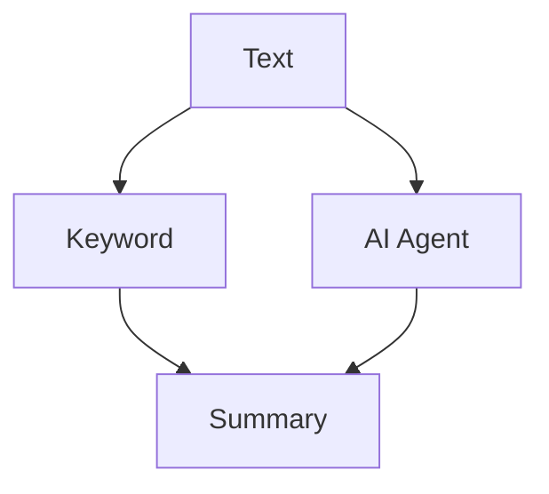
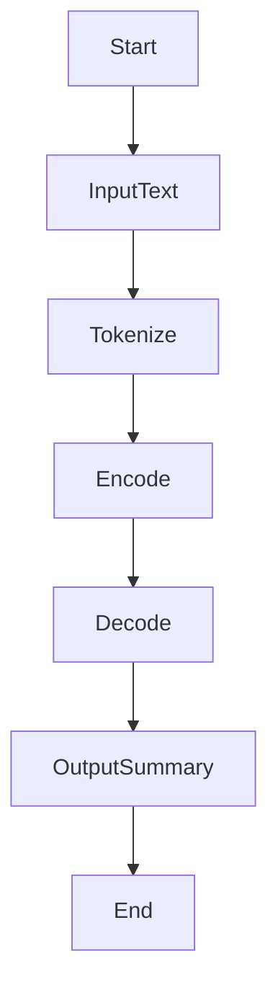
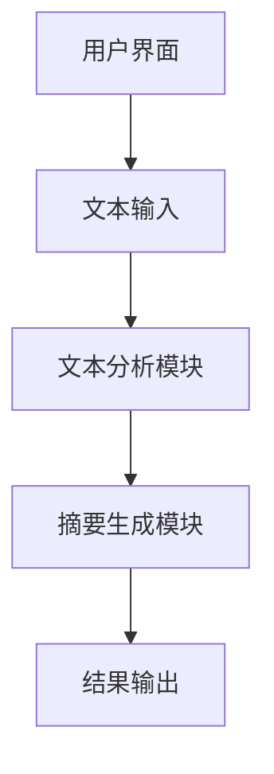
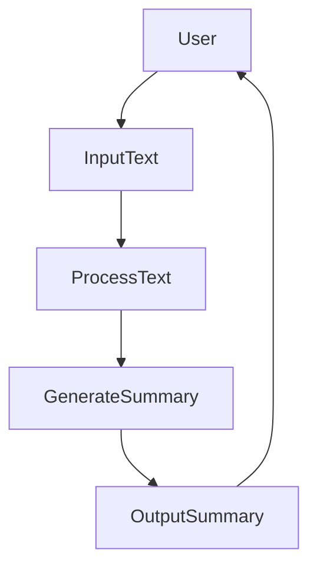

                 


# 构建具有自动摘要能力的AI Agent

> 关键词：AI Agent, 自动摘要, 自然语言处理, 深度学习, 摘要算法

> 摘要：本文深入探讨了构建具有自动摘要能力的AI Agent的技术细节，从核心概念、算法原理到系统架构设计，再到项目实战，全面解析如何实现高效、准确的自动摘要功能。通过实际案例分析和代码实现，为读者提供从理论到实践的完整指南。

---

# 第一部分: AI Agent与自动摘要能力概述

## 第1章: AI Agent的基本概念

### 1.1 AI Agent的定义与特点

#### 1.1.1 什么是AI Agent
AI Agent（人工智能代理）是一种能够感知环境、执行任务并做出决策的智能实体。它通过传感器获取信息，利用推理能力解决问题，并通过执行器与环境交互。

#### 1.1.2 AI Agent的核心特点
- **自主性**：能够在没有外部干预的情况下运行。
- **反应性**：能够实时感知环境并做出响应。
- **学习能力**：通过数据和经验提升性能。
- **交互能力**：能够与用户或系统进行自然语言交互。

#### 1.1.3 AI Agent与传统程序的区别
AI Agent具备以下特点，使其与传统程序不同：
- 能够处理非结构化数据（如自然语言文本）。
- 具备学习和推理能力。
- 能够适应动态变化的环境。

### 1.2 自动摘要能力的背景与意义

#### 1.2.1 自动摘要的定义
自动摘要是指通过算法从大量文本中提取关键信息，生成简洁、准确的摘要。自动摘要的目标是保留原文的核心内容，同时去除冗余信息。

#### 1.2.2 自动摘要的应用场景
- **信息检索**：帮助用户快速获取所需信息。
- **内容管理**：用于整理和归档大量文本数据。
- **自然语言交互**：在AI Agent与用户交互中，自动摘要能够快速理解用户需求。

#### 1.2.3 自动摘要的重要性
在信息爆炸的时代，自动摘要技术能够显著提升信息处理效率，帮助用户快速获取关键信息，降低信息过载的问题。

---

## 第2章: AI Agent自动摘要能力的实现背景

### 2.1 自动摘要技术的发展历程

#### 2.1.1 自动摘要的起源
自动摘要技术起源于20世纪50年代，早期主要依赖于基于规则的文本处理方法。

#### 2.1.2 自动摘要技术的演进
- **基于规则的方法**：通过预定义的规则提取文本中的关键信息。
- **统计学习方法**：利用概率模型分析文本特征。
- **深度学习方法**：基于神经网络的摘要生成技术成为主流。

#### 2.1.3 当前自动摘要技术的现状
当前，深度学习技术在自动摘要领域占据主导地位，主流算法包括基于Transformer的模型（如Bert、GPT）。

### 2.2 自动摘要技术的核心问题

#### 2.2.1 文本理解与信息提取
AI Agent需要理解文本的语义结构，提取关键信息。

#### 2.2.2 摘要生成的算法选择
选择合适的摘要算法，如基于抽取或生成的方法。

#### 2.2.3 摘要效果的评估标准
评估摘要质量的标准包括准确率、简洁性和可读性。

---

## 第3章: 自动摘要能力的核心概念与联系

### 3.1 自动摘要的核心原理

#### 3.1.1 文本摘要的基本原理
文本摘要通过分析文本内容，提取核心信息并生成摘要。

#### 3.1.2 AI Agent在摘要中的角色
AI Agent作为执行者，负责接收输入、处理文本并生成摘要。

#### 3.1.3 自动摘要的实现流程
1. **文本输入**：接收需要摘要的文本。
2. **文本分析**：通过NLP技术提取关键信息。
3. **摘要生成**：基于分析结果生成摘要。
4. **结果输出**：将摘要返回给用户或系统。

### 3.2 核心概念对比表格

| 比较维度 | 基于抽取的摘要 | 基于生成的摘要 |
|----------|-----------------|-----------------|
| **定义** | 提取原文中的句子或短语 | 重新生成新的文本 |
| **优点** | 高准确性，保持原文结构 | 更加灵活，生成多样化的摘要 |
| **缺点** | 可能缺乏连贯性 | 生成内容可能不够准确 |

### 3.3 ER实体关系图



---

## 第4章: 自动摘要算法原理与实现

### 4.1 常见的自动摘要算法

#### 4.1.1 基于抽取的摘要算法

- **定义**：从原文中直接抽取关键句子或短语。
- **实现步骤**：
  1. 分句：将文本分割成句子。
  2. 提取关键词：计算每个句子的关键词权重。
  3. 抽取句子：根据权重选择最重要的句子。

#### 4.1.2 基于生成的摘要算法

- **定义**：通过生成模型重新生成摘要文本。
- **实现步骤**：
  1. 文本编码：将文本编码为向量表示。
  2. 解码生成：利用解码器生成摘要。

#### 4.1.3 基于深度学习的摘要算法

- **定义**：使用深度学习模型（如Transformer）生成摘要。
- **实现步骤**：
  1. 输入文本：将文本输入编码器。
  2. 编码表示：生成文本的向量表示。
  3. 解码生成：利用解码器生成摘要。

### 4.2 算法流程图



### 4.3 算法代码实现

#### 4.3.1 基于抽取的摘要算法

```python
def text_rank_summary(text, num_sentences=3):
    from text_rank import TextRank
    tr = TextRank()
    tr.feed_documents([text])
    summary = tr.get_best_summaries(num_sentences)
    return summary
```

#### 4.3.2 基于生成的摘要算法

```python
def generate_summary(text):
    import torch
    from model import SummaryGenerator
    generator = SummaryGenerator()
    summary = generator.generate_summary(text)
    return summary
```

### 4.4 数学公式与模型

#### 4.4.1 基于TF-IDF的摘要算法

- **公式**：
  $$ TF-IDF = \frac{TF \times IDF}{\sum TF \times IDF} $$
  其中，TF是词频，IDF是逆向文件频率。

- **示例**：
  对于文本“AI Agent是一种人工智能代理，能够感知环境并执行任务”，计算TF-IDF值，提取关键词“AI Agent”和“任务”。

---

## 第5章: 系统分析与架构设计

### 5.1 系统架构设计

#### 5.1.1 系统功能模块划分

- **文本输入模块**：接收用户输入的文本。
- **文本分析模块**：对文本进行预处理和特征提取。
- **摘要生成模块**：选择合适的算法生成摘要。
- **结果输出模块**：将摘要返回给用户或系统。

#### 5.1.2 系统架构图



### 5.2 系统交互流程

#### 5.2.1 交互流程图



---

## 第6章: 项目实战

### 6.1 项目环境配置

```bash
pip install numpy
pip install scikit-learn
pip install transformers
```

### 6.2 核心代码实现

#### 6.2.1 文本预处理

```python
def preprocess_text(text):
    import nltk
    from sklearn.feature_extraction.text import TfidfVectorizer
    vectorizer = TfidfVectorizer()
    tfidf = vectorizer.fit_transform([text])
    return tfidf
```

#### 6.2.2 摘要生成

```python
def generate_summary(text):
    from transformers import AutoTokenizer, AutoModelForSummarization
    tokenizer = AutoTokenizer.from_pretrained("facebook/bart-large-cnn")
    model = AutoModelForSummarization.from_pretrained("facebook/bart-large-cnn")
    inputs = tokenizer(text, max_length=1000, truncation=True, padding=True)
    summary = model.generate(inputs.input_ids)
    return tokenizer.decode(summary[0], skip_special_tokens=True)
```

### 6.3 案例分析与代码解读

#### 6.3.1 案例分析
假设输入文本为一篇关于“AI Agent”的技术文章，生成长度为3的摘要。

#### 6.3.2 代码解读
- 使用预训练的Bart模型进行摘要生成。
- 输入文本经过分词、编码后，通过模型生成摘要。

### 6.4 项目小结

通过本章的实战，读者可以了解如何将理论应用于实践，掌握自动摘要技术的实现方法。

---

## 第7章: 最佳实践与小结

### 7.1 最佳实践

- **选择合适的算法**：根据具体需求选择基于抽取或生成的摘要算法。
- **优化模型性能**：通过数据增强和超参数调优提升摘要质量。
- **处理多语言文本**：支持多种语言的摘要生成。

### 7.2 小结

本文从理论到实践，详细介绍了构建具有自动摘要能力的AI Agent的全过程。通过学习本文，读者可以掌握自动摘要的核心原理和实现方法。

### 7.3 注意事项

- **数据质量问题**：确保输入文本的质量，避免噪声干扰。
- **模型训练成本**：深度学习模型需要大量计算资源。
- **算法选择**：根据具体需求选择合适的摘要算法。

### 7.4 拓展阅读

- 《Neural Machine Translation》
- 《Deep Learning for Natural Language Processing》

---

通过本文的系统讲解和实践案例，读者可以全面掌握构建具有自动摘要能力的AI Agent的技术细节。希望本文对读者在实际应用中有所帮助。

