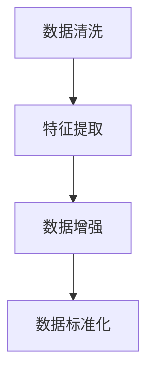
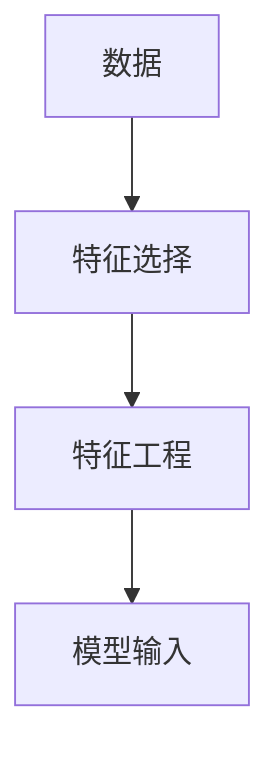
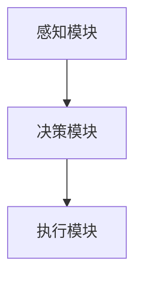
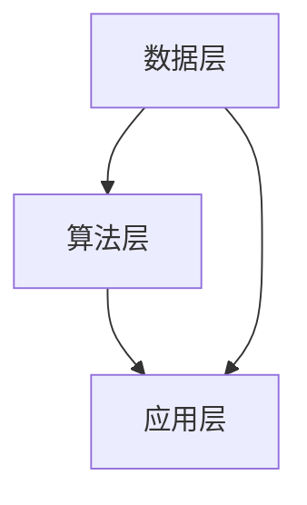

                 


# 构建具有自动机器学习能力的AI Agent

## 关键词：自动机器学习，AI Agent，系统架构，算法原理，项目实战

## 摘要：  
本文将详细探讨如何构建一个具有自动机器学习能力的AI Agent。通过系统地分析自动机器学习的核心原理、AI Agent的设计与实现、系统架构以及项目实战，本文将为读者提供一个全面的构建指南。我们还将结合实际案例，深入讲解算法原理、系统设计和优化技巧，帮助读者掌握构建此类AI Agent的关键技术。

---

# 第1章: 自动机器学习与AI Agent概述

## 1.1 自动机器学习的基本概念

### 1.1.1 机器学习的定义与分类  
机器学习是一种人工智能技术，通过数据训练模型，使其能够从数据中学习并做出预测或决策。机器学习主要分为监督学习、无监督学习、半监督学习和强化学习。

### 1.1.2 自动机器学习的核心概念  
自动机器学习（AutoML）是一种技术，旨在自动化机器学习的各个阶段，包括数据预处理、特征工程、模型选择和超参数调优。它使得非专家也能轻松构建高性能的机器学习模型。

### 1.1.3 自动机器学习与传统机器学习的区别  
与传统机器学习相比，自动机器学习通过自动化工具和算法，显著降低了机器学习的门槛，提高了模型构建的效率和效果。

---

## 1.2 AI Agent的定义与特点

### 1.2.1 AI Agent的基本定义  
AI Agent是一种智能体，能够感知环境、自主决策并执行任务。它通过与环境交互，实现目标。

### 1.2.2 AI Agent的核心特点  
AI Agent具有智能性、自主性、反应性和社会性等特点。它能够根据环境信息自主决策，并与其他Agent或人类进行交互。

### 1.2.3 AI Agent与传统AI的区别  
AI Agent更注重与环境的交互和自主决策能力，而传统AI更关注特定任务的解决。

---

## 1.3 自动机器学习在AI Agent中的作用

### 1.3.1 自动机器学习的背景与意义  
随着数据量的爆炸式增长和计算能力的提升，自动机器学习成为构建高效AI Agent的关键技术。

### 1.3.2 自动机器学习在AI Agent中的应用  
通过自动机器学习，AI Agent能够快速适应环境变化，优化决策策略，并提高任务执行效率。

### 1.3.3 自动机器学习与AI Agent的结合  
自动机器学习为AI Agent提供了强大的数据驱动决策能力，使其能够通过数据学习和优化行为。

---

## 1.4 本章小结  
本章介绍了自动机器学习和AI Agent的基本概念，并探讨了它们在AI Agent中的结合与作用。

---

# 第2章: 自动机器学习的核心原理

## 2.1 自动机器学习的流程与步骤

### 2.1.1 数据预处理  
数据预处理是机器学习的关键步骤，包括数据清洗、特征提取和数据增强。



### 2.1.2 特征工程  
特征工程是通过选择和构建有用的特征，提高模型性能的过程。



### 2.1.3 模型选择与训练  
模型选择包括选择合适的算法，并通过训练数据优化模型参数。

### 2.1.4 模型评估与优化  
通过交叉验证和超参数调优，优化模型性能。

---

## 2.2 自动机器学习的关键技术

### 2.2.1 自动特征选择  
通过自动化方法选择最优特征，提高模型性能。

### 2.2.2 自动模型选择  
基于性能指标，自动选择最优模型。

### 2.2.3 自动超参数优化  
使用优化算法，如遗传算法和随机搜索，自动调整模型超参数。

### 2.2.4 自动部署与监控  
将模型部署到生产环境，并实时监控模型性能。

---

## 2.3 自动机器学习的实现框架

### 2.3.1 基于开源库的实现  
使用AutoML框架，如AutoKeras和Tune。

### 2.3.2 基于自定义框架的实现  
从头构建自动机器学习框架。

### 2.3.3 常见自动机器学习框架对比  
对比AutoKeras、Tune和Hyperopt等框架的优缺点。

---

## 2.4 本章小结  
本章详细讲解了自动机器学习的核心原理和技术，包括数据预处理、特征工程、模型选择和超参数优化。

---

# 第3章: AI Agent的设计与实现

## 3.1 AI Agent的结构与功能

### 3.1.1 AI Agent的基本结构  
AI Agent通常由感知模块、决策模块和执行模块组成。



### 3.1.2 AI Agent的功能模块  
功能模块包括数据采集、特征提取、模型预测和结果输出。

### 3.1.3 AI Agent的交互方式  
AI Agent可以通过API、命令行或图形界面与用户交互。

---

## 3.2 自动机器学习在AI Agent中的应用

### 3.2.1 数据驱动的决策制定  
通过机器学习模型，AI Agent能够基于数据做出最优决策。

### 3.2.2 自适应行为优化  
AI Agent通过自动学习优化行为策略，提高任务执行效率。

### 3.2.3 智能任务分解与执行  
AI Agent能够将复杂任务分解为多个子任务，并协同完成。

---

## 3.3 AI Agent的实现流程

### 3.3.1 需求分析与任务分解  
明确需求，将任务分解为可执行的子任务。

### 3.3.2 数据收集与预处理  
收集数据并进行清洗、特征提取和数据增强。

### 3.3.3 模型训练与部署  
选择模型并训练，部署到生产环境。

### 3.3.4 系统集成与测试  
将AI Agent集成到系统中，并进行全面测试。

---

## 3.4 本章小结  
本章详细介绍了AI Agent的设计与实现过程，包括结构、功能和实现流程。

---

# 第4章: 系统架构与设计

## 4.1 系统架构概述

### 4.1.1 分层架构设计  
系统分为数据层、算法层和应用层。

### 4.1.2 模块化设计  
系统分为数据模块、模型模块和交互模块。

### 4.1.3 微服务架构  
通过微服务架构，提高系统的可扩展性和可维护性。

---

## 4.2 系统功能设计

### 4.2.1 数据处理功能  
包括数据采集、清洗和存储。

### 4.2.2 模型训练功能  
包括特征工程、模型选择和超参数优化。

### 4.2.3 交互功能  
包括API接口和用户界面。

---

## 4.3 系统架构设计



---

## 4.4 系统接口设计

### 4.4.1 API接口设计  
定义RESTful API接口，实现数据交互。

### 4.4.2 通信协议设计  
选择HTTP或WebSocket协议进行数据传输。

---

## 4.5 本章小结  
本章详细讲解了系统架构与设计，包括分层架构、模块化设计和接口设计。

---

# 第5章: 项目实战

## 5.1 环境安装

### 5.1.1 安装Python  
安装Python 3.8及以上版本。

### 5.1.2 安装依赖库  
安装numpy、pandas、scikit-learn和auto_keras。

---

## 5.2 系统核心实现

### 5.2.1 数据预处理  
代码示例：

```python
import pandas as pd
from sklearn.preprocessing import StandardScaler

# 数据加载
data = pd.read_csv('data.csv')

# 数据清洗
data.dropna()

# 特征提取
X = data.drop('target', axis=1)
y = data['target']

# 数据标准化
scaler = StandardScaler()
X_scaled = scaler.fit_transform(X)
```

### 5.2.2 模型训练  
代码示例：

```python
from auto_keras import AutoKeras

# 模型训练
model = AutoKeras()
model.fit(X_scaled, y)
```

---

## 5.3 代码应用解读与分析  
解读代码的功能和实现细节。

---

## 5.4 实际案例分析  
通过具体案例，分析自动机器学习在AI Agent中的应用。

---

## 5.5 本章小结  
本章通过项目实战，详细讲解了AI Agent的实现过程，包括环境搭建、数据预处理和模型训练。

---

# 第6章: 优化与扩展

## 6.1 模型优化

### 6.1.1 超参数优化  
使用网格搜索或随机搜索优化模型超参数。

### 6.1.2 模型调优  
通过验证集调整模型结构和参数。

---

## 6.2 系统扩展

### 6.2.1 高可用性设计  
通过负载均衡和容灾备份提高系统的可用性。

### 6.2.2 可扩展性设计  
通过模块化设计和水平扩展提高系统的处理能力。

---

## 6.3 本章小结  
本章探讨了模型优化和系统扩展的方法，为构建高性能AI Agent提供了参考。

---

# 第7章: 总结与展望

## 7.1 全文总结  
总结全文内容，强调自动机器学习在AI Agent中的重要性。

## 7.2 未来展望  
展望自动机器学习和AI Agent的未来发展方向。

---

## 参考文献  
列出本文参考的文献和资料。

---

## 致谢  
感谢读者的阅读和支持。

---

通过以上章节的详细讲解，我们系统地探讨了如何构建具有自动机器学习能力的AI Agent，从理论到实践，从设计到实现，为读者提供了全面的指导。

