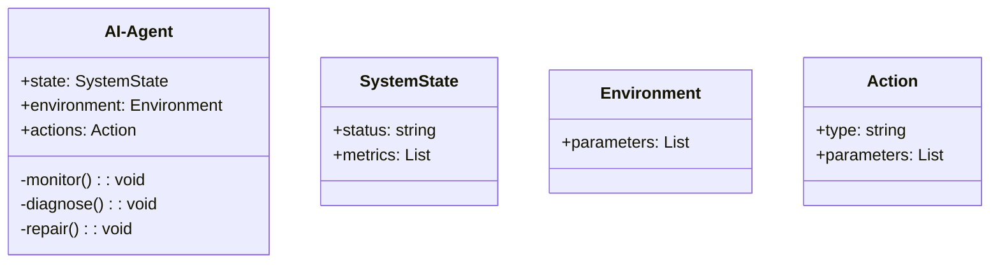
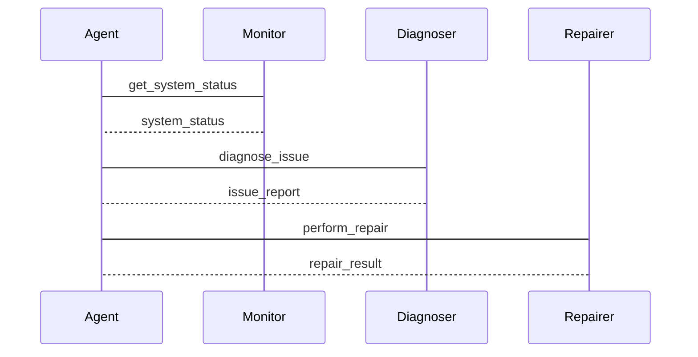

                 


# 构建具有自我修复能力的AI Agent

> 关键词：AI Agent，自我修复，自适应算法，异常检测，系统架构

> 摘要：随着人工智能技术的快速发展，AI Agent在各个领域的应用越来越广泛。然而，AI Agent在运行过程中可能会遇到各种问题，如数据偏差、环境变化或系统故障等，这些问题可能导致AI Agent的性能下降或失效。为了提高AI Agent的鲁棒性和可靠性，构建具有自我修复能力的AI Agent变得至关重要。本文将从背景、核心概念、算法原理、系统架构到项目实战，全面解析如何构建具备自我修复能力的AI Agent。通过本文的讲解，读者将能够理解自我修复机制的核心原理，并掌握实际实现的关键技术。

---

## 第一部分: 自我修复AI Agent的背景与基础

### 第1章: AI Agent概述

#### 1.1 AI Agent的基本概念

##### 1.1.1 什么是AI Agent

AI Agent（人工智能代理）是指能够感知环境、做出决策并执行动作的智能实体。它可以是一个软件程序、一个机器人，或者任何能够与环境交互的智能系统。AI Agent的核心目标是通过感知和行动来优化目标函数，实现特定任务。

##### 1.1.2 AI Agent的核心特征

AI Agent具有以下核心特征：
1. **自主性**：能够在没有外部干预的情况下自主运行。
2. **反应性**：能够实时感知环境并做出相应的反应。
3. **目标导向性**：具有明确的目标，并通过行动来实现这些目标。
4. **学习能力**：能够通过经验改进自身的性能。

##### 1.1.3 AI Agent的应用场景

AI Agent广泛应用于多个领域，包括：
- **自动驾驶**：如自动驾驶汽车中的路径规划和决策系统。
- **智能助手**：如Siri、Alexa等语音助手。
- **机器人控制**：如工业机器人和家庭服务机器人。
- **推荐系统**：如电商平台的个性化推荐系统。

#### 1.2 自我修复能力的定义与重要性

##### 1.2.1 自我修复能力的定义

自我修复能力是指AI Agent在运行过程中能够自动检测问题、诊断问题根源，并采取相应措施修复问题的能力。这种能力使得AI Agent能够在动态变化的环境中保持稳定运行。

##### 1.2.2 自我修复能力的核心要素

自我修复能力的核心要素包括：
1. **自我监控**：持续监测自身的状态和环境的变化。
2. **问题诊断**：识别问题并定位问题的根源。
3. **修复执行**：采取措施修复问题，并恢复正常的运行状态。

##### 1.2.3 自我修复能力在AI Agent中的作用

自我修复能力在AI Agent中具有以下重要作用：
- **提高可靠性**：通过自动修复问题，减少系统故障的可能性。
- **增强适应性**：使AI Agent能够适应动态变化的环境。
- **降低维护成本**：减少人工干预的需求，降低系统的维护成本。

### 第2章: 自我修复AI Agent的背景与挑战

#### 2.1 当前AI Agent的发展现状

##### 2.1.1 AI Agent的技术演进

AI Agent的技术发展经历了多个阶段：
1. **基于规则的AI Agent**：通过预定义的规则进行决策。
2. **基于知识的AI Agent**：利用知识库进行推理和决策。
3. **基于学习的AI Agent**：通过机器学习算法从数据中学习决策策略。
4. **基于强化学习的AI Agent**：通过与环境的交互优化决策策略。

##### 2.1.2 当前主流AI Agent的应用领域

当前，AI Agent已经在多个领域得到广泛应用：
- **自动驾驶**：如特斯拉、Waymo的自动驾驶系统。
- **智能助手**：如苹果的Siri、亚马逊的Alexa。
- **推荐系统**：如Netflix、Amazon的个性化推荐。
- **机器人控制**：如工业机器人和家庭服务机器人。

##### 2.1.3 自我修复能力在AI Agent中的需求

随着AI Agent的应用场景越来越复杂，对自我修复能力的需求日益增加：
- **动态环境适应**：AI Agent需要在动态变化的环境中保持稳定运行。
- **故障自愈能力**：AI Agent需要能够自动检测和修复系统故障。
- **数据偏差处理**：AI Agent需要能够识别和纠正数据偏差。

#### 2.2 自我修复AI Agent面临的挑战

##### 2.2.1 技术层面的挑战

技术层面的挑战包括：
1. **复杂环境的适应性**：如何在复杂多变的环境中实现自我修复。
2. **算法的实时性**：如何在实时运行中实现高效的自我修复。
3. **多目标优化**：如何在多个目标之间找到平衡，实现最优的自我修复。

##### 2.2.2 系统层面的挑战

系统层面的挑战包括：
1. **系统的可扩展性**：如何在大规模系统中实现自我修复。
2. **系统的可维护性**：如何在复杂系统中实现高效的自我修复。
3. **系统的安全性**：如何在确保系统安全的前提下实现自我修复。

##### 2.2.3 应用层面的挑战

应用层面的挑战包括：
1. **应用的多样性**：不同应用场景对自我修复的需求不同。
2. **应用的实时性**：某些应用场景要求实时修复，增加了实现难度。
3. **应用的复杂性**：复杂应用场景的修复过程需要更精细的算法支持。

### 第3章: 自我修复AI Agent的核心概念

#### 3.1 自我修复机制

##### 3.1.1 自我监控与状态评估

自我监控是自我修复的基础，AI Agent需要实时监测自身的状态和环境的变化。状态评估是通过一系列指标（如性能指标、环境指标）来评估系统的健康状态。

##### 3.1.2 自动诊断与问题定位

自动诊断是通过分析系统状态和运行数据，识别问题的存在。问题定位是通过进一步分析，确定问题的具体位置和原因。

##### 3.1.3 自动修复与优化

自动修复是通过采取相应措施，修复系统中的问题。优化是在修复过程中，不断优化修复策略，提高修复效率和质量。

#### 3.2 自适应算法

##### 3.2.1 自适应算法的基本原理

自适应算法是一种能够根据环境变化自动调整自身参数和策略的算法。其核心思想是通过反馈机制，不断优化算法的性能。

##### 3.2.2 自适应算法的核心特征

自适应算法的核心特征包括：
1. **动态调整**：能够根据环境变化动态调整算法参数。
2. **自适应学习**：能够通过学习优化算法性能。
3. **自我优化**：能够在运行过程中不断优化自身策略。

#### 3.3 异常检测与处理

##### 3.3.1 异常检测的基本概念

异常检测是指通过分析系统数据，识别异常行为或异常事件的过程。异常检测是自我修复的重要组成部分，能够帮助AI Agent及时发现系统中的问题。

##### 3.3.2 异常处理的策略

异常处理的策略包括：
1. **隔离异常**：将异常部分隔离，防止异常扩散。
2. **修复异常**：通过调整参数或算法，修复异常问题。
3. **记录异常**：记录异常信息，便于后续分析和优化。

##### 3.3.3 异常检测与自我修复的结合

异常检测与自我修复的结合是通过实时检测异常，并采取相应措施修复问题。这种结合能够显著提高AI Agent的稳定性和可靠性。

---

## 第二部分: 自我修复AI Agent的核心算法与实现

### 第4章: 自我修复机制的算法原理

#### 4.1 自我监控与状态评估算法

##### 4.1.1 状态评估的数学模型

状态评估的数学模型可以通过以下公式表示：

$$
S(t) = f(x(t), y(t), z(t))
$$

其中，$S(t)$ 表示系统在时间 $t$ 的状态，$x(t)$、$y(t)$、$z(t)$ 分别表示系统的输入、输出和环境参数。

##### 4.1.2 状态评估的实现步骤

1. **数据采集**：采集系统的输入、输出和环境参数。
2. **特征提取**：提取系统的特征，如性能指标、环境指标。
3. **状态评估**：通过数学模型评估系统状态。

##### 4.1.3 状态评估算法的代码实现

```python
def assess_state(input_data, output_data, environment_params):
    # 特征提取
    features = extract_features(input_data, output_data)
    # 状态评估
    state = evaluate(features, environment_params)
    return state
```

#### 4.2 自动诊断与问题定位算法

##### 4.2.1 问题定位的数学模型

问题定位的数学模型可以通过以下公式表示：

$$
D(t) = g(S(t), A(t))
$$

其中，$D(t)$ 表示系统在时间 $t$ 的诊断结果，$S(t)$ 表示系统状态，$A(t)$ 表示异常事件。

##### 4.2.2 问题定位的实现步骤

1. **异常检测**：检测系统中的异常事件。
2. **问题分析**：分析异常事件的原因。
3. **问题定位**：确定问题的具体位置和原因。

##### 4.2.3 问题定位算法的代码实现

```python
def diagnose_problem(anomalies, system_state):
    # 异常分析
    root Causes = analyze_anomalies(anomalies)
    # 问题定位
    problem_location = locate_issue(root Causes, system_state)
    return problem_location
```

#### 4.3 自动修复与优化算法

##### 4.3.1 自动修复的数学模型

自动修复的数学模型可以通过以下公式表示：

$$
R(t) = h(D(t), P(t))
$$

其中，$R(t)$ 表示系统在时间 $t$ 的修复结果，$D(t)$ 表示诊断结果，$P(t)$ 表示修复策略。

##### 4.3.2 自动修复的实现步骤

1. **修复策略选择**：根据诊断结果选择修复策略。
2. **修复执行**：执行修复操作，恢复系统正常运行。
3. **修复优化**：优化修复策略，提高修复效率。

##### 4.3.3 自动修复算法的代码实现

```python
def auto_repair(diagnosis_results, repair_strategies):
    # 修复策略选择
    selected_strategy = select_repair_strategy(diagnosis_results, repair_strategies)
    # 修复执行
    repair_result = execute_repair(selected_strategy)
    return repair_result
```

### 第5章: 自适应算法的实现

#### 5.1 自适应算法的基本原理

自适应算法的核心思想是通过反馈机制，动态调整算法参数和策略，以优化算法性能。自适应算法的基本步骤包括：

1. **初始化**：设置初始参数和策略。
2. **运行**：执行算法，生成输出。
3. **反馈**：收集反馈信息，评估算法性能。
4. **调整**：根据反馈信息调整参数和策略。

#### 5.2 自适应算法的优化策略

##### 5.2.1 参数自适应调整策略

参数自适应调整策略是通过动态调整算法参数，优化算法性能。例如，在机器学习算法中，可以通过自适应调整学习率来优化模型性能。

##### 5.2.2 模型自适应更新策略

模型自适应更新策略是通过动态更新模型参数，使模型能够适应环境变化。例如，在强化学习中，可以通过自适应更新策略网络参数，优化决策策略。

##### 5.2.3 策略自适应选择策略

策略自适应选择策略是通过动态选择最优策略，提高算法的适应性。例如，在多目标优化问题中，可以通过自适应选择优化目标，实现多目标之间的平衡。

#### 5.3 自适应算法的代码实现

##### 5.3.1 算法实现的

---

## 第三部分: 自我修复AI Agent的系统架构与实现

### 第6章: 系统分析与架构设计

#### 6.1 问题场景分析

在构建具有自我修复能力的AI Agent时，需要考虑以下问题场景：
- **动态环境变化**：AI Agent需要能够适应环境的变化。
- **系统故障**：AI Agent需要能够检测和修复系统故障。
- **数据偏差**：AI Agent需要能够识别和纠正数据偏差。

#### 6.2 系统功能设计

##### 6.2.1 领域模型设计

领域模型是系统功能设计的核心，通过领域模型可以清晰地描述系统的功能模块和它们之间的关系。以下是一个简单的领域模型设计：



##### 6.2.2 系统架构设计

系统架构设计是构建具有自我修复能力的AI Agent的核心。以下是一个典型的系统架构设计：


##### 6.2.3 接口设计

接口设计是系统架构设计的重要部分，通过接口设计可以明确系统各个部分之间的交互方式。以下是一个简单的接口设计示例：



---

## 第四部分: 项目实战

### 第7章: 项目实战

#### 7.1 环境搭建

在实际项目中，构建具有自我修复能力的AI Agent需要以下环境：

1. **开发工具**：如Python、Jupyter Notebook等。
2. **AI框架**：如TensorFlow、PyTorch等。
3. **数据集**：如公开数据集或自定义数据集。

#### 7.2 核心代码实现

##### 7.2.1 自我修复机制的代码实现

```python
class AI-Agent:
    def __init__(self):
        self.state = SystemState()
        self.environment = Environment()
        self.actions = []

    def monitor(self):
        # 实现自我监控功能
        pass

    def diagnose(self):
        # 实现问题诊断功能
        pass

    def repair(self):
        # 实现自动修复功能
        pass
```

##### 7.2.2 自适应算法的代码实现

```python
class AdaptiveAlgorithm:
    def __init__(self):
        self.parameters = {}

