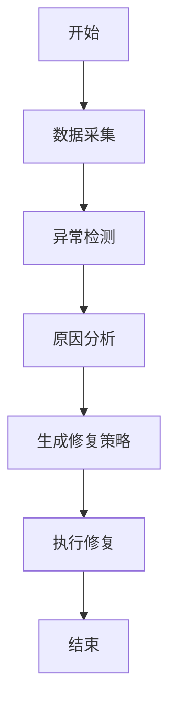
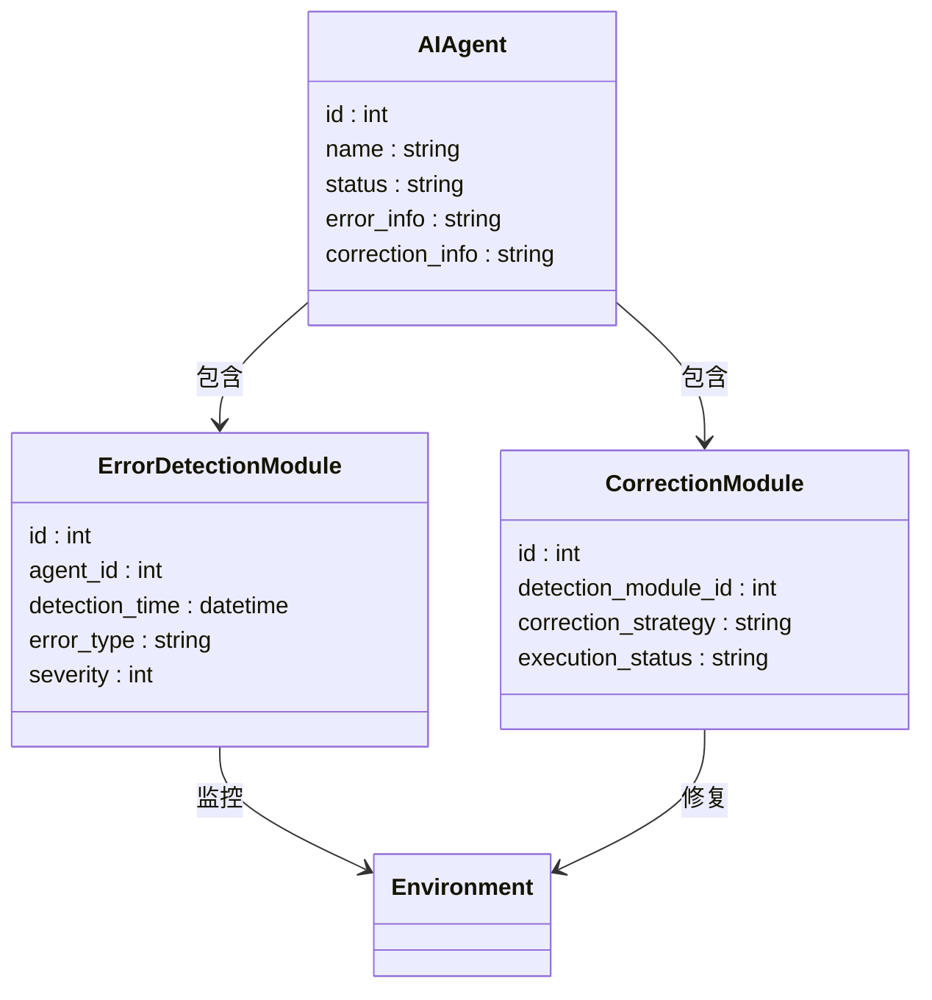
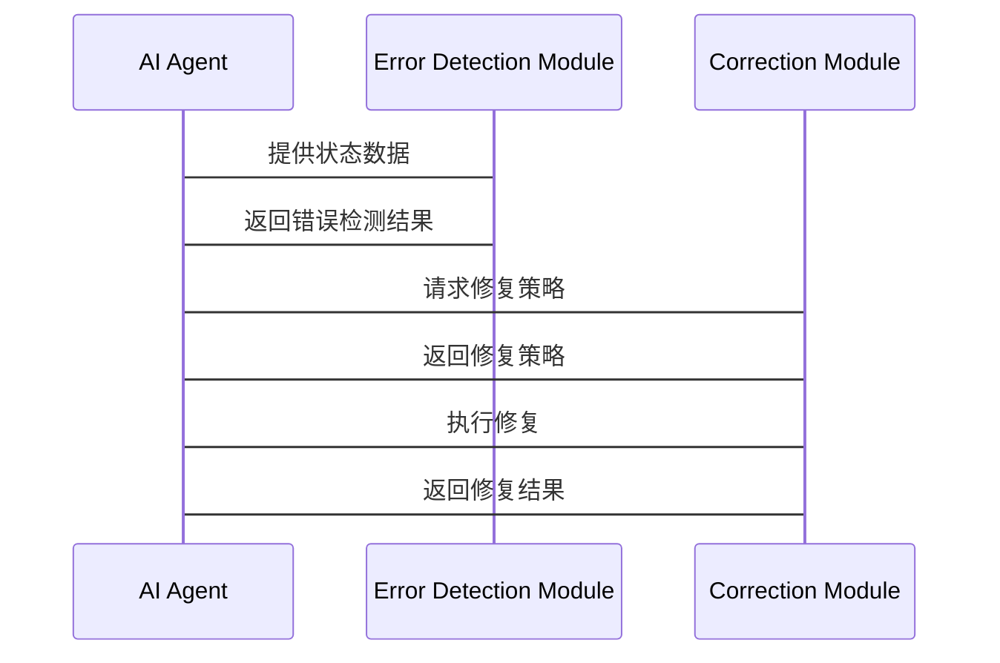

                 


# 《构建具有自我修正能力的AI Agent》

> 关键词：AI Agent，自我修正，智能体，算法原理，系统架构，项目实战

> 摘要：本文将深入探讨如何构建一个具有自我修正能力的AI Agent。通过分析AI Agent的核心概念、自我修正机制、相关算法原理及系统架构设计，结合实际项目案例，详细讲解如何实现具备自我检测、自我修复和自我学习能力的AI Agent。文章内容涵盖从理论到实践的全栈知识，帮助读者全面掌握构建此类智能体的关键技术和方法。

---

## 第一部分: 构建具有自我修正能力的AI Agent概述

### 第1章: AI Agent的基本概念与自我修正能力的必要性

#### 1.1 AI Agent的定义与核心特点
##### 1.1.1 AI Agent的基本定义
AI Agent（人工智能代理）是一种能够感知环境、自主决策并执行任务的智能实体。它通过传感器获取信息，利用计算模型进行分析，并通过执行器与环境交互。AI Agent的核心特点包括自主性、反应性、目标导向和情境适应性。

##### 1.1.2 自我修正能力的定义与特征
自我修正能力是指AI Agent在运行过程中能够自动检测问题、分析错误原因并采取修复措施的能力。其特征包括实时性、自适应性和主动性。

##### 1.1.3 自我修正能力的重要性
在动态和复杂的环境中，AI Agent需要能够快速响应变化并解决突发问题。自我修正能力是确保AI Agent稳定运行、提高可靠性和适应性的关键。

#### 1.2 自我修正AI Agent的背景与问题背景
##### 1.2.1 当前AI Agent的应用现状
AI Agent广泛应用于自动驾驶、智能助手、机器人和推荐系统等领域。然而，现有的AI Agent在面对复杂环境和意外情况时，往往缺乏足够的自我修正能力，导致系统故障或用户体验下降。

##### 1.2.2 自我修正能力的必要性
随着AI Agent的应用场景越来越复杂，其在运行过程中可能会遇到数据错误、环境变化或算法失效等问题。自我修正能力能够帮助AI Agent在这些情况下保持稳定性和高效性。

##### 1.2.3 问题解决的核心思路
通过结合机器学习、强化学习和自适应算法，构建一种能够实时监控自身状态、识别问题并主动修复的AI Agent体系结构。

#### 1.3 自我修正能力的边界与外延
##### 1.3.1 自我修正能力的边界
自我修正能力的边界包括系统内部错误检测与修复、外部环境适应性以及用户反馈处理。超出这些范围的问题需要依赖外部支持系统。

##### 1.3.2 相关概念的对比分析
与传统AI Agent相比，自我修正AI Agent在自主性、适应性和纠错能力方面具有明显优势。

##### 1.3.3 核心要素组成
自我修正AI Agent的核心要素包括错误检测模块、修复策略生成模块、执行修复模块和学习优化模块。

---

### 第2章: 自我修正AI Agent的核心概念与联系

#### 2.1 核心概念原理
##### 2.1.1 自我修正机制的原理
自我修正机制通过实时监控系统状态、检测异常并生成修复策略，实现问题的快速解决。其核心原理包括异常检测、原因分析和修复决策。

##### 2.1.2 自我检测与修复的实现方式
自我检测可以通过日志分析、性能指标监控和用户反馈等方式实现。修复方式包括参数调整、算法优化和任务重新规划。

##### 2.1.3 自我学习与适应的算法基础
自我学习基于强化学习和监督学习，通过不断优化模型参数和策略，提升系统的纠错能力。

#### 2.2 核心概念属性特征对比表格
##### 表2-1: 自我修正AI Agent与传统AI Agent的对比

| 属性 | 传统AI Agent | 自我修正AI Agent |
|------|--------------|------------------|
| 自主性 | 较低          | 高               |
| 适应性 | 较差          | 高               |
| 错误处理 | 依赖外部干预 | 自主检测修复      |

#### 2.3 ER实体关系图
##### 图2-1: 自我修正AI Agent的实体关系图

```mermaid
erDiagram
    class AI Agent {
        id : int
        name : string
        status : string
        error_info : string
        correction_info : string
    }
    class Environment {
        id : int
        status : string
        input_data : string
        output_data : string
    }
    class Error Detection Module {
        id : int
        agent_id : int
        detection_time : datetime
        error_type : string
        severity : int
    }
    class Correction Module {
        id : int
        detection_module_id : int
        correction_strategy : string
        execution_status : string
    }
    AI Agent --> Error Detection Module : 包含
    AI Agent --> Correction Module : 包含
    Error Detection Module --> Environment : 监控
    Correction Module --> Environment : 修复
```

---

### 第3章: 自我修正AI Agent的算法原理

#### 3.1 算法原理概述
##### 3.1.1 自我修正算法的基本流程
自我修正算法通过实时监控系统状态、检测异常、分析错误原因并生成修复策略，最终执行修复操作。整个流程包括数据采集、异常检测、原因分析、策略生成和修复执行五个阶段。

##### 3.1.2 算法的核心思想
基于强化学习的自我修正算法通过不断优化奖励函数，使AI Agent在错误发生时能够选择最优的修复策略。算法的核心思想是将错误检测和修复过程转化为一个优化问题。

##### 3.1.3 算法的优缺点分析
优点：能够快速响应错误，提高系统的稳定性和可靠性。缺点：算法复杂度较高，实现难度较大。

#### 3.2 算法原理的数学模型与公式
##### 图3-1: 自我修正算法的mermaid流程图



##### 代码3-1: 算法的Python实现

```python
import numpy as np

def detect_error(agent_status):
    # 检测错误
    error_flag = False
    error_type = None
    if agent_status['performance'] < threshold:
        error_flag = True
        error_type = 'performance'
    return error_flag, error_type

def analyze_error(error_type):
    # 分析错误原因
    cause = None
    if error_type == 'performance':
        cause = '参数设置不当'
    return cause

def generate_strategy(cause):
    # 生成修复策略
    strategy = None
    if cause == '参数设置不当':
        strategy = '调整参数'
    return strategy

def execute_correction(strategy):
    # 执行修复
    success = False
    if strategy == '调整参数':
        # 调整参数并执行
        success = True
    return success

def self_correction_algorithm():
    error_flag, error_type = detect_error(agent_status)
    if not error_flag:
        return
    cause = analyze_error(error_type)
    strategy = generate_strategy(cause)
    success = execute_correction(strategy)
    return success
```

#### 3.3 算法的数学模型
自我修正算法的数学模型基于强化学习，其核心是通过优化奖励函数来选择最优的修复策略。数学模型可以表示为：

$$ R = \sum_{t=1}^{T} r_t $$

其中，$R$ 是总奖励，$r_t$ 是时间步 $t$ 的奖励。通过最大化 $R$，算法能够找到最优的修复策略。

---

### 第4章: 自我修正AI Agent的系统分析与架构设计

#### 4.1 系统分析
##### 4.1.1 系统目标与范围
系统目标是构建一个能够实时检测错误、分析原因并执行修复的AI Agent。系统范围包括错误检测模块、修复策略生成模块和修复执行模块。

##### 4.1.2 系统功能需求分析
系统需要实现以下功能：
- 实时监控系统状态
- 检测异常情况
- 分析错误原因
- 生成修复策略
- 执行修复操作

##### 4.1.3 系统的约束与假设
系统假设环境数据能够实时传输，并且修复操作不会对环境造成重大影响。

#### 4.2 系统架构设计
##### 图4-1: 系统架构的mermaid类图



##### 图4-2: 系统架构的mermaid架构图


#### 4.3 系统接口设计
系统主要接口包括：
- 数据采集接口：从环境获取实时数据
- 错误检测接口：分析数据并检测异常
- 修复策略生成接口：根据错误原因生成修复策略
- 修复执行接口：执行修复操作并返回结果

#### 4.4 系统交互流程
##### 图4-3: 系统交互的mermaid序列图



---

## 第二部分: 项目实战——构建具有自我修正能力的AI Agent

### 第5章: 项目实战

#### 5.1 环境安装与配置
##### 5.1.1 开发环境要求
- Python 3.8及以上版本
- 必要的Python库：numpy、pandas、scikit-learn、tensorflow

##### 5.1.2 系统部署环境
- Linux或Windows操作系统
- 足够的计算资源（CPU/GPU）

#### 5.2 系统核心实现源代码
##### 5.2.1 错误检测模块实现

```python
import numpy as np

def detect_error(agent_status):
    error_flag = False
    error_type = None
    if agent_status['performance'] < 0.8:
        error_flag = True
        error_type = 'performance'
    return error_flag, error_type
```

##### 5.2.2 修复策略生成模块实现

```python
def analyze_error(error_type):
    cause = None
    if error_type == 'performance':
        cause = '参数设置不当'
    return cause

def generate_strategy(cause):
    strategy = None
    if cause == '参数设置不当':
        strategy = '调整学习率'
    return strategy
```

##### 5.2.3 修复执行模块实现

```python
def execute_correction(strategy):
    success = False
    if strategy == '调整学习率':
        # 假设我们有一个函数来调整学习率
        adjust_learning_rate()
        success = True
    return success
```

##### 5.2.4 自我修正算法实现

```python
def self_correction_algorithm(agent_status):
    error_flag, error_type = detect_error(agent_status)
    if not error_flag:
        return
    cause = analyze_error(error_type)
    strategy = generate_strategy(cause)
    success = execute_correction(strategy)
    return success
```

#### 5.3 代码应用解读与分析
##### 5.3.1 代码实现细节
- 错误检测模块通过性能指标判断是否存在错误。
- 修复策略生成模块根据错误原因生成相应的修复策略。
- 修复执行模块通过调整学习率或其他参数来实现修复。

##### 5.3.2 代码实现优势
- 实现简单，易于扩展。
- 通过模块化设计，提高了代码的可维护性和可扩展性。

#### 5.4 实际案例分析
##### 5.4.1 案例背景
假设我们有一个基于强化学习的AI Agent，用于控制一个机器人在动态环境中导航。在运行过程中，机器人可能会因为传感器故障或环境变化而无法正常导航。

##### 5.4.2 案例分析
- 错误检测模块检测到机器人的导航性能下降。
- 分析错误原因，发现是传感器数据异常。
- 生成修复策略，例如调整传感器灵敏度。
- 执行修复操作，恢复正常导航。

##### 5.4.3 案例总结
通过自我修正能力，AI Agent能够在检测到问题后快速修复，确保系统的稳定性和可靠性。

#### 5.5 项目小结
- 通过实际案例，验证了自我修正AI Agent的可行性。
- 项目实现了错误检测、原因分析、策略生成和修复执行四个核心功能。

---

## 第三部分: 总结与展望

### 第6章: 总结与展望

#### 6.1 核心内容总结
- 自我修正AI Agent的核心概念和实现方法。
- 算法原理和系统架构设计。
- 项目实战中的实现细节和应用案例。

#### 6.2 未来展望
- 结合边缘计算和雾计算，提升自我修正能力的实时性和响应速度。
- 研究更复杂的自适应算法，进一步提高系统的纠错能力。
- 探索自我修正AI Agent在更多领域的应用，如自动驾驶、智能医疗等。

#### 6.3 最佳实践 tips
- 在设计AI Agent时，充分考虑系统的自我修正能力。
- 定期测试和优化算法，确保系统的稳定性和可靠性。
- 结合实际应用场景，选择合适的算法和实现方案。

---

## 附录

### 附录A: 术语表

| 术语 | 定义 |
|------|------|
| AI Agent | 人工智能代理，能够感知环境、自主决策并执行任务的智能实体。 |
| 自我修正能力 | AI Agent在运行过程中能够自动检测问题、分析错误原因并采取修复措施的能力。 |

### 附录B: 参考文献

1. Russell, S., & Norvig, P. (2010). *Artificial Intelligence: A Modern Approach*. Pearson.
2. Sutton, R. S., & Barto, A. G. (2018). *Reinforcement Learning: An Introduction. MIT Press.*
3. Goodfellow, I., Bengio, Y., & Courville, A. (2016). *Deep Learning. MIT Press.*

---

# 结束语

构建具有自我修正能力的AI Agent是一个复杂而有趣的挑战，需要结合算法设计、系统架构和实际应用等多方面的知识。通过本文的详细讲解，读者可以系统地掌握构建此类AI Agent的核心技术和方法，为未来的创新和应用打下坚实的基础。

