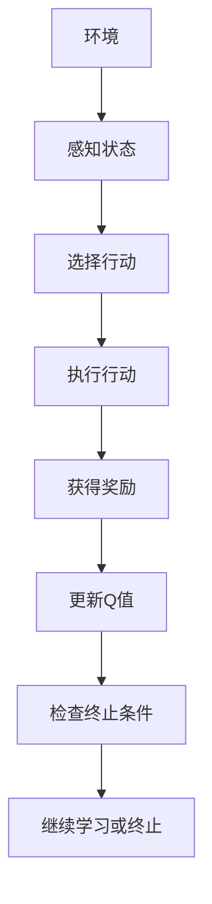
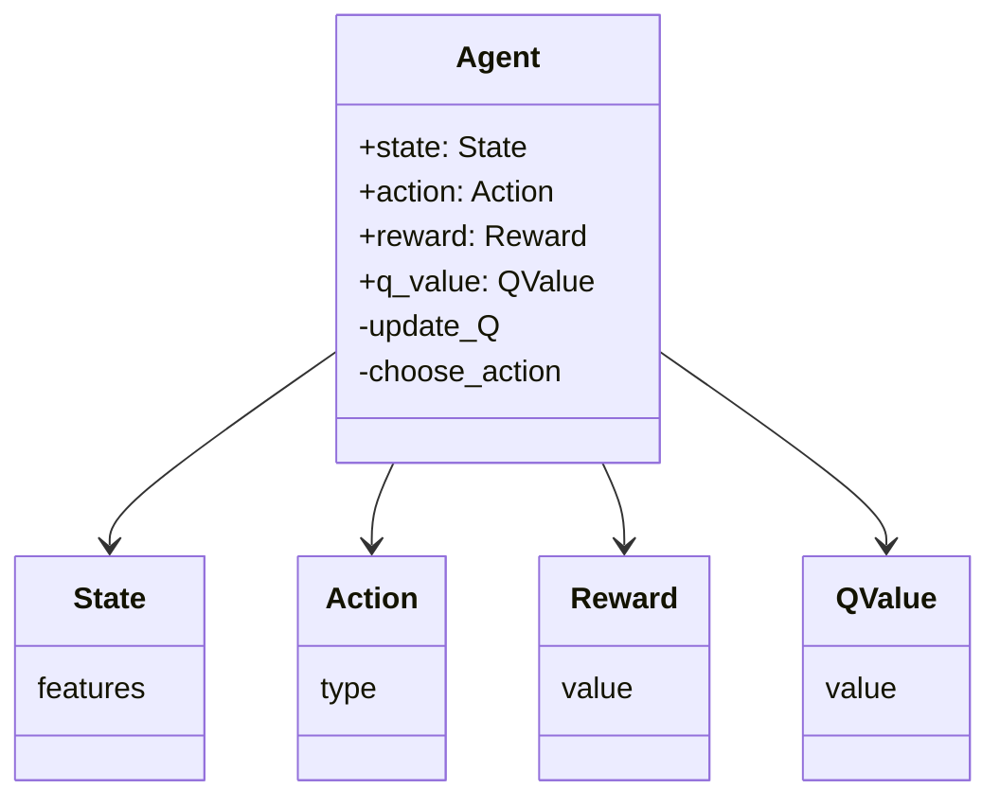
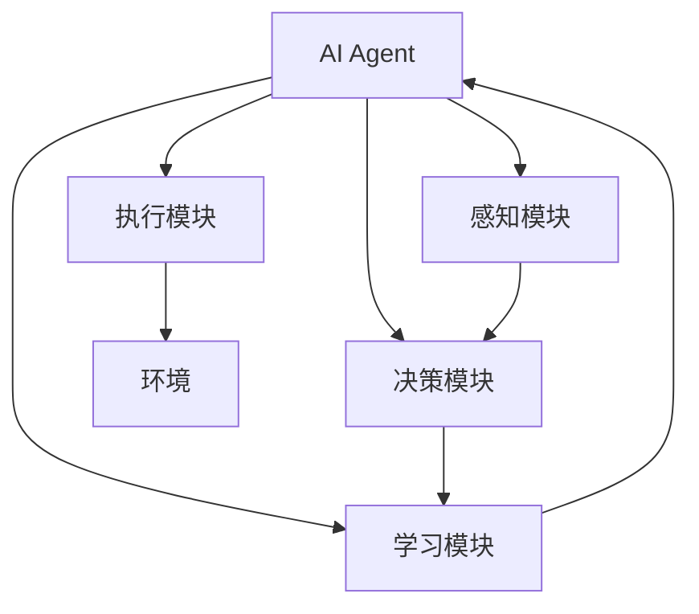

                 


# 《构建具有自我学习能力的AI Agent》

> 关键词：AI Agent，自我学习，强化学习，深度学习，机器学习

> 摘要：本文详细探讨了构建具有自我学习能力的AI Agent的各个方面，从基本概念到算法实现，再到系统设计和项目实战，旨在帮助读者系统地掌握构建这种智能系统的核心技术和方法。

---

## 第一部分：AI Agent基础

### 第1章：AI Agent的基本概念与背景

#### 1.1 AI Agent的定义与特点

**1.1.1 AI Agent的定义**

AI Agent（人工智能代理）是一种能够感知环境、自主决策并采取行动的智能实体。它能够根据当前状态和历史经验，选择最优的行为以实现特定目标。

**1.1.2 AI Agent的核心特点**

1. **自主性**：AI Agent能够自主决策，无需外部干预。
2. **反应性**：能够实时感知环境变化并做出反应。
3. **目标导向**：通过明确的目标驱动行为。
4. **学习能力**：能够通过经验优化决策策略。

**1.1.3 AI Agent与传统AI的区别**

| 特性       | 传统AI                     | AI Agent                     |
|------------|---------------------------|-----------------------------|
| 智能水平    | 基于规则或模式匹配         | 具备自主决策和学习能力       |
| 应用场景    | 处理特定任务（如图像识别） | 广泛应用于复杂动态环境       |
| 适应性     | 固定规则，难以适应变化     | 能够自适应环境和任务变化     |

---

#### 1.2 AI Agent的分类

**1.2.1 简单反射型AI Agent**

- 基于当前输入做出即时反应，无内部状态。
- 例如：聊天机器人中的关键词匹配。

**1.2.2 基于模型的AI Agent**

- 维护环境模型，基于模型做出决策。
- 例如：自动驾驶中的路径规划系统。

**1.2.3 目标驱动型AI Agent**

- 以明确目标为导向，采取行动。
- 例如：金融交易中的算法交易系统。

**1.2.4 学习驱动型AI Agent**

- 通过学习优化决策策略。
- 例如：游戏AI通过强化学习提升游戏水平。

---

#### 1.3 AI Agent的发展历程

**1.3.1 从专家系统到机器学习**

- 早期AI Agent基于专家规则，逐渐转向机器学习技术。
- 例如：从基于规则的问答系统到基于深度学习的问答系统。

**1.3.2 强化学习的崛起**

- 强化学习技术的引入使AI Agent能够自主学习策略。
- 例如：AlphaGo通过强化学习在围棋上击败人类顶尖棋手。

**1.3.3 当前AI Agent的发展趋势**

- 结合多模态数据（如视觉、听觉）提升感知能力。
- 研究重点：可解释性、安全性和人机协作。

---

## 第二部分：自我学习机制

### 第2章：自我学习的核心概念

#### 2.1 自我学习的定义与特点

**2.1.1 自我学习的定义**

自我学习是AI Agent通过与环境互动，不断优化自身行为的过程。这种学习方式不需要外部监督，而是通过内在奖励机制驱动。

**2.1.2 自我学习的核心特点**

1. **自主性**：无需外部指导。
2. **目标导向**：通过优化目标函数实现。
3. **适应性**：能够应对动态变化的环境。

---

#### 2.2 自我学习的实现机制

**2.2.1 强化学习机制**

- 基于奖励机制，通过试错学习优化策略。
- 例如：游戏AI通过不断尝试不同的策略，最终找到最优路径。

**2.2.2 深度学习机制**

- 利用神经网络建模复杂决策过程。
- 例如：使用深度神经网络进行图像识别和自然语言处理。

**2.2.3 迁移学习机制**

- 利用已有的知识和经验，快速适应新任务。
- 例如：将图像识别模型应用于相似的图像分类任务。

---

#### 2.3 自我学习的核心要素

**2.3.1 状态空间**

- 定义：系统可能处于的所有状态的集合。
- 示例：在迷宫中，每个位置是一个状态。

**2.3.2 行动空间**

- 定义：系统可能采取的所有行动的集合。
- 示例：向前、向左、向右移动。

**2.3.3 奖励函数**

- 定义：衡量行动结果的好坏的函数。
- 示例：在迷宫中找到出口给予正奖励，碰到墙壁给予负奖励。

**2.3.4 策略函数**

- 定义：根据当前状态选择行动的函数。
- 示例：在迷宫中选择距离出口最近的方向。

---

### 第3章：强化学习原理与算法

#### 3.1 强化学习的基本原理

**3.1.1 状态-动作-奖励模型**

- **定义**：系统通过感知状态，采取行动，获得奖励，以驱动学习。
- **公式**：$R = r(s, a)$，其中$s$是状态，$a$是行动。

**3.1.2 Q-learning算法**

- **原理**：通过Q表记录状态-行动对的期望奖励，逐步更新Q值以找到最优策略。
- **数学模型**：
  $$ Q(s, a) = Q(s, a) + \alpha (r + \gamma \max Q(s', a') - Q(s, a)) $$
  其中，$\alpha$是学习率，$\gamma$是折扣因子。

**3.1.3 Deep Q-Networks（DQN）算法**

- **原理**：使用深度神经网络近似Q函数，避免了Q表的高维度问题。
- **网络结构**：输入层（状态）→ 隐藏层 → 输出层（Q值）。

**3.1.4 DQN算法流程图**



**3.1.5 Python代码实现**

```python
import numpy as np
import gym

# 初始化环境
env = gym.make('CartPole-v0')
env.seed(42)

# 定义Q-learning算法
class QLearning:
    def __init__(self, state_space, action_space, alpha=0.1, gamma=0.99):
        self.state_space = state_space
        self.action_space = action_space
        self.alpha = alpha
        self.gamma = gamma
        self.Q = np.zeros((state_space, action_space))
    
    def get_action(self, state):
        return np.argmax(self.Q[state])  # 贪婪策略
    
    def update_Q(self, state, action, reward, next_state):
        self.Q[state, action] += self.alpha * (reward + self.gamma * np.max(self.Q[next_state]) - self.Q[state, action])

# 训练过程
agent = QLearning(env.observation_space.shape[0], env.action_space.n)
episodes = 1000

for episode in range(episodes):
    state = env.reset()
    total_reward = 0
    while True:
        action = agent.get_action(state)
        next_state, reward, done, _ = env.step(action)
        agent.update_Q(state, action, reward, next_state)
        total_reward += reward
        state = next_state
        if done:
            break
    print(f'Episode {episode + 1}, Total Reward: {total_reward}')

env.close()
```

---

#### 3.2 强化学习的核心算法

**3.2.1 Q-learning算法的数学模型**

$$ Q(s, a) = Q(s, a) + \alpha (r + \gamma \max Q(s', a') - Q(s, a)) $$

- **参数解释**：
  - $\alpha$：学习率，控制更新步长。
  - $\gamma$：折扣因子，平衡当前奖励和未来奖励的重要性。

**3.2.2 Deep Q-Net**

- **神经网络结构**：
  - 输入层：接收状态向量。
  - 隐藏层：提取特征。
  - 输出层：输出每个行动的Q值。
  
- **优势**：适用于高维状态空间，避免了Q表的维度灾难问题。

---

### 第4章：自我学习的数学模型与算法实现

#### 4.1 自我学习的数学模型

**4.1.1 状态转移模型**

- 定义：$P(s' | s, a)$，表示从状态$s$采取行动$a$后转移到状态$s'$的概率。

**4.1.2 奖励模型**

- 定义：$r(s, a, s')$，表示从状态$s$采取行动$a$到状态$s'$的奖励。

---

#### 4.2 算法实现

**4.2.1 Q-learning算法实现**

```python
def q_learning(env, alpha=0.1, gamma=0.99, episodes=1000):
    state_space = env.observation_space.shape[0]
    action_space = env.action_space.n
    Q = np.zeros((state_space, action_space))
    
    for episode in range(episodes):
        state = env.reset()
        total_reward = 0
        while True:
            action = np.argmax(Q[state])  # 贪婪策略
            next_state, reward, done, _ = env.step(action)
            Q[state, action] += alpha * (reward + gamma * np.max(Q[next_state]) - Q[state, action])
            total_reward += reward
            state = next_state
            if done:
                break
        print(f'Episode {episode + 1}, Total Reward: {total_reward}')
    
    return Q
```

---

## 第三部分：系统分析与架构设计

### 第5章：AI Agent的系统分析

#### 5.1 问题场景介绍

- **目标**：设计一个能够自我学习的AI Agent，能够在动态环境中优化决策。
- **应用场景**：例如，在游戏中击败人类玩家，或在机器人中实现自主导航。

#### 5.2 系统功能设计

**5.2.1 领域模型设计**



---

### 第6章：系统架构设计

#### 6.1 系统架构设计

**6.1.1 模块划分**

1. **感知模块**：接收环境输入，解析状态。
2. **决策模块**：基于当前状态选择行动。
3. **学习模块**：更新Q值，优化策略。
4. **执行模块**：输出行动，与环境互动。

**6.1.2 系统架构图**



---

## 第四部分：项目实战

### 第7章：构建一个自我学习的AI Agent

#### 7.1 环境配置

- **安装依赖**：
  ```bash
  pip install gym numpy matplotlib
  ```

---

#### 7.2 核心实现代码

```python
import gym
import numpy as np

def main():
    env = gym.make('CartPole-v0')
    env.seed(42)
    
    class AI-Agent:
        def __init__(self, state_space, action_space, alpha=0.1, gamma=0.99):
            self.state_space = state_space
            self.action_space = action_space
            self.alpha = alpha
            self.gamma = gamma
            self.Q = np.zeros((state_space, action_space))
        
        def get_action(self, state):
            return np.argmax(self.Q[state])
        
        def update_Q(self, state, action, reward, next_state):
            self.Q[state, action] += self.alpha * (reward + self.gamma * np.max(self.Q[next_state]) - self.Q[state, action])
    
    agent = AI-Agent(env.observation_space.shape[0], env.action_space.n)
    episodes = 1000
    
    for episode in range(episodes):
        state = env.reset()
        total_reward = 0
        while True:
            action = agent.get_action(state)
            next_state, reward, done, _ = env.step(action)
            agent.update_Q(state, action, reward, next_state)
            total_reward += reward
            state = next_state
            if done:
                break
        print(f'Episode {episode + 1}, Total Reward: {total_reward}')
    
    env.close()

if __name__ == "__main__":
    main()
```

---

## 第五部分：总结与展望

### 第8章：总结与展望

#### 8.1 总结

- 本文详细探讨了构建具有自我学习能力的AI Agent的各个方面，从基本概念到算法实现，再到系统设计和项目实战，帮助读者系统地掌握构建这种智能系统的核心技术和方法。

#### 8.2 展望

- **技术进步**：随着深度学习和强化学习技术的不断发展，AI Agent将变得更加智能和自主。
- **应用拓展**：未来，AI Agent将在更多领域得到广泛应用，如教育、医疗、交通等。
- **挑战与机遇**：尽管取得了显著进展，但AI Agent仍面临诸多挑战，如可解释性、安全性和伦理问题，这些都需要进一步研究和解决。

---

**小结**：通过本文的学习，读者不仅能够理解AI Agent的核心概念和技术，还能够通过实际项目掌握构建自我学习AI Agent的技能，为未来的AI开发奠定坚实基础。

