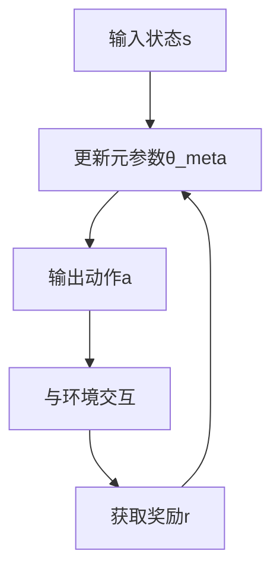
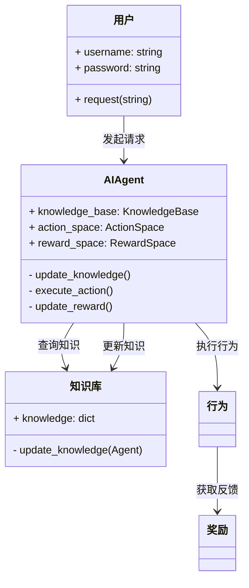

                 


# 构建具有自我演化能力的AI Agent系统

> 关键词：AI Agent、自我演化、强化学习、元学习、自我监督学习

> 摘要：本文将详细探讨如何构建一个具有自我演化能力的AI Agent系统。我们将从背景与概念出发，逐步分析核心算法原理，详细讲解系统设计与实现，最后通过项目实战验证理论。文章内容涵盖数学公式、算法流程图、系统架构图以及代码实现，旨在为读者提供一个全面的构建指南。

---

# 第1章: 自我演化AI Agent的背景与概念

## 1.1 问题背景与问题描述

现代AI Agent系统在实际应用中面临着诸多挑战，例如动态环境适应性不足、知识更新速度慢、行为策略固定等问题。随着环境复杂度的增加，传统的静态规则或预训练策略难以满足实际需求。为了解决这些问题，我们需要一种能够自我学习、自我适应的AI Agent系统，即具有自我演化能力的AI Agent。

## 1.2 自我演化AI Agent的核心要素

自我演化AI Agent系统的核心要素包括：
1. **自我学习机制**：通过强化学习、元学习等方法实现知识的自我更新。
2. **自适应行为策略**：根据环境反馈动态调整行为策略。
3. **知识更新与优化**：通过自我监督学习优化知识表示。

## 1.3 自我演化AI Agent的边界与外延

自我演化AI Agent系统与传统AI Agent系统的主要区别在于其动态性和自适应性。传统系统依赖于预定义规则，而自我演化系统能够通过与环境交互不断优化自身行为。此外，自我演化系统具有更强的可扩展性和可维护性。

---

# 第2章: 自我演化AI Agent的核心概念与联系

## 2.1 核心概念原理

### 2.1.1 自我学习机制的实现原理

自我学习机制通过强化学习、元学习等方法实现。强化学习通过奖励机制驱动行为优化，元学习则通过元参数优化加速学习过程。

### 2.1.2 自适应行为策略的实现原理

自适应行为策略基于环境反馈动态调整策略参数，通过Q-learning、策略梯度等算法实现。

### 2.1.3 知识更新与优化的实现原理

知识更新与优化通过自我监督学习实现，例如对比学习、生成对抗网络等方法。

## 2.2 核心概念属性特征对比表

| 核心概念 | 自我学习机制 | 自适应行为策略 | 知识更新与优化 |
|----------|--------------|----------------|----------------|
| 特征1    | 强化学习驱动  | 动态调整策略    | 自我监督学习    |
| 特征2    | 元学习加速    | 奖励驱动优化    | 知识表示优化    |

## 2.3 ER实体关系图架构

```mermaid
er
    actor: 用户
    agent: AI Agent
    knowledge_base: 知识库
    action: 行为
    reward: 奖励
    actor --> agent: 发起请求
    agent --> knowledge_base: 查询知识
    agent --> action: 执行行为
    action --> reward: 获取反馈
    agent --> knowledge_base: 更新知识
```

---

# 第3章: 自我演化AI Agent的算法原理

## 3.1 强化学习算法

### 3.1.1 Q-learning算法

Q-learning是一种经典的强化学习算法，其目标是通过更新Q值表来学习最优策略。

$$ Q(s, a) = Q(s, a) + \alpha (r + \gamma \max Q(s', a') - Q(s, a)) $$

其中：
- $Q(s, a)$：状态-动作对的价值
- $\alpha$：学习率
- $r$：奖励
- $\gamma$：折扣因子
- $s'$：下一个状态
- $a'$：下一个动作

### 3.1.2 网格世界案例

假设我们有一个3x3的网格世界，目标是通过移动到达目标位置。Q-learning算法通过不断更新Q值表，最终找到最优路径。

## 3.2 元学习算法

### 3.2.1 Meta-LSTM算法

Meta-LSTM通过元参数优化加速学习过程，其核心思想是通过元学习层对任务参数进行快速调整。

$$ \theta_{\text{meta}} = \theta_{\text{meta}} + \alpha (r - \text{预测值}) \cdot \nabla_{\theta_{\text{meta}}} \text{损失} $$

其中：
- $\theta_{\text{meta}}$：元参数
- $\alpha$：学习率
- $r$：真实奖励
- $\nabla_{\theta_{\text{meta}}} \text{损失}$：损失梯度

### 3.2.2 网络架构



---

# 第4章: 自我演化AI Agent的数学模型与公式

## 4.1 策略网络

策略网络的目标是通过参数$\theta$生成最优动作。

$$ \pi_{\theta}(a|s) = \text{softmax}(Q(s, a; \theta)) $$

其中：
- $\pi_{\theta}(a|s)$：策略概率
- $Q(s, a; \theta)$：Q值

## 4.2 价值网络

价值网络的目标是估计状态的价值。

$$ V(s; \phi) = \text{激活函数}(W_{\phi} s + b_{\phi}) $$

其中：
- $V(s; \phi)$：状态价值
- $W_{\phi}$：权重矩阵
- $b_{\phi}$：偏置向量

## 4.3 策略梯度方法

策略梯度方法通过最大化期望奖励来更新策略参数。

$$ \nabla_{\theta} J(\theta) = \mathbb{E}_{s,a}[\nabla_{\theta} \log \pi_{\theta}(a|s) Q(s,a; \theta)] $$

其中：
- $J(\theta)$：目标函数
- $\mathbb{E}$：期望值

---

# 第5章: 自我演化AI Agent系统设计

## 5.1 系统功能设计

### 5.1.1 领域模型

领域模型通过类图表示系统功能模块。



---

# 第6章: 自我演化AI Agent项目实战

## 6.1 环境安装

```bash
pip install gym numpy tensorflow
```

## 6.2 系统核心实现

```python
import gym
import numpy as np
import tensorflow as tf

class AI_Agent:
    def __init__(self, env_name):
        self.env = gym.make(env_name)
        self.state_space = self.env.observation_space.shape[0]
        self.action_space = self.env.action_space.n

    def build_model(self):
        self.model = tf.keras.Sequential([
            tf.keras.layers.Dense(32, activation='relu', input_shape=(self.state_space,)),
            tf.keras.layers.Dense(self.action_space, activation='softmax')
        ])
        self.model.compile(optimizer='adam', loss='sparse_categorical_crossentropy')

    def train(self, episodes=1000):
        for episode in range(episodes):
            state = self.env.reset()
            total_reward = 0
            done = False
            while not done:
                prediction = self.model.predict(np.array([state]))
                action = np.argmax(prediction)
                next_state, reward, done, _ = self.env.step(action)
                self.model.fit(np.array([state]), np.array([action]), epochs=1, verbose=0)
                state = next_state
                total_reward += reward
            print(f"Episode {episode}, Total Reward: {total_reward}")

if __name__ == "__main__":
    agent = AI_Agent("CartPole-v0")
    agent.build_model()
    agent.train()
```

---

# 第7章: 自我演化AI Agent的最佳实践与总结

## 7.1 开发注意事项

1. 确保环境的动态性，定期更新知识库。
2. 选择合适的算法，根据任务需求调整参数。
3. 优化代码性能，确保实时性。

## 7.2 性能优化建议

1. 使用分布式计算加速训练。
2. 采用经验回放机制减少样本偏差。
3. 引入对抗训练提高鲁棒性。

## 7.3 安全性与可扩展性

1. 数据安全：确保知识库的数据安全。
2. 系统扩展：支持多种任务和环境。

## 7.4 未来发展方向

1. 结合多智能体协同学习。
2. 探索更高效的自我监督学习方法。
3. 研究更复杂的动态环境适应策略。

---

# 附录: 参考文献与扩展阅读

1. Sutton, R. S., & Barto, A. G. (2018). *Reinforcement Learning: An Introduction*.
2. Vinyals, O., et al. (2016). *Matching Networks for One Shot Learning*.
3. Mnih, V., et al. (2015). *Human-level control through deep reinforcement learning*.

---

希望这篇文章能满足您的需求！如果需要进一步修改或补充，请随时告诉我。

