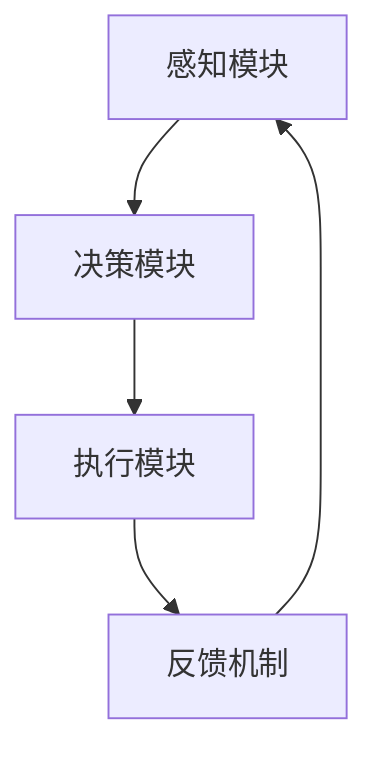
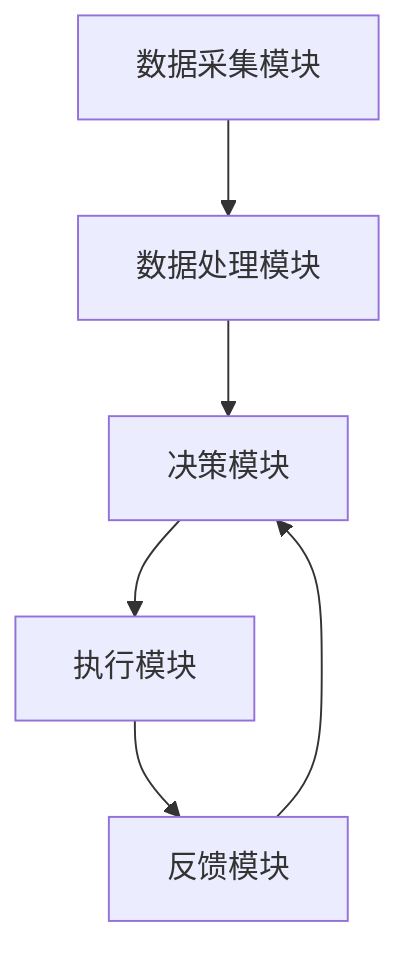

                 


# 构建具有自我评估与优化能力的AI Agent系统

> 关键词：AI Agent, 自我评估, 优化能力, 强化学习, 反馈机制

> 摘要：本文详细探讨了如何构建一个具有自我评估与优化能力的AI Agent系统。通过背景介绍、核心概念分析、算法原理讲解、系统架构设计和项目实战，文章为读者提供了从理论到实践的全面指导，帮助读者理解并实现一个能够自主学习和优化的智能系统。

---

# 第一部分: 背景介绍

## 第1章: AI Agent系统的基本概念

### 1.1 AI Agent的定义与特点
AI Agent（人工智能代理）是一种能够感知环境、自主决策并执行任务的智能实体。其特点包括：
- **自主性**：无需外部干预，自主完成任务。
- **反应性**：能够实时感知环境并做出反应。
- **目标导向**：基于目标驱动行为，优化决策过程。

### 1.2 自我评估与优化能力的必要性
AI Agent需要具备自我评估与优化能力，以适应动态变化的环境。这种能力使其能够：
- **自适应调整**：根据反馈不断优化自身行为。
- **自我改进**：识别不足并主动学习提升。

### 1.3 相关技术基础
- **机器学习**：提供数据驱动的决策方法。
- **强化学习**：通过试错优化决策策略。
- **反馈机制**：构建闭环系统，实现持续改进。

---

# 第二部分: 核心概念与联系

## 第2章: AI Agent系统的核心概念

### 2.1 核心概念原理
AI Agent系统由以下核心模块组成：
- **感知模块**：接收环境输入，解析数据。
- **决策模块**：基于感知信息，制定行动策略。
- **执行模块**：将决策转化为具体行动。
- **反馈机制**：收集执行结果，评估并优化决策。

### 2.2 核心概念属性特征对比表

| 模块         | 输入       | 输出       | 功能描述                         |
|--------------|------------|------------|----------------------------------|
| 感知模块     | 环境数据    | 解释信息    | 将原始数据转化为有意义的信息     |
| 决策模块     | 解释信息    | 行动策略    | 基于目标选择最优行动              |
| 执行模块     | 行动策略    | 系统反馈    | 执行决策并返回结果                |
| 反馈机制     | 系统反馈    | 优化策略    | 根据结果调整后续决策策略          |

### 2.3 ER实体关系图
使用Mermaid图展示系统实体关系：



---

# 第三部分: 自我评估与优化算法原理

## 第3章: 强化学习算法原理

### 3.1 强化学习的基本概念
强化学习是一种通过试错学习优化决策策略的方法。核心概念包括：
- **状态（State）**：环境的当前情况。
- **动作（Action）**：AI Agent的决策。
- **奖励（Reward）**：对决策的反馈，用于调整策略。

### 3.2 基于强化学习的优化算法
**Q-learning算法**是常见的强化学习方法，数学模型如下：

$$ Q(s, a) = Q(s, a) + \alpha [r + \max Q(s', a') - Q(s, a)] $$

其中：
- \( Q(s, a) \)：当前状态和动作的评估值。
- \( \alpha \)：学习率。
- \( r \)：奖励值。
- \( s' \)：下一个状态。

### 3.3 算法实现代码示例

```python
import numpy as np

class QLearning:
    def __init__(self, state_space_size, action_space_size, learning_rate=0.1):
        self.q_table = np.zeros((state_space_size, action_space_size))
        self.learning_rate = learning_rate

    def choose_action(self, state, epsilon=0.1):
        if np.random.random() < epsilon:
            return np.random.randint(0, action_space_size)
        return np.argmax(self.q_table[state])

    def update_q_table(self, state, action, reward, next_state):
        current_q = self.q_table[state][action]
        next_max_q = np.max(self.q_table[next_state])
        self.q_table[state][action] = current_q + self.learning_rate * (reward + next_max_q - current_q)

# 示例使用
ql = QLearning(5, 3)
action = ql.choose_action(0)
ql.update_q_table(0, action, reward=1, next_state=1)
```

---

## 第4章: 反馈机制与自我评估

### 4.1 反馈机制的数学模型
反馈机制通过奖励函数评估AI Agent的行为，公式如下：

$$ R(s, a) = r + \gamma \cdot R(s', a') $$

其中：
- \( R(s, a) \)：当前状态和动作的奖励。
- \( r \)：即时奖励。
- \( \gamma \)：折扣因子。
- \( s' \)：下一个状态。

### 4.2 自我评估算法的实现
**评估指标**的选择直接影响反馈机制的有效性。常用的指标包括：
- **准确率**：分类任务中的正确预测比例。
- **F1分数**：平衡召回率和精确率的指标。

---

# 第四部分: 系统分析与架构设计

## 第5章: 系统功能设计

### 5.1 系统功能模块
AI Agent系统主要功能模块包括：
- **数据采集模块**：获取环境数据。
- **数据处理模块**：预处理和特征提取。
- **决策模块**：基于强化学习生成策略。
- **执行模块**：将策略转化为具体行动。
- **反馈模块**：收集结果并优化策略。

### 5.2 功能模块关系图



### 5.3 系统架构设计
AI Agent系统的架构设计包括：
- **单体架构**：适合小型任务，模块独立运行。
- **分布式架构**：适用于大规模任务，模块间协作优化。

---

# 第五部分: 项目实战

## 第6章: 环境安装与核心代码实现

### 6.1 环境安装
安装必要的库：

```bash
pip install numpy matplotlib
```

### 6.2 核心代码实现

```python
import numpy as np
import matplotlib.pyplot as plt

class AI-Agent:
    def __init__(self, state_space=10, action_space=4):
        self.q_table = np.zeros((state_space, action_space))
        self.learning_rate = 0.1
        self.gamma = 0.9

    def perceive(self, state):
        # 感知环境状态
        return state

    def choose_action(self, state):
        # 选择动作
        return np.argmax(self.q_table[state])

    def learn(self, state, action, reward, next_state):
        # 强化学习更新Q表
        self.q_table[state][action] += self.learning_rate * (reward + self.gamma * np.max(self.q_table[next_state]) - self.q_table[state][action])

# 示例使用
agent = AI-Agent()
state = 5
action = agent.choose_action(state)
agent.learn(state, action, reward=1, next_state=6)
```

---

## 第7章: 案例分析与详细解读

### 7.1 案例分析
以一个简单的游戏AI为例，展示AI Agent如何通过自我评估与优化提升游戏水平。

### 7.2 代码应用解读
分析上述代码的执行过程，理解每个模块的功能与交互。

---

# 第六部分: 总结与展望

## 第8章: 总结与注意事项

### 8.1 内容总结
本文详细讲解了构建具有自我评估与优化能力的AI Agent系统的各个方面，从理论到实践，为读者提供了全面的指导。

### 8.2 注意事项
- **数据质量**：高质量的数据是系统优化的基础。
- **反馈机制设计**：合理的反馈机制能够显著提升系统性能。
- **算法选择**：根据任务需求选择合适的算法。

---

## 第9章: 未来展望

### 9.1 拓展方向
- **多智能体协作**：研究多Agent协同优化的方法。
- **实时优化**：提升系统的实时响应能力和优化速度。

### 9.2 最佳实践 tips
- 定期评估系统性能，及时调整参数。
- 结合实际场景，灵活设计反馈机制。

---

# 结语

通过本文的详细指导，读者可以系统地理解并实现一个具有自我评估与优化能力的AI Agent系统。从理论学习到实际应用，每个环节都得到了充分的阐述，帮助读者在实践中不断优化和提升系统性能。未来，随着技术的不断发展，AI Agent系统将在更多领域展现出其强大的潜力。

