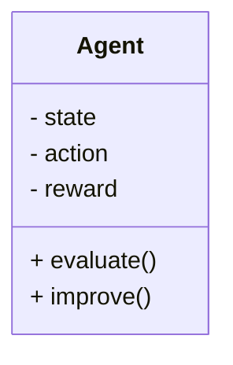

                 


# 构建具有自我评估与改进能力的AI Agent

## 关键词：AI Agent，自我评估，自我改进，强化学习，系统架构，项目实战

## 摘要：  
本文深入探讨了如何构建具有自我评估与改进能力的AI Agent。通过分析AI Agent的核心概念、算法原理、系统架构及项目实战，详细阐述了从理论到实践的全过程。文章从背景介绍出发，逐步解析AI Agent的工作原理，探讨其算法实现，设计系统架构，并通过具体案例展示如何实现具有自我评估与改进能力的AI Agent。

---

# 第一部分：AI Agent的背景与核心概念

# 第1章：AI Agent概述

## 1.1 AI Agent的基本概念

### 1.1.1 AI Agent的定义  
AI Agent（人工智能代理）是一种能够感知环境、做出决策并执行动作的智能实体。它可以自主或基于外部输入完成特定任务，通过与环境交互不断优化自身行为。

### 1.1.2 AI Agent的核心特征  
- **自主性**：无需外部干预，自主完成任务。  
- **反应性**：能够实时感知环境并做出反应。  
- **目标导向性**：以特定目标为导向，优化行为。  
- **学习能力**：通过经验改进性能。  

### 1.1.3 AI Agent的分类与应用场景  
AI Agent可以分为简单反射型、基于模型的反射型、目标驱动型和效用驱动型。应用场景包括自动驾驶、智能助手、机器人控制、游戏AI等。

## 1.2 自我评估与改进能力的必要性

### 1.2.1 AI Agent面临的挑战  
- **动态环境**：环境不断变化，需要快速适应。  
- **复杂决策**：面对复杂问题，需要多维度分析。  
- **错误处理**：需要及时发现并纠正错误。  

### 1.2.2 自我评估能力的引入  
AI Agent需要能够评估自身的性能和行为，发现问题并提出改进方案。

### 1.2.3 自我改进能力的意义  
通过自我评估，AI Agent能够不断优化自身的算法、策略和行为模式，提升任务完成效率和准确性。

## 1.3 本章小结  
本章介绍了AI Agent的基本概念、核心特征和分类，强调了自我评估与改进能力的重要性，并指出了其在实际应用中的价值。

---

# 第二部分：AI Agent的核心概念与联系

# 第2章：AI Agent的核心原理

## 2.1 感知模块

### 2.1.1 数据输入与特征提取  
AI Agent通过传感器或接口获取环境数据，并通过特征提取将数据转化为有用的特征向量。

### 2.1.2 感知模块的实现方式  
常用的方法包括基于规则的感知和基于机器学习的感知。

### 2.1.3 感知模块与改进能力的关系  
感知模块的准确性直接影响AI Agent的决策质量，因此需要通过自我评估不断优化感知算法。

## 2.2 决策模块

### 2.2.1 决策算法的选择  
常用的决策算法包括规则引擎、决策树、随机森林和深度学习模型。

### 2.2.2 决策模块的优化策略  
通过强化学习和参数调整优化决策模块的性能。

### 2.2.3 决策模块与自我评估的关系  
决策模块需要根据自我评估的结果不断优化决策策略。

## 2.3 执行模块

### 2.3.1 执行策略的制定  
根据决策模块的输出制定具体的执行策略。

### 2.3.2 执行结果的反馈机制  
通过反馈机制将执行结果传递给感知模块，形成闭环。

### 2.3.3 执行模块的改进方向  
优化执行策略和动作选择，提升执行效率和准确性。

## 2.4 本章小结  
本章详细讲解了AI Agent的核心模块，包括感知、决策和执行模块，并分析了它们之间的相互关系和改进方向。

---

# 第三部分：AI Agent的算法原理

# 第3章：强化学习算法

## 3.1 强化学习的基本原理

### 3.1.1 状态、动作、奖励的定义  
- **状态（State）**：环境当前的状况。  
- **动作（Action）**：AI Agent采取的行动。  
- **奖励（Reward）**：环境对AI Agent行为的反馈。  

### 3.1.2 Q-learning算法的数学模型  
$$ Q(s,a) = r + \gamma \max Q(s',a') $$  

### 3.1.3 算法流程  
1. 初始化Q表。  
2. 选择动作。  
3. 执行动作，获取新状态和奖励。  
4. 更新Q表。  
5. 重复步骤2-4。

## 3.2 策略梯度算法

### 3.2.1 策略梯度的数学模型  
$$ \nabla \theta \log \pi_\theta(a|s) \cdot Q(s,a) $$  

### 3.2.2 算法流程  
1. 初始化策略参数θ。  
2. 采样动作。  
3. 计算梯度并更新θ。  
4. 重复步骤2-3。

## 3.3 算法实现与优化

### 3.3.1 算法实现的步骤  
- 初始化模型参数。  
- 定义奖励函数。  
- 实现梯度更新逻辑。  

### 3.3.2 算法优化的策略  
- 使用经验回放。  
- 调整学习率。  
- 引入正则化。  

## 3.4 本章小结  
本章详细讲解了强化学习的基本原理和算法实现，分析了策略梯度算法的优势，并给出了优化策略。

---

# 第四部分：AI Agent的系统架构与设计

# 第4章：系统功能设计

## 4.1 领域模型设计

### 4.1.1 领域模型的类图设计  


### 4.1.2 领域模型的交互流程  
1. 接收输入数据。  
2. 调用感知模块进行特征提取。  
3. 调用决策模块生成动作。  
4. 执行动作并获取反馈。  
5. 评估性能并改进算法。

## 4.2 系统架构设计

### 4.2.1 系统架构的层次划分  
- **感知层**：负责数据输入和特征提取。  
- **决策层**：负责策略选择和优化。  
- **执行层**：负责动作执行和结果反馈。  

### 4.2.2 系统架构的实现  
- 使用微服务架构。  
- 通过消息队列实现模块间的通信。  

## 4.3 接口设计

### 4.3.1 系统接口的定义  
- 输入接口：接收环境数据。  
- 输出接口：发送动作指令。  

### 4.3.2 接口实现的细节  
- 使用RESTful API进行通信。  
- 定义统一的接口规范。  

## 4.4 本章小结  
本章详细分析了AI Agent的系统架构设计，包括领域模型设计、系统架构实现和接口设计。

---

# 第五部分：项目实战

# 第5章：项目实现与分析

## 5.1 环境安装

### 5.1.1 安装Python环境  
- 安装Python 3.8或更高版本。  
- 安装必要的库：numpy、pandas、tensorflow、keras。  

### 5.1.2 安装开发工具  
- 安装Jupyter Notebook或VS Code。  

## 5.2 核心代码实现

### 5.2.1 感知模块的实现  
```python
class PerceptionModule:
    def __init__(self):
        self.model = self.build_model()
    
    def build_model(self):
        # 构建感知模型
        pass
    
    def process_input(self, input_data):
        # 处理输入数据
        pass
```

### 5.2.2 决策模块的实现  
```python
class DecisionModule:
    def __init__(self):
        self.model = self.build_model()
    
    def build_model(self):
        # 构建决策模型
        pass
    
    def make_decision(self, state):
        # 生成决策
        pass
```

## 5.3 代码解读与分析

### 5.3.1 感知模块的代码解读  
- 感知模块负责将输入数据转化为特征向量。  
- 使用深度学习模型提取特征。  

### 5.3.2 决策模块的代码解读  
- 决策模块基于感知结果生成动作。  
- 使用强化学习算法优化决策策略。  

## 5.4 实际案例分析

### 5.4.1 案例背景  
以自动驾驶为例，AI Agent需要实时感知环境并做出驾驶决策。

### 5.4.2 案例分析  
1. 感知模块识别道路、车辆和行人。  
2. 决策模块生成转向和加速指令。  
3. 执行模块控制方向盘和油门。  
4. 通过反馈不断优化决策策略。

## 5.5 本章小结  
本章通过实际项目展示了AI Agent的实现过程，包括环境安装、核心代码实现和案例分析。

---

# 第六部分：总结与展望

# 第6章：总结与展望

## 6.1 本章总结  
本文详细探讨了构建具有自我评估与改进能力的AI Agent的方法，从理论到实践，全面分析了其核心概念、算法原理和系统架构。

## 6.2 未来展望  
未来，随着AI技术的不断发展，AI Agent将更加智能化和自主化，能够更好地适应复杂环境并完成更复杂的任务。

---

通过以上内容，读者可以系统地了解如何构建具有自我评估与改进能力的AI Agent，并能够将其应用于实际项目中。

