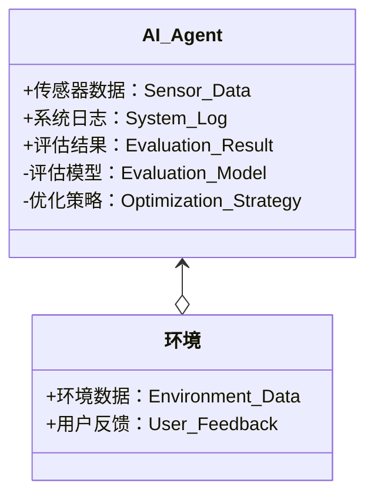
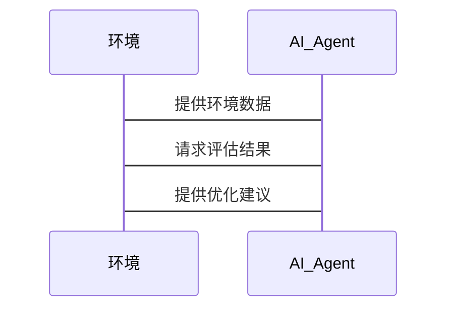

                 


# 《构建具有自我评估能力的AI Agent》

---

## 关键词：
- 自我评估、AI Agent、强化学习、数学模型、系统架构、动态调整、反馈机制

---

## 摘要：
本文深入探讨了构建具有自我评估能力的AI Agent的关键技术与实现方法。通过分析传统AI Agent的局限性，提出了基于自我评估机制的优化方案。文章详细阐述了自我评估的核心概念、数学模型、算法实现以及系统架构设计，并通过实际案例展示了如何实现具备动态调整和自适应学习能力的AI Agent。最后，本文总结了当前技术的优势与挑战，并展望了未来的研究方向。

---

## 正文：

---

### 第1章: 自我评估AI Agent的背景与核心概念

#### 1.1 问题背景
传统AI Agent在处理复杂任务时，往往缺乏对自身状态和行为的深度分析能力，导致在动态变化的环境中表现受限。例如，在自动驾驶系统中，当传感器出现故障或环境突变时，传统AI Agent可能无法有效调整策略，从而引发安全隐患。这种局限性促使我们探索一种能够自我评估、自我优化的AI Agent设计。

#### 1.2 问题描述
自我评估AI Agent的核心目标是实现对自身状态、行为和结果的实时分析与优化。具体包括：
- **状态评估**：对当前环境、任务目标和自身能力的全面评估。
- **行为评估**：分析自身行为的有效性，并根据评估结果进行调整。
- **自我优化**：基于评估结果，动态调整策略和参数，以提高整体性能。

#### 1.3 解决方案概述
为实现自我评估能力，我们提出了一个多模块协同工作的架构：
1. **数据采集模块**：负责收集环境信息、用户反馈和系统日志。
2. **评估模型模块**：构建数学模型对数据进行分析，生成评估结果。
3. **优化策略模块**：根据评估结果动态调整系统参数和行为策略。

#### 1.4 概念结构与核心要素
- **核心概念**：自我评估机制、自适应学习模型。
- **实现路径**：数据采集→评估分析→优化调整。

---

### 第2章: 自我评估机制的核心概念

#### 2.1 自我评估机制的定义
自我评估机制是指AI Agent能够主动分析自身状态、行为和结果的能力。这种能力通过以下三个关键特征体现：
1. **自主性**：无需外部干预，自动完成评估。
2. **动态性**：评估结果随环境和任务变化而调整。
3. **自适应性**：根据评估结果优化自身行为。

#### 2.2 自我评估与外部反馈的关系
自我评估机制与外部反馈机制相辅相成：
- **内部评估**：基于AI Agent的内部数据（如系统日志、传感器数据）进行分析。
- **外部反馈**：通过用户输入或环境反馈获取信息。
- **数据融合**：将内部评估与外部反馈相结合，生成综合评估结果。

#### 2.3 实现路径
1. **数据采集**：通过传感器、日志文件等获取数据。
2. **模型构建**：建立评估模型，分析数据。
3. **结果分析**：生成评估报告，并提出优化建议。

---

### 第3章: 自我评估AI Agent的算法原理

#### 3.1 状态评估模型
状态评估模型通过数学公式对当前状态进行量化分析：
$$ P(s) = \frac{1}{1 + e^{-s}} $$
其中，$s$ 表示当前状态的评分，$P(s)$ 表示状态的概率值。

#### 3.2 行为评估模型
行为评估模型基于强化学习原理，使用Q-learning算法对行为进行评估：
$$ Q(a) = r + \gamma \max(Q(a')) $$
其中，$a$ 是当前动作，$r$ 是奖励值，$\gamma$ 是折扣因子，$a'$ 是后续动作。

#### 3.3 自我优化算法
自我优化算法通过动态调整参数实现：
$$ \theta_{t+1} = \theta_t + \alpha \nabla L $$
其中，$\theta$ 是模型参数，$\alpha$ 是学习率，$\nabla L$ 是损失函数的梯度。

---

### 第4章: 系统分析与架构设计

#### 4.1 问题场景介绍
以自动驾驶系统为例，AI Agent需要实时评估自身传感器状态、决策算法的有效性，并根据评估结果动态调整驾驶策略。

#### 4.2 系统功能设计
- **数据采集模块**：收集环境数据和用户反馈。
- **评估模块**：分析数据并生成评估报告。
- **优化模块**：根据评估结果调整系统参数。

#### 4.3 系统架构设计
使用领域模型类图和系统架构图展示系统的组成与交互关系：



#### 4.4 接口设计与交互流程
- **接口设计**：定义了AI Agent与环境之间的数据接口。
- **交互流程**：通过Mermaid序列图展示交互过程：



---

### 第5章: 项目实战

#### 5.1 环境安装与配置
- 安装Python、TensorFlow、Mermaid等工具。
- 配置开发环境，确保依赖库版本兼容。

#### 5.2 核心代码实现
以下是评估模型的核心代码实现：

```python
import numpy as np
import tensorflow as tf

def state_assessment(s):
    return 1 / (1 + np.exp(-s))

def behavior_assessment(r, gamma, next_Q):
    return r + gamma * np.max(next_Q)

def self_optimization(theta, alpha, gradient):
    return theta + alpha * gradient

# 示例代码
s = np.array([0.5, 1.0, -0.3])
r = 0.8
gamma = 0.9
next_Q = np.array([0.6, 0.7, 0.5])
theta = np.random.randn(3, 1)
alpha = 0.01
gradient = np.array([0.1, -0.05, 0.02])

state_score = state_assessment(s)
behavior_score = behavior_assessment(r, gamma, next_Q)
optimized_theta = self_optimization(theta, alpha, gradient)

print("状态评估结果:", state_score)
print("行为评估结果:", behavior_score)
print("优化后的参数:", optimized_theta)
```

#### 5.3 实际案例分析
通过上述代码实现，我们可以在自动驾驶系统中实时评估传感器状态和驾驶策略的有效性，并根据评估结果动态调整参数，以提高系统的安全性和效率。

---

### 第6章: 总结与展望

#### 6.1 本章小结
本文详细探讨了构建具有自我评估能力的AI Agent的关键技术与实现方法，涵盖了从理论分析到实际应用的全过程。

#### 6.2 注意事项
- 确保数据采集的准确性。
- 定期更新评估模型以适应环境变化。
- 注意算法的收敛性和稳定性。

#### 6.3 最佳实践
- 使用数据可视化工具分析评估结果。
- 定期进行系统压力测试。
- 建立完善的日志系统。

#### 6.4 拓展阅读
- 探索多智能体协同的自我评估机制。
- 研究基于深度学习的评估模型。

---

## 附录
- 附录A: 代码实现细节
- 附录B: Mermaid图表详细解释
- 附录C: 参考文献与拓展资源

--- 

以上是《构建具有自我评估能力的AI Agent》的技术博客文章的完整目录和内容框架，涵盖了从理论到实践的各个方面，确保读者能够全面理解并掌握构建具有自我评估能力的AI Agent的核心技术与实现方法。

