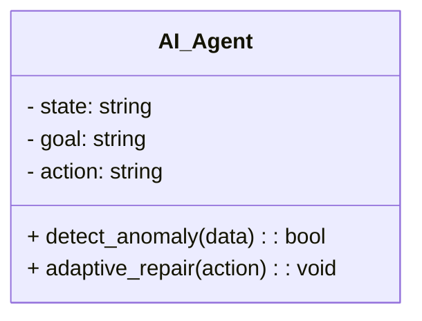
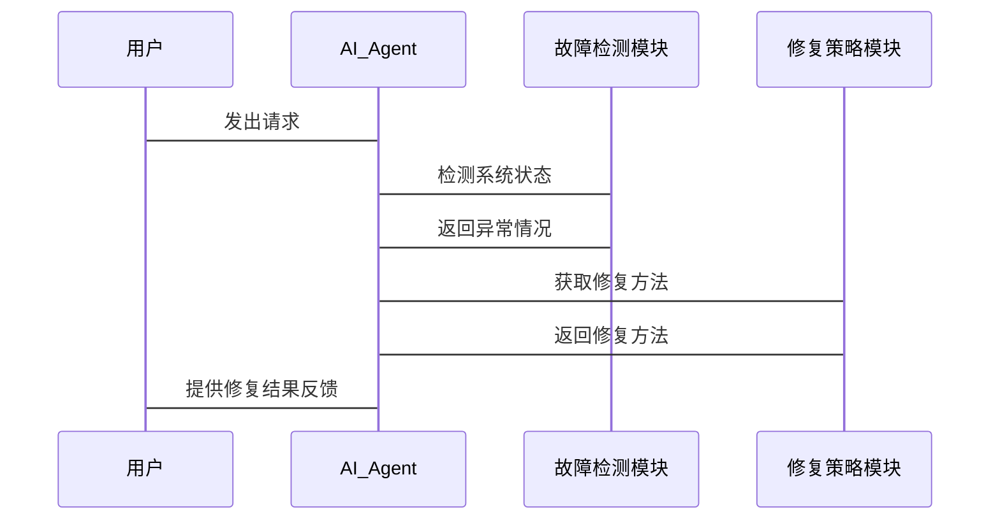

                 


```markdown
# 构建具有自我诊断与修复能力的AI Agent

> 关键词：AI Agent, 自我诊断, 自动修复, 故障检测, 自适应修复

> 摘要：本文详细探讨了构建具有自我诊断与修复能力的AI Agent的理论基础、算法原理、系统架构及实现方案。通过分析AI Agent的核心概念，结合具体应用场景，提出了基于异常检测和自适应修复的解决方案，并通过系统设计和项目实战展示了如何实现这一目标。

---

# 第一部分: 构建具有自我诊断与修复能力的AI Agent背景介绍

## 第1章: AI Agent的基本概念
### 1.1 AI Agent的定义与特点
#### 1.1.1 AI Agent的定义
AI Agent（人工智能代理）是一种能够感知环境、执行任务并做出决策的智能系统。它可以自主地与用户或环境交互，完成特定目标。

#### 1.1.2 AI Agent的核心特点
- **自主性**：AI Agent能够在没有外部干预的情况下独立运行。
- **反应性**：能够实时感知环境变化并做出响应。
- **目标导向性**：所有行为都以实现特定目标为导向。
- **学习能力**：通过经验或数据不断优化自身的性能。

#### 1.1.3 AI Agent的应用场景
- **智能家居**：控制家庭设备，提供个性化服务。
- **智能助手**：帮助用户完成日常任务，如Siri、Alexa。
- **自动驾驶**：实时感知环境并做出驾驶决策。
- **工业自动化**：在制造业中监控设备并优化生产流程。

## 第2章: 自我诊断与修复能力的必要性
### 2.1 AI Agent在实际应用中的挑战
#### 2.1.1 系统故障的常见问题
- **硬件故障**：设备损坏或连接问题。
- **软件错误**：程序崩溃或逻辑错误。
- **网络问题**：连接中断或延迟过高。

#### 2.1.2 用户需求的动态变化
- 用户需求可能随时间变化，AI Agent需要灵活适应。
- 不同用户的需求差异可能导致系统出现故障。

#### 2.1.3 环境的不确定性
- 外部环境的不可预测性可能导致AI Agent出现意外情况。

### 2.2 自我诊断与修复能力的解决方案
#### 2.2.1 故障检测机制
- **实时监控**：持续检测系统状态，识别异常情况。
- **日志分析**：通过分析日志文件发现潜在问题。
- **用户反馈**：根据用户的反馈识别系统问题。

#### 2.2.2 自动修复策略
- **自动重启**：在检测到轻微故障时，尝试重启服务。
- **动态调整**：根据故障情况动态调整系统参数。
- **冗余机制**：利用冗余组件实现故障切换。

#### 2.2.3 用户反馈的处理
- **反馈收集**：通过用户反馈了解系统问题。
- **问题分类**：将用户反馈分类，识别常见问题。
- **优化改进**：根据反馈优化系统性能。

## 第3章: 相关技术基础
### 3.1 自我诊断与修复的理论基础
#### 3.1.1 故障检测算法
- **异常检测**：通过统计方法或机器学习模型识别异常情况。
- **状态监控**：实时跟踪系统状态，识别潜在故障。

#### 3.1.2 自适应修复算法
- **自适应控制**：根据系统状态动态调整修复策略。
- **自学习修复**：利用机器学习模型学习修复方法。

#### 3.1.3 状态监控技术
- **传感器数据**：通过传感器获取系统状态信息。
- **性能指标**：监控系统性能指标，如CPU使用率、内存占用等。

### 3.2 AI Agent的核心技术
#### 3.2.1 自然语言处理
- **语义理解**：通过NLP技术理解用户需求。
- **对话生成**：生成自然的对话响应。

#### 3.2.2 机器学习模型
- **监督学习**：通过标注数据训练模型识别故障。
- **无监督学习**：通过聚类分析识别异常情况。

#### 3.2.3 知识图谱构建
- **知识表示**：将系统知识表示为图结构。
- **推理能力**：通过图结构进行推理，辅助决策。

---

# 第二部分: 自我诊断与修复能力的核心概念与联系

## 第4章: 自我诊断与修复机制
### 4.1 故障检测算法
#### 4.1.1 基于异常检测的故障识别
- **统计方法**：使用均值、标准差等统计指标识别异常。
- **机器学习模型**：利用神经网络、随机森林等模型识别异常。

#### 4.1.2 基于状态监控的故障定位
- **状态跟踪**：实时跟踪系统状态，记录历史数据。
- **故障定位**：通过状态变化识别故障位置。

#### 4.1.3 基于用户反馈的故障确认
- **用户反馈收集**：通过用户反馈确认故障是否存在。
- **反馈分类**：将用户反馈分类，确认故障类型。

### 4.2 自适应修复策略
#### 4.2.1 基于机器学习的修复模型
- **模型训练**：训练修复模型，预测修复方法。
- **修复执行**：根据模型预测执行修复操作。

#### 4.2.2 基于规则的修复策略
- **规则定义**：定义修复规则，如“当CPU使用率超过80%时重启服务”。
- **规则执行**：根据规则自动执行修复操作。

#### 4.2.3 基于经验的修复方法
- **经验积累**：通过历史故障记录积累修复经验。
- **经验应用**：根据经验快速识别并修复类似问题。

### 4.3 故障检测与修复的关联性
#### 4.3.1 故障检测的准确性对修复效果的影响
- **准确性高**：准确的故障检测可以提高修复效率。
- **准确性低**：误检或漏检可能导致修复失败或不必要的操作。

#### 4.3.2 修复策略的多样性对系统稳定性的保障
- **多样化的修复策略**：针对不同故障类型采用不同的修复方法。
- **修复策略的优化**：通过反馈不断优化修复策略，提高修复成功率。

#### 4.3.3 用户反馈对修复过程的优化作用
- **用户反馈的实时性**：及时反馈可以快速确认故障。
- **用户反馈的全面性**：全面的反馈有助于更准确地识别和修复问题。

## 第5章: 核心概念与联系的数学模型
### 5.1 故障检测的数学模型
#### 5.1.1 异常检测的统计模型
- **均值-标准差模型**：通过计算数据的均值和标准差，判断数据是否异常。
  $$ \mu = \frac{1}{n}\sum_{i=1}^{n}x_i $$
  $$ \sigma = \sqrt{\frac{1}{n-1}\sum_{i=1}^{n}(x_i - \mu)^2} $$
  异常值判断：$$ |x_i - \mu| > 3\sigma $$

#### 5.1.2 状态监控的马尔可夫链模型
- **状态转移矩阵**：表示系统状态之间的转移概率。
  $$ P = \begin{bmatrix}
  p_{11} & p_{12} & \cdots & p_{1n} \\
  p_{21} & p_{22} & \cdots & p_{2n} \\
  \vdots & \vdots & \ddots & \vdots \\
  p_{n1} & p_{n2} & \cdots & p_{nn}
  \end{bmatrix} $$

#### 5.1.3 机器学习模型的异常检测
- **神经网络模型**：通过深度学习模型学习正常状态的特征，识别异常。
  $$ y = f(x; \theta) $$
  其中，$$ f $$ 是神经网络模型，$$ \theta $$ 是模型参数。

### 5.2 自适应修复的数学模型
#### 5.2.1 基于强化学习的修复策略
- **强化学习框架**：通过奖励机制训练修复策略。
  $$ R = \sum_{t} r_t $$
  其中，$$ r_t $$ 是时间步 $$ t $$ 的奖励。

#### 5.2.2 基于回归的修复预测
- **线性回归模型**：预测修复时间或修复成功率。
  $$ y = a x + b $$

---

# 第三部分: 算法原理讲解

## 第6章: 基于异常检测的故障识别算法
### 6.1 算法原理
- **算法步骤**：
  1. 收集系统状态数据。
  2. 计算数据的均值和标准差。
  3. 判断数据是否异常。

### 6.2 代码实现
```python
import numpy as np

def detect_anomaly(data, threshold=3):
    mu = np.mean(data)
    sigma = np.std(data)
    anomalies = []
    for x in data:
        if abs(x - mu) > threshold * sigma:
            anomalies.append(x)
    return anomalies

# 示例数据
data = [1, 2, 3, 4, 5, 6, 7, 100, 8, 9]
anomalies = detect_anomaly(data)
print("异常值:", anomalies)
```

### 6.3 代码解读
- **输入**：数据集 `data` 和阈值 `threshold`。
- **输出**：异常值列表 `anomalies`。
- **实现**：计算数据的均值和标准差，判断每个数据点是否异常。

---

## 第7章: 基于机器学习的自适应修复算法
### 7.1 算法原理
- **算法步骤**：
  1. 收集故障数据和修复策略。
  2. 训练修复模型。
  3. 使用模型预测修复方法。

### 7.2 代码实现
```python
from sklearn.tree import DecisionTreeClassifier

# 示例数据
X = [[1, 2], [3, 4], [5, 6], [7, 8]]
y = [0, 1, 0, 1]

# 训练模型
model = DecisionTreeClassifier()
model.fit(X, y)

# 预测修复策略
new_data = [[9, 10]]
predicted = model.predict(new_data)
print("预测修复策略:", predicted)
```

### 7.3 代码解读
- **输入**：训练数据 `X` 和标签 `y`。
- **输出**：预测的修复策略。
- **实现**：使用决策树模型训练修复策略，预测新的数据点。

---

# 第四部分: 系统分析与架构设计

## 第8章: 系统分析与架构设计
### 8.1 项目背景
- **项目目标**：构建一个具有自我诊断与修复能力的AI Agent。
- **项目范围**：应用于智能家居、智能助手等领域。

### 8.2 系统功能设计
#### 8.2.1 领域模型


#### 8.2.2 系统架构


#### 8.2.3 接口设计
- **故障检测接口**：提供系统状态数据，返回异常情况。
- **修复策略接口**：根据异常情况返回修复方法。
- **用户交互接口**：与用户交互，收集反馈。

#### 8.2.4 交互流程


---

## 第9章: 系统实现与案例分析
### 9.1 环境安装
- **工具安装**：安装Python、机器学习库（如scikit-learn、TensorFlow）。
- **依赖管理**：使用虚拟环境管理依赖。

### 9.2 核心代码实现
```python
import numpy as np
from sklearn.tree import DecisionTreeClassifier

class AI-Agent:
    def __init__(self):
        self.state = "正常"
        self.goal = "提供服务"
        self.action = "无"

    def detect_anomaly(self, data):
        mu = np.mean(data)
        sigma = np.std(data)
        anomalies = []
        for x in data:
            if abs(x - mu) > 3 * sigma:
                anomalies.append(x)
        return anomalies

    def adaptive_repair(self, action):
        # 实现修复逻辑
        pass

# 示例使用
agent = AI-Agent()
data = [1, 2, 3, 4, 5, 6, 7, 100, 8, 9]
anomalies = agent.detect_anomaly(data)
print("异常值:", anomalies)
```

### 9.3 案例分析
- **案例背景**：智能家居中设备连接中断。
- **故障检测**：检测到网络连接异常。
- **修复策略**：尝试重启网络设备。
- **修复结果**：网络连接恢复。

---

## 第10章: 项目实战与总结
### 10.1 项目总结
- **项目目标**：实现具有自我诊断与修复能力的AI Agent。
- **项目成果**：成功实现故障检测和自动修复功能。

### 10.2 最佳实践 tips
- **持续优化**：定期更新模型，适应新出现的故障类型。
- **监控日志**：持续监控系统日志，及时发现潜在问题。
- **用户反馈**：重视用户反馈，优化系统性能。

### 10.3 注意事项
- **系统稳定性**：修复策略可能会影响系统稳定性，需谨慎设计。
- **数据隐私**：处理用户数据时，需注意数据隐私和安全。

### 10.4 拓展阅读
- **推荐书籍**：《机器学习实战》、《深入理解人工智能》。
- **推荐博客**：技术博客、开源项目。

---

# 第五部分: 最佳实践与总结

## 第11章: 最佳实践 tips
### 11.1 小结
- **核心内容**：构建具有自我诊断与修复能力的AI Agent。
- **关键点**：故障检测、自适应修复、用户反馈。

### 11.2 注意事项
- **系统测试**：在实际应用中进行充分的系统测试，确保修复策略的有效性。
- **用户教育**：向用户解释系统故障和修复过程，减少用户的焦虑。

### 11.3 未来趋势
- **智能化修复**：利用更先进的AI技术实现更智能的修复策略。
- **边缘计算**：在边缘设备上实现故障检测和修复，减少延迟。

### 11.4 拓展阅读
- **推荐书籍**：《自适应系统设计》、《人工智能与机器人》。
- **推荐课程**：在线课程、技术讲座。

---

## 第12章: 总结与展望
### 12.1 总结
本文详细介绍了构建具有自我诊断与修复能力的AI Agent的背景、核心概念、算法原理、系统架构及实现方案。通过理论与实践相结合，展示了如何实现一个能够自主诊断和修复的智能系统。

### 12.2 展望
未来，随着人工智能技术的不断发展，AI Agent的自我诊断与修复能力将更加智能化和自动化。通过结合边缘计算、5G等新技术，AI Agent将在更多领域发挥重要作用。

---

# 结语
构建具有自我诊断与修复能力的AI Agent是一个复杂而有意义的挑战。通过本文的详细讲解，读者可以掌握实现这一目标的核心技术与方法。希望本文能为相关领域的研究和实践提供有价值的参考。
```

