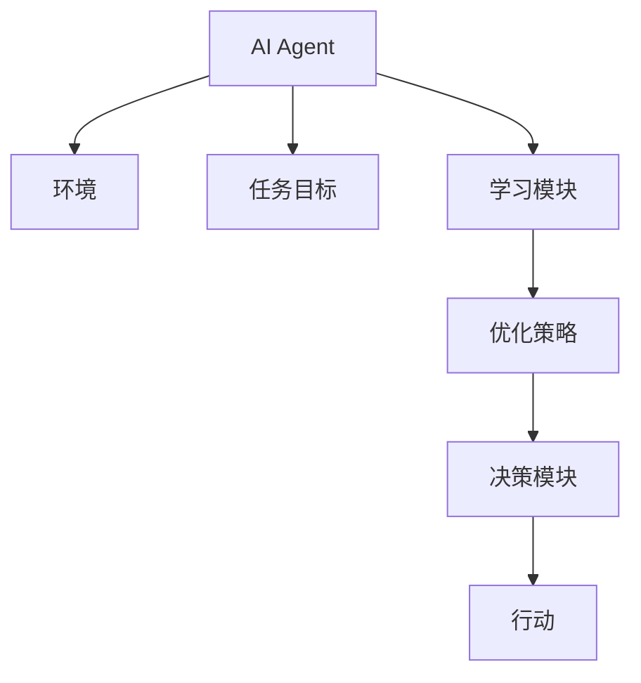
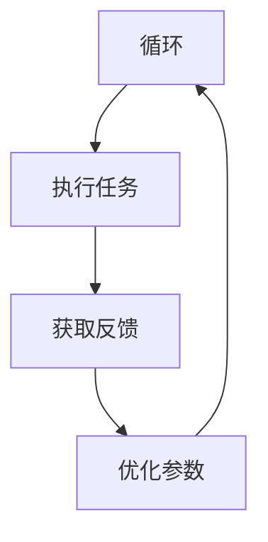
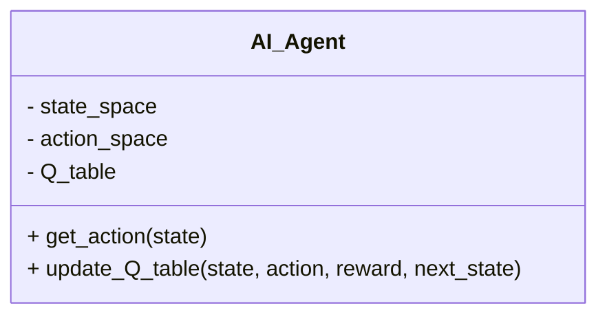
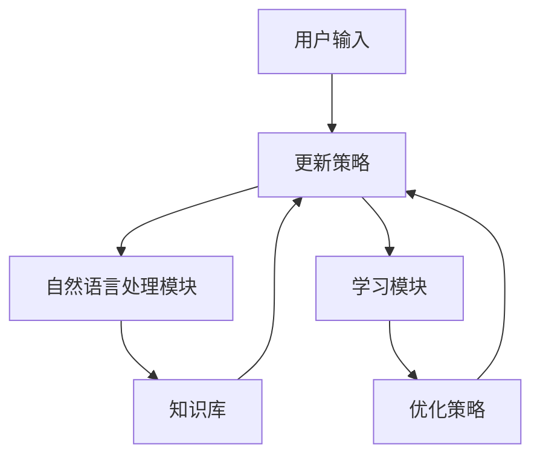
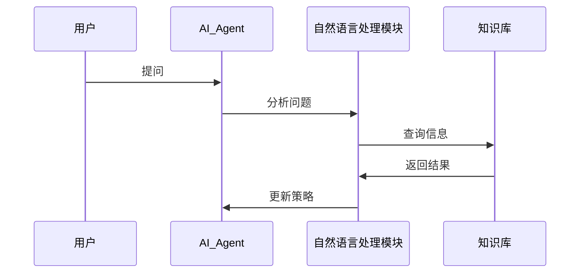
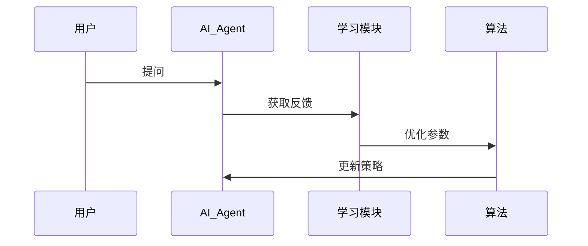

                 


# 构建具有自我进化能力的AI Agent系统

> 关键词：AI Agent, 自我进化, 人工智能, 系统架构, 强化学习, 自适应算法

> 摘要：  
本文详细探讨了构建具有自我进化能力的AI Agent系统的各个方面，从理论基础到实际应用，结合算法原理和系统架构设计，帮助读者全面理解如何设计和实现一个能够自我优化、适应复杂环境的智能系统。

---

# 第1章：AI Agent系统背景与问题背景

## 1.1 AI Agent的基本概念
### 1.1.1 什么是AI Agent
AI Agent（人工智能代理）是指在计算机系统中能够感知环境、自主决策并采取行动以实现特定目标的实体。AI Agent可以是软件程序、机器人或其他智能系统，具备以下核心特征：
- **自主性**：能够在没有外部干预的情况下独立运行。
- **反应性**：能够感知环境并实时调整行为。
- **目标导向性**：所有行为都以实现特定目标为导向。
- **学习能力**：能够通过经验或数据优化自身性能。

### 1.1.2 AI Agent的核心特征
AI Agent的核心特征包括：
1. **自主性**：无需外部干预即可完成任务。
2. **反应性**：能够实时感知环境并调整行为。
3. **目标导向性**：所有行为以目标为导向。
4. **学习能力**：能够通过经验优化自身性能。

### 1.1.3 自我进化能力的定义
自我进化能力是指AI Agent能够在运行过程中，通过不断学习和优化自身算法或参数，逐步提升性能、适应环境变化的能力。

---

## 1.2 自我进化AI Agent的背景与问题背景
### 1.2.1 当前AI Agent的发展现状
当前，AI Agent已经在多个领域得到广泛应用，例如：
- **自动驾驶**：自动驾驶汽车中的AI Agent能够实时感知环境并做出决策。
- **智能助手**：如Siri、Alexa等智能助手能够通过与用户的交互不断优化自身的响应策略。
- **游戏AI**：在电子游戏中，AI Agent能够通过学习不断提高游戏水平。

### 1.2.2 自我进化能力的重要性
随着环境的复杂化和多样化，传统的静态AI Agent难以应对所有场景。引入自我进化能力可以使AI Agent具备更强的适应性和学习能力，能够在动态环境中持续优化自身性能。

### 1.2.3 问题背景与挑战
- **动态环境适应性**：环境的变化可能导致AI Agent的初始策略失效。
- **复杂决策过程**：在复杂场景中，AI Agent需要同时考虑多个因素，做出最优决策。
- **学习效率**：如何设计高效的算法以实现快速学习和优化是一个关键挑战。

---

## 1.3 问题描述与解决思路
### 1.3.1 自我进化AI Agent的核心问题
- 如何实现AI Agent的自我学习和优化。
- 如何设计算法以支持持续的性能提升。

### 1.3.2 问题解决的关键点
- **自我学习机制**：设计高效的算法以实现持续学习。
- **动态优化策略**：在运行过程中实时调整参数以适应环境变化。

### 1.3.3 解决方案的初步思路
- 引入强化学习算法，通过奖励机制优化AI Agent的行为。
- 设计自适应算法，根据环境反馈动态调整系统参数。

---

## 1.4 自我进化AI Agent的边界与外延
### 1.4.1 系统边界
- **输入**：环境反馈、用户输入、任务目标。
- **输出**：决策、行动、状态更新。

### 1.4.2 核心功能的外延
- **自适应学习**：通过强化学习或神经网络优化行为。
- **动态规划**：在复杂环境中规划最优路径。

### 1.4.3 相关领域的关联性
- **强化学习**：作为核心算法之一。
- **自适应控制**：用于动态环境中的实时调整。
- **分布式系统**：支持多AI Agent协作。

---

## 1.5 概念结构与核心要素
### 1.5.1 概念结构图


### 1.5.2 核心要素分析
- **环境**：AI Agent感知和交互的外部世界。
- **任务目标**：AI Agent需要完成的具体任务。
- **学习模块**：负责接收反馈并优化算法。

### 1.5.3 要素之间的关系
- AI Agent通过感知环境并结合任务目标，利用学习模块优化自身策略，最终输出决策和行动。

---

# 第2章：自我进化AI Agent的核心原理

## 2.1 自我进化机制的原理
### 2.1.1 自适应学习机制
自适应学习机制是AI Agent的核心，通过以下步骤实现：
1. **感知环境**：通过传感器或接口获取环境信息。
2. **分析反馈**：根据环境反馈调整策略。
3. **优化算法**：利用强化学习或遗传算法优化参数。

### 2.1.2 自我优化算法
自我优化算法通过以下步骤实现：
1. **初始化参数**：设定初始算法参数。
2. **执行任务**：根据当前参数执行任务。
3. **接收反馈**：获取环境反馈。
4. **优化参数**：根据反馈调整参数，优化算法性能。

### 2.1.3 自动进化过程
自动进化过程是一个循环迭代的过程：
1. **学习阶段**：通过强化学习或其他算法学习最优策略。
2. **测试阶段**：在真实环境中测试策略的有效性。
3. **优化阶段**：根据测试结果优化算法。

---

## 2.2 自我进化与传统AI Agent的区别
### 2.2.1 传统AI Agent的功能特点
- **静态策略**：依赖于预设的规则和策略。
- **有限适应性**：难以在动态环境中调整策略。

### 2.2.2 自我进化AI Agent的独特优势
- **动态适应性**：能够在运行过程中优化策略。
- **持续改进能力**：通过学习不断提高性能。

### 2.2.3 两者的对比分析
| 特性             | 传统AI Agent           | 自我进化AI Agent         |
|------------------|------------------------|---------------------------|
| 策略调整能力     | 有限                   | 强大                     |
| 环境适应性       | 较弱                   | 强大                     |
| 学习能力         | 无                     | 有                       |

---

## 2.3 核心概念属性特征对比
| 特性             | 自我进化AI Agent       | 传统AI Agent             |
|------------------|------------------------|---------------------------|
| 是否具备自适应性   | 是                     | 否                       |
| 是否支持动态优化   | 是                     | 否                       |
| 是否依赖外部数据   | 是                     | 否                       |

---

## 2.4 ER实体关系图架构
```mermaid
erd
    客户端 <--[请求]-> AI Agent
    AI Agent <--[反馈]-> 环境
    AI Agent <--[策略调整]-> 学习模块
    学习模块 <--[优化参数]-> 算法
```

---

# 第3章：自我进化AI Agent的算法原理

## 3.1 强化学习算法的数学模型
### 3.1.1 强化学习的基本公式
强化学习的核心公式是Q-learning算法：
$$ Q(s, a) = Q(s, a) + \alpha [r + \gamma \max Q(s', a') - Q(s, a)] $$
其中：
- \( s \) 是当前状态。
- \( a \) 是当前动作。
- \( r \) 是奖励值。
- \( \gamma \) 是折扣因子。
- \( \alpha \) 是学习率。

### 3.1.2 状态转移概率
状态转移概率可以通过马尔可夫决策过程（MDP）描述：
$$ P(s' | s, a) $$
表示从状态 \( s \) 采取动作 \( a \) 后转移到状态 \( s' \) 的概率。

---

## 3.2 自我进化算法的实现步骤
### 3.2.1 算法流程图


---

## 3.3 算法实现的核心代码
### 3.3.1 强化学习算法实现
```python
import numpy as np

class AI_Agent:
    def __init__(self, state_space, action_space):
        self.state_space = state_space
        self.action_space = action_space
        self.Q_table = np.zeros((state_space, action_space))
    
    def get_action(self, state):
        # 探索与利用策略
        epsilon = 0.1
        if np.random.random() < epsilon:
            return np.random.randint(self.action_space)
        else:
            return np.argmax(self.Q_table[state])
    
    def update_Q_table(self, state, action, reward, next_state):
        learning_rate = 0.1
        discount_factor = 0.9
        self.Q_table[state][action] += learning_rate * (reward + discount_factor * np.max(self.Q_table[next_state]) - self.Q_table[state][action])
```

---

## 3.4 算法原理的详细讲解
### 3.4.1 强化学习的基本原理
强化学习通过智能体与环境的交互，逐步学习最优策略。智能体通过执行动作获得奖励，根据奖励调整策略，最终找到最优行为策略。

### 3.4.2 自我优化算法的实现
自我优化算法通过不断调整参数，优化强化学习算法的性能。具体步骤包括：
1. **初始化参数**：设定初始参数值。
2. **执行任务**：根据当前参数执行任务。
3. **获取反馈**：根据任务执行结果获得反馈。
4. **优化参数**：根据反馈调整参数，优化算法性能。

---

## 3.5 通过实例理解算法的数学模型
### 3.5.1 实例：迷宫导航问题
假设有一个迷宫，智能体需要从起点走到终点。通过强化学习算法，智能体逐步学习最优路径。

### 3.5.2 算法数学模型的应用
在迷宫导航问题中，智能体通过强化学习算法更新Q表，最终找到最优路径。

---

# 第4章：自我进化AI Agent的系统分析与架构设计

## 4.1 系统分析
### 4.1.1 问题场景介绍
以一个智能助手为例，智能助手需要能够根据用户的反馈不断优化自身的响应策略。

### 4.1.2 系统功能设计


---

## 4.2 系统架构设计
### 4.2.1 分层架构设计


---

## 4.3 系统接口设计
### 4.3.1 接口定义
- **输入接口**：用户输入、环境反馈。
- **输出接口**：决策、行动。

### 4.3.2 接口交互流程


---

## 4.4 系统交互流程图


---

# 第5章：自我进化AI Agent的项目实战

## 5.1 环境安装
### 5.1.1 安装Python环境
```bash
python --version
pip install numpy
```

### 5.1.2 安装相关库
```bash
pip install gym
pip install matplotlib
```

---

## 5.2 系统核心实现源代码
### 5.2.1 强化学习算法实现
```python
import gym
import numpy as np
import matplotlib.pyplot as plt

class AI_Agent:
    def __init__(self, env):
        self.env = env
        self.state_space = env.observation_space.shape[0]
        self.action_space = env.action_space.n
        self.Q_table = np.zeros((self.state_space, self.action_space))
    
    def get_action(self, state):
        epsilon = 0.1
        if np.random.random() < epsilon:
            return self.env.action_space.sample()
        else:
            return np.argmax(self.Q_table[state])
    
    def update_Q_table(self, state, action, reward, next_state):
        learning_rate = 0.1
        discount_factor = 0.9
        self.Q_table[state][action] += learning_rate * (reward + discount_factor * np.max(self.Q_table[next_state]) - self.Q_table[state][action])

    def train(self, episodes):
        rewards = []
        for episode in range(episodes):
            state = self.env.reset()
            episode_reward = 0
            done = False
            while not done:
                action = self.get_action(state)
                next_state, reward, done, _ = self.env.step(action)
                self.update_Q_table(state, action, reward, next_state)
                episode_reward += reward
                state = next_state
            rewards.append(episode_reward)
        plt.plot(rewards)
        plt.show()

if __name__ == "__main__":
    env = gym.make('CartPole-v1')
    agent = AI_Agent(env)
    agent.train(1000)
```

---

## 5.3 代码应用解读与分析
### 5.3.1 代码实现的强化学习算法
上述代码实现了一个强化学习算法，用于训练AI Agent在CartPole环境中保持平衡。

---

## 5.4 实际案例分析
### 5.4.1 案例：智能助手优化
通过强化学习算法，智能助手能够根据用户的反馈不断优化自身的响应策略。

---

## 5.5 项目小结
通过本章的项目实战，我们了解了如何将强化学习算法应用于实际场景，实现了AI Agent的自我进化能力。

---

# 第6章：自我进化AI Agent的最佳实践

## 6.1 小结
通过本文的详细讲解，我们了解了如何构建具有自我进化能力的AI Agent系统。

## 6.2 注意事项
- **算法选择**：根据具体场景选择合适的算法。
- **性能优化**：在实际应用中需要注意算法的计算效率。

## 6.3 拓展阅读
- 《Reinforcement Learning: Theory and Algorithms》
- 《Self-Adaptive Systems: Design and Applications》

---

# 结语

通过本文的详细讲解，我们了解了如何构建具有自我进化能力的AI Agent系统，从理论到实践，帮助读者掌握相关知识和技术。

