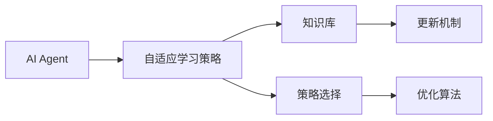
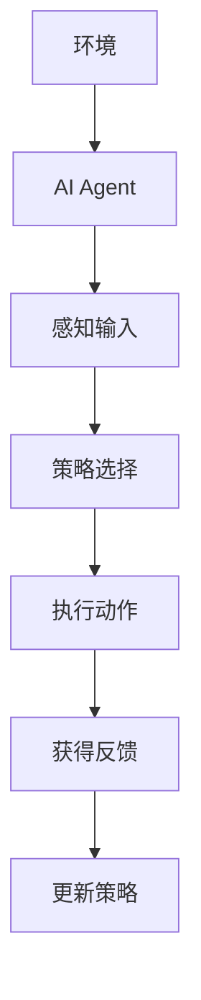
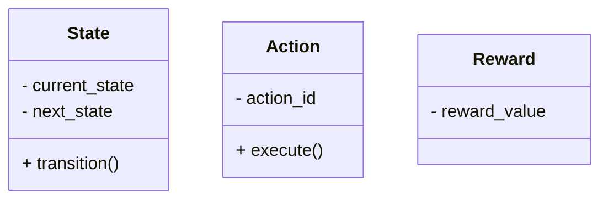
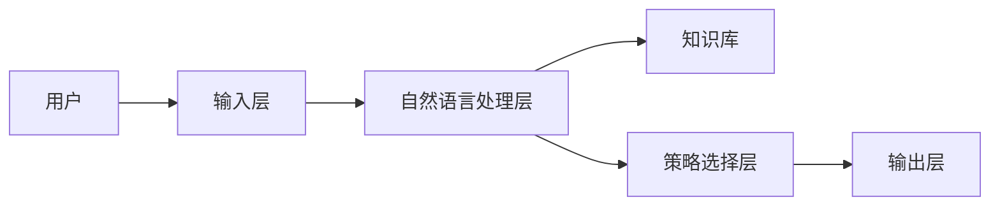

                 


# 构建具有自适应学习策略的AI Agent

> 关键词：AI Agent，自适应学习策略，强化学习，元学习，知识更新，动态环境

> 摘要：本文详细探讨了构建具有自适应学习策略的AI Agent的方法，从背景介绍到核心概念，从算法原理到系统架构，从项目实战到最佳实践，全面分析了如何设计和实现能够根据环境变化和任务需求自动调整学习策略的智能体。文章结合理论分析和实际案例，深入剖析了自适应学习策略的原理、算法实现、系统设计和应用场景。

---

# 第一部分：背景与核心概念

# 第1章：AI Agent与自适应学习策略概述

## 1.1 AI Agent的基本概念

### 1.1.1 AI Agent的定义
AI Agent（人工智能代理）是指能够感知环境、执行任务并做出决策的智能实体。它通过传感器获取信息，利用计算模型处理信息，并通过执行器与环境交互。

### 1.1.2 自适应学习策略的内涵
自适应学习策略是指AI Agent能够根据环境的变化和任务的需求，动态调整其学习目标、学习速率和学习方法的能力。这种能力使得AI Agent能够在复杂和动态的环境中保持高效和稳定的表现。

### 1.1.3 问题背景与问题描述
在实际应用中，传统的静态学习模型难以应对环境的动态变化和任务的多样性。例如，在智能客服系统中，用户的问题可能涉及多个领域，AI Agent需要能够快速切换学习模式，以应对不同领域的问题。

## 1.2 自适应学习策略的重要性

### 1.2.1 知识更新的挑战
知识的快速变化要求AI Agent能够不断更新其知识库，以保持对最新信息的掌握。

### 1.2.2 动态环境中的适应性需求
在动态环境中，AI Agent需要能够根据环境的变化调整其行为策略，以应对不确定性。

### 1.2.3 自适应学习的边界与外延
自适应学习的边界在于如何在有限的计算资源和时间内实现高效的策略调整，而外延则涉及多模态数据的处理和跨任务的学习。

## 1.3 自适应学习策略的核心要素

### 1.3.1 知识表示与更新机制
知识表示是自适应学习的基础，更新机制决定了如何高效地更新知识。

### 1.3.2 策略选择与优化算法
策略选择决定了AI Agent如何在多种可能的策略中选择最优解，优化算法则用于不断改进策略。

### 1.3.3 多模态数据处理能力
自适应学习策略需要能够处理多种类型的数据，例如文本、图像和语音，以实现更全面的理解和决策。

## 1.4 本章小结

---

# 第2章：自适应学习策略的原理与核心概念

## 2.1 自适应学习策略的原理

### 2.1.1 知识表示与更新机制
知识表示可以采用图结构、向量表示等多种形式，更新机制则包括在线更新和离线更新两种模式。

### 2.1.2 策略选择与优化算法
策略选择可以通过强化学习、元学习等方法实现，优化算法则包括梯度下降、遗传算法等。

### 2.1.3 多模态数据处理能力
多模态数据处理能力使得AI Agent能够从多个角度理解问题，从而做出更准确的决策。

## 2.2 核心概念对比分析

### 2.2.1 自适应学习策略与传统机器学习的对比
传统机器学习模型通常在训练完成后不再更新，而自适应学习策略允许模型在推理过程中不断更新。

### 2.2.2 策略调整机制与强化学习的联系
策略调整机制是强化学习的核心，强化学习通过奖励机制引导策略的优化。

### 2.2.3 自适应学习策略的属性特征对比表

| 属性 | 自适应学习策略 | 非自适应学习策略 |
|------|----------------|-------------------|
| 知识更新 | 动态更新       | 静态不变         |
| 策略调整 | 根据环境变化   | 固定策略         |
| 适应性 | 高            | 低               |

## 2.3 实体关系图



## 2.4 本章小结

---

# 第3章：自适应学习策略的算法原理

## 3.1 强化学习算法

### 3.1.1 Q-learning算法

#### 3.1.1.1 算法流程
1. 初始化Q表。
2. 在每个时间步中，根据当前状态选择动作。
3. 执行动作，获得奖励。
4. 更新Q表中的值。

#### 3.1.1.2 代码实现
```python
def q_learning(env, alpha=0.1, gamma=0.99):
    q_table = {}
    for episode in range(max_episodes):
        state = env.reset()
        while True:
            # 选择动作
            if state not in q_table:
                q_table[state] = [0.0 for _ in range(env.action_space)]
            action = choose_action(q_table[state])
            next_state, reward, done = env.step(action)
            # 更新Q表
            q_table[state][action] += alpha * (reward + gamma * max(q_table[next_state]) - q_table[state][action])
            if done:
                break
```

### 3.1.2 策略梯度算法

#### 3.1.2.1 算法流程
1. 初始化参数。
2. 采样动作，计算策略梯度。
3. 更新参数。

#### 3.1.2.2 代码实现
```python
def policy_gradient(env, theta, learning_rate=0.01):
    optimizer = AdamOptimizer(learning_rate).minimize(loss)
    for episode in range(max_episodes):
        state, reward, done = env.reset(), 0, False
        while not done:
            # 计算概率分布
            with tf.GradientTape() as tape:
                prob = model(state)
                action = sample(prob)
                log_prob = tf.log(prob)
                # 计算损失
                loss = -log_prob * reward
            # 更新参数
            gradients = tape.gradient(loss, model.trainable_variables)
            optimizer.apply_gradients(zip(gradients, model.trainable_variables))
```

### 3.1.3 算法对比与应用场景
Q-learning适用于离散动作空间，而策略梯度适用于连续动作空间。

---

## 3.2 元学习算法

### 3.2.1 MAML算法

#### 3.2.1.1 算法流程
1. 初始化参数。
2. 在支持集上进行内循环优化。
3. 在查询集上进行外循环优化。

#### 3.2.1.2 代码实现
```python
def maml_update(model, optimizer, support, query):
    # 内循环优化
    with tf.GradientTape(persistent=True) as inner_tape:
        loss_support = model.loss(support)
    inner grads = inner_tape.gradient(loss_support, model.trainable_variables)
    # 外循环优化
    with tf.GradientTape as outer_tape:
        loss_query = model.loss(query)
        outer_tape.watch(inner grads)
        loss_total = loss_query + tf.reduce_sum([tf.norm(g) for g in inner grads])
    outer grads = outer_tape.gradient(loss_total, model.trainable_variables)
    optimizer.apply_gradients(zip(outer grads, model.trainable_variables))
```

### 3.2.2 Reptile算法

#### 3.2.2.1 算法流程
1. 初始化参数。
2. 在任务上进行优化。
3. 更新全局参数。

#### 3.2.2.2 代码实现
```python
def reptile_update(model, optimizer, tasks):
    for task in tasks:
        with tf.GradientTape() as tape:
            loss_task = model.loss(task)
        grads = tape.gradient(loss_task, model.trainable_variables)
        # 更新全局参数
        for g, var in zip(grads, model.trainable_variables):
            var.assign(var + reptile_alpha * g)
```

### 3.2.3 元学习的数学模型

#### 3.2.3.1 MAML的数学模型
$$ L_{\text{meta}} = \sum_{i=1}^{N} \mathbb{E}_{(x,y)\sim D_i}[\log p(y|x; \theta_{i+})] $$
其中，$\theta_{i+} = \theta_{i-} + \alpha \nabla_{\theta_{i-}} L_i(\theta_{i-})$。

#### 3.2.3.2 Reptile的数学模型
$$ \theta_{\text{new}} = \theta_{\text{old}} + \alpha \sum_{i=1}^{N} \nabla_{\theta} L_i(\theta_{\text{old}}) $$

---

## 3.3 算法流程图



---

## 3.4 算法实现代码

```python
def q_learning(env, alpha=0.1, gamma=0.99):
    q_table = {}
    for episode in range(max_episodes):
        state = env.reset()
        while True:
            if state not in q_table:
                q_table[state] = [0.0 for _ in range(env.action_space)]
            action = choose_action(q_table[state])
            next_state, reward, done = env.step(action)
            q_table[state][action] += alpha * (reward + gamma * max(q_table[next_state]) - q_table[state][action])
            state = next_state
            if done:
                break
```

---

## 3.5 数学公式

$$ Q(s,a) = Q(s,a) + \alpha (r + \gamma \max Q(s',a') - Q(s,a)) $$

---

# 第4章：系统分析与架构设计

## 4.1 问题场景介绍

### 4.1.1 智能客服助手
AI Agent需要能够理解用户的问题，并根据上下文动态调整其回答策略。

---

## 4.2 系统功能设计

### 4.2.1 领域模型

#### 4.2.1.1 领域模型类图



---

### 4.2.2 系统架构设计

#### 4.2.2.1 系统架构图



---

### 4.2.3 系统接口设计

#### 4.2.3.1 接口定义
- 输入接口：接收用户输入。
- 输出接口：生成回复。

---

### 4.2.4 系统交互流程

#### 4.2.4.1 交互流程图


---

## 4.3 本章小结

---

# 第5章：项目实战

## 5.1 环境配置

### 5.1.1 安装依赖
- Python 3.8+
- TensorFlow 2.0+
- gym库

```bash
pip install gym tensorflow
```

---

## 5.2 系统核心实现

### 5.2.1 实现代码

#### 5.2.1.1 Q-learning实现
```python
def q_learning(env, alpha=0.1, gamma=0.99):
    q_table = {}
    for episode in range(max_episodes):
        state = env.reset()
        while True:
            if state not in q_table:
                q_table[state] = [0.0 for _ in range(env.action_space)]
            action = choose_action(q_table[state])
            next_state, reward, done = env.step(action)
            q_table[state][action] += alpha * (reward + gamma * max(q_table[next_state]) - q_table[state][action])
            state = next_state
            if done:
                break
```

---

### 5.2.2 代码应用解读

#### 5.2.2.1 知识库更新
知识库的更新可以通过定期调用API获取最新数据。

---

## 5.3 案例分析与总结

---

## 5.4 本章小结

---

# 第6章：最佳实践

## 6.1 小结

---

## 6.2 注意事项

---

## 6.3 拓展阅读

---

# 第7章：未来展望

---

# 参考文献

---

通过以上目录大纲，您可以按照每个章节的详细内容进行逐步撰写。

