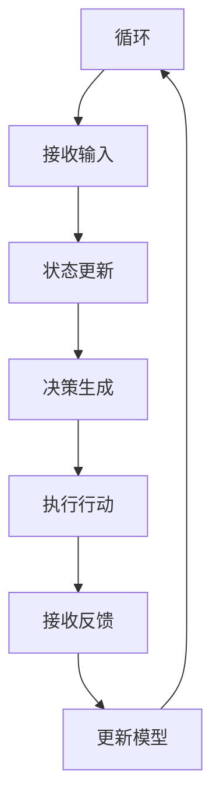
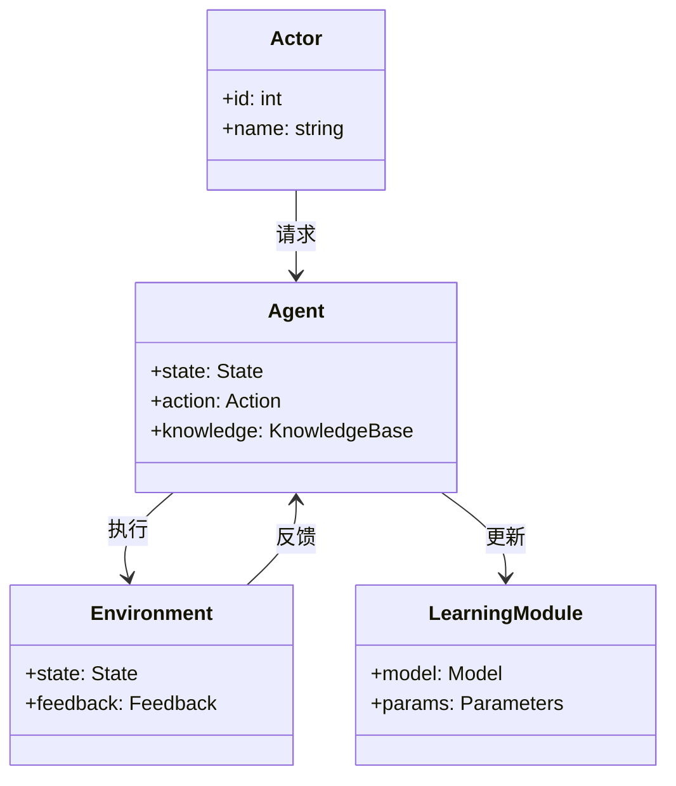
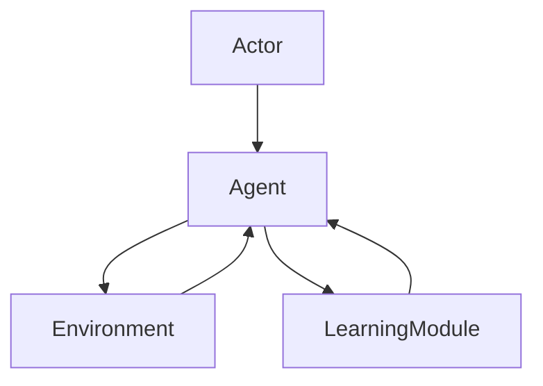

                 


# 构建具有自适应学习能力的AI Agent

## 关键词
- 自适应学习
- AI Agent
- 人工智能
- 强化学习
- 深度学习
- 系统架构
- 算法原理

## 摘要
构建具有自适应学习能力的AI Agent是当前人工智能领域的重要研究方向。本文将从基础概念、核心原理、系统架构到实际应用，全面介绍如何设计和实现一个能够根据环境反馈动态调整行为的自适应学习AI Agent。文章内容包括：背景介绍、核心概念、算法原理、系统架构设计、项目实战、优化与总结等部分，旨在为读者提供一个完整的构建指南。

---

# 第1章: 自适应学习AI Agent的背景与核心概念

## 1.1 问题背景与描述
### 1.1.1 当前AI Agent的发展现状
随着人工智能技术的快速发展，AI Agent（智能体）在各个领域的应用越来越广泛。传统的AI Agent通常依赖于固定的规则或预设的策略来执行任务，但在复杂多变的环境中，这种静态的策略往往无法满足动态变化的需求。

### 1.1.2 自适应学习能力的核心问题
自适应学习能力是AI Agent在动态环境中保持高效性和准确性的关键。通过自适应学习，AI Agent能够根据环境反馈不断优化自身的决策策略和行为模式。

### 1.1.3 问题的边界与外延
自适应学习AI Agent的核心问题在于如何设计一个能够动态调整策略的学习机制。其边界包括环境的动态变化、学习的效率和准确性，以及与用户的交互方式。

## 1.2 自适应学习AI Agent的核心概念
### 1.2.1 自适应学习的定义与特征
自适应学习是指AI Agent能够根据环境反馈和任务需求动态调整其学习策略和行为模式的能力。其主要特征包括动态性、反馈驱动和自适应性。

### 1.2.2 AI Agent的基本组成与功能
AI Agent通常由感知模块、决策模块、执行模块和学习模块组成。其核心功能包括感知环境、制定决策、执行动作和优化学习策略。

### 1.2.3 自适应学习与传统机器学习的区别
与传统机器学习相比，自适应学习更注重动态性和实时性，能够根据环境反馈快速调整模型参数和策略。

## 1.3 本章小结
本章介绍了自适应学习AI Agent的背景、核心概念和与传统机器学习的区别，为后续章节的深入讨论奠定了基础。

---

# 第2章: 自适应学习AI Agent的核心概念与联系

## 2.1 核心概念原理
### 2.1.1 自适应学习的数学模型
自适应学习的核心是通过优化算法不断更新模型参数。常用的数学模型包括强化学习和基于梯度的优化方法。

### 2.1.2 AI Agent的行为决策机制
AI Agent的行为决策基于当前状态、环境反馈和学习模型。决策过程通常包括状态感知、策略选择和动作执行。

### 2.1.3 自适应学习与环境的交互模型
自适应学习通过与环境的交互不断获取反馈信息，用于优化模型参数和策略。环境的动态性是自适应学习的核心驱动力。

## 2.2 核心概念属性特征对比
### 2.2.1 自适应学习能力的特征对比表
| 特征 | 自适应学习 | 非自适应学习 |
|------|------------|---------------|
| 动态性 | 高          | 低             |
| 反馈驱动 | 高          | 低             |
| 自适应性 | 高          | 低             |

### 2.2.2 AI Agent与传统AI的区别
| 属性 | AI Agent | 传统AI |
|------|----------|---------|
| 行为 | 自主决策 | 执行任务 |
| 学习 | 动态调整 | 静态规则 |

### 2.2.3 自适应学习的优劣势分析
#### 优势
- 能够在动态环境中保持高效性。
- 可以根据反馈快速调整策略。

#### 劣势
- 对环境的依赖性强。
- 对学习算法的实时性和准确性要求高。

## 2.3 ER实体关系图架构
```mermaid
er
    Actor: 用户
    Agent: AI Agent
    Environment: 环境
    Knowledge: 知识库
    Learning: 学习模块
    Action: 行动
    Feedback: 反馈

    Actor --> Agent: 发出请求
    Agent --> Environment: 执行行动
    Environment --> Agent: 返回反馈
    Agent --> Learning: 更新知识
    Learning --> Agent: 提供决策支持
```

## 2.4 本章小结
本章通过对比分析和ER图展示了自适应学习AI Agent的核心概念及其与传统AI的区别，帮助读者更好地理解其内在联系。

---

# 第3章: 自适应学习AI Agent的算法原理

## 3.1 算法原理概述
### 3.1.1 自适应学习的基本原理
自适应学习的核心是通过不断接收环境反馈来优化模型参数。常用的方法包括强化学习、基于梯度的优化和在线学习。

### 3.1.2 基于强化学习的自适应机制
强化学习通过奖励机制驱动AI Agent优化其策略。其核心公式为：
$$ Q(s, a) = r + \gamma \max_{a'} Q(s', a') $$
其中，$Q(s, a)$表示状态-动作对的价值，$r$是奖励，$\gamma$是折扣因子。

### 3.1.3 深度学习在自适应学习中的应用
深度学习通过构建神经网络模型来实现复杂的特征表示和策略优化。其核心公式为：
$$ \theta_{t+1} = \theta_t + \alpha \nabla L(\theta_t) $$
其中，$\theta$表示模型参数，$\alpha$是学习率，$L$是损失函数。

## 3.2 算法流程图


## 3.3 数学模型与公式
### 3.3.1 强化学习的基本公式
$$ Q(s, a) = r + \gamma \max_{a'} Q(s', a') $$
其中，$Q(s, a)$表示状态-动作对的价值，$r$是奖励，$\gamma$是折扣因子。

### 3.3.2 自适应学习的更新公式
$$ \theta_{t+1} = \theta_t + \alpha \nabla L(\theta_t) $$
其中，$\theta$表示模型参数，$\alpha$是学习率，$L$是损失函数。

## 3.4 本章小结
本章详细介绍了自适应学习AI Agent的算法原理，包括强化学习和深度学习的核心公式及其应用场景。

---

# 第4章: 自适应学习AI Agent的系统分析与架构设计

## 4.1 系统分析
### 4.1.1 问题场景介绍
自适应学习AI Agent需要在动态环境中实时调整策略，通常应用于智能推荐、自动驾驶和智能客服等领域。

### 4.1.2 系统功能设计
系统的功能包括状态感知、决策生成、策略优化和环境交互。

## 4.2 系统架构设计
### 4.2.1 领域模型


### 4.2.2 系统架构


## 4.3 接口设计与交互
### 4.3.1 系统接口设计
- Actor与Agent的交互接口
- Agent与Environment的交互接口
- Agent与LearningModule的交互接口

### 4.3.2 交互流程
```mermaid
sequenceDiagram
    Actor ->> Agent: 发出请求
    Agent ->> Environment: 执行行动
    Environment ->> Agent: 返回反馈
    Agent ->> LearningModule: 更新知识
    LearningModule ->> Agent: 提供决策支持
```

## 4.4 本章小结
本章通过系统分析和架构设计，展示了自适应学习AI Agent的实现框架。

---

# 第5章: 自适应学习AI Agent的项目实战

## 5.1 环境安装
### 5.1.1 安装Python环境
- 安装Python 3.8及以上版本
- 安装必要的Python包（如TensorFlow、Keras、OpenAI Gym等）

## 5.2 系统核心实现
### 5.2.1 知识库构建
- 数据预处理
- 特征提取

### 5.2.2 学习模块实现
- 神经网络模型构建
- 模型训练与优化

### 5.2.3 Agent实现
- 状态感知
- 决策生成
- 动作执行

## 5.3 代码实现
### 5.3.1 环境接口代码
```python
class Environment:
    def __init__(self):
        self.state = None
        self.feedback = None

    def step(self, action):
        # 执行动作并返回反馈
        self.state = self.get_next_state(action)
        self.feedback = self.get_feedback(action, self.state)
        return self.state, self.feedback
```

### 5.3.2 学习模块代码
```python
class LearningModule:
    def __init__(self):
        self.model = self.build_model()
        self.params = self.model.trainable_weights

    def build_model(self):
        # 构建神经网络模型
        model = Sequential()
        model.add(Dense(64, activation='relu', input_dim=state_dim))
        model.add(Dense(action_dim, activation='softmax'))
        model.compile(optimizer='adam', loss='categorical_crossentropy')
        return model
```

### 5.3.3 Agent代码
```python
class Agent:
    def __init__(self, environment, learning_module):
        self.environment = environment
        self.learning_module = learning_module
        self.state = None
        self.action = None
        self.feedback = None

    def perceive(self):
        # 获取当前状态
        self.state = self.environment.state

    def decide(self):
        # 根据当前状态生成动作
        action_probs = self.learning_module.model.predict([self.state])
        self.action = np.random.choice(len(action_probs[0]), p=action_probs[0])

    def execute(self):
        # 执行动作并获取反馈
        self.environment.step(self.action)
        self.feedback = self.environment.feedback

    def learn(self):
        # 更新学习模块
        self.learning_module.model.fit([self.state], [self.feedback], epochs=1, verbose=0)
```

## 5.4 案例分析
### 5.4.1 案例场景描述
以智能推荐系统为例，AI Agent需要根据用户的反馈动态调整推荐策略。

### 5.4.2 代码应用解读
通过实际代码运行，展示AI Agent在智能推荐中的应用过程。

## 5.5 本章小结
本章通过项目实战，详细展示了自适应学习AI Agent的实现过程。

---

# 第6章: 自适应学习AI Agent的优化与总结

## 6.1 优化策略
### 6.1.1 算法优化
- 参数调整
- 模型优化
- 并行计算

### 6.1.2 系统优化
- 性能优化
- 可扩展性优化
- 可靠性优化

## 6.2 总结与展望
### 6.2.1 核心总结
自适应学习AI Agent的核心在于动态调整策略和高效学习机制。

### 6.2.2 未来展望
未来的研究方向包括更高效的算法、更强大的学习能力以及更广泛的应用场景。

## 6.3 最佳实践
### 6.3.1 开发建议
- 从简单场景入手
- 注重反馈机制的设计
- 定期优化模型

### 6.3.2 问题与解决方案
- 环境动态性问题：通过在线学习和增量学习解决
- 模型收敛问题：通过调整学习率和优化算法解决

## 6.4 本章小结
本章总结了自适应学习AI Agent的核心内容，并提出了优化建议和未来研究方向。

---

# 第7章: 拓展阅读与进一步学习

## 7.1 拓展阅读
### 7.1.1 推荐书籍
- 《强化学习》
- 《深度学习》
- 《自适应系统设计》

### 7.1.2 推荐论文
- 现代强化学习研究
- 自适应学习算法创新

## 7.2 课程与资源
- AI Agent开发课程
- 自适应学习在线资源
- 开源项目参考

## 7.3 本章小结
本章为读者提供了进一步学习和研究的方向。

---

# 附录

## 附录A: 代码示例
### A.1 环境接口代码
```python
class Environment:
    def __init__(self):
        self.state = None
        self.feedback = None

    def step(self, action):
        # 执行动作并返回反馈
        self.state = self.get_next_state(action)
        self.feedback = self.get_feedback(action, self.state)
        return self.state, self.feedback
```

### A.2 学习模块代码
```python
class LearningModule:
    def __init__(self):
        self.model = self.build_model()
        self.params = self.model.trainable_weights

    def build_model(self):
        # 构建神经网络模型
        model = Sequential()
        model.add(Dense(64, activation='relu', input_dim=state_dim))
        model.add(Dense(action_dim, activation='softmax'))
        model.compile(optimizer='adam', loss='categorical_crossentropy')
        return model
```

### A.3 Agent实现代码
```python
class Agent:
    def __init__(self, environment, learning_module):
        self.environment = environment
        self.learning_module = learning_module
        self.state = None
        self.action = None
        self.feedback = None

    def perceive(self):
        # 获取当前状态
        self.state = self.environment.state

    def decide(self):
        # 根据当前状态生成动作
        action_probs = self.learning_module.model.predict([self.state])
        self.action = np.random.choice(len(action_probs[0]), p=action_probs[0])

    def execute(self):
        # 执行动作并获取反馈
        self.environment.step(self.action)
        self.feedback = self.environment.feedback

    def learn(self):
        # 更新学习模块
        self.learning_module.model.fit([self.state], [self.feedback], epochs=1, verbose=0)
```

## 附录B: 模型训练与优化

## 附录C: 术语解释

---

# 参考文献

---

# 索引

---

# 致谢

---

---

以上是《构建具有自适应学习能力的AI Agent》的完整目录大纲，涵盖了从理论到实践的各个方面，内容详实且结构清晰，适合技术读者深入学习和研究。

