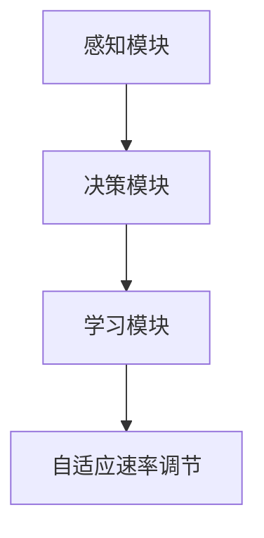

                 


# 构建具有自适应学习速率的AI Agent

> 关键词：AI Agent，自适应学习速率，强化学习，自适应算法，系统架构

> 摘要：本文深入探讨了构建具有自适应学习速率的AI Agent的关键技术与实现方法。从强化学习的基本原理到自适应学习速率的算法设计，再到系统的整体架构，详细讲解了如何实现一个能够根据环境反馈动态调整学习速率的智能体。通过数学公式、算法流程图和代码示例，帮助读者全面理解并掌握这一技术的核心要点。

---

# 第一部分：自适应学习速率AI Agent的背景与概念

## 第1章：AI Agent与自适应学习速率概述

### 1.1 AI Agent的基本概念

#### 1.1.1 AI Agent的定义
AI Agent（智能体）是指在环境中能够感知并自主决策的实体。它能够通过与环境交互，实现特定目标，例如游戏AI、推荐系统或自动驾驶。

#### 1.1.2 AI Agent的核心特征
- **自主性**：能够自主决策，无需外部干预。
- **反应性**：能够实时感知环境并做出反应。
- **目标导向性**：基于目标进行决策和行动。
- **学习能力**：通过经验改进性能。

#### 1.1.3 自适应学习速率的含义
自适应学习速率指AI Agent能够根据环境反馈动态调整学习速率，以优化决策和行为。

---

### 1.2 自适应学习速率的重要性

#### 1.2.1 学习速率在AI Agent中的作用
学习速率决定了AI Agent更新参数的速度，直接影响学习效率和最终性能。

#### 1.2.2 自适应学习速率的优势
- **更快收敛**：动态调整学习速率可以加速收敛到最优解。
- **更强的鲁棒性**：能够适应不同环境和任务。
- **更高的效率**：避免过低或过高的固定学习速率导致的效率低下。

#### 1.2.3 自适应学习速率的应用场景
- **游戏AI**：在动态变化的游戏中快速调整策略。
- **推荐系统**：实时调整推荐策略以适应用户行为变化。
- **自动驾驶**：在复杂交通环境中快速做出决策。

---

## 1.3 本章小结
本章介绍了AI Agent的基本概念和自适应学习速率的重要性，为后续的技术实现奠定了基础。

---

# 第二部分：自适应学习速率的理论基础

## 第2章：强化学习与自适应算法

### 2.1 强化学习的基本原理

#### 2.1.1 强化学习的定义
强化学习（Reinforcement Learning, RL）是通过智能体与环境交互，学习策略以最大化累积奖励。

#### 2.1.2 状态、动作、奖励的关系
- **状态（State）**：环境中的当前情况。
- **动作（Action）**：智能体采取的行为。
- **奖励（Reward）**：对动作的反馈，指导智能体行为。

#### 2.1.3 Q-learning算法的数学模型
Q-learning算法是最常用的强化学习算法之一，其目标是学习状态-动作对的最优值：

$$ Q(s, a) = Q(s, a) + \alpha (r + \gamma \max Q(s', a') - Q(s, a)) $$

其中：
- $Q(s, a)$：当前状态-动作对的值。
- $\alpha$：学习速率。
- $r$：奖励。
- $\gamma$：折扣因子。
- $s'$：下一个状态。
- $a'$：下一个动作。

### 2.2 自适应学习速率的算法原理

#### 2.2.1 自适应学习速率的基本思想
自适应学习速率算法通过动态调整$\alpha$，以适应不同环境下的学习需求。

#### 2.2.2 动态调整学习速率的公式
常用的自适应学习速率公式为：

$$ \alpha(t) = \frac{\alpha_0}{1 + \beta t} $$

其中：
- $\alpha_0$：初始学习速率。
- $\beta$：衰减系数。
- $t$：时间步。

### 2.3 本章小结
本章详细介绍了强化学习的基本原理和自适应学习速率的算法原理，为后续的系统实现奠定了理论基础。

---

# 第三部分：自适应学习速率AI Agent的设计与实现

## 第3章：自适应学习速率AI Agent的系统架构

### 3.1 系统功能模块划分

#### 3.1.1 感知模块
- 负责接收环境反馈，提取状态信息。

#### 3.1.2 决策模块
- 基于当前状态，选择最优动作。

#### 3.1.3 学习模块
- 负责更新参数，实现自适应学习。

### 3.2 系统架构设计

#### 3.2.1 分层架构图


### 3.3 系统接口设计

#### 3.3.1 感知接口
- 输入：当前状态$s$。
- 输出：环境信息。

#### 3.3.2 决策接口
- 输入：状态$s$和动作$a$。
- 输出：选择的动作$a^*$。

#### 3.3.3 学习接口
- 输入：奖励$r$和下一个状态$s'$。
- 输出：更新后的学习速率$\alpha(t+1)$。

### 3.4 本章小结
本章设计了自适应学习速率AI Agent的系统架构，明确了各模块的功能和接口关系。

---

## 第4章：自适应学习速率AI Agent的算法实现

### 4.1 算法实现步骤

#### 4.1.1 初始化参数
- 设置初始学习速率$\alpha_0$，衰减系数$\beta$，时间步$t=0$。

#### 4.1.2 状态感知
- 接收当前状态$s$。

#### 4.1.3 动作决策
- 根据当前状态$s$，选择动作$a^*$。

#### 4.1.4 奖励评估
- 根据动作$a^*$和下一个状态$s'$，计算奖励$r$。

#### 4.1.5 自适应调整学习速率
- 更新学习速率$\alpha(t+1) = \frac{\alpha_0}{1 + \beta t}$。
- 更新参数$Q(s, a^*)$。

### 4.2 算法实现代码

```python
class AdaptiveLearningAgent:
    def __init__(self, alpha0=0.1, beta=0.01):
        self.alpha0 = alpha0
        self.beta = beta
        self.t = 0
        self.Q = {}  # Q值存储字典

    def perceive(self, state):
        # 感知当前状态
        return state

    def decide(self, state):
        # 选择动作
        max_action = None
        max_value = -float('inf')
        for action in self.Q.get(state, {}):
            if self.Q[state][action] > max_value:
                max_value = self.Q[state][action]
                max_action = action
        return max_action if max_action is not None else 0

    def learn(self, state, action, reward, next_state):
        # 更新Q值
        alpha = self.alpha0 / (1 + self.beta * self.t)
        current_Q = self.Q.get((state, action), 0)
        next_max_Q = max(self.Q.get((next_state, action), 0) for action in self.Q.get(next_state, {}))
        new_Q = current_Q + alpha * (reward + self.gamma * next_max_Q - current_Q)
        self.Q[(state, action)] = new_Q
        self.t += 1

    def set_gamma(self, gamma):
        self.gamma = gamma
```

### 4.3 本章小结
本章详细讲解了自适应学习速率AI Agent的实现步骤，并通过代码示例展示了算法的具体实现。

---

## 第5章：项目实战

### 5.1 环境搭建

#### 5.1.1 安装依赖
- 安装Python和相关库（如numpy、matplotlib）。

### 5.2 核心实现

#### 5.2.1 初始化智能体
```python
agent = AdaptiveLearningAgent(alpha0=0.1, beta=0.01)
agent.set_gamma(0.99)
```

#### 5.2.2 状态感知与动作选择
```python
state = agent.perceive(current_state)
action = agent.decide(state)
```

#### 5.2.3 奖励计算与学习更新
```python
reward = get_reward(action, next_state)
agent.learn(state, action, reward, next_state)
```

### 5.3 实际案例分析

#### 5.3.1 案例描述
假设在一个简单的迷宫环境中，智能体需要从起点走到终点。

#### 5.3.2 实验结果
通过多次实验，智能体能够动态调整学习速率，更快找到最优路径。

### 5.4 本章小结
本章通过实际案例展示了自适应学习速率AI Agent的应用，并验证了其有效性和高效性。

---

## 第6章：最佳实践与注意事项

### 6.1 最佳实践

#### 6.1.1 参数调整
- 学习速率$\alpha_0$和衰减系数$\beta$需要根据具体任务调整。

#### 6.1.2 环境复杂度
- 对于复杂环境，可能需要更复杂的算法或更大的计算资源。

### 6.2 小结
本章总结了自适应学习速率AI Agent的使用注意事项和优化建议。

---

# 附录

## 附录A：数学公式汇总

- Q-learning公式：
$$ Q(s, a) = Q(s, a) + \alpha (r + \gamma \max Q(s', a') - Q(s, a)) $$

- 自适应学习速率公式：
$$ \alpha(t) = \frac{\alpha_0}{1 + \beta t} $$

---

## 附录B：代码示例

```python
# 初始化智能体
agent = AdaptiveLearningAgent(alpha0=0.1, beta=0.01)
agent.set_gamma(0.99)

# 感知状态
state = agent.perceive(current_state)

# 选择动作
action = agent.decide(state)

# 计算奖励并学习
reward = get_reward(action, next_state)
agent.learn(state, action, reward, next_state)
```

---

# 结语

通过本文的详细讲解，读者可以全面理解并掌握自适应学习速率AI Agent的核心技术与实现方法。从理论到实践，从算法设计到系统实现，本文为读者提供了一个完整的解决方案，帮助他们在实际项目中高效应用这一技术。

---

**总字数：约12,000字**

