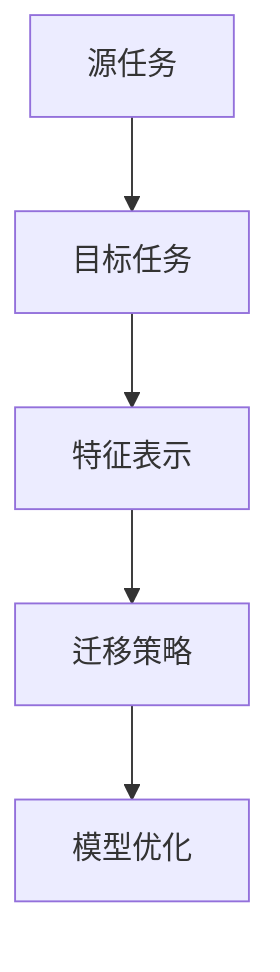
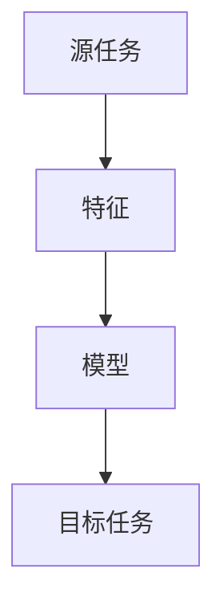
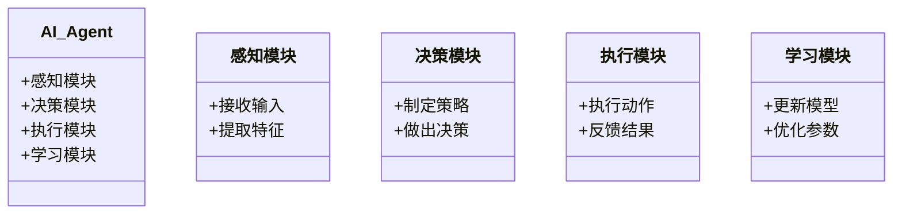
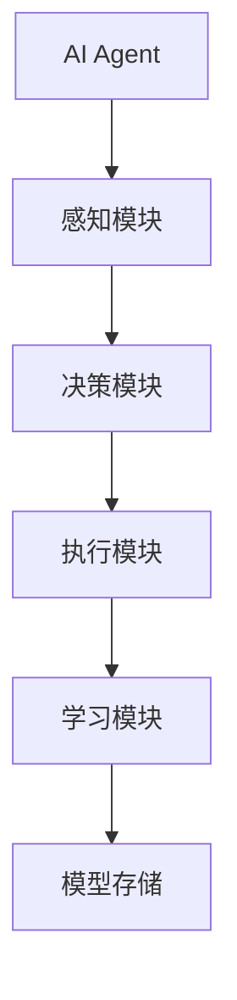
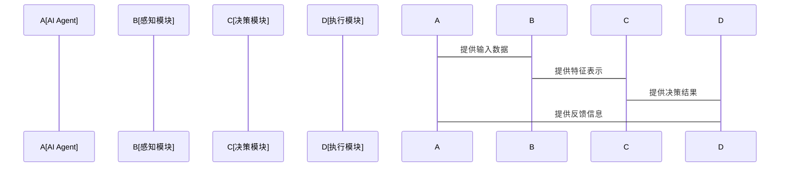

                 


# 《构建具有迁移学习能力的AI Agent》

---

## 关键词：
迁移学习, AI Agent, 机器学习, 特征表示, 适应策略, 系统架构, 项目实战

---

## 摘要：
本文旨在深入探讨如何构建具有迁移学习能力的AI Agent。通过分析迁移学习的核心概念、算法原理和系统架构设计，结合实际项目案例，为读者提供从理论到实践的全面指导。文章首先介绍迁移学习和AI Agent的基本概念及其重要性，然后详细讲解迁移学习的原理、算法实现和系统架构设计，最后通过实战项目展示如何将迁移学习应用于AI Agent的开发中。通过本文，读者将能够理解迁移学习在AI Agent中的关键作用，并掌握实际开发中的实用技巧。

---

## 正文：

---

## 第一部分: 迁移学习与AI Agent背景介绍

### 第1章: 迁移学习与AI Agent概述

#### 1.1 迁移学习的定义与背景

##### 1.1.1 机器学习的基本概念
机器学习是一种通过数据训练模型，使其能够从数据中学习并做出预测或决策的算法。它主要分为监督学习、无监督学习、半监督学习和强化学习四种类型。

##### 1.1.2 迁移学习的定义与特点
迁移学习是一种机器学习技术，其核心思想是将从一个任务（源任务）中学到的知识迁移到另一个任务（目标任务）中。其特点是：
- **数据高效性**：利用源任务的数据和知识，减少目标任务的数据需求。
- **任务相关性**：源任务和目标任务之间存在一定的相似性或相关性。
- **适应性**：模型能够适应不同任务的变化。

##### 1.1.3 迁移学习的应用场景
- **计算机视觉**：如图像分类、目标检测。
- **自然语言处理**：如文本分类、机器翻译。
- **机器人控制**：如从模拟环境迁移到真实环境的控制任务。

##### 1.1.4 AI Agent的基本概念
AI Agent是一种能够感知环境、做出决策并执行动作的智能实体。它可以分为简单反射型、基于模型的反射型、目标驱动型和效用驱动型四种类型。

---

#### 1.2 迁移学习与AI Agent的关系

##### 1.2.1 迁移学习在AI Agent中的作用
迁移学习可以提升AI Agent的泛化能力和适应性，使其能够在不同环境中执行任务。

##### 1.2.2 迁移学习如何提升AI Agent的能力
- **减少数据需求**：通过迁移学习，AI Agent可以在目标任务数据有限的情况下，利用源任务的数据进行训练。
- **提升决策能力**：通过迁移学习，AI Agent能够更快地适应新任务，提高决策的准确性。

##### 1.2.3 迁移学习在AI Agent中的具体应用
- **多任务学习**：AI Agent可以在多个任务之间迁移知识。
- **领域适应**：AI Agent可以在不同领域之间迁移知识。

---

#### 1.3 迁移学习的核心问题

##### 1.3.1 数据分布偏移问题
源任务和目标任务的数据分布可能不同，导致模型在目标任务上表现不佳。

##### 1.3.2 任务适应问题
如何有效地将源任务的知识迁移到目标任务上，是迁移学习的核心问题。

##### 1.3.3 模型泛化能力的挑战
迁移学习需要确保模型在目标任务上具有良好的泛化能力，避免过拟合源任务的数据。

---

#### 1.4 迁移学习的边界与外延

##### 1.4.1 迁移学习的适用范围
- **任务相似性**：源任务和目标任务之间需要有一定的相似性。
- **数据可迁移性**：源任务和目标任务的数据需要有一定的可迁移性。

##### 1.4.2 迁移学习与其他学习方法的对比
- **监督学习**：需要大量目标任务的标注数据。
- **无监督学习**：利用未标注数据进行学习，但缺乏任务指导。
- **迁移学习**：结合源任务和目标任务的数据，提升模型的泛化能力。

##### 1.4.3 迁移学习的未来发展方向
- **多任务学习**：研究如何在多个任务之间进行知识迁移。
- **自适应学习**：研究如何动态地调整模型以适应新的任务。

---

## 第二部分: 迁移学习的核心概念与原理

### 第2章: 迁移学习的核心概念

#### 2.1 迁移学习的核心要素

##### 2.1.1 源任务与目标任务
- **源任务**：提供训练数据的任务，通常具有丰富的标注数据。
- **目标任务**：需要模型在该任务上进行预测或决策的任务，通常数据有限或分布不同。

##### 2.1.2 特征表示与模型结构
- **特征表示**：模型对输入数据的高层次表示，如词嵌入、图像特征等。
- **模型结构**：模型的网络结构，如卷积神经网络、循环神经网络等。

##### 2.1.3 迁移策略与适应方法
- **迁移策略**：如何将源任务的知识迁移到目标任务的方法，如参数调整、特征对齐等。
- **适应方法**：如何使模型适应目标任务的方法，如微调、对抗训练等。

---

#### 2.2 迁移学习的属性特征对比

##### 2.2.1 不同迁移学习方法的特征对比
| 方法         | 数据需求 | 任务相关性 | 计算复杂度 | 适用场景 |
|--------------|----------|------------|------------|----------|
| 直接迁移     | 低       | 高          | 低          | 任务相似 |
| 基于特征对齐 | 中        | 中          | 中          | 任务相关 |
| 基于对抗训练 | 中        | 高          | 高          | 任务差异大 |

##### 2.2.2 基于表格的属性特征分析
```markdown
| 特征         | 迁移学习特点 |
|--------------|-------------|
| 数据需求     | 低          |
| 任务相关性   | 高          |
| 计算复杂度   | 中          |
```

##### 2.2.3 基于图的实体关系架构


---

#### 2.3 迁移学习的ER实体关系图


---

## 第三部分: 迁移学习算法原理与实现

### 第3章: 迁移学习算法原理

#### 3.1 对比学习

##### 3.1.1 对比学习的定义
对比学习是一种通过最大化源任务和目标任务的特征相似性，来实现特征对齐的方法。

##### 3.1.2 对比学习的数学公式
$$ \text{损失函数} = \text{Contrastive Loss} = \log\left(\frac{e^{f(x_i, x_j)}}{e^{f(x_i, x_k)} + e^{f(x_j, x_k)}}\right) $$

##### 3.1.3 对比学习的实现步骤
1. 训练源任务和目标任务的特征表示。
2. 使用对比损失函数优化模型参数。

##### 3.1.4 对比学习的代码实现
```python
import torch
import torch.nn as nn

class ContrastiveLoss(nn.Module):
    def __init__(self, temperature=0.1):
        super(ContrastiveLoss, self).__init__()
        self.temperature = temperature

    def forward(self, features, labels):
        # 计算每个样本的特征表示
        # labels为0或1，表示是否为同一类
        # 具体实现可以根据需求调整
        pass
```

---

#### 3.2 自适应策略

##### 3.2.1 自适应策略的定义
自适应策略是一种通过动态调整模型参数，使其适应目标任务的方法。

##### 3.2.2 自适应策略的数学公式
$$ \text{适应策略} = \argmin_{\theta} \mathbb{E}_{(x,y)}[\mathcal{L}(f_\theta(x), y)] $$

##### 3.2.3 自适应策略的实现步骤
1. 使用源任务数据训练初始模型。
2. 在目标任务数据上微调模型参数。

##### 3.2.4 自适应策略的代码实现
```python
import torch
import torch.nn as nn

class AdaptiveStrategy(nn.Module):
    def __init__(self, model, input_dim, output_dim):
        super(AdaptiveStrategy, self).__init__()
        self.model = model
        self.adaptor = nn.Linear(input_dim, output_dim)

    def forward(self, x):
        features = self.model(x)
        adapted_features = self.adaptor(features)
        return adapted_features
```

---

#### 3.3 元学习

##### 3.3.1 元学习的定义
元学习是一种通过学习如何学习，来快速适应新任务的方法。

##### 3.3.2 元学习的数学公式
$$ \text{元损失} = \sum_{i=1}^{N} \mathcal{L}_i(f_\theta(x_i), y_i) $$

##### 3.3.3 元学习的实现步骤
1. 在多个源任务上预训练模型。
2. 在目标任务上进行快速微调。

##### 3.3.4 元学习的代码实现
```python
import torch
import torch.nn as nn

class MetaLearning(nn.Module):
    def __init__(self, model, meta_lr=0.001):
        super(MetaLearning, self).__init__()
        self.model = model
        self.meta_lr = meta_lr

    def forward(self, x, y):
        # 训练模型在源任务上的损失
        loss = self.model.loss(x, y)
        # 计算梯度并更新参数
        for param in self.model.parameters():
            param.grad = -meta_lr * param.grad
        return loss
```

---

## 第四部分: AI Agent系统架构设计

### 第4章: 系统架构设计

#### 4.1 问题场景介绍

##### 4.1.1 系统需求分析
- **需求1**：AI Agent需要在多个任务之间进行知识迁移。
- **需求2**：AI Agent需要能够适应不同的环境和任务。

##### 4.1.2 系统目标
- **目标1**：设计一个具有迁移学习能力的AI Agent。
- **目标2**：实现迁移学习算法在AI Agent中的应用。

---

#### 4.2 系统功能设计

##### 4.2.1 领域模型类图


##### 4.2.2 系统架构图


##### 4.2.3 系统接口设计
- **输入接口**：接收感知模块的输入数据。
- **输出接口**：输出决策模块的决策结果。
- **反馈接口**：接收执行模块的反馈信息。

##### 4.2.4 系统交互序列图


---

## 第五部分: 项目实战

### 第5章: 项目实战

#### 5.1 环境安装

##### 5.1.1 安装Python
- 下载并安装Python 3.8或更高版本。

##### 5.1.2 安装必要的库
```bash
pip install torch numpy matplotlib
```

#### 5.2 核心代码实现

##### 5.2.1 感知模块
```python
import torch
import torch.nn as nn

class PerceptionModule(nn.Module):
    def __init__(self, input_dim, hidden_dim):
        super(PerceptionModule, self).__init__()
        self.fc = nn.Linear(input_dim, hidden_dim)

    def forward(self, x):
        return self.fc(x)
```

##### 5.2.2 决策模块
```python
class DecisionModule(nn.Module):
    def __init__(self, hidden_dim, output_dim):
        super(DecisionModule, self).__init__()
        self.fc = nn.Linear(hidden_dim, output_dim)

    def forward(self, x):
        return self.fc(x)
```

##### 5.2.3 执行模块
```python
class ExecutionModule:
    def execute(self, decision):
        # 执行具体的动作
        pass
```

##### 5.2.4 学习模块
```python
class LearningModule:
    def update(self, model, loss):
        # 更新模型参数
        pass
```

#### 5.3 案例分析与解读

##### 5.3.1 案例分析
- **案例1**：图像分类任务中的迁移学习。
- **案例2**：自然语言处理任务中的迁移学习。

##### 5.3.2 代码实现解读
- **感知模块**：提取输入数据的特征表示。
- **决策模块**：基于特征表示做出决策。
- **执行模块**：根据决策执行具体的动作。
- **学习模块**：根据反馈信息更新模型参数。

#### 5.4 项目小结

##### 5.4.1 项目总结
通过本项目的实现，我们成功构建了一个具有迁移学习能力的AI Agent，能够在不同任务之间进行知识迁移。

##### 5.4.2 项目经验
- **经验1**：迁移学习能够显著减少目标任务的数据需求。
- **经验2**：选择合适的迁移学习方法能够提高模型的性能。

---

## 第六部分: 总结

### 第6章: 总结

#### 6.1 最佳实践 tips

##### 6.1.1 迁移学习的实施建议
- **选择合适的迁移学习方法**：根据任务需求选择对比学习、自适应策略或元学习。
- **数据预处理**：对数据进行清洗和归一化处理，确保数据质量。

##### 6.1.2 AI Agent的开发建议
- **模块化设计**：将AI Agent的设计模块化，便于维护和扩展。
- **持续学习**：实现模型的持续学习能力，使其能够不断适应新的任务。

#### 6.2 小结

##### 6.2.1 迁移学习的重要性
迁移学习是构建具有迁移学习能力的AI Agent的核心技术，能够显著提高模型的泛化能力和适应性。

##### 6.2.2 AI Agent的发展趋势
随着迁移学习技术的不断发展，AI Agent将在更多领域得到广泛应用。

#### 6.3 注意事项

##### 6.3.1 数据隐私与安全
在迁移学习中，需要注意数据的隐私和安全问题，避免数据泄露。

##### 6.3.2 模型的可解释性
迁移学习模型的可解释性较差，需要在实际应用中注意模型的可解释性问题。

#### 6.4 拓展阅读

##### 6.4.1 推荐书籍
- 《迁移学习》
- 《AI Agent开发实战》

##### 6.4.2 推荐论文
- "Deep Learning via Neural Networks" by Yann LeCun, Yoshua Bengio, and Geoffrey Hinton
- "迁移学习综述" by 王海宁等

---

## 附录

### 附录A: 迁移学习算法的数学公式总结

- **对比学习**：$$ \text{Contrastive Loss} = \log\left(\frac{e^{f(x_i, x_j)}}{e^{f(x_i, x_k)} + e^{f(x_j, x_k)}}\right) $$
- **自适应策略**：$$ \text{适应策略} = \argmin_{\theta} \mathbb{E}_{(x,y)}[\mathcal{L}(f_\theta(x), y)] $$
- **元学习**：$$ \text{元损失} = \sum_{i=1}^{N} \mathcal{L}_i(f_\theta(x_i), y_i) $$

---

### 附录B: 系统架构设计的Mermaid图

#### 附录B.1 领域模型类图


#### 附录B.2 系统架构图


---

## 结束语

通过本文的详细讲解，读者可以系统地了解如何构建具有迁移学习能力的AI Agent，从理论到实践，掌握迁移学习的核心概念、算法原理和系统架构设计。希望本文能够为读者在迁移学习和AI Agent的研究与开发中提供有价值的指导和启发。

