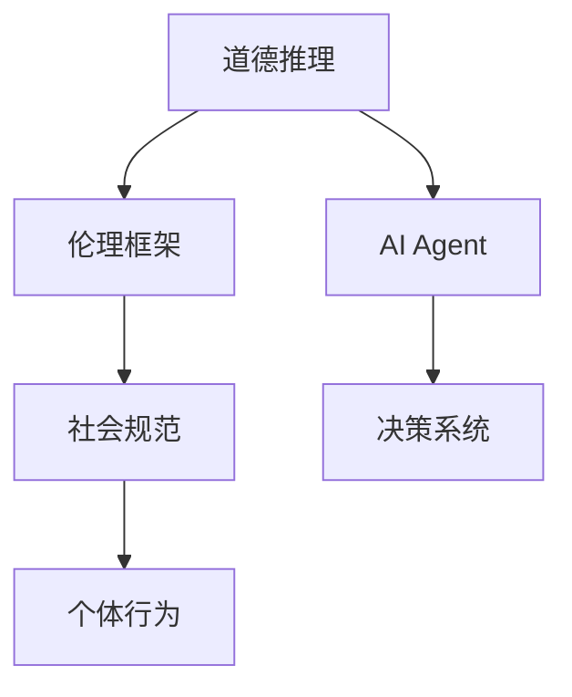
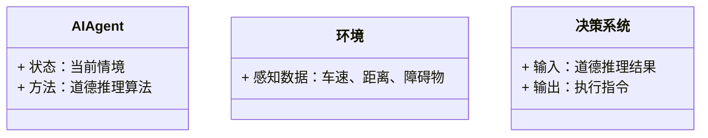
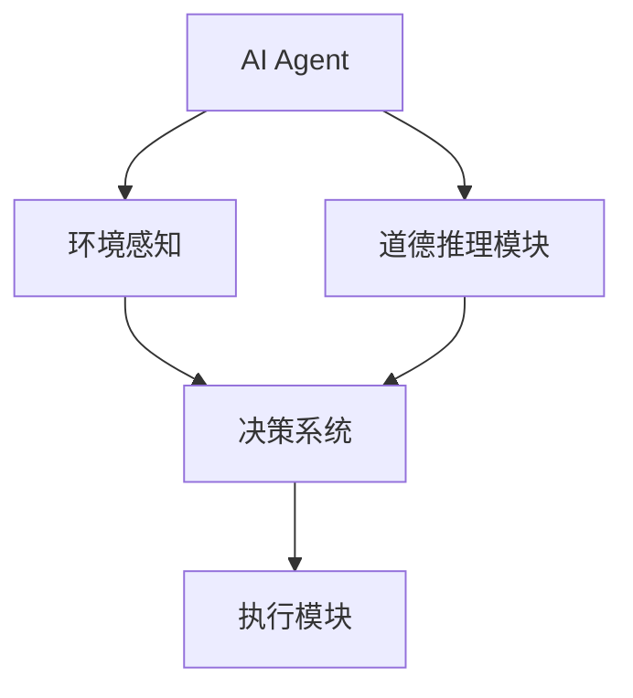
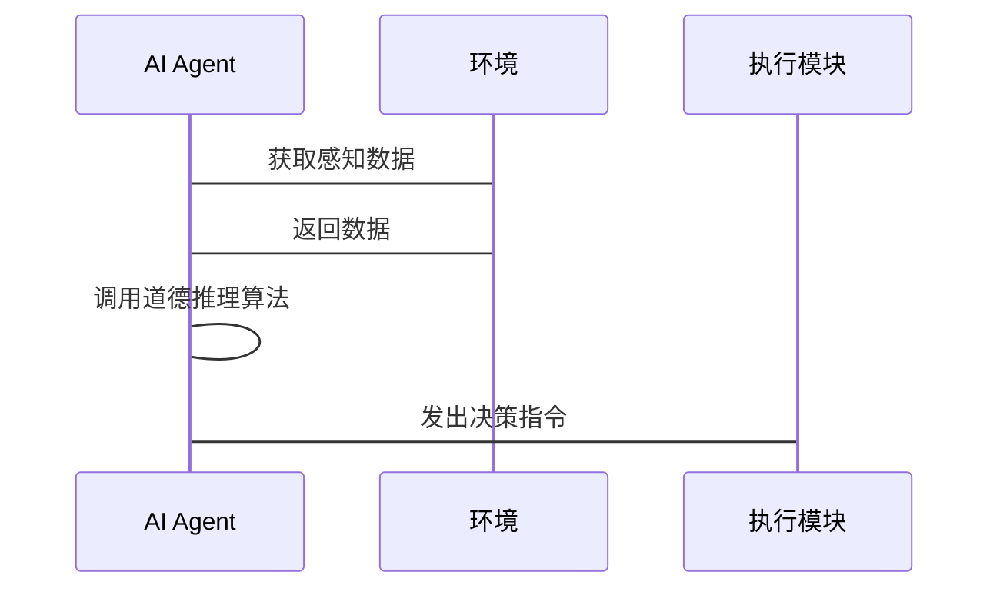

                 


# 构建具有道德推理能力的AI Agent

## 关键词：AI Agent, 道德推理, 强化学习, 算法原理, 系统架构, 实践案例

## 摘要：本文系统地探讨了如何在AI Agent中构建道德推理能力，从理论基础到算法实现，再到系统架构设计，结合实际案例，详细解析了构建具有道德推理能力AI Agent的关键步骤和技术要点。文章内容涵盖问题背景、核心概念、算法原理、系统设计、项目实战及最佳实践，为AI开发者和研究人员提供了全面的指导。

---

# 第一部分：背景与核心概念

## 第1章：问题背景与描述

### 1.1 问题背景

#### 1.1.1 当前AI技术的发展现状
人工智能（AI）技术近年来取得了飞速发展，AI Agent（智能体）作为AI技术的核心应用之一，广泛应用于自动驾驶、智能助手、医疗诊断等领域。然而，随着AI Agent在更多高风险领域的应用，其决策的伦理性和道德性问题日益凸显。

#### 1.1.2 AI Agent在实际应用中的挑战
AI Agent的决策往往基于数据和算法，缺乏对人类伦理和道德规范的深度理解。例如，在自动驾驶中，AI Agent在紧急情况下如何权衡不同的人命安全问题，就是一个典型的道德推理问题。

#### 1.1.3 道德推理能力的重要性
道德推理能力是AI Agent具备人类价值观和伦理判断能力的关键。通过道德推理，AI Agent能够在复杂情境中做出符合伦理规范的决策，避免因算法缺陷或数据偏差导致的伦理问题。

### 1.2 问题描述

#### 1.2.1 AI Agent的定义与分类
AI Agent是一种能够感知环境、自主决策并执行任务的智能系统，通常分为简单反射型Agent、基于模型的反射型Agent、目标驱动型Agent和效用驱动型Agent。

#### 1.2.2 道德推理在AI Agent中的必要性
在涉及人类生命安全和重大利益的场景中，AI Agent需要具备道德推理能力，以确保其决策符合社会伦理和法律规范。

#### 1.2.3 当前AI Agent在道德推理方面的不足
现有的AI Agent大多基于逻辑推理和数据驱动的决策方式，缺乏对伦理和道德问题的深度思考，容易在复杂场景中出现伦理冲突。

## 第2章：核心概念与联系

### 2.1 道德推理的原理

#### 2.1.1 道德推理的基本概念
道德推理是指通过伦理框架、社会规范和个体价值观来判断行为的对错，并据此做出决策的过程。

#### 2.1.2 道德推理的实现框架
道德推理通常包括以下几个步骤：识别问题、分析情境、评估选项、选择最优解。

#### 2.1.3 道德推理的核心要素
- 伦理框架：定义行为的基本道德准则，如功利主义、义务论等。
- 社会规范：反映社会对行为的期望和禁忌。
- 个体价值观：基于个体或组织的核心价值观进行判断。

### 2.2 核心概念对比

#### 2.2.1 道德推理与传统逻辑推理的对比
| 对比维度 | 道德推理 | 传统逻辑推理 |
|----------|----------|--------------|
| 输入     | 伦理规范、社会价值观 | 事实、数据 |
| 输出     | 符合伦理的决策 | 真伪判断 |
| 不确定性 | 高 | 较低 |

#### 2.2.2 道德推理与情感计算的联系
道德推理依赖于对人类情感和价值观的理解，而情感计算则通过感知情感来辅助决策。两者相辅相成，共同构建AI Agent的情感和伦理判断能力。

#### 2.2.3 道德推理与决策优化的关系
道德推理为决策优化提供伦理约束，而决策优化则通过算法优化确保道德决策的可行性。

### 2.3 实体关系图



---

# 第二部分：算法原理与数学模型

## 第3章：道德推理算法原理

### 3.1 基于规则的道德推理

#### 3.1.1 规则的定义与表示
规则通常以“如果-那么”形式表示，例如：
- 如果行为可能危及他人生命，则优先保护弱势群体。

#### 3.1.2 基于规则的推理过程
1. 识别问题情境。
2. 匹配适用的伦理规则。
3. 根据规则生成初步决策。
4. 对决策进行验证和优化。

#### 3.1.3 规则的冲突解决
当多个规则同时适用时，可以通过优先级排序或权衡分析来解决冲突。

### 3.2 基于案例的道德推理

#### 3.2.1 案例库的构建
案例库包含历史事件、相似情境及其伦理判断结果，例如：
- 自动驾驶紧急刹车的案例。

#### 3.2.2 案例匹配与推理
1. 基于相似度算法（如余弦相似度）匹配相似案例。
2. 参考案例的伦理判断结果生成初步决策。
3. 根据情境差异调整决策。

#### 3.2.3 案例推理的优缺点
- 优点：能够处理复杂情境，具有灵活性。
- 缺点：案例库的规模和质量直接影响推理效果。

### 3.3 基于强化学习的道德推理

#### 3.3.1 强化学习的基本原理
通过环境反馈不断优化决策策略，例如在自动驾驶中，通过模拟不同情境下的决策效果，优化紧急刹车的触发条件。

#### 3.3.2 道德推理的强化学习模型
- 状态空间：问题情境。
- 动作空间：可能的决策选项。
- 奖励函数：基于伦理判断的决策效果。

#### 3.3.3 模型训练与优化
通过大量模拟训练，优化AI Agent的道德决策能力，确保在复杂情境下做出合理选择。

## 第4章：数学模型与公式

### 4.1 基于规则的道德评分模型

#### 4.1.1 规则权重的计算公式
$$ w_i = \frac{1}{1 + e^{-k \cdot s_i}} $$
其中，$w_i$ 是规则 $i$ 的权重，$s_i$ 是规则的评分，$k$ 是调节系数。

### 4.2 基于强化学习的道德决策模型

#### 4.2.1 Q-learning算法
$$ Q(s, a) = Q(s, a) + \alpha \cdot [r + \gamma \cdot \max Q(s', a') - Q(s, a)] $$
其中，$Q(s, a)$ 是状态 $s$ 下动作 $a$ 的Q值，$\alpha$ 是学习率，$\gamma$ 是折扣因子。

### 4.3 案例推理的相似度计算公式

#### 4.3.1 余弦相似度
$$ \text{similarity} = \frac{\vec{A} \cdot \vec{B}}{|\vec{A}| |\vec{B}|} $$
其中，$\vec{A}$ 和 $\vec{B}$ 是两个案例的特征向量。

---

# 第三部分：系统分析与架构设计

## 第5章：系统分析与架构设计

### 5.1 问题场景介绍
以自动驾驶中的紧急刹车决策为例，分析道德推理在AI Agent中的应用场景。

### 5.2 系统功能设计

#### 5.2.1 领域模型


#### 5.2.2 系统架构


### 5.3 系统接口设计
- 输入接口：感知数据和用户输入。
- 输出接口：决策指令和反馈信息。

### 5.4 系统交互

#### 5.4.1 序列图


---

# 第四部分：项目实战

## 第6章：项目实战

### 6.1 环境安装
- 安装Python、TensorFlow、Keras等开发工具。

### 6.2 核心代码实现

#### 6.2.1 道德推理模块
```python
class MoralReasoner:
    def __init__(self):
        self.rules = [...]  # 道德规则库
        self.weights = [...]  # 规则权重
    
    def compute_moral_score(self, scenario):
        scores = []
        for rule in self.rules:
            score = self.weight(rule) * self.evaluate_rule(scenario, rule)
            scores.append(score)
        return sum(scores)
    
    def weight(self, rule):
        return 1 / (1 + exp(-k * self.rules.index(rule)))
```

#### 6.2.2 决策优化模块
```python
class DecisionOptimizer:
    def __init__(self):
        self.agent = MoralReasoner()
    
    def optimize_decision(self, scenario):
        score = self.agent.compute_moral_score(scenario)
        return self.select_best_action(score)
    
    def select_best_action(self, score):
        # 根据评分选择最优动作
        pass
```

### 6.3 代码应用解读与分析
通过具体代码实现，展示道德推理算法在AI Agent中的应用，并分析其优缺点。

### 6.4 实际案例分析
以自动驾驶紧急刹车场景为例，分析道德推理模块在决策过程中的作用。

### 6.5 项目小结
总结项目实现的关键点和经验教训，为后续优化提供参考。

---

# 第五部分：最佳实践

## 第7章：最佳实践

### 7.1 小结
- 道德推理是AI Agent具备人类价值观和伦理判断能力的关键。
- 综合运用多种推理方法（规则、案例、强化学习）可以提高AI Agent的道德决策能力。

### 7.2 注意事项
- 道德推理模型需要根据具体应用场景进行调整和优化。
- 道德推理的结果需要结合实际情境进行验证和评估。

### 7.3 拓展阅读
- 《道德机器》：探讨AI在道德决策中的挑战和解决方案。
- 《强化学习实战》：学习强化学习在AI Agent中的应用。

---

# 总结

构建具有道德推理能力的AI Agent是一项复杂的系统工程，需要结合伦理学、人工智能和计算机科学的最新研究成果。通过本文的系统介绍，读者可以全面了解道德推理的核心概念、算法原理和系统架构，并通过实际案例和代码实现，掌握构建具有道德推理能力AI Agent的关键技术。未来，随着AI技术的不断发展，道德推理能力将成为AI Agent智能化和人性化的重要标志。

