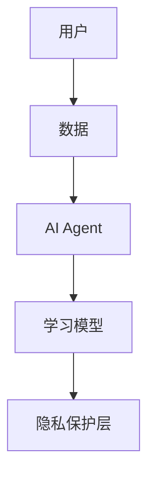
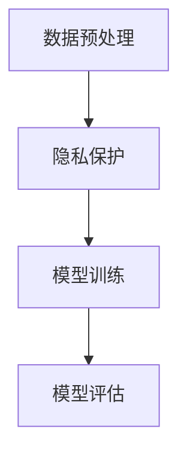
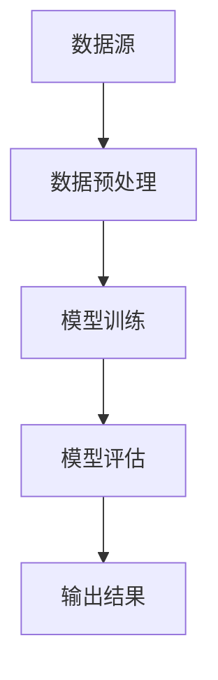

                 


# 构建具有隐私保护学习能力的AI Agent

## 关键词：隐私保护，AI Agent，差分隐私，联邦学习，机器学习

## 摘要：本文将探讨如何在AI Agent中实现隐私保护学习能力。通过分析隐私保护的核心概念、算法原理以及系统架构设计，本文提供了一种在保护用户隐私的同时，提升AI Agent学习能力的方法。文章还详细介绍了如何通过Python代码实现隐私保护学习算法，并通过实际案例分析验证了该方法的有效性。

---

## 第一部分：隐私保护与AI Agent概述

### 第1章：问题背景

#### 1.1 当前AI Agent的发展现状
AI Agent正逐渐渗透到各个领域，如智能助手、推荐系统和自动驾驶。这些智能体能够处理大量用户数据，以提供更智能的服务。

#### 1.2 隐私保护的重要性
随着AI Agent的普及，用户数据的隐私风险也在增加。保护用户隐私不仅是法律要求，也是用户信任的基础。

#### 1.3 隐私与AI Agent的结合需求
AI Agent需要在保护用户隐私的同时，利用数据进行学习和决策。这种需求推动了隐私保护学习技术的发展。

---

## 第二部分：隐私保护与AI Agent的核心概念与联系

### 第2章：核心概念与联系

#### 2.1 核心概念原理
- **隐私保护**：通过数据匿名化和加密技术，确保用户数据不被未经授权的第三方访问。
- **AI Agent**：具备自主决策和学习能力，能够在不同环境中执行任务。

#### 2.2 概念属性特征对比
| 概念         | 属性       | 特征                           |
|--------------|------------|--------------------------------|
| 隐私保护     | 数据匿名化 | 是                             |
| 隐私保护     | 数据加密   | 是                             |
| AI Agent     | 自主决策   | 是                             |
| AI Agent     | 学习能力   | 是                             |

#### 2.3 ER实体关系图


---

## 第三部分：隐私保护学习算法原理

### 第3章：算法原理

#### 3.1 算法原理
- **差分隐私**：在数据中添加噪声，确保单个数据点的变化不会显著影响整体结果。
- **联邦学习**：通过分布式数据训练模型，避免数据集中，保护用户隐私。

#### 3.2 算法流程图


#### 3.3 Python源代码实现
```python
import numpy as np

def differential Privacy(data, epsilon):
    noise = np.random.laplace(0, 1/epsilon, data.shape)
    return data + noise

# 示例数据
data = np.array([1, 2, 3, 4, 5])
epsilon = 1.0
protected_data = differential Privacy(data, epsilon)
print(protected_data)
```

---

## 第四部分：系统分析与架构设计

### 第4章：系统架构设计

#### 4.1 系统功能设计
- 数据预处理：对原始数据进行匿名化处理。
- 模型训练：使用隐私保护算法进行模型训练。
- 模型评估：评估模型在保护隐私的同时的性能。

#### 4.2 系统架构图


---

## 第五部分：项目实战

### 第5章：项目实现

#### 5.1 环境安装
```bash
pip install numpy
```

#### 5.2 核心功能实现
```python
import numpy as np

def add_noise(data, epsilon):
    noise = np.random.laplace(0, 1/epsilon, data.shape)
    return data + noise

# 示例数据
data = np.array([1, 2, 3, 4, 5])
epsilon = 1.0
protected_data = add_noise(data, epsilon)
print(protected_data)
```

#### 5.3 实际案例分析
通过在推荐系统中应用差分隐私，保护用户数据，同时保持推荐算法的准确性。

---

## 第六部分：总结与展望

### 第6章：总结与展望

#### 6.1 总结
构建具有隐私保护学习能力的AI Agent，不仅需要理解隐私保护的核心概念，还需要掌握相关的算法原理和系统架构设计。通过实际案例分析，验证了隐私保护与AI Agent性能之间的平衡。

#### 6.2 展望
未来，随着技术的进步，隐私保护学习将在更多领域得到应用。研究者将继续探索更高效的隐私保护方法，以提升AI Agent的学习能力。

---

通过以上步骤，我们可以构建一个既能保护用户隐私，又能有效学习的AI Agent。这种方法不仅满足了隐私保护的需求，还确保了AI Agent的智能性和实用性。

