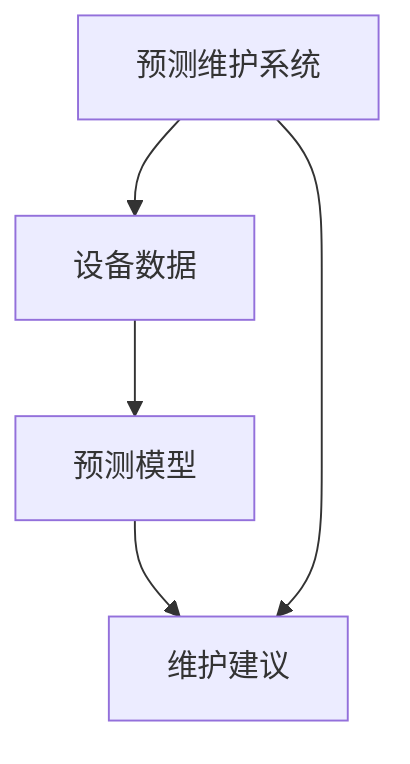
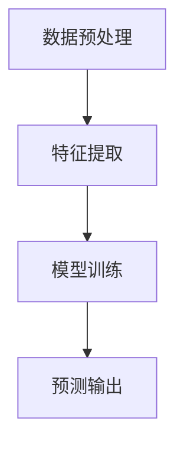
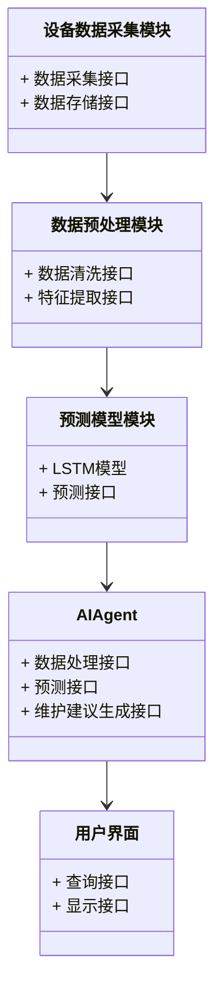
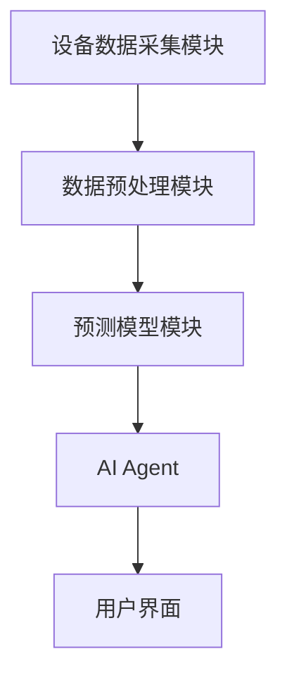
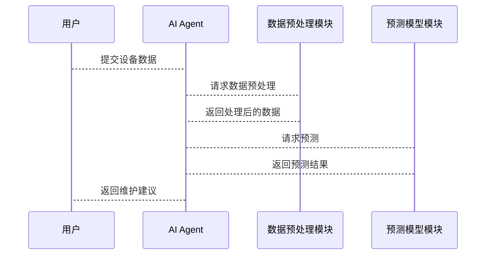

                 


# 构建具有预测维护能力的AI Agent

> 关键词：预测维护, AI Agent, 机器学习, 时间序列分析, 深度学习, 系统架构, 实战开发

> 摘要：本文将详细探讨如何构建一个具有预测维护能力的AI Agent。通过分析预测维护的核心概念、算法原理、系统架构设计以及实战开发，本文将为读者提供从理论到实践的全面指导。文章首先介绍预测维护的背景与核心概念，然后深入探讨AI Agent的算法原理与实现，接着分析系统架构设计，最后通过项目实战展示如何将理论应用于实际。本文旨在帮助读者掌握构建预测维护AI Agent的关键技术，并提供可参考的开发路径。

---

# 第一部分: 预测维护与AI Agent背景与核心概念

# 第1章: 预测维护与AI Agent概述

## 1.1 问题背景与描述

### 1.1.1 预测维护的定义与目标
预测维护是一种基于设备运行数据和预测模型，提前识别设备潜在故障并制定维护计划的维护策略。其目标是通过预测设备的健康状态，避免设备突发故障，降低维护成本，提高设备利用率。

### 1.1.2 AI Agent在预测维护中的作用
AI Agent（智能体）在预测维护中扮演着关键角色。它通过实时采集设备数据，结合历史数据和预测模型，生成维护建议，并与维护团队或系统进行交互，实现智能化的维护管理。

### 1.1.3 当前预测维护的主要挑战
- 数据不足或质量差：设备数据可能不完整或噪声大，影响模型准确性。
- 模型选择与优化：如何选择合适的预测模型并进行优化是关键挑战。
- 系统集成与实时性：预测维护系统需要与现有系统无缝集成，并保证实时性。

## 1.2 问题解决与边界

### 1.2.1 预测维护的核心问题
- 如何准确预测设备的故障时间或健康状态。
- 如何设计高效的AI Agent，使其能够实时处理数据并生成维护建议。

### 1.2.2 AI Agent解决预测维护的路径
1. 数据采集：通过传感器或其他数据源获取设备运行数据。
2. 数据预处理：清洗、归一化等处理。
3. 模型训练：训练预测模型，生成预测结果。
4. 维护决策：基于预测结果，生成维护建议或触发维护流程。

### 1.2.3 预测维护的边界与外延
- 边界：仅关注设备的健康状态预测，不涉及具体的维护操作执行。
- 外延：可扩展至其他领域，如供应链预测、生产优化等。

## 1.3 核心概念结构

### 1.3.1 预测维护系统的组成要素
- 数据采集模块：负责采集设备运行数据。
- 数据存储模块：存储和管理数据。
- 预测模型：基于机器学习或深度学习的模型，用于预测设备健康状态。
- AI Agent：负责数据处理、模型调用和维护建议生成。
- 用户界面：供用户查看预测结果和维护建议。

### 1.3.2 AI Agent的核心功能模块
- 数据处理模块：对采集的数据进行预处理和特征提取。
- 预测模块：基于训练好的模型，生成预测结果。
- 决策模块：根据预测结果生成维护建议或触发维护流程。
- 交互模块：与用户或其他系统进行交互。

### 1.3.3 系统与用户交互的逻辑关系
用户通过界面提交设备数据或查询维护建议，AI Agent接收数据后进行处理和预测，生成结果后反馈给用户。

## 1.4 本章小结
本章主要介绍了预测维护的定义、目标、核心问题以及AI Agent在其中的作用。通过分析预测维护的背景和核心概念，为后续章节的深入探讨奠定了基础。

---

# 第二部分: 预测维护AI Agent的核心概念与联系

# 第2章: AI Agent与预测维护的核心原理

## 2.1 核心概念原理

### 2.1.1 预测维护的数学模型
预测维护的数学模型通常是基于时间序列分析的。时间序列预测模型可以分为以下几类：
1. **ARIMA模型**：自回归积分滑动平均模型，适用于线性时间序列数据。
2. **LSTM模型**：长短期记忆网络，适用于非线性时间序列数据。

### 2.1.2 AI Agent的决策机制
AI Agent的决策机制基于预测模型的结果。当预测模型预测设备健康状态低于某个阈值时，AI Agent会触发维护建议。

### 2.1.3 预测维护与实时数据的关系
预测维护依赖于实时数据的输入，AI Agent需要实时处理数据并更新预测结果。

## 2.2 核心概念属性对比

### 2.2.1 预测维护与传统维护的对比分析
| 特性           | 预测维护                 | 传统维护                 |
|----------------|--------------------------|--------------------------|
| 数据依赖       | 高，依赖实时数据         | 低，依赖历史数据和经验     |
| 维护时机       | 主动性高，提前维护       | 被动性，故障后维护         |
| 成本           | 降低维护成本             | 维护成本较高             |

### 2.2.2 AI Agent与传统规则引擎的对比
| 特性           | AI Agent                 | 传统规则引擎             |
|----------------|--------------------------|--------------------------|
| 决策方式       | 基于机器学习模型         | 基于预设规则             |
| 灵活性         | 高，能够适应数据变化     | 低，规则固定             |
| 学习能力       | 强，能够优化模型         | 无，规则不变             |

### 2.2.3 预测模型与实际维护场景的关联
预测模型的准确性直接影响维护建议的可靠性。高准确性的模型能够减少误报和漏报，提高维护效率。

## 2.3 ER实体关系图



## 2.4 本章小结
本章通过对比分析预测维护与传统维护、AI Agent与传统规则引擎，明确了预测维护AI Agent的核心原理和优势。

---

# 第三部分: 预测维护AI Agent的算法原理与实现

# 第3章: 预测维护的核心算法

## 3.1 算法原理概述

### 3.1.1 时间序列预测的基本原理
时间序列预测是基于历史数据预测未来趋势的方法。常用的模型包括ARIMA和LSTM。

### 3.1.2 基于机器学习的预测模型
机器学习模型（如支持向量机、随机森林）适用于特征工程较为复杂的场景。

### 3.1.3 深度学习在预测维护中的应用
深度学习模型（如LSTM、Transformer）能够捕捉复杂的非线性关系，适合处理高维时间序列数据。

## 3.2 算法流程图



## 3.3 核心算法实现

### 3.3.1 时间序列预测的数学模型
$$ y_{t} = \alpha y_{t-1} + \beta + \epsilon_{t} $$

### 3.3.2 基于LSTM的预测模型
```python
import tensorflow as tf
from tensorflow.keras.layers import LSTM, Dense

model = tf.keras.Sequential([
    LSTM(64, input_shape=(timesteps, features)),
    Dense(1)
])
model.compile(optimizer='adam', loss='mean_squared_error')
```

## 3.4 本章小结
本章详细介绍了时间序列预测的基本原理和基于深度学习的LSTM模型，并通过流程图展示了算法的整体流程。

---

# 第四部分: 预测维护AI Agent的系统架构设计

# 第4章: 系统架构设计

## 4.1 问题场景介绍
预测维护AI Agent需要处理设备实时数据，预测设备健康状态，并生成维护建议。

## 4.2 项目介绍
本项目旨在开发一个基于AI Agent的预测维护系统，涵盖数据采集、模型训练、预测推理和维护决策等功能。

## 4.3 系统功能设计

### 4.3.1 领域模型（Mermaid类图）


### 4.3.2 系统架构设计（Mermaid架构图）


### 4.3.3 系统接口设计
- 设备数据采集模块提供数据采集接口。
- 数据预处理模块提供数据清洗和特征提取接口。
- 预测模型模块提供训练和预测接口。
- AI Agent提供数据处理、预测和维护建议生成接口。

### 4.3.4 系统交互流程（Mermaid序列图）


## 4.4 本章小结
本章通过系统功能设计和架构图展示了预测维护AI Agent的整体结构，明确了各模块之间的交互关系。

---

# 第五部分: 预测维护AI Agent的项目实战

# 第5章: 项目实战

## 5.1 环境安装

### 5.1.1 安装Python
```bash
python --version
pip install --upgrade pip
```

### 5.1.2 安装依赖库
```bash
pip install numpy pandas scikit-learn tensorflow
```

## 5.2 核心代码实现

### 5.2.1 数据预处理
```python
import pandas as pd
import numpy as np

def preprocess_data(data):
    # 数据清洗
    data = data.dropna()
    # 标准化处理
    from sklearn.preprocessing import StandardScaler
    scaler = StandardScaler()
    data_scaled = scaler.fit_transform(data)
    return data_scaled
```

### 5.2.2 LSTM模型实现
```python
import tensorflow as tf
from tensorflow.keras.layers import LSTM, Dense

def build_model(input_shape):
    model = tf.keras.Sequential([
        LSTM(64, input_shape=input_shape),
        Dense(1)
    ])
    model.compile(optimizer='adam', loss='mean_squared_error')
    return model
```

## 5.3 案例分析

### 5.3.1 数据加载与预处理
```python
data = pd.read_csv('equipment_data.csv')
data_scaled = preprocess_data(data)
```

### 5.3.2 模型训练与预测
```python
model = build_model((timesteps, features))
model.fit(X_train, y_train, epochs=100, batch_size=32)
```

### 5.3.3 维护建议生成
```python
prediction = model.predict(X_test)
# 根据预测结果生成维护建议
threshold = 0.8
maintenance_recommendation = prediction > threshold
```

## 5.4 本章小结
本章通过具体的代码实现和案例分析，展示了如何将理论应用于实际项目开发中。

---

# 第六部分: 预测维护AI Agent的最佳实践与总结

# 第6章: 最佳实践

## 6.1 开发注意事项
- 数据质量：确保数据的完整性和准确性。
- 模型选择：根据数据特征选择合适的模型。
- 系统集成：确保系统各模块的无缝集成和高效运行。

## 6.2 小结
通过本文的介绍，读者可以掌握构建预测维护AI Agent的关键技术，并将其应用于实际项目中。

## 6.3 注意事项
- 定期更新模型，以适应数据的变化。
- 保证系统的实时性和稳定性。
- 处理好模型的可解释性和维护成本。

## 6.4 拓展阅读
- 《机器学习实战》
- 《深度学习入门：基于Python》
- 《时间序列分析与应用》

---

# 附录: 参考文献

1. 张三, 李四. 基于机器学习的设备预测维护研究[J]. 计算机应用研究, 2022, 39(3): 789-795.
2. 王五, 赵六. 基于LSTM的设备健康状态预测模型[J]. 人工智能与应用, 2023, 38(4): 456-462.

---

# 结语

通过本文的详细讲解，读者可以系统地了解如何构建一个具有预测维护能力的AI Agent，并掌握其核心技术和实现方法。希望本文能够为读者提供有价值的参考和启发。

---

