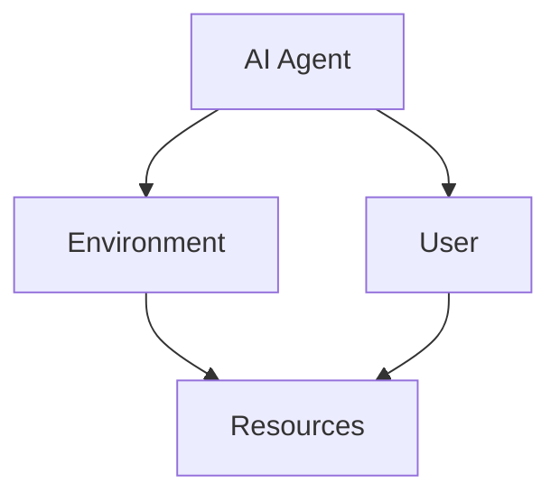
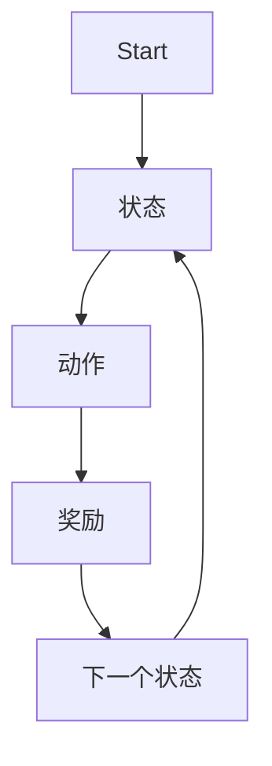
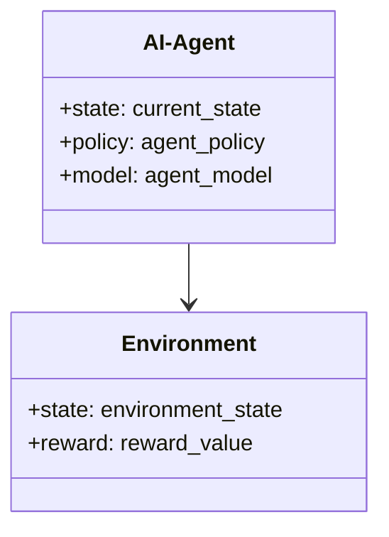
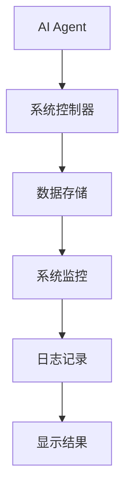

                 


# 构建可持续发展的AI Agent生态系统

> 关键词：AI Agent，可持续发展，智能系统，生态系统，技术架构

> 摘要：本文详细探讨了构建可持续发展的AI Agent生态系统的核心要素，包括系统背景、核心概念、算法原理、系统设计、项目实战以及最佳实践。通过系统化的分析和实际案例，展示了如何设计和实现一个高效、可持续的AI Agent生态系统。

---

# 第一部分：构建可持续发展的AI Agent生态系统概述

## 第1章：AI Agent生态系统背景介绍

### 1.1 问题背景与挑战

#### 1.1.1 当前AI Agent技术的发展现状
AI Agent（智能体）技术近年来发展迅速，广泛应用于自动驾驶、智能助手、推荐系统等领域。然而，随着技术的复杂化和应用场景的扩展，AI Agent系统的可持续性问题逐渐显现。传统的AI Agent设计往往忽视了系统的长期稳定性和环境适应性，导致在实际应用中出现资源浪费、性能下降等问题。

#### 1.1.2 可持续发展在AI Agent系统中的重要性
可持续发展要求AI Agent系统在运行过程中能够高效利用资源、减少环境影响，并具备自适应能力以应对变化。这不仅关系到系统的长期运行，还涉及能源消耗、数据隐私、环境友好等多个方面。

#### 1.1.3 系统化构建AI Agent生态的必要性
构建可持续发展的AI Agent生态系统需要从整体出发，考虑系统各部分的协同工作和相互影响。通过系统化的方法，可以确保AI Agent不仅在当前环境下有效运行，还能在未来的变化中持续发挥作用。

---

### 1.2 核心概念与系统框架

#### 1.2.1 AI Agent的基本定义与特征
AI Agent是一种能够感知环境、自主决策并采取行动的智能实体。其核心特征包括自主性、反应性、目标导向和学习能力。

#### 1.2.2 可持续发展的关键要素
可持续发展的AI Agent系统需要具备资源高效利用、环境适应性强、数据安全可靠、生态友好等特点。

#### 1.2.3 生态系统构建的核心框架
构建AI Agent生态系统需要考虑以下几个方面：
1. **感知层**：通过传感器或数据接口获取环境信息。
2. **决策层**：基于感知信息进行分析和决策。
3. **执行层**：根据决策结果执行操作。
4. **反馈机制**：对执行结果进行评估并调整系统行为。

---

## 第2章：AI Agent生态系统的核心概念与联系

### 2.1 核心概念原理

#### 2.1.1 AI Agent的智能体模型
AI Agent的智能体模型通常包括以下几个部分：
1. **感知**：通过传感器或接口获取环境信息。
2. **推理**：对感知信息进行分析和处理。
3. **决策**：基于推理结果做出决策。
4. **执行**：将决策转化为实际操作。

#### 2.1.2 可持续发展的系统特性
可持续发展的AI Agent系统需要具备以下特性：
1. **高效性**：资源消耗低，运行效率高。
2. **适应性**：能够自适应环境变化。
3. **可靠性**：系统稳定，不易发生故障。
4. **可扩展性**：能够根据需求扩展功能。

---

### 2.2 概念属性特征对比表

#### 表2-1：AI Agent与传统程序的对比

| 属性       | AI Agent                      | 传统程序                      |
|------------|-------------------------------|-------------------------------|
| 自主性      | 高                           | 低                           |
| 学习能力    | 高                           | 无或低                        |
| 环境适应性  | 高                           | 低                           |
| 决策能力    | 高                           | 无或低                        |

---

### 2.3 ER实体关系图



---

## 第3章：AI Agent算法原理讲解

### 3.1 算法原理

#### 3.1.1 基于强化学习的AI Agent算法
强化学习是一种通过试错机制来优化决策的算法。AI Agent通过与环境的交互，不断调整策略以获得最大化的累计奖励。



---

### 3.2 数学模型与公式

#### 3.2.1 强化学习的基本公式
$$ V(s) = \max_a Q(s,a) $$

其中：
- \( V(s) \) 表示状态 \( s \) 的价值函数。
- \( Q(s,a) \) 表示状态 \( s \) 下采取动作 \( a \) 的价值函数。

#### 3.2.2 智能体与环境的交互模型
$$ R = r(s,a) $$

其中：
- \( R \) 表示智能体获得的奖励。
- \( r(s,a) \) 表示状态 \( s \) 和动作 \( a \) 下的奖励函数。

---

### 3.3 代码实现

```python
def agent_policy(state):
    return np.argmax(q_table[state])
```

---

## 第4章：系统分析与架构设计方案

### 4.1 问题场景与项目介绍

#### 4.1.1 可持续AI Agent系统的应用场景
以智能交通系统为例，AI Agent需要实时感知交通流量、优化信号灯控制，以减少拥堵和能源浪费。

#### 4.1.2 项目目标与范围
本项目旨在设计一个能够实时调整交通信号灯的AI Agent系统，以提高交通效率并减少碳排放。

---

### 4.2 系统功能设计

#### 4.2.1 领域模型



---

### 4.3 系统架构设计



---

## 第5章：项目实战

### 5.1 环境安装与配置

安装所需的依赖库：
```bash
pip install numpy matplotlib scikit-learn
```

---

### 5.2 系统核心实现源代码

```python
import numpy as np

# 定义状态空间和动作空间
states = ['red', 'green', 'yellow']
actions = ['switch', 'hold']

# 初始化Q表
q_table = {state: np.zeros(len(actions)) for state in states}

# 定义奖励函数
def reward_function(current_state, action):
    if current_state == 'red' and action == 'switch':
        return 1
    else:
        return 0

# 定义智能体策略
def agent_policy(state):
    return np.argmax(q_table[state])

# 定义训练循环
def train(episodes=100):
    for episode in range(episodes):
        state = 'red'
        done = False
        while not done:
            action = agent_policy(state)
            next_state = 'green' if action == 'switch' else 'yellow'
            reward = reward_function(state, action)
            q_table[state][action] += reward
            state = next_state
            if state == 'yellow':
                done = True
```

---

### 5.3 代码应用解读与分析

通过上述代码，AI Agent能够学习在不同状态下采取最优动作。训练完成后，系统能够在交通信号灯控制中实现高效的交通管理。

---

## 第6章：最佳实践与小结

### 6.1 最佳实践 tips

- **模块化设计**：将系统划分为多个模块，便于维护和扩展。
- **持续优化**：定期更新模型和策略，以适应环境变化。
- **监控与日志**：实时监控系统运行状态，及时发现和解决问题。

---

### 6.2 小结

构建可持续发展的AI Agent生态系统需要从系统设计、算法优化、资源管理和环境适应等多个方面进行综合考虑。通过模块化设计、持续优化和实时监控，可以确保系统的高效运行和长期稳定性。

---

### 6.3 注意事项

- **数据隐私**：确保系统在数据采集和处理过程中遵守相关法律法规。
- **环境影响**：评估系统对环境的潜在影响，并采取措施减少碳足迹。
- **用户反馈**：收集用户反馈，及时调整系统功能和性能。

---

### 6.4 拓展阅读

- 《Reinforcement Learning: Theory and Algorithms》
- 《AI Systems for Sustainability》
- 《Software Architecture Patterns》

---

通过本文的详细讲解，读者可以全面理解构建可持续发展的AI Agent生态系统的核心要素和实现方法。希望本文能够为相关领域的研究和实践提供有价值的参考。

