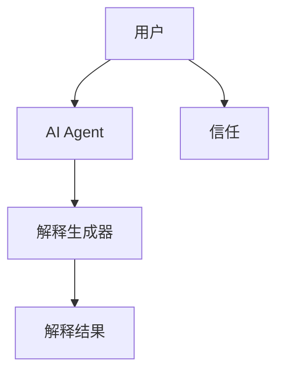
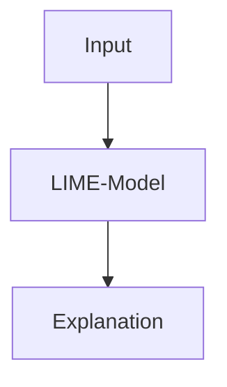

                 


# 构建可解释的AI Agent：透明度和可信度

**关键词：** 可解释性AI、AI Agent、透明度、可信度、模型可解释性、算法解释性、可解释性系统

**摘要：**  
构建可解释的AI Agent是实现人工智能系统透明度和可信度的关键。本文从可解释性AI（XAI）的基本概念出发，深入探讨AI Agent的可解释性原理、算法实现、系统架构设计以及实际应用案例。通过对比分析不同可解释性方法，结合具体算法实现和系统架构设计，本文旨在为读者提供一套构建透明和可信AI Agent的系统化方法论。最后，本文总结了构建可解释AI Agent的最佳实践，并展望了未来的研究方向。

---

## 第1章 可解释性AI Agent的背景与核心概念

### 1.1 可解释性AI的定义与重要性

#### 1.1.1 什么是可解释性AI（XAI）
可解释性AI（Explainable AI, XAI）是指AI系统能够生成人类可以理解的解释，以展示其决策过程或输出结果的依据。可解释性是构建透明和可信AI系统的核心要素。

#### 1.1.2 可解释性在AI Agent中的重要性
AI Agent作为智能系统的执行者，其行为必须具有可解释性，才能让用户信任其决策过程。可解释性有助于提高系统的透明度，减少用户对“黑箱”算法的疑虑。

#### 1.1.3 可解释性AI的边界与外延
可解释性AI的边界包括模型的可解释性、算法的可解释性以及用户对可解释性的需求。其外延则涉及可解释性与模型复杂度、性能之间的平衡。

### 1.2 AI Agent的基本概念

#### 1.2.1 AI Agent的定义
AI Agent是一种智能实体，能够感知环境、执行任务并做出决策。它通过与环境交互来实现目标。

#### 1.2.2 AI Agent的核心组成要素
AI Agent的核心组成包括感知模块、决策模块、执行模块和学习模块。这些模块协同工作，实现智能行为。

#### 1.2.3 可解释性与AI Agent的关系
可解释性是AI Agent信任的核心，通过可解释性，用户可以理解AI Agent的决策过程，从而增强对系统的信任。

### 1.3 问题背景与问题描述

#### 1.3.1 当前AI Agent面临的挑战
AI Agent在复杂环境中的决策往往缺乏透明度，用户难以理解其行为，导致信任缺失。

#### 1.3.2 可解释性缺失带来的问题
可解释性缺失会导致用户对AI Agent的决策不信任，甚至引发安全隐患。

#### 1.3.3 问题解决的目标与方法
目标是通过可解释性技术，提高AI Agent的透明度和可信度。方法包括设计可解释性模型、优化算法解释性以及增强用户交互体验。

### 1.4 本章小结
本章介绍了可解释性AI的基本概念、AI Agent的核心组成以及当前面临的主要问题，为后续章节的深入分析奠定了基础。

---

## 第2章 可解释性AI的核心概念与联系

### 2.1 可解释性AI的原理

#### 2.1.1 可解释性模型的分类
可解释性模型分为基于规则的模型（如决策树）和基于模型的模型（如线性回归）。

#### 2.1.2 可解释性与模型复杂度的关系
模型复杂度越高，可解释性通常越低。需要在模型性能和可解释性之间找到平衡。

#### 2.1.3 可解释性与模型性能的平衡
通过选择适当的可解释性方法，可以在保证模型性能的同时，提高其可解释性。

### 2.2 可解释性AI的核心概念对比

#### 2.2.1 不同可解释性方法的对比分析
| 方法 | 原理 | 优缺点 |
|------|------|--------|
| LIME | 局部解释 | 局限于局部，但易于实现 |
| SHAP | 全局解释 | 能够解释整体模型，但实现复杂 |

#### 2.2.2 可解释性与不可解释性模型的对比
可解释性模型适用于需要透明决策的场景，而不可解释性模型适用于复杂任务。

#### 2.2.3 用户需求与模型可解释性的关系
用户对可解释性的需求直接影响模型设计的选择。

### 2.3 可解释性AI的ER实体关系图



### 2.4 本章小结
本章通过对比分析，明确了可解释性AI的核心概念及其在不同场景中的应用，为后续算法实现奠定了理论基础。

---

## 第3章 可解释性AI的算法原理

### 3.1 可解释性AI的算法概述

#### 3.1.1 基于规则的可解释性算法
基于规则的算法（如决策树）通过生成清晰的规则，提供可解释的决策过程。

#### 3.1.2 基于模型的可解释性算法
基于模型的算法（如线性回归）通过模型参数解释其决策过程。

#### 3.1.3 基于解释生成的可解释性算法
通过生成自然语言解释，帮助用户理解模型决策。

### 3.2 可解释性AI的算法实现

#### 3.2.1 LIME算法原理
LIME（局部可解释模型agnostic解释）通过扰动数据点，生成局部解释。



#### 3.2.2 SHAP值的计算
SHAP（Shapley Additive exPlanations）通过计算特征对模型输出的贡献度，生成全局解释。

$$ SHAP\_value = \sum_{i} \phi\_i $$

#### 3.2.3 算法实现示例

```python
import lime
from lime import lime lime lime lime lime lime lime lime lime lime lime lime lime lime lime lime lime lime lime lime lime lime lime lime lime lime lime lime lime lime lime lime lime lime lime lime lime lime lime lime lime lime lime lime lime lime lime lime lime lime lime lime lime lime lime lime lime lime lime lime lime lime lime lime lime lime lime lime lime lime lime lime lime lime lime lime lime lime lime lime lime lime lime lime lime lime lime lime lime lime lime lime lime lime lime lime lime lime lime lime lime lime lime lime lime lime lime lime lime lime lime lime lime lime lime lime lime lime lime lime lime lime lime lime lime lime lime lime lime lime lime lime lime lime lime lime lime lime lime lime lime lime lime lime lime lime lime lime lime lime lime lime lime lime lime lime lime lime lime lime lime lime lime lime lime lime lime lime lime lime lime lime lime lime lime lime lime lime lime lime lime lime lime lime lime lime lime lime lime lime lime lime lime lime lime lime lime lime lime lime lime lime lime lime lime lime lime lime lime lime lime lime lime lime lime lime lime lime lime lime lime lime lime lime lime lime lime lime lime lime lime lime lime lime lime lime lime lime lime lime lime lime lime lime lime lime lime lime lime lime lime lime lime lime lime lime lime lime lime lime lime lime lime lime lime lime lime lime lime lime lime lime lime lime lime lime lime lime lime lime lime lime lime lime lime lime lime lime lime lime lime lime lime lime lime lime lime lime lime lime lime lime lime lime lime lime lime lime lime lime lime lime lime lime lime lime lime lime lime lime lime lime lime lime lime lime lime lime lime lime lime lime lime lime lime lime lime lime lime lime lime lime lime lime lime lime lime lime lime lime lime lime lime lime lime lime lime lime lime lime lime lime lime lime lime lime lime lime lime lime lime lime lime lime lime lime lime lime lime lime lime lime lime lime lime lime lime lime lime lime lime lime lime lime lime lime lime lime lime lime lime lime lime lime lime lime lime lime lime lime lime lime lime lime lime lime lime lime lime lime lime lime lime lime lime lime lime lime lime lime lime lime lime lime lime lime lime lime lime lime lime lime lime lime lime lime lime lime lime lime lime lime lime lime lime lime lime lime lime lime lime lime lime lime lime lime lime lime lime lime lime lime lime lime lime lime lime lime lime lime lime lime lime lime lime lime lime lime lime lime lime lime lime lime lime lime lime lime lime lime lime lime lime lime lime lime lime lime lime lime lime lime lime lime lime lime lime lime lime lime lime lime lime lime lime lime lime lime lime lime lime lime lime lime lime lime lime lime lime lime lime lime lime lime lime lime lime lime lime lime lime lime lime lime lime lime lime lime lime lime lime lime lime lime lime lime lime lime lime lime lime lime lime lime lime lime lime lime lime lime lime lime lime lime lime lime lime lime lime lime lime lime lime lime lime lime lime lime lime lime lime lime lime lime lime lime lime lime lime lime lime lime lime lime lime lime lime lime lime lime lime lime lime lime lime lime lime lime lime lime lime lime lime lime lime lime lime lime lime lime lime lime lime lime lime lime lime lime lime lime lime lime lime lime lime lime lime lime lime lime lime lime lime lime lime lime lime lime lime lime lime lime lime lime lime lime lime lime lime lime lime lime lime lime lime lime lime lime lime lime lime lime lime lime lime lime lime lime lime lime lime lime lime lime lime lime lime lime lime lime lime lime lime lime lime lime lime lime lime lime lime lime lime lime lime lime lime lime lime lime lime lime lime lime lime lime lime lime lime lime lime lime lime lime lime lime lime lime lime lime lime lime lime lime lime lime lime lime lime lime lime lime lime lime lime lime lime lime lime lime lime lime lime lime lime lime lime lime lime lime lime lime lime lime lime lime lime lime lime lime lime lime lime lime lime lime lime lime lime lime lime lime lime lime lime lime lime lime lime lime lime lime lime lime lime lime lime lime lime lime lime lime lime lime lime lime lime lime lime lime lime lime lime lime lime lime lime lime lime lime lime lime lime lime lime lime lime lime lime lime lime lime lime lime lime lime lime lime lime lime lime lime lime lime lime lime lime lime lime lime lime lime lime lime lime lime lime lime lime lime lime lime lime lime lime lime lime lime lime lime lime lime lime lime lime lime lime lime lime lime lime lime lime lime lime lime lime lime lime lime lime lime lime lime lime lime lime lime lime lime lime lime lime lime lime lime lime lime lime lime lime lime lime lime lime lime lime lime lime lime lime lime lime lime lime lime lime lime lime lime lime lime lime lime lime lime lime lime lime lime lime lime lime lime lime lime lime lime lime lime lime lime lime lime lime lime lime lime lime lime lime lime lime lime lime lime lime lime lime lime lime lime lime lime lime lime lime lime lime lime lime lime lime lime lime lime lime lime lime lime lime lime lime lime lime lime lime lime lime lime lime lime lime lime lime lime lime lime lime lime lime lime lime lime lime lime lime lime lime lime lime lime lime lime lime lime lime lime lime lime lime lime lime lime lime lime lime lime lime lime lime lime lime lime lime lime lime lime lime lime lime lime lime lime lime lime lime lime lime lime lime lime lime lime lime lime lime lime lime lime lime lime lime lime lime lime lime lime lime lime lime lime lime lime lime lime lime lime lime lime lime lime lime lime lime lime lime lime lime lime lime lime lime lime lime lime lime lime lime lime lime lime lime lime lime lime lime lime lime lime lime lime lime lime lime lime lime lime lime lime lime lime lime lime lime lime lime lime lime lime lime lime lime lime lime lime lime lime lime lime lime lime lime lime lime lime lime lime lime lime lime lime lime lime lime lime lime lime lime lime lime lime lime lime lime lime lime lime lime lime lime lime lime lime lime lime lime lime lime lime lime lime lime lime lime lime lime lime lime lime lime lime lime lime lime lime lime lime lime lime lime lime lime lime lime lime lime lime lime lime lime lime lime lime lime lime lime lime lime lime lime lime lime lime lime lime lime lime lime lime lime lime lime lime lime lime lime lime lime lime lime lime lime lime lime lime lime lime lime lime lime lime lime lime lime lime lime lime lime lime lime lime lime lime lime lime lime lime lime lime lime lime lime lime lime lime lime lime lime lime lime lime lime lime lime lime lime lime lime lime lime lime lime lime lime lime lime lime lime lime lime lime lime lime lime lime lime lime lime lime lime lime lime lime lime lime lime lime lime lime lime lime lime lime lime lime lime lime lime lime lime lime lime lime lime lime lime lime lime lime lime lime lime lime lime lime lime lime lime lime lime lime lime lime lime lime lime lime lime lime lime lime lime lime lime lime lime lime lime lime lime lime lime lime lime lime lime lime lime lime lime lime lime lime lime lime lime lime lime lime lime lime lime lime lime lime lime lime lime lime lime lime lime lime lime lime lime lime lime lime lime lime lime lime lime lime lime lime lime lime lime lime lime lime lime lime lime lime lime lime lime lime lime lime lime lime lime lime lime lime lime lime lime lime lime lime lime lime lime lime lime lime lime lime lime lime lime lime lime lime lime lime lime lime lime lime lime lime lime lime lime lime lime lime lime lime lime lime lime lime lime lime lime lime lime lime lime lime lime lime lime lime lime lime lime lime lime lime lime lime lime lime lime lime lime lime lime lime lime lime lime lime lime lime lime lime lime lime lime lime lime lime lime lime lime lime lime lime lime lime lime lime lime lime lime lime lime lime lime lime lime lime lime lime lime lime lime lime lime lime lime lime lime lime lime lime lime lime lime lime lime lime lime lime lime lime lime lime lime lime lime lime lime lime lime lime lime lime lime lime lime lime lime lime lime lime lime lime lime lime lime lime lime lime lime lime lime lime lime lime lime lime lime lime lime lime lime lime lime lime lime lime lime lime lime lime lime lime lime lime lime lime lime lime lime lime lime lime lime lime lime lime lime lime lime lime lime lime lime lime lime lime lime lime lime lime lime lime lime lime lime lime lime lime lime lime lime lime lime lime lime lime lime lime lime lime lime lime lime lime lime lime lime lime lime lime lime lime lime lime lime lime lime lime lime lime lime lime lime lime lime lime lime lime lime lime lime lime lime lime lime lime lime lime lime lime lime lime lime lime lime lime lime lime lime lime lime lime lime lime lime lime lime lime lime lime lime lime lime lime lime lime lime lime lime lime lime lime lime lime lime lime lime lime lime lime lime lime lime lime lime lime lime lime lime lime lime lime lime lime lime lime lime lime lime lime lime lime lime lime lime lime lime lime lime lime lime lime lime lime lime lime lime lime lime lime lime lime lime lime lime lime lime lime lime lime lime lime lime lime lime lime lime lime lime lime lime lime lime lime lime lime lime lime lime lime lime lime lime lime lime lime lime lime lime lime lime lime lime lime lime lime lime lime lime lime lime lime lime lime lime lime lime lime lime lime lime lime lime lime lime lime lime lime lime lime lime lime lime lime lime lime lime lime lime lime lime lime lime lime lime lime lime lime lime lime lime lime lime lime lime lime lime lime lime lime lime lime lime lime lime lime lime lime lime lime lime lime lime lime lime lime lime lime lime lime lime lime lime lime lime lime lime lime lime lime lime lime lime lime lime lime lime lime lime lime lime lime lime lime lime lime lime lime lime lime lime lime lime lime lime lime lime lime lime lime lime lime lime lime lime lime lime lime lime lime lime lime lime lime lime lime lime lime lime lime lime lime lime lime lime lime lime lime lime lime lime lime lime lime lime lime lime lime lime lime lime lime lime lime lime lime lime lime lime lime lime lime lime lime lime lime lime lime lime lime lime lime lime lime lime lime lime lime lime lime lime lime lime lime lime lime lime lime lime lime lime lime lime lime lime lime lime lime lime lime lime lime lime lime lime lime lime lime lime lime lime lime lime lime lime lime lime lime lime lime lime lime lime lime lime lime lime lime lime lime lime lime lime lime lime lime lime lime lime lime lime lime lime lime lime lime lime lime lime lime lime lime lime lime lime lime lime lime lime lime lime lime lime lime lime lime lime lime lime lime lime lime lime lime lime lime lime lime lime lime lime lime lime lime lime lime lime lime lime lime lime lime lime lime lime lime lime lime lime lime lime lime lime lime lime lime lime lime lime lime lime lime lime lime lime lime lime lime lime lime lime lime lime lime lime lime lime lime lime lime lime lime lime lime lime lime lime lime lime lime lime lime lime lime lime lime lime lime lime lime lime lime lime lime lime lime lime lime lime lime lime lime lime lime lime lime lime lime lime lime lime lime lime lime lime lime lime lime lime lime lime lime lime lime lime lime lime lime lime lime lime lime lime lime lime lime lime lime lime lime lime lime lime lime lime lime lime lime lime lime lime lime lime lime lime lime lime lime lime lime lime lime lime lime lime lime lime lime lime lime lime lime lime lime lime lime lime lime lime lime lime lime lime lime lime lime lime lime lime lime lime lime lime lime lime lime lime lime lime lime lime lime lime lime lime lime lime lime lime lime lime lime lime lime lime lime lime lime lime lime lime lime lime lime lime lime lime lime lime lime lime lime lime lime lime lime lime lime lime lime lime lime lime lime lime lime lime lime lime lime lime lime lime lime lime lime lime lime lime lime lime lime lime lime lime lime lime lime lime lime lime lime lime lime lime lime lime lime lime lime lime lime lime lime lime lime lime lime lime lime lime lime lime lime lime lime lime lime lime lime lime lime lime lime lime lime lime lime lime lime lime lime lime lime lime lime lime lime lime lime lime lime lime lime lime lime lime lime lime lime lime lime lime lime lime lime lime lime lime lime lime lime lime lime lime lime lime lime lime lime lime lime lime lime lime lime lime lime lime lime lime lime lime lime lime lime lime lime lime lime lime lime lime lime lime lime lime lime lime lime lime lime lime lime lime lime lime lime lime lime lime lime lime lime lime lime lime lime lime lime lime lime lime lime lime lime lime lime lime lime lime lime lime lime lime lime lime lime lime lime lime lime lime lime lime lime lime lime lime lime lime lime lime lime lime lime lime lime lime lime lime lime lime lime lime lime lime lime lime lime lime lime lime lime lime lime lime lime lime lime lime lime lime lime lime lime lime lime lime lime lime lime lime lime lime lime lime lime lime lime lime lime lime lime lime lime lime lime lime lime lime lime lime lime lime lime lime lime lime lime lime lime lime lime lime lime lime lime lime lime lime lime lime lime lime lime lime lime lime lime lime lime lime lime lime lime lime lime lime lime lime lime lime lime lime lime lime lime lime lime lime lime lime lime lime lime lime lime lime lime lime lime lime lime lime lime lime lime lime lime lime lime lime lime lime lime lime lime lime lime lime lime lime lime lime lime lime lime lime lime lime lime lime lime lime lime lime lime lime lime lime lime lime lime lime lime lime lime lime lime lime lime lime lime lime lime lime lime lime lime lime lime lime lime lime lime lime lime lime lime lime lime lime lime lime lime lime lime lime lime lime lime lime lime lime lime lime lime lime lime lime lime lime lime lime lime lime lime lime lime lime lime lime lime lime lime lime lime lime lime lime lime lime lime lime lime lime lime lime lime lime lime lime lime lime lime lime lime lime lime lime lime lime lime lime lime lime lime lime lime lime lime lime lime lime lime lime lime lime lime lime lime lime lime lime lime lime lime lime lime lime lime lime lime lime lime lime lime lime lime lime lime lime lime lime lime lime lime lime lime lime lime lime lime lime lime lime lime lime lime lime lime lime lime lime lime lime lime lime lime lime lime lime lime lime lime lime lime lime lime lime lime lime lime lime lime lime lime lime lime lime lime lime lime lime lime lime lime lime lime lime lime lime lime lime lime lime lime lime lime lime lime lime lime lime lime lime lime lime lime lime lime lime lime lime lime lime lime lime lime lime lime lime lime lime lime lime lime lime lime lime lime lime lime lime lime lime lime lime lime lime lime lime lime lime lime lime lime lime lime lime lime lime lime lime lime lime lime lime lime lime lime lime lime lime lime lime lime lime lime lime lime lime lime lime lime lime lime lime lime lime lime lime lime lime lime lime lime lime lime lime lime lime lime lime lime lime lime lime lime lime lime lime lime lime lime lime lime lime lime lime lime lime lime lime lime lime lime lime lime lime lime lime lime lime lime lime lime lime lime lime lime lime lime lime lime lime lime lime lime lime lime lime lime lime lime lime lime lime lime lime lime lime lime lime lime lime lime lime lime lime lime lime lime lime lime lime lime lime lime lime lime lime lime lime lime lime lime lime lime lime lime lime lime lime lime lime lime lime lime lime lime lime lime lime lime lime lime lime lime lime lime lime lime lime lime lime lime lime lime lime lime lime lime lime lime lime lime lime lime lime lime lime lime lime lime lime lime lime lime lime lime lime lime lime lime lime lime lime lime lime lime lime lime lime lime lime lime lime lime lime lime lime lime lime lime lime lime lime lime lime lime lime lime lime lime lime lime lime lime lime lime lime lime lime lime lime lime lime lime lime lime lime lime lime lime lime lime lime lime lime lime lime lime lime lime lime lime lime lime lime lime lime lime lime lime lime lime lime lime lime lime lime lime lime lime lime lime lime lime lime lime lime lime lime lime lime lime lime lime lime lime lime lime lime lime lime lime lime lime lime lime lime lime lime lime lime lime lime lime lime lime lime lime lime lime lime lime lime lime lime lime lime lime lime lime lime lime lime lime lime lime lime lime lime lime lime lime lime lime lime lime lime lime lime lime lime lime lime lime lime lime lime lime lime lime lime lime lime lime lime lime lime lime lime lime lime lime lime lime lime lime lime lime lime lime lime lime lime lime lime lime lime lime lime lime lime lime lime lime lime lime lime lime lime lime lime lime lime lime lime lime lime lime lime lime lime lime lime lime lime lime lime lime lime lime lime lime lime lime lime lime lime lime lime lime lime lime lime lime lime lime lime lime lime lime lime lime lime lime lime lime lime lime lime lime lime lime lime lime lime lime lime lime lime lime lime lime lime lime lime lime lime lime lime lime lime lime lime lime lime lime lime lime lime lime lime lime lime lime lime lime lime lime lime lime lime lime lime lime lime lime lime lime lime lime lime lime lime lime lime lime lime lime lime lime lime lime lime lime lime lime lime lime lime lime lime lime lime lime lime lime lime lime lime lime lime lime lime lime lime lime lime lime lime lime lime lime lime lime lime lime lime lime lime lime lime lime lime lime lime lime lime lime lime lime lime lime lime lime lime lime lime lime lime lime lime lime lime lime lime lime lime lime lime lime lime lime lime lime lime lime lime lime lime lime lime lime lime lime lime lime lime lime lime lime lime lime lime lime lime lime lime lime lime lime lime lime lime lime lime lime lime lime lime lime lime lime lime lime lime lime lime lime lime lime lime lime lime lime lime lime lime lime lime lime lime lime lime lime lime lime lime lime lime lime lime lime lime lime lime lime lime lime lime lime lime lime lime lime lime lime lime lime lime lime lime lime lime lime lime lime lime lime lime lime lime lime lime lime lime lime lime lime lime lime lime lime lime lime lime lime lime lime lime lime lime lime lime lime lime lime lime lime lime lime lime lime lime lime lime lime lime lime lime lime lime lime lime lime lime lime lime lime lime lime lime lime lime lime lime lime lime lime lime lime lime lime lime lime lime lime lime lime lime lime lime lime lime lime lime lime lime lime lime lime lime lime lime lime lime lime lime lime lime lime lime lime lime lime lime lime lime lime lime lime lime lime lime lime lime lime lime lime lime lime lime lime lime lime lime lime lime lime lime lime lime lime lime lime lime lime lime lime lime lime lime lime lime lime lime lime lime lime lime lime lime lime lime lime lime lime lime lime lime lime lime lime lime lime lime lime lime lime lime lime lime lime lime lime lime lime lime lime lime lime lime lime lime lime lime lime lime lime lime lime lime lime lime lime lime lime lime lime lime lime lime lime lime lime lime lime lime lime lime lime lime lime lime lime lime lime lime lime lime lime lime lime lime lime lime lime lime lime lime lime lime lime lime lime lime lime lime lime lime lime lime lime lime lime lime lime lime lime lime lime lime lime lime lime lime lime lime lime lime lime lime lime lime lime lime lime lime lime lime lime lime lime lime lime lime lime lime lime lime lime lime lime lime lime lime lime lime lime lime lime lime lime lime lime lime lime lime lime lime lime lime lime lime lime lime lime lime lime lime lime lime lime lime lime lime lime lime lime lime lime lime lime lime lime lime lime lime lime lime lime lime lime lime lime lime lime lime lime lime lime lime lime lime lime lime lime lime lime lime lime lime lime lime lime lime lime lime lime lime lime lime lime lime lime lime lime lime lime lime lime lime lime lime lime lime lime lime lime lime lime lime lime lime lime lime lime lime lime lime lime lime lime lime lime lime lime lime lime lime lime lime lime lime lime lime lime lime lime lime lime lime lime lime lime lime lime lime lime lime lime lime lime lime lime lime lime lime lime lime lime lime lime lime lime lime lime lime lime lime lime lime lime lime lime lime lime lime lime lime lime lime lime lime lime lime lime lime lime lime lime lime lime lime lime lime lime lime lime lime lime lime lime lime lime lime lime lime lime lime lime lime lime lime lime lime lime lime lime lime lime lime lime lime lime lime lime lime lime lime lime lime lime lime lime lime lime lime lime lime lime lime lime lime lime lime lime lime lime lime lime lime lime lime lime lime lime lime lime lime lime lime lime lime lime lime lime lime lime lime lime lime lime lime lime lime lime lime lime lime lime lime lime lime lime lime lime lime lime lime lime lime lime lime lime lime lime lime lime lime lime lime lime lime lime lime lime lime lime lime lime lime lime lime lime lime lime lime lime lime lime lime lime lime lime lime lime lime lime lime lime lime lime lime lime lime lime lime lime lime lime lime lime lime lime lime lime lime lime lime lime lime lime lime lime lime lime lime lime lime lime lime lime lime lime lime lime lime lime lime lime lime lime lime lime lime lime lime lime lime lime lime lime lime lime lime lime lime lime lime lime lime lime lime lime lime lime lime lime lime lime lime lime lime lime lime lime lime lime lime lime lime lime lime lime lime lime lime lime lime lime lime lime lime lime lime lime lime lime lime lime lime lime lime lime lime lime lime lime lime lime lime lime lime lime lime lime lime lime lime lime lime lime lime lime lime lime lime lime lime lime lime lime lime lime lime lime lime lime lime lime lime lime lime lime lime lime lime lime lime lime lime lime lime lime lime lime lime lime lime lime lime lime lime lime lime lime lime lime lime lime lime lime lime lime lime lime lime lime lime lime lime lime lime lime lime lime lime lime lime lime lime lime lime lime lime lime lime lime lime lime lime lime lime lime lime lime lime lime lime lime lime lime lime lime lime lime lime lime lime lime lime lime lime lime lime lime lime lime lime lime lime lime lime lime lime lime lime lime lime lime lime lime lime lime lime lime lime lime lime lime lime lime lime lime lime lime lime lime lime lime lime lime lime lime lime lime lime lime lime lime lime lime lime lime lime lime lime lime lime lime lime lime lime lime lime lime lime lime lime lime lime lime lime lime lime lime lime lime lime lime lime lime lime lime lime lime lime lime lime lime lime lime lime lime lime lime lime lime lime lime lime lime lime lime lime lime lime lime lime lime lime lime lime lime lime lime lime lime lime lime lime lime lime lime lime lime lime lime lime lime lime lime lime lime lime lime lime lime lime lime lime lime lime lime lime lime lime lime lime lime lime lime lime lime lime lime lime lime lime lime lime lime lime lime lime lime lime lime lime lime lime lime lime lime lime lime lime lime lime lime lime lime lime lime lime lime lime lime lime lime lime lime lime lime lime lime lime lime lime lime lime lime lime lime lime lime lime lime lime lime lime lime lime lime lime lime lime lime lime lime lime lime lime lime lime lime lime lime lime lime lime lime lime lime lime lime lime lime lime lime lime lime lime lime lime lime lime lime lime lime lime lime lime lime lime lime lime lime lime lime lime lime lime lime lime lime lime lime lime lime lime lime lime lime lime lime lime lime lime lime lime lime lime lime lime lime lime lime lime lime lime lime lime lime lime lime lime lime lime lime lime lime lime lime lime lime lime lime lime lime lime lime lime lime lime lime lime lime lime lime lime lime lime lime lime lime lime lime lime lime lime lime lime lime lime lime lime lime lime lime lime lime lime lime lime lime lime lime lime lime lime lime lime lime lime lime lime lime lime lime lime lime lime lime lime lime lime lime lime lime lime lime lime lime lime lime lime lime lime lime lime lime lime lime lime lime lime lime lime lime lime lime lime lime lime lime lime lime lime lime lime lime lime lime lime lime lime lime lime lime lime lime lime lime lime lime lime lime lime lime lime lime lime lime lime lime lime lime lime lime lime lime lime lime lime lime lime lime lime lime lime lime lime lime lime lime lime lime lime lime lime lime lime lime lime lime lime lime lime lime lime lime lime lime lime lime lime lime lime lime lime lime lime lime lime lime lime lime lime lime lime lime lime lime lime lime lime lime lime lime lime lime lime lime lime lime lime lime lime lime lime lime lime lime lime lime lime lime lime lime lime lime lime lime lime lime lime lime lime lime lime lime lime lime lime lime lime lime lime lime lime lime lime lime lime lime lime lime lime lime lime lime lime lime lime lime lime lime lime lime lime lime lime lime lime lime lime lime lime lime lime lime lime lime lime lime lime lime lime lime lime lime lime lime lime lime lime lime lime lime lime lime lime lime lime lime lime lime lime lime lime lime lime lime lime lime lime lime lime lime lime lime lime lime lime lime lime lime lime lime lime lime lime lime lime lime lime lime lime lime lime lime lime lime lime lime lime lime lime lime lime lime lime lime lime lime lime lime lime lime lime lime lime lime lime lime lime lime lime lime lime lime lime lime lime lime lime lime lime lime lime lime lime lime lime lime lime lime lime lime lime lime lime lime lime lime lime lime lime lime lime lime lime lime lime lime lime lime lime lime lime lime lime lime lime lime lime lime lime lime lime lime lime lime lime lime lime lime lime lime lime lime lime lime lime lime lime lime lime lime lime lime lime lime lime lime lime lime lime lime lime lime lime lime lime lime lime lime lime lime lime lime lime lime lime lime lime lime lime lime lime lime lime lime lime lime lime lime lime lime lime lime lime lime lime lime lime lime lime lime lime lime lime lime lime lime lime lime lime lime lime lime lime lime lime lime lime lime lime lime lime lime lime lime lime lime lime lime lime lime lime lime lime lime lime lime lime lime lime lime lime lime lime lime lime lime lime lime lime lime lime lime lime lime lime lime lime lime lime lime lime lime lime lime lime lime lime lime lime lime lime lime lime lime lime lime lime lime lime lime lime lime lime lime lime lime lime lime lime lime lime lime lime lime lime lime lime lime lime lime lime lime lime lime lime lime lime lime lime lime lime lime lime lime lime lime lime lime lime lime lime lime lime lime lime lime lime lime lime lime lime lime lime lime lime lime lime lime lime lime lime lime lime lime lime lime lime lime lime lime lime lime lime lime lime lime lime lime lime lime lime lime lime lime lime lime lime lime lime lime lime lime lime lime lime lime lime lime lime lime lime lime lime lime lime lime lime lime lime lime lime lime lime lime lime lime lime lime lime lime lime lime lime lime lime lime lime lime lime lime lime lime lime lime lime lime lime lime lime lime lime lime lime lime lime lime lime lime lime lime lime lime lime lime lime lime lime lime lime lime lime lime lime lime lime lime lime lime lime lime lime lime lime lime lime lime lime lime lime lime lime lime lime lime lime lime lime lime lime lime lime lime lime lime lime lime lime lime lime lime lime lime lime lime lime lime lime lime lime lime lime lime lime lime lime lime lime lime lime lime lime lime lime lime lime lime lime lime lime lime lime lime lime lime lime lime lime lime lime lime lime lime lime lime lime lime lime lime lime lime lime lime lime lime lime lime lime lime lime lime lime lime lime lime lime lime lime lime lime lime lime lime lime lime lime lime lime lime lime lime lime lime lime lime lime lime lime lime lime lime lime lime lime lime lime lime lime lime lime lime lime lime lime lime lime lime lime lime lime lime lime lime lime lime lime lime lime lime lime lime lime lime lime lime lime lime lime lime lime lime lime lime lime lime lime lime lime lime lime lime lime lime lime lime lime lime lime lime lime lime lime lime lime lime lime lime lime lime lime lime lime lime lime lime lime lime lime lime lime lime lime lime lime lime lime lime lime lime lime lime lime lime lime lime lime lime lime lime lime lime lime lime lime lime lime lime lime lime lime lime lime lime lime lime lime lime lime lime lime lime lime lime lime lime lime lime lime lime lime lime lime lime lime lime lime lime lime lime lime lime lime lime lime lime lime lime lime lime lime lime lime lime lime lime lime lime lime lime lime lime lime lime lime lime lime lime lime lime lime lime lime lime lime lime lime lime lime lime lime lime lime lime lime lime lime lime lime lime lime lime lime lime lime lime lime lime lime lime lime lime lime lime lime lime lime lime lime lime lime lime lime lime lime lime lime lime lime lime lime lime lime lime lime lime lime lime lime lime lime lime lime lime lime lime lime lime lime lime lime lime lime lime lime lime lime lime lime lime lime lime lime lime lime lime lime lime lime lime lime lime lime lime lime lime lime lime lime lime lime lime lime lime lime lime lime lime lime lime lime lime lime lime lime lime lime lime lime lime lime lime lime lime lime lime lime lime lime lime lime lime lime lime lime lime lime lime lime lime lime lime lime lime lime lime lime lime lime lime lime lime lime lime lime lime lime lime lime lime lime lime lime lime lime lime lime lime lime lime lime lime lime lime lime lime lime lime lime lime lime lime lime lime lime lime lime lime lime lime lime lime lime lime lime lime lime lime lime lime lime lime lime lime lime lime lime lime lime lime lime lime lime lime lime lime lime lime lime lime lime lime lime lime lime lime lime lime lime lime lime lime lime lime lime lime lime lime lime lime lime lime lime lime lime lime lime lime lime lime lime lime lime lime lime lime lime lime lime lime lime lime lime lime lime lime lime lime lime lime lime lime lime lime lime lime lime lime lime lime lime lime lime lime lime lime lime lime lime lime lime lime lime lime lime lime lime lime lime lime lime lime lime lime lime lime lime lime lime lime lime lime lime lime lime lime lime lime lime lime lime lime lime lime lime lime lime lime lime lime lime lime lime lime lime lime lime lime lime lime lime lime lime lime lime lime lime lime lime lime lime lime lime lime lime lime lime lime lime lime lime lime lime lime lime lime lime lime lime lime lime lime lime lime lime lime lime lime lime lime lime lime lime lime lime lime lime lime lime lime lime lime lime lime lime lime lime lime lime lime lime lime lime lime lime lime lime lime lime lime lime lime lime lime lime lime lime lime lime lime lime lime lime lime lime lime lime lime lime lime lime lime lime lime lime lime lime lime lime lime lime lime lime lime lime lime lime lime lime lime lime lime lime lime lime lime lime lime lime lime lime lime lime lime lime lime lime lime lime lime lime lime lime lime lime lime lime lime lime lime lime lime lime lime lime lime lime lime lime lime lime lime lime lime lime lime lime lime lime lime lime lime lime lime lime lime lime lime lime lime lime lime lime lime lime lime lime lime lime lime lime lime lime lime lime lime lime lime lime lime lime lime lime lime lime lime lime lime lime lime lime lime lime lime lime lime lime lime lime lime lime lime lime lime lime lime lime lime lime lime lime lime lime lime lime lime lime lime lime lime lime lime lime lime lime lime lime lime lime lime lime lime lime lime lime lime lime lime lime lime lime lime lime lime lime lime lime lime lime lime lime lime lime lime lime lime lime lime lime lime lime lime lime lime lime lime lime lime lime lime lime lime lime lime lime lime lime lime lime lime lime lime lime lime lime lime lime lime lime lime lime lime lime lime lime lime lime lime lime lime lime lime lime lime lime lime lime lime lime lime lime lime lime lime lime lime lime lime lime lime lime lime lime lime lime lime lime lime lime lime lime lime lime lime lime lime lime lime lime lime lime lime lime lime lime lime lime lime lime lime lime lime lime lime lime lime lime lime lime lime lime lime lime lime lime lime lime lime lime lime lime lime lime lime lime lime lime lime lime lime lime lime lime lime lime lime lime lime lime lime lime lime lime lime lime lime lime lime lime lime lime lime lime lime lime lime lime lime lime lime lime lime lime lime lime lime lime lime lime lime lime lime lime lime lime lime lime lime lime lime lime lime lime lime lime lime lime lime lime lime lime lime lime lime lime lime lime lime lime lime lime lime lime lime lime lime lime lime lime lime lime lime lime lime lime lime lime lime lime lime lime lime lime lime lime lime lime lime lime lime lime lime lime lime lime lime lime lime lime lime lime lime lime lime lime lime lime lime lime lime lime lime lime lime lime lime lime lime lime lime lime lime lime lime lime lime lime lime lime lime lime lime lime lime lime lime lime lime lime lime lime lime lime lime lime lime lime lime lime lime lime lime lime lime lime lime lime lime lime lime lime lime lime lime lime lime lime lime lime lime lime lime lime lime lime lime lime lime lime lime lime lime lime lime lime lime lime lime lime lime lime lime lime lime lime lime lime lime lime lime lime lime lime lime lime lime lime lime lime lime lime lime lime lime lime lime lime lime lime lime lime lime lime lime lime lime lime lime lime lime lime lime lime lime lime lime lime lime lime lime lime lime lime lime lime lime lime lime lime lime lime lime lime lime lime lime lime lime lime lime lime lime lime lime lime lime lime lime lime lime lime lime lime lime lime lime lime lime lime lime lime lime lime lime lime lime lime lime lime lime lime lime lime lime lime lime lime lime lime lime lime lime lime lime lime lime lime lime lime lime lime lime lime lime lime lime lime lime lime lime lime lime lime lime lime lime lime lime lime lime lime lime lime lime lime lime lime lime lime lime lime lime lime lime lime lime lime lime lime lime lime lime lime lime lime lime lime lime lime lime lime lime lime lime lime lime lime lime lime lime lime lime lime lime lime lime lime lime lime lime lime lime lime lime lime lime lime lime lime lime lime lime lime lime lime lime lime lime lime lime lime lime lime lime lime lime lime lime lime lime lime lime lime lime lime lime lime lime lime lime lime lime lime lime lime lime lime lime lime lime lime lime lime lime lime lime lime lime lime lime lime lime lime lime lime lime lime lime lime lime lime lime lime lime lime lime lime lime lime lime lime lime lime lime lime lime lime lime lime lime lime lime lime lime lime lime lime lime lime lime lime lime lime lime lime lime lime lime lime lime lime lime lime lime lime lime lime lime lime lime lime lime lime lime lime lime lime lime lime lime lime lime lime lime lime lime lime lime lime lime lime lime lime lime lime lime lime lime lime lime lime lime lime lime lime lime lime lime lime lime lime lime lime lime lime lime lime lime lime lime lime lime lime lime lime lime lime lime lime lime lime lime lime lime lime lime lime lime lime lime lime lime lime lime lime lime lime lime lime lime lime lime lime lime lime lime lime lime lime lime lime lime lime lime lime lime lime lime lime lime lime lime lime lime lime lime lime lime lime lime lime lime lime lime lime lime lime lime lime lime lime lime lime lime lime lime lime lime lime lime lime lime lime lime lime lime lime lime lime lime lime lime lime lime lime lime lime lime lime lime lime lime lime lime lime lime lime lime lime lime lime lime lime lime lime lime lime lime lime lime lime lime lime lime lime lime lime lime lime lime lime lime lime lime lime lime lime lime lime lime lime lime lime lime lime lime lime lime lime lime lime lime lime lime lime lime lime lime lime lime lime lime lime lime lime lime lime lime lime lime lime lime lime lime lime lime lime lime lime lime lime lime lime lime lime lime lime lime lime lime lime lime lime lime lime lime lime lime lime lime lime lime lime lime lime lime lime lime lime lime lime lime lime lime lime lime lime lime lime lime lime lime lime lime lime lime lime lime lime lime lime lime lime lime lime lime lime lime lime lime lime lime lime lime lime lime lime lime lime lime lime lime lime lime lime lime lime lime lime lime lime lime lime lime lime lime lime lime lime lime lime lime lime lime lime lime lime lime lime lime lime lime lime lime lime lime lime lime lime lime lime lime lime lime lime lime lime lime lime lime lime lime lime lime lime lime lime lime lime lime lime lime lime lime lime lime lime lime lime lime lime lime lime lime lime lime lime lime lime lime lime lime lime lime lime lime lime lime lime lime lime lime lime lime lime lime lime lime lime lime lime lime lime lime lime lime lime lime lime lime lime lime lime lime lime lime lime lime lime lime lime lime lime lime lime lime lime lime lime lime lime lime lime lime lime lime lime lime lime lime lime lime lime lime lime lime lime lime lime lime lime lime lime lime lime lime lime lime lime lime lime lime lime lime lime lime lime lime lime lime lime lime lime lime lime lime lime lime lime lime lime lime lime lime lime lime lime lime lime lime lime lime lime lime lime lime lime lime lime lime lime lime lime lime lime lime lime lime lime lime lime lime lime lime lime lime lime lime lime lime lime lime lime lime lime lime lime lime lime lime lime lime lime lime lime lime lime lime lime lime lime lime lime lime lime lime lime lime lime lime lime lime lime lime lime lime lime lime lime lime lime lime lime lime lime lime lime lime lime lime lime lime lime lime lime lime lime lime lime lime lime lime lime lime lime lime lime lime lime lime lime lime lime lime lime lime lime lime lime lime lime lime lime lime lime lime lime lime lime lime lime lime lime lime lime lime lime lime lime lime lime lime lime lime lime lime lime lime lime lime lime lime lime lime lime lime lime lime lime lime lime lime lime lime lime lime lime lime lime lime lime lime lime lime lime lime lime lime lime lime lime lime lime lime lime lime lime lime lime lime lime lime lime lime lime lime lime lime lime lime lime lime lime lime lime lime lime lime lime lime lime lime lime lime lime lime lime lime lime lime lime lime lime lime lime lime lime lime lime lime lime lime lime lime lime lime lime lime lime lime lime lime lime lime lime lime lime lime lime lime lime lime lime lime lime lime lime lime lime lime lime lime lime lime lime lime lime lime lime lime lime lime lime lime lime lime lime lime lime lime lime lime lime lime lime lime lime lime lime lime lime lime lime lime lime lime lime lime lime lime lime lime lime lime lime lime lime lime lime lime lime lime lime lime lime lime lime lime lime lime lime lime lime lime lime lime lime lime lime lime lime lime lime lime lime lime lime lime lime lime lime lime lime lime lime lime lime lime lime lime lime lime lime lime lime lime lime lime lime lime lime lime lime lime lime lime lime lime lime lime lime lime lime lime lime lime lime lime lime lime lime lime lime lime lime lime lime lime lime lime lime lime lime lime lime lime lime lime lime lime lime lime lime lime lime lime lime lime lime lime lime lime lime lime lime lime lime lime lime lime lime lime lime lime lime lime lime lime lime lime lime lime lime lime lime lime lime lime lime lime lime lime lime lime lime lime lime lime lime lime lime lime lime lime lime lime lime lime lime lime lime lime lime lime lime lime lime lime lime lime lime lime lime lime lime lime lime lime lime lime lime lime lime lime lime lime lime lime lime lime lime lime lime lime lime lime lime lime lime lime lime lime lime lime lime lime lime lime lime lime lime lime lime lime lime lime lime lime lime lime lime lime lime lime lime lime lime lime lime lime lime lime lime lime lime lime lime lime lime lime lime lime lime lime lime lime lime lime lime lime lime lime lime lime lime lime lime lime lime lime lime lime lime lime lime lime lime lime lime lime lime lime lime lime lime lime lime lime lime lime lime lime lime lime lime lime lime lime lime lime lime lime lime lime lime lime lime lime lime lime lime lime lime lime lime lime lime lime lime lime lime lime lime lime lime lime lime lime lime lime lime lime lime lime lime lime lime lime lime lime lime lime lime lime lime lime lime lime lime lime lime lime lime lime lime lime lime lime lime lime lime lime lime lime lime lime lime lime lime lime lime lime lime lime lime lime lime lime lime lime lime lime lime lime lime lime lime lime lime lime lime lime lime lime lime lime lime lime lime lime lime lime lime lime lime lime lime lime lime lime lime lime lime lime lime lime lime lime lime lime lime lime lime lime lime lime lime lime lime lime lime lime lime lime lime lime lime lime lime lime lime lime lime lime lime lime lime lime lime lime lime lime lime lime lime lime lime lime lime lime lime lime lime lime lime lime lime lime lime lime lime lime lime lime lime lime lime lime lime lime lime lime lime lime lime lime lime lime lime lime lime lime lime lime lime lime lime lime lime lime lime lime lime lime lime lime lime lime lime lime lime lime lime lime lime lime lime lime lime lime lime lime lime lime lime lime lime lime lime lime lime lime lime lime lime lime lime lime lime lime lime lime lime lime lime lime lime lime lime lime lime lime lime lime lime lime lime lime lime lime lime lime lime lime lime lime lime lime lime lime lime lime lime lime lime lime lime lime lime lime lime lime lime lime lime lime lime lime lime lime lime lime lime lime lime lime lime lime lime lime lime lime lime lime lime lime lime lime lime lime lime lime lime lime lime lime lime lime lime lime lime lime lime lime lime lime lime lime lime lime lime lime lime lime lime lime lime lime lime lime lime lime lime lime lime lime lime lime lime lime lime lime lime lime lime lime lime lime lime lime lime lime lime lime lime lime lime lime lime lime lime lime lime lime lime lime lime lime lime lime lime lime lime lime lime lime lime lime lime lime lime lime lime lime lime lime lime lime lime lime lime lime lime lime lime lime lime lime lime lime lime lime lime lime lime lime lime lime lime lime lime lime lime lime lime lime lime lime lime lime lime lime lime lime lime lime lime lime lime lime lime lime lime lime lime lime lime lime lime lime lime lime lime lime lime lime lime lime lime lime lime lime lime lime lime lime lime lime lime lime lime lime lime lime lime lime lime lime lime lime lime lime lime lime lime lime lime lime lime lime lime lime lime lime lime lime lime lime lime lime lime lime lime lime lime lime lime lime lime lime lime lime lime lime lime lime lime lime lime lime lime lime lime lime lime lime lime lime lime lime lime lime lime lime lime lime lime lime lime lime lime lime lime lime lime lime lime lime lime lime lime lime lime lime lime lime lime lime lime lime lime lime lime lime lime lime lime lime lime lime lime lime lime lime lime lime lime lime lime lime lime lime lime lime lime lime lime lime lime lime lime lime lime lime lime lime lime lime lime lime lime lime lime lime lime lime lime lime lime lime lime lime lime lime lime lime lime lime lime lime lime lime lime lime lime lime lime lime lime lime lime lime lime lime lime lime lime lime lime lime lime lime lime lime lime lime lime lime lime lime lime lime lime lime lime lime lime lime lime lime lime lime lime lime lime lime lime lime lime lime lime lime lime lime lime lime lime lime lime lime lime lime lime lime lime lime lime lime lime lime lime lime lime lime lime lime lime lime lime lime lime lime lime lime lime lime lime lime lime lime lime lime lime lime lime lime lime lime lime lime lime lime lime lime lime lime lime lime lime lime lime lime lime lime lime lime lime lime lime lime lime lime lime lime lime lime lime lime lime lime lime lime lime lime lime lime lime lime lime lime lime lime lime lime lime lime lime lime lime lime lime lime lime lime lime lime lime lime lime lime lime lime lime lime lime lime lime lime lime lime lime lime lime lime lime lime lime lime lime lime lime lime lime lime lime lime lime lime lime lime lime lime lime lime lime lime lime lime lime lime lime lime lime lime lime lime lime lime lime lime lime lime lime lime lime lime lime lime lime lime lime lime lime lime lime lime lime lime lime lime lime lime lime lime lime lime lime lime lime lime lime lime lime lime lime lime lime lime lime lime lime lime lime lime lime lime lime lime lime lime lime lime lime lime lime lime lime lime lime lime lime lime lime lime lime lime lime lime lime lime lime lime lime lime lime lime lime lime lime lime lime lime lime lime lime lime lime lime lime lime lime lime lime lime lime lime lime lime lime lime lime lime lime lime lime lime lime lime lime lime lime lime lime lime lime lime lime lime lime lime lime lime lime lime lime lime lime lime lime lime lime lime lime lime lime lime lime lime lime lime lime lime lime lime lime lime lime lime lime lime lime lime lime lime lime lime lime lime lime lime lime lime lime lime lime lime lime lime lime lime lime lime lime lime lime lime lime lime lime lime lime lime lime lime lime lime lime lime lime lime lime lime lime lime lime lime lime lime lime lime lime lime lime lime lime lime lime lime lime lime lime lime lime lime lime lime lime lime lime lime lime lime lime lime lime lime lime lime lime lime lime lime lime lime lime lime lime lime lime lime lime lime lime lime lime lime lime lime lime lime lime lime lime lime lime lime lime lime lime lime lime lime lime lime lime lime lime lime lime lime lime lime lime lime lime lime lime lime lime lime lime lime lime lime lime lime lime lime lime lime lime lime lime lime lime lime lime lime lime lime lime lime lime lime lime lime lime lime lime lime lime lime lime lime lime lime lime lime lime lime lime lime lime lime lime lime lime lime lime lime lime lime lime lime lime lime lime lime lime lime lime lime lime lime lime lime lime lime lime lime lime lime lime lime lime lime lime lime lime lime lime lime lime lime lime lime lime lime lime lime lime lime lime lime lime lime lime lime lime lime lime lime lime lime lime lime lime lime lime lime lime lime lime lime lime lime lime lime lime lime lime lime lime lime lime lime lime lime lime lime lime lime lime lime lime lime lime lime lime lime lime lime lime lime lime lime lime lime lime lime lime lime lime lime lime lime lime lime lime lime lime lime lime lime lime lime lime lime lime lime lime lime lime lime lime lime lime lime lime lime lime lime lime lime lime lime lime lime lime lime lime lime lime lime lime lime lime lime lime lime lime lime lime lime lime lime lime lime lime lime lime lime lime lime lime lime lime lime lime lime lime lime lime lime lime lime lime lime lime lime lime lime lime lime lime lime lime lime lime lime lime lime lime lime lime lime lime lime lime lime lime lime lime lime lime lime lime lime lime lime lime lime lime lime lime lime lime lime lime lime lime lime lime lime lime lime lime lime lime lime lime lime lime lime lime lime lime lime lime lime lime lime lime lime lime lime lime lime lime lime lime lime lime lime lime lime lime lime lime lime lime lime lime lime lime lime lime lime lime lime lime lime lime lime lime lime lime lime lime lime lime lime lime lime lime lime lime lime lime lime lime lime lime lime lime lime lime lime lime lime lime lime lime lime lime lime lime lime lime lime lime lime lime lime lime lime lime lime lime lime lime lime lime lime lime lime lime lime lime lime lime lime lime lime lime lime lime lime lime lime lime lime lime lime lime lime lime lime lime lime lime lime lime lime lime lime lime lime lime lime lime lime lime lime lime lime lime lime lime lime lime lime lime lime lime lime lime lime lime lime lime lime lime lime lime lime lime lime lime lime lime lime lime lime lime lime lime lime lime lime lime lime lime lime lime lime lime lime lime lime lime lime lime lime lime lime lime lime lime lime lime lime lime lime lime lime lime lime lime lime lime lime lime lime lime lime lime lime lime lime lime lime lime lime lime lime lime lime lime lime lime lime lime lime lime lime lime lime lime lime lime lime lime lime lime lime lime lime lime lime lime lime lime lime lime lime lime lime lime lime lime lime lime lime lime lime lime lime lime lime lime lime lime lime lime lime lime lime lime lime lime lime lime lime lime lime lime lime lime lime lime lime lime lime lime lime lime lime lime lime lime lime lime lime lime lime lime lime lime lime lime lime lime lime lime lime lime lime lime lime lime lime lime lime lime lime lime lime lime lime lime lime lime lime lime lime lime lime lime lime lime lime lime lime lime lime lime lime lime lime lime lime lime lime lime lime lime lime lime lime lime lime lime lime lime lime lime lime lime lime lime lime lime lime lime lime lime lime lime lime lime lime lime lime lime lime lime lime lime lime lime lime lime lime lime lime lime lime lime lime lime lime lime lime lime lime lime lime lime lime lime lime lime lime lime lime lime lime lime lime lime lime lime lime lime lime lime lime lime lime lime lime lime lime lime lime lime lime lime lime lime lime lime lime lime lime lime lime lime lime lime lime lime lime lime lime lime lime lime lime lime lime lime lime lime lime lime lime lime lime lime lime lime lime lime lime lime lime lime lime lime lime lime lime lime lime lime lime lime lime lime lime lime lime lime lime lime lime lime lime lime lime lime lime lime lime lime lime lime lime lime lime lime lime lime lime lime lime lime lime lime lime lime lime lime lime lime lime lime lime lime lime lime lime lime lime lime lime lime lime lime lime lime lime lime lime lime lime lime lime lime lime lime lime lime lime lime lime lime lime lime lime lime lime lime lime lime lime lime lime lime lime lime lime lime lime lime lime lime lime lime lime lime lime lime lime lime lime lime lime lime lime lime lime lime lime lime lime lime lime lime lime lime lime lime lime lime lime lime lime lime lime lime lime lime lime lime lime lime lime lime lime lime lime lime lime lime lime lime lime lime lime lime lime lime lime lime lime lime lime lime lime lime lime lime lime lime lime lime lime lime lime lime lime lime lime lime lime lime lime lime lime lime lime lime lime lime lime lime lime lime lime lime lime lime lime lime lime lime lime lime lime lime lime lime lime lime lime lime lime lime lime lime lime lime lime lime lime lime lime lime lime lime lime lime lime lime lime lime lime lime lime lime lime lime lime lime lime lime lime lime lime lime lime lime lime lime lime lime lime lime lime lime lime lime lime lime lime lime lime lime lime lime lime lime lime lime lime lime lime lime lime lime lime lime lime lime lime lime lime lime lime lime lime lime lime lime lime lime lime lime lime lime lime lime lime lime lime lime lime lime lime lime lime lime lime lime lime lime lime lime lime lime lime lime lime lime lime lime lime lime lime lime lime lime lime lime lime lime lime lime lime lime lime lime lime lime lime lime lime lime lime lime lime lime lime lime lime lime lime lime lime lime lime lime lime lime lime lime lime lime lime lime lime lime lime lime lime lime lime lime lime lime lime lime lime lime lime lime lime lime lime lime lime lime lime lime lime lime lime lime lime lime lime lime lime lime lime lime lime lime lime lime lime lime lime lime lime lime lime lime lime lime lime lime lime lime lime lime lime lime lime lime lime lime lime lime lime lime lime lime lime lime lime lime lime lime lime lime lime lime lime lime lime lime lime lime lime lime lime lime lime lime lime lime lime lime lime lime lime lime lime lime lime lime lime lime lime lime lime lime lime lime lime lime lime lime lime lime lime lime lime lime lime lime lime lime lime lime lime lime lime lime lime lime lime lime lime lime lime lime lime lime lime lime lime lime lime lime lime lime lime lime lime lime lime lime lime lime lime lime lime lime lime lime lime lime lime lime lime lime lime lime lime lime lime lime lime lime lime lime lime lime lime lime lime lime lime lime lime lime lime lime lime lime lime lime lime lime lime lime lime lime lime lime lime lime lime lime lime lime lime lime lime lime lime lime lime lime lime lime lime lime lime lime lime lime lime lime lime lime lime lime lime lime lime lime lime lime lime lime lime lime lime lime lime lime lime lime lime lime lime lime lime lime lime lime lime lime lime lime lime lime lime lime lime lime lime lime lime lime lime lime lime lime lime lime lime lime lime lime lime lime lime lime lime lime lime lime lime lime lime lime lime lime lime lime lime lime lime lime lime lime lime lime lime lime lime lime lime lime lime lime lime lime lime lime lime lime lime lime lime lime lime lime lime lime lime lime lime lime lime lime lime lime lime lime lime lime lime lime lime lime lime lime lime lime lime lime lime lime lime lime lime lime lime lime lime lime lime lime lime lime lime lime lime lime lime lime lime lime lime lime lime lime lime lime lime lime lime lime lime lime lime lime lime lime lime lime lime lime lime lime lime lime lime lime lime lime lime lime lime lime lime lime lime lime lime lime lime lime lime lime lime lime lime lime lime lime lime lime lime lime lime lime lime lime lime lime lime lime lime lime lime lime lime lime lime lime lime lime lime lime lime lime lime lime lime lime lime lime lime lime lime lime lime lime lime lime lime lime lime lime lime lime lime lime lime lime lime lime lime lime lime lime lime lime lime lime lime lime lime lime lime lime lime lime lime lime lime lime lime lime lime lime lime lime lime lime lime lime lime lime lime lime lime lime lime lime lime lime lime lime lime lime lime lime lime lime lime lime lime lime lime lime lime lime lime lime lime lime lime lime lime lime lime lime lime lime lime lime lime lime lime lime lime lime lime lime lime lime lime lime lime lime lime lime lime lime lime lime lime lime lime lime lime lime lime lime lime lime lime lime lime lime lime lime lime lime lime lime lime lime lime lime lime lime lime lime lime lime lime lime lime lime lime lime lime lime lime lime lime lime lime lime lime lime lime lime lime lime lime lime lime lime lime lime lime lime lime lime lime lime lime lime lime lime lime lime lime lime lime lime lime lime lime lime lime lime lime lime lime lime lime lime lime lime lime lime lime lime lime lime lime lime lime lime lime lime lime lime lime lime lime lime lime lime lime lime lime lime lime lime lime lime lime lime lime lime lime lime lime lime lime lime lime lime lime lime lime lime lime lime lime lime lime lime lime lime lime lime lime lime lime lime lime lime lime lime lime lime lime lime lime lime lime lime lime lime lime lime lime lime lime lime lime lime lime lime lime lime lime lime lime lime lime lime lime lime lime lime lime lime lime lime lime lime lime lime lime lime lime lime lime lime lime lime lime lime lime lime lime lime lime lime lime lime lime lime lime lime lime lime lime lime lime lime lime lime lime lime lime lime lime lime lime lime lime lime lime lime lime lime lime lime lime lime lime lime lime lime lime lime lime lime lime lime lime lime lime lime lime lime lime lime lime lime lime lime lime lime lime lime lime lime lime lime lime lime lime lime lime lime lime lime lime lime lime lime lime lime lime lime lime lime lime lime lime lime lime lime lime lime lime lime lime lime lime lime lime lime lime lime lime lime lime lime lime lime lime lime lime lime lime lime lime lime lime lime lime lime lime lime lime lime lime lime lime lime lime lime lime lime lime lime lime lime lime lime lime lime lime lime lime lime lime lime lime lime lime lime lime lime lime lime lime lime lime lime lime lime lime lime lime lime lime lime lime lime lime lime lime lime lime lime lime lime lime lime lime lime lime lime lime lime lime lime lime lime lime lime lime lime lime lime lime lime lime lime lime lime lime lime lime lime lime lime lime lime lime lime lime lime lime lime lime lime lime lime lime lime lime lime lime lime lime lime lime lime lime lime lime lime lime lime lime lime lime lime lime lime lime lime lime lime lime lime lime lime lime lime lime lime lime lime lime lime lime lime lime lime lime lime lime lime lime lime lime lime lime lime lime lime lime lime lime lime lime lime lime lime lime lime lime lime lime lime lime lime lime lime lime lime lime lime lime lime lime lime lime lime lime lime lime lime lime lime lime lime lime lime lime lime lime lime lime lime lime lime lime lime lime lime lime lime lime lime lime lime lime lime lime lime lime lime lime lime lime lime lime lime lime lime lime lime lime lime lime lime lime lime lime lime lime lime lime lime lime lime lime lime lime lime lime lime lime lime lime lime lime lime lime lime lime lime lime lime lime lime lime lime lime lime lime lime lime lime lime lime lime lime lime lime lime lime lime lime lime lime lime lime lime lime lime lime lime lime lime lime lime lime lime lime lime lime lime lime lime lime lime lime lime lime lime lime lime lime lime lime lime lime lime lime lime lime lime lime lime lime lime lime lime lime lime lime lime lime lime lime lime lime lime lime lime lime lime lime lime lime lime lime lime lime lime lime lime lime lime lime lime lime lime lime lime lime lime lime lime lime lime lime lime lime lime lime lime lime lime lime lime lime lime lime lime lime lime lime lime lime lime lime lime lime lime lime lime lime lime lime lime lime lime lime lime lime lime lime lime lime lime lime lime lime lime lime lime lime lime lime lime lime lime lime lime lime lime lime lime lime lime lime lime lime lime lime lime lime lime lime lime lime lime lime lime lime lime lime lime lime lime lime lime lime lime lime lime lime lime lime lime lime lime lime lime lime lime lime lime lime lime lime lime lime lime lime lime lime lime lime lime lime lime lime lime lime lime lime lime lime lime lime lime lime lime lime lime lime lime lime lime lime lime lime lime lime lime lime lime lime lime lime lime lime lime lime lime lime lime lime lime lime lime lime lime lime lime lime lime lime lime lime lime lime lime lime lime lime lime lime lime lime lime lime lime lime lime lime lime lime lime lime lime lime lime lime lime lime lime lime lime lime lime lime lime lime lime lime lime lime lime lime lime lime lime lime lime lime lime lime lime lime lime lime lime lime lime lime lime lime lime lime lime lime lime lime lime lime lime lime lime lime lime lime lime lime lime lime lime lime lime lime lime lime lime lime lime lime lime lime lime lime lime lime lime lime lime lime lime lime lime lime lime lime lime lime lime lime lime lime lime lime lime lime lime lime lime lime lime lime lime lime lime lime lime lime lime lime lime lime lime lime lime lime lime lime lime lime lime lime lime lime lime lime lime lime lime lime lime lime lime lime lime lime lime lime lime lime lime lime lime lime lime lime lime lime lime lime lime lime lime lime lime lime lime lime lime lime lime lime lime lime lime lime lime lime lime lime lime lime lime lime lime lime lime lime lime lime lime lime lime lime lime lime lime lime lime lime lime lime lime lime lime lime lime lime lime lime lime lime lime lime lime lime lime lime lime lime lime lime lime lime lime lime lime lime lime lime lime lime lime lime lime lime lime lime lime lime lime lime lime lime lime lime lime lime lime lime lime lime lime lime lime lime lime lime lime lime lime lime lime lime lime lime lime lime lime lime lime lime lime lime lime lime lime lime lime lime lime lime lime lime lime lime lime lime lime lime lime lime lime lime lime lime lime lime lime lime lime lime lime lime lime lime lime lime lime lime lime lime lime lime lime lime lime lime lime lime lime lime lime lime lime lime lime lime lime lime lime lime lime lime lime lime lime lime lime lime lime lime lime lime lime lime lime lime lime lime lime lime lime lime lime lime lime lime lime lime lime lime lime lime lime lime lime lime lime lime lime lime lime lime lime lime lime lime lime lime lime lime lime lime lime lime lime lime lime lime lime lime lime lime lime lime lime lime lime lime lime lime lime lime lime lime lime lime lime lime lime lime lime lime lime lime lime lime lime lime lime lime lime lime lime lime lime lime lime lime lime lime lime lime lime lime lime lime lime lime lime lime lime lime lime lime lime lime lime lime lime lime lime lime lime lime lime lime lime lime lime lime lime lime lime lime lime lime lime lime lime lime lime lime lime lime lime lime lime lime lime lime lime lime lime lime lime lime lime lime lime lime lime lime lime lime lime lime lime lime lime lime lime lime lime lime lime lime lime lime lime lime lime lime lime lime lime lime lime lime lime lime lime lime lime lime lime lime lime lime lime lime lime lime lime lime lime lime lime lime lime lime lime lime lime lime lime lime lime lime lime lime lime lime lime lime lime lime lime lime lime lime lime lime lime lime lime lime lime lime lime lime lime lime lime lime lime lime lime lime lime lime lime lime lime lime lime lime lime lime lime lime lime lime lime lime lime lime lime lime lime lime lime lime lime lime lime lime lime lime lime lime lime lime lime lime lime lime lime lime lime lime lime lime lime lime lime lime lime lime lime lime lime lime lime lime lime lime lime lime lime lime lime lime lime lime lime lime lime lime lime lime lime lime lime lime lime lime lime lime lime lime lime lime lime lime lime lime lime lime lime lime lime lime lime lime lime lime lime lime lime lime lime lime lime lime lime lime lime lime lime lime lime lime lime lime lime lime lime lime lime lime lime lime lime lime lime lime lime lime lime lime lime lime lime lime lime lime lime lime lime lime lime lime lime lime lime lime lime lime lime lime lime lime lime lime lime lime lime lime lime lime lime lime lime lime lime lime lime lime lime lime lime lime lime lime lime lime lime lime lime lime lime lime lime lime lime lime lime lime lime lime lime lime lime lime lime lime lime lime lime lime lime lime lime lime lime lime lime lime lime lime lime lime lime lime lime lime lime lime lime lime lime lime lime lime lime lime lime lime lime lime lime lime lime lime lime lime lime lime lime lime lime lime lime lime lime lime lime lime lime lime lime lime lime lime lime lime lime lime lime lime lime lime lime lime lime lime lime lime lime lime lime lime lime lime lime lime lime lime lime lime lime lime lime lime lime lime lime lime lime lime lime lime lime lime lime lime lime lime lime lime lime lime lime lime lime lime lime lime lime lime lime lime lime lime lime lime lime lime lime lime lime lime lime lime lime lime lime lime lime lime lime lime lime lime lime lime lime lime lime lime lime lime lime lime lime lime lime lime lime lime lime lime lime lime lime lime lime lime lime lime lime lime lime lime lime lime lime lime lime lime lime lime lime lime lime lime lime lime lime lime lime lime lime lime lime lime lime lime lime lime lime lime lime lime lime lime lime lime lime lime lime lime lime lime lime lime lime lime lime lime lime lime lime lime lime lime lime lime lime lime lime lime lime lime lime lime lime lime lime lime lime lime lime lime lime lime lime lime lime lime lime lime lime lime lime lime lime lime lime lime lime lime lime lime lime lime lime lime lime lime lime lime lime lime lime lime lime lime lime lime lime lime lime lime lime lime lime lime lime lime lime lime lime lime lime lime lime lime lime lime lime lime lime lime lime lime lime lime lime lime lime lime lime lime lime lime lime lime lime lime lime lime lime lime lime lime lime lime lime lime lime lime lime lime lime lime lime lime lime lime lime lime lime lime lime lime lime lime lime lime lime lime lime lime lime lime lime lime lime lime lime lime lime lime lime lime lime lime lime lime lime lime lime lime lime lime lime lime lime lime lime lime lime lime lime lime lime lime lime lime lime lime lime lime lime lime lime lime lime lime lime lime lime lime lime lime lime lime lime lime lime lime lime lime lime lime lime lime lime lime lime lime lime lime lime lime lime lime lime lime lime lime lime lime lime lime lime lime lime lime lime lime lime lime lime lime lime lime lime lime lime lime lime lime lime lime lime lime lime lime lime lime lime lime lime lime lime lime lime lime lime lime lime lime lime lime lime lime lime lime lime lime lime lime lime lime lime lime lime lime lime lime lime lime lime lime lime lime lime lime lime lime lime lime lime lime lime lime lime lime lime lime lime lime lime lime lime lime lime lime lime lime lime lime lime lime lime lime lime lime lime lime lime lime lime lime lime lime lime lime lime lime lime lime lime lime lime lime lime lime lime lime lime lime lime lime lime lime lime lime lime lime lime lime lime lime lime lime lime lime lime lime lime lime lime lime lime lime lime lime lime lime lime lime lime lime lime lime lime lime lime lime lime lime lime lime lime lime lime lime lime lime lime lime lime lime lime lime lime lime lime lime lime lime lime lime lime lime lime lime lime lime lime lime lime lime lime lime lime lime lime lime lime lime lime lime lime lime lime lime lime lime lime lime lime lime lime lime lime lime lime lime lime lime lime lime lime lime lime lime lime lime lime lime lime lime lime lime lime lime lime lime lime lime lime lime lime lime lime lime lime lime lime lime lime lime lime lime lime lime lime lime lime lime lime lime lime lime lime lime lime lime lime lime lime lime lime lime lime lime lime lime lime lime lime lime lime lime lime lime lime lime lime lime lime lime lime lime lime lime lime lime lime lime lime lime lime lime lime lime lime lime lime lime lime lime lime lime lime lime lime lime lime lime lime lime lime lime lime lime lime lime lime lime lime lime lime lime lime lime lime lime lime lime lime lime lime lime lime lime lime lime lime lime lime lime lime lime lime lime lime lime lime lime lime lime lime lime lime lime lime lime lime lime lime lime lime lime lime lime lime lime lime lime lime lime lime lime lime lime lime lime lime lime lime lime lime lime lime lime lime lime lime lime lime lime lime lime lime lime lime lime lime lime lime lime lime lime lime lime lime lime lime lime lime lime lime lime lime lime lime lime lime lime lime lime lime lime lime lime lime lime lime lime lime lime lime lime lime lime lime lime lime lime lime lime lime lime lime lime lime lime lime lime lime lime lime lime lime lime lime lime lime lime lime lime lime lime lime lime lime lime lime lime lime lime lime lime lime lime lime lime lime lime lime lime lime lime lime lime lime lime lime lime lime lime lime lime lime lime lime lime lime lime lime lime lime lime lime lime lime lime lime lime lime lime lime lime lime lime lime lime lime lime lime lime lime lime lime lime lime lime lime lime lime lime lime lime lime lime lime lime lime lime lime lime lime lime lime lime lime lime lime lime lime lime lime lime lime lime lime lime lime lime lime lime lime lime lime lime lime lime lime lime lime lime lime lime lime lime lime lime lime lime lime lime lime lime lime lime lime lime lime lime lime lime lime lime lime lime lime lime lime lime lime lime lime lime lime lime lime lime lime lime lime lime lime lime lime lime lime lime lime lime lime lime lime lime lime lime lime lime lime lime lime lime lime lime lime lime lime lime lime lime lime lime lime lime lime lime lime lime lime lime lime lime lime lime lime lime lime lime lime lime lime lime lime lime lime lime lime lime lime lime lime lime lime lime lime lime lime lime lime lime lime lime lime lime lime lime lime lime lime lime lime lime lime lime lime lime lime lime lime lime lime lime lime lime lime lime lime lime lime lime lime lime lime lime lime lime lime lime lime lime lime lime lime lime lime lime lime lime lime lime lime lime lime lime lime lime lime lime lime lime lime lime lime lime lime lime lime lime lime lime lime lime lime lime lime lime lime lime lime lime lime lime lime lime lime lime lime lime lime lime lime lime lime lime lime lime lime lime lime lime lime lime lime lime lime lime lime lime lime lime lime lime lime lime lime lime lime lime lime lime lime lime lime lime lime lime lime lime lime lime lime lime lime lime lime lime lime lime lime lime lime lime lime lime lime lime lime lime lime lime lime lime lime lime lime lime lime lime lime lime lime lime lime lime lime lime lime lime lime lime lime lime lime lime lime lime lime lime lime lime lime lime lime lime lime lime lime lime lime lime lime lime lime lime lime lime lime lime lime lime lime lime lime lime lime lime lime lime lime lime lime lime lime lime lime lime lime lime lime lime lime lime lime lime lime lime lime lime lime lime lime lime lime lime lime lime lime lime lime lime lime lime lime lime lime lime lime lime lime lime lime lime lime lime lime lime lime lime lime lime lime lime lime lime lime lime lime lime lime lime lime lime lime lime lime lime lime lime lime lime lime lime lime lime lime lime lime lime lime lime lime lime lime lime lime lime lime lime lime lime lime lime lime lime lime lime lime lime lime lime lime lime lime lime lime lime lime lime lime lime lime lime lime lime lime lime lime lime lime lime lime lime lime lime lime lime lime lime lime lime lime lime lime lime lime lime lime lime lime lime lime lime lime lime lime lime lime lime lime lime lime lime lime lime lime lime lime lime lime lime lime lime lime lime lime lime lime lime lime lime lime lime lime lime lime lime lime lime lime lime lime lime lime lime lime lime lime lime lime lime lime lime lime lime lime lime lime lime lime lime lime lime lime lime lime lime lime lime lime lime lime lime lime lime lime lime lime lime lime lime lime lime lime lime lime lime lime lime lime lime lime lime lime lime lime lime lime lime lime lime lime lime lime lime lime lime lime lime lime lime lime lime lime lime lime lime lime lime lime lime lime lime lime lime lime lime lime lime lime lime lime lime lime lime lime lime lime lime lime lime lime lime lime lime lime lime lime lime lime lime lime lime lime lime lime lime lime lime lime lime lime lime lime lime lime lime lime lime lime lime lime lime lime lime lime lime lime lime lime lime lime lime lime lime lime lime lime lime lime lime lime lime lime lime lime lime lime lime lime lime lime lime lime lime lime lime lime lime lime lime lime lime lime lime lime lime lime lime lime lime lime lime lime lime lime lime lime lime lime lime lime lime lime lime lime lime lime lime lime lime lime lime lime lime lime lime lime lime lime lime lime lime lime lime lime lime lime lime lime lime lime lime lime lime lime lime lime lime lime lime lime lime lime lime lime lime lime lime lime lime lime lime lime lime lime lime lime lime lime lime lime lime lime lime lime lime lime lime lime lime lime lime lime lime lime lime lime lime lime lime lime lime lime lime lime lime lime lime lime lime lime lime lime lime lime lime lime lime lime lime lime lime lime lime lime lime lime lime lime lime lime lime lime lime lime lime lime lime lime lime lime lime lime lime lime lime lime lime lime lime lime lime lime lime lime lime lime lime lime lime lime lime lime lime lime lime lime lime lime lime lime lime lime lime lime lime lime lime lime lime lime lime lime lime lime lime lime lime lime lime lime lime lime lime lime lime lime lime lime lime lime lime lime lime lime lime lime lime lime lime lime lime lime lime lime lime lime lime lime lime lime lime lime lime lime lime lime lime lime lime lime lime lime lime lime lime lime lime lime lime lime lime lime lime lime lime lime lime lime lime lime lime lime lime lime lime lime lime lime lime lime lime lime lime lime lime lime lime lime lime lime lime lime lime lime lime lime lime lime lime lime lime lime lime lime lime lime lime lime lime lime lime lime lime lime lime lime lime lime lime lime lime lime lime lime lime lime lime lime lime lime lime lime lime lime lime lime lime lime lime lime lime lime lime lime lime lime lime lime lime lime lime lime lime lime lime lime lime lime lime lime lime lime lime lime lime lime lime lime lime lime lime lime lime lime lime lime lime lime lime lime lime lime lime lime lime lime lime lime lime lime lime lime lime lime lime lime lime lime lime lime lime lime lime lime lime lime lime lime lime lime lime lime lime lime lime lime lime lime lime lime lime lime lime lime lime lime lime lime lime lime lime lime lime lime lime lime lime lime lime lime lime lime lime lime lime lime lime lime lime lime lime lime lime lime lime lime lime lime lime lime lime lime lime lime lime lime lime lime lime lime lime lime lime lime lime lime lime lime lime lime lime lime lime lime lime lime lime lime lime lime lime lime lime lime lime lime lime lime lime lime lime lime lime lime lime lime lime lime lime lime lime lime lime lime lime lime lime lime lime lime lime lime lime lime lime lime lime lime lime lime lime lime lime lime lime lime lime lime lime lime lime lime lime lime lime lime lime lime lime lime lime lime lime lime lime lime lime lime lime lime lime lime lime lime lime lime lime lime lime lime lime lime lime lime lime lime lime lime lime lime lime lime lime lime lime lime lime lime lime lime lime lime lime lime lime lime lime lime lime lime lime lime lime lime lime lime lime lime lime lime lime lime lime lime lime lime lime lime lime lime lime lime lime lime lime lime lime lime lime lime lime lime lime lime lime lime lime lime lime lime lime lime lime lime lime lime lime lime lime lime lime lime lime lime lime lime lime lime lime lime lime lime lime lime lime lime lime lime lime lime lime lime lime lime lime lime lime lime lime lime lime lime lime lime lime lime lime lime lime lime lime lime lime lime lime lime lime lime lime lime lime lime lime lime lime lime lime lime lime lime lime lime lime lime lime lime lime lime lime lime lime lime lime lime lime lime lime lime lime lime lime lime lime lime lime lime lime lime lime lime lime lime lime lime lime lime lime lime lime lime lime lime lime lime lime lime lime lime lime lime lime lime lime lime lime lime lime lime lime lime lime lime lime lime lime lime lime lime lime lime lime lime lime lime lime lime lime lime lime lime lime lime lime lime lime lime lime lime lime lime lime lime lime lime lime lime lime lime lime lime lime lime lime lime lime lime lime lime lime lime lime lime lime lime lime lime lime lime lime lime lime lime lime lime lime lime lime lime lime lime lime lime lime lime lime lime lime lime lime lime lime lime lime lime lime lime lime lime lime lime lime lime lime lime lime lime lime lime lime lime lime lime lime lime lime lime lime lime lime lime lime lime lime lime lime lime lime lime lime lime lime lime lime lime lime lime lime lime lime lime lime lime lime lime lime lime lime lime lime lime lime lime lime lime lime lime lime lime lime lime lime lime lime lime lime lime lime lime lime lime lime lime lime lime lime lime lime lime lime lime lime lime lime lime lime lime lime lime lime lime lime lime lime lime lime lime lime lime lime lime lime lime lime lime lime lime lime lime lime lime lime lime lime lime lime lime lime lime lime lime lime lime lime lime lime lime lime lime lime lime lime lime lime lime lime lime lime lime lime lime lime lime lime lime lime lime lime lime lime lime lime lime lime lime lime lime lime lime lime lime lime lime lime lime lime lime lime lime lime lime lime lime lime lime lime lime lime lime lime lime lime lime lime lime lime lime lime lime lime lime lime lime lime lime lime lime lime lime lime lime lime lime lime lime lime lime lime lime lime lime lime lime lime lime lime lime lime lime lime lime lime lime lime lime lime lime lime lime lime lime lime lime lime lime lime lime lime lime lime lime lime lime lime lime lime lime lime lime lime lime lime lime lime lime lime lime lime lime lime lime lime lime lime lime lime lime lime lime lime lime lime lime lime lime lime lime lime lime lime lime lime lime lime lime lime lime lime lime lime lime lime lime lime lime lime lime lime lime lime lime lime lime lime lime lime lime lime lime lime lime lime lime lime lime lime lime lime lime lime lime lime lime lime lime lime lime lime lime lime lime lime lime lime lime lime lime lime lime lime lime lime lime lime lime lime lime lime lime lime lime lime lime lime lime lime lime lime lime lime lime lime lime lime lime lime lime lime lime lime lime lime lime lime lime lime lime lime lime lime lime lime lime lime lime lime lime lime lime lime lime lime lime lime lime lime lime lime lime lime lime lime lime lime lime lime lime lime lime lime lime lime lime lime lime lime lime lime lime lime lime lime lime lime lime lime lime lime lime lime lime lime lime lime lime lime lime lime lime lime lime lime lime lime lime lime lime lime lime lime lime lime lime lime lime lime lime lime lime lime lime lime lime lime lime lime lime lime lime lime lime lime lime lime lime lime lime lime lime lime lime lime lime lime lime lime lime lime lime lime lime lime lime lime lime lime lime lime lime lime lime lime lime lime lime lime lime lime lime lime lime lime lime lime lime lime lime lime lime lime lime lime lime lime lime lime lime lime lime lime lime lime lime lime lime lime lime lime lime lime lime lime lime lime lime lime lime lime lime lime lime lime lime lime lime lime lime lime lime lime lime lime lime lime lime lime lime lime lime lime lime lime lime lime lime lime lime lime lime lime lime lime lime lime lime lime lime lime lime lime lime lime lime lime lime lime lime lime lime lime lime lime lime lime lime lime lime lime lime lime lime lime lime lime lime lime lime lime lime lime lime lime lime lime lime lime lime lime lime lime lime lime lime lime lime lime lime lime lime lime lime lime lime lime lime lime lime lime lime lime lime lime lime lime lime lime lime lime lime lime lime lime lime lime lime lime lime lime lime lime lime lime lime lime lime lime lime lime lime lime lime lime lime lime lime lime lime lime lime lime lime lime lime lime lime lime lime lime lime lime lime lime lime lime lime lime lime lime lime lime lime lime lime lime lime lime lime lime lime lime lime lime lime lime lime lime lime lime lime lime lime lime lime lime lime lime lime lime lime lime lime lime lime lime lime lime lime lime lime lime lime lime lime lime lime lime lime lime lime lime lime lime lime lime lime lime lime lime lime lime lime lime lime lime lime lime lime lime lime lime lime lime lime lime lime lime lime lime lime lime lime lime lime lime lime lime lime lime lime lime lime lime lime lime lime lime lime lime lime lime lime lime lime lime lime lime lime lime lime lime lime lime lime lime lime lime lime lime lime lime lime lime lime lime lime lime lime lime lime lime lime lime lime lime lime lime lime lime lime lime lime lime lime lime lime lime lime lime lime lime lime lime lime lime lime lime lime lime lime lime lime lime lime lime lime lime lime lime lime lime lime lime lime lime lime lime lime lime lime lime lime lime lime lime lime lime lime lime lime lime lime lime lime lime lime lime lime lime lime lime lime lime lime lime lime lime lime lime lime lime lime lime lime lime lime lime lime lime lime lime lime lime lime lime lime lime lime lime lime lime lime lime lime lime lime lime lime lime lime lime lime lime lime lime lime lime lime lime lime lime lime lime lime lime lime lime lime lime lime lime lime lime lime lime lime lime lime lime lime lime lime lime lime lime lime lime lime lime lime lime lime lime lime lime lime lime lime lime lime lime lime lime lime lime lime lime lime lime lime lime lime lime lime lime lime lime lime lime lime lime lime lime lime lime lime lime lime lime lime lime lime lime lime lime lime lime lime lime lime lime lime lime lime lime lime lime lime lime lime lime lime lime lime lime lime lime lime lime lime lime lime lime lime lime lime lime lime lime lime lime lime lime lime lime lime lime lime lime lime lime lime lime lime lime lime lime lime lime lime lime lime lime lime lime lime lime lime lime lime lime lime lime lime lime lime lime lime lime lime lime lime lime lime lime lime lime lime lime lime lime lime lime lime lime lime lime lime lime lime lime lime lime lime lime lime lime lime lime lime lime lime lime lime lime lime lime lime lime lime lime lime lime lime lime lime lime lime lime lime lime lime lime lime lime lime lime lime lime lime lime lime lime lime lime lime lime lime lime lime lime lime lime lime lime lime lime lime lime lime lime lime lime lime lime lime lime lime lime lime lime lime lime lime lime lime lime lime lime lime lime lime lime lime lime lime lime lime lime lime lime lime lime lime lime lime lime lime lime lime lime lime lime lime lime lime lime lime lime lime lime lime lime lime lime lime lime lime lime lime lime lime lime lime lime lime lime lime lime lime lime lime lime lime lime lime lime lime lime lime lime lime lime lime lime lime lime lime lime lime lime lime lime lime lime lime lime lime lime lime lime lime lime lime lime lime lime lime lime lime lime lime lime lime lime lime lime lime lime lime lime lime lime lime lime lime lime lime lime lime lime lime lime lime lime lime lime lime lime lime lime lime lime lime lime lime lime lime lime lime lime lime lime lime lime lime lime lime lime lime lime lime lime lime lime lime lime lime lime lime lime lime lime lime lime lime lime lime lime lime lime lime lime lime lime lime lime lime lime lime lime lime lime lime lime lime lime lime lime lime lime lime lime lime lime lime lime lime lime lime lime lime lime lime lime lime lime lime lime lime lime lime lime lime lime lime lime lime lime lime lime lime lime lime lime lime lime lime lime lime lime lime lime lime lime lime lime lime lime lime lime lime lime lime lime lime lime lime lime lime lime lime lime lime lime lime lime lime lime lime lime lime lime lime lime lime lime lime lime lime lime lime lime lime lime lime lime lime lime lime lime lime lime lime lime lime lime lime lime lime lime lime lime lime lime lime lime lime lime lime lime lime lime lime lime lime lime lime lime lime lime lime lime lime lime lime lime lime lime lime lime lime lime lime lime lime lime lime lime lime lime lime lime lime lime lime lime lime lime lime lime lime lime lime lime lime lime lime lime lime lime lime lime lime lime lime lime lime lime lime lime lime lime lime lime lime lime lime lime lime lime lime lime lime lime lime lime lime lime lime lime lime lime lime lime lime lime lime lime lime lime lime lime lime lime lime lime lime lime lime lime lime lime lime lime lime lime lime lime lime lime lime lime lime lime lime lime lime lime lime lime lime lime lime lime lime lime lime lime lime lime lime lime lime lime lime lime lime lime lime lime lime lime lime lime lime lime lime lime lime lime lime lime lime lime lime lime lime lime lime lime lime lime lime lime lime lime lime lime lime lime lime lime lime lime lime lime lime lime lime lime lime lime lime lime lime lime lime lime lime lime lime lime lime lime lime lime lime lime lime lime lime lime lime lime lime lime lime lime lime lime lime lime lime lime lime lime lime lime lime lime lime lime lime lime lime lime lime lime lime lime lime lime lime lime lime lime lime lime lime lime lime lime lime lime lime lime lime lime lime lime lime lime lime lime lime lime lime lime lime lime lime lime lime lime lime lime lime lime lime lime lime lime lime lime lime lime lime lime lime lime lime lime lime lime lime lime lime lime lime lime lime lime lime lime lime lime lime lime lime lime lime lime lime lime lime lime lime lime lime lime lime lime lime lime lime lime lime lime lime lime lime lime lime lime lime lime lime lime lime lime lime lime lime lime lime lime lime lime lime lime lime lime lime lime lime lime lime lime lime lime lime lime lime lime lime lime lime lime lime lime lime lime lime lime lime lime lime lime lime lime lime lime lime lime lime lime lime lime lime lime lime lime lime lime lime lime lime lime lime lime lime lime lime lime lime lime lime lime lime lime lime lime lime lime lime lime lime lime lime lime lime lime lime lime lime lime lime lime lime lime lime lime lime lime lime lime lime lime lime lime lime lime lime lime lime lime lime lime lime lime lime lime lime lime lime lime lime lime lime lime lime lime lime lime lime lime lime lime lime lime lime lime lime lime lime lime lime lime lime lime lime lime lime lime lime lime lime lime lime lime lime lime lime lime lime lime lime lime lime lime lime lime lime lime lime lime lime lime lime lime lime lime lime lime lime lime lime lime lime lime lime lime lime lime lime lime lime lime lime lime lime lime lime lime lime lime lime lime lime lime lime lime lime lime lime lime lime lime lime lime lime lime lime lime lime lime lime lime lime lime lime lime lime lime lime lime lime lime lime lime lime lime lime lime lime lime lime lime lime lime lime lime lime lime lime lime lime lime lime lime lime lime lime lime lime lime lime lime lime lime lime lime lime lime lime lime lime lime lime lime lime lime lime lime lime lime lime lime lime lime lime lime lime lime lime lime lime lime lime lime lime lime lime lime lime lime lime lime lime lime lime lime lime lime lime lime lime lime lime lime lime lime lime lime lime lime lime lime lime lime lime lime lime lime lime lime lime lime lime lime lime lime lime lime lime lime lime lime lime lime lime lime lime lime lime lime lime lime lime lime lime lime lime lime lime lime lime lime lime lime lime lime lime lime lime lime lime lime lime lime lime lime lime lime lime lime lime lime lime lime lime lime lime lime lime lime lime lime lime lime lime lime lime lime lime lime lime lime lime lime lime lime lime lime lime lime lime lime lime lime lime lime lime lime lime lime lime lime lime lime lime lime lime lime lime lime lime lime lime lime lime lime lime lime lime lime lime lime lime lime lime lime lime lime lime lime lime lime lime lime lime lime lime lime lime lime lime lime lime lime lime lime lime lime lime lime lime lime lime lime lime lime lime lime lime lime lime lime lime lime lime lime lime lime lime lime lime lime lime lime lime lime lime lime lime lime lime lime lime lime lime lime lime lime lime lime lime lime lime lime lime lime lime lime lime lime lime lime lime lime lime lime lime lime lime lime lime lime lime lime lime lime lime lime lime lime lime lime lime lime lime lime lime lime lime lime lime lime lime lime lime lime lime lime lime lime lime lime lime lime lime lime lime lime lime lime lime lime lime lime lime lime lime lime lime lime lime lime lime lime lime lime lime lime lime lime lime lime lime lime lime lime lime lime lime lime lime lime lime lime lime lime lime lime lime lime lime lime lime lime lime lime lime lime lime lime lime lime lime lime lime lime lime lime lime lime lime lime lime lime lime lime lime lime lime lime lime lime lime lime lime lime lime lime lime lime lime lime lime lime lime lime lime lime lime lime lime lime lime lime lime lime lime lime lime lime lime lime lime lime lime lime lime lime lime lime lime lime lime lime lime lime lime lime lime lime lime lime lime lime lime lime lime lime lime lime lime lime lime lime lime lime lime lime lime lime lime lime lime lime lime lime lime lime lime lime lime lime lime lime lime lime lime lime lime lime lime lime lime lime lime lime lime lime lime lime lime lime lime lime lime lime lime lime lime lime lime lime lime lime lime lime lime lime lime lime lime lime lime lime lime lime lime lime lime lime lime lime lime lime lime lime lime lime lime lime lime lime lime lime lime lime lime lime lime lime lime lime lime lime lime lime lime lime lime lime lime lime lime lime lime lime lime lime lime lime lime lime lime lime lime lime lime lime lime lime lime lime lime lime lime lime lime lime lime lime lime lime lime lime lime lime lime lime lime lime lime lime lime lime lime lime lime lime lime lime lime lime lime lime lime lime lime lime lime lime lime lime lime lime lime lime lime lime lime lime lime lime lime lime lime lime lime lime lime lime lime lime lime lime lime lime lime lime lime lime lime lime lime lime lime lime lime lime lime lime lime lime lime lime lime lime lime lime lime lime lime lime lime lime lime lime lime lime lime lime lime lime lime lime lime lime lime lime lime lime lime lime lime lime lime lime lime lime lime lime lime lime lime lime lime lime lime lime lime lime lime lime lime lime lime lime lime lime lime lime lime lime lime lime lime lime lime lime lime lime lime lime lime lime lime lime lime lime lime lime lime lime lime lime lime lime lime lime lime lime lime lime lime lime lime lime lime lime lime lime lime lime lime lime lime lime lime lime lime lime lime lime lime lime lime lime lime lime lime lime lime lime lime lime lime lime lime lime lime lime lime lime lime lime lime lime lime lime lime lime lime lime lime lime lime lime lime lime lime lime lime lime lime lime lime lime lime lime lime lime lime lime lime lime lime lime lime lime lime lime lime lime lime lime lime lime lime lime lime lime lime lime lime lime lime lime lime lime lime lime lime lime lime lime lime lime lime lime lime lime lime lime lime lime lime lime lime lime lime lime lime lime lime lime lime lime lime lime lime lime lime lime lime lime lime lime lime lime lime lime lime lime lime lime lime lime lime lime lime lime lime lime lime lime lime lime lime lime lime lime lime lime lime lime lime lime lime lime lime lime lime lime lime lime lime lime lime lime lime lime lime lime lime lime lime lime lime lime lime lime lime lime lime lime lime lime lime lime lime lime lime lime lime lime lime lime lime lime lime lime lime lime lime lime lime lime lime lime lime lime lime lime lime lime lime lime lime lime lime lime lime lime lime lime lime lime lime lime lime lime lime lime lime lime lime lime lime lime lime lime lime lime lime lime lime lime lime lime lime lime lime lime lime lime lime lime lime lime lime lime lime lime lime lime lime lime lime lime lime lime lime lime lime lime lime lime lime lime lime lime lime lime lime lime lime lime lime lime lime lime lime lime lime lime lime lime lime lime lime lime lime lime lime lime lime lime lime lime lime lime lime lime lime lime lime lime lime lime lime lime lime lime lime lime lime lime lime lime lime lime lime lime lime lime lime lime lime lime lime lime lime lime lime lime lime lime lime lime lime lime lime lime lime lime lime lime lime lime lime lime lime lime lime lime lime lime lime lime lime lime lime lime lime lime lime lime lime lime lime lime lime lime lime lime lime lime lime lime lime lime lime lime lime lime lime lime lime lime lime lime lime lime lime lime lime lime lime lime lime lime lime lime lime lime lime lime lime lime lime lime lime lime lime lime lime lime lime lime lime lime lime lime lime lime lime lime lime lime lime lime lime lime lime lime lime lime lime lime lime lime lime lime lime lime lime lime lime lime lime lime lime lime lime lime lime lime lime lime lime lime lime lime lime lime lime lime lime lime lime lime lime lime lime lime lime lime lime lime lime lime lime lime lime lime lime lime lime lime lime lime lime lime lime lime lime lime lime lime lime lime lime lime lime lime lime lime lime lime lime lime lime lime lime lime lime lime lime lime lime lime lime lime lime lime lime lime lime lime lime lime lime lime lime lime lime lime lime lime lime lime lime lime lime lime lime lime lime lime lime lime lime lime lime lime lime lime lime lime lime lime lime lime lime lime lime lime lime lime lime lime lime lime lime lime lime lime lime lime lime lime lime lime lime lime lime lime lime lime lime lime lime lime lime lime lime lime lime lime lime lime lime lime lime lime lime lime lime lime lime lime lime lime lime lime lime lime lime lime lime lime lime lime lime lime lime lime lime lime lime lime lime lime lime lime lime lime lime lime lime lime lime lime lime lime lime lime lime lime lime lime lime lime lime lime lime lime lime lime lime lime lime lime lime lime lime lime lime lime lime lime lime lime lime lime lime lime lime lime lime lime lime lime lime lime lime lime lime lime lime lime lime lime lime lime lime lime lime lime lime lime lime lime lime lime lime lime lime lime lime lime lime lime lime lime lime lime lime lime lime lime lime lime lime lime lime lime lime lime lime lime lime lime lime lime lime lime lime lime lime lime lime lime lime lime lime lime lime lime lime lime lime lime lime lime lime lime lime lime lime lime lime lime lime lime lime lime lime lime lime lime lime lime lime lime lime lime lime lime lime lime lime lime lime lime lime lime lime lime lime lime lime lime lime lime lime lime lime lime lime lime lime lime lime lime lime lime lime lime lime lime lime lime lime lime lime lime lime lime lime lime lime lime lime lime lime lime lime lime lime lime lime lime lime lime lime lime lime lime lime lime lime lime lime lime lime lime lime lime lime lime lime lime lime lime lime lime lime lime lime lime lime lime lime lime lime lime lime lime lime lime lime lime lime lime lime lime lime lime lime lime lime lime lime lime lime lime lime lime lime lime lime lime lime lime lime lime lime lime lime lime lime lime lime lime lime lime lime lime lime lime lime lime lime lime lime lime lime lime lime lime lime lime lime lime lime lime lime lime lime lime lime lime lime lime lime lime lime lime lime lime lime lime lime lime lime lime lime lime lime lime lime lime lime lime lime lime lime lime lime lime lime lime lime lime lime lime lime lime lime lime lime lime lime lime lime lime lime lime lime lime lime lime lime lime lime lime lime lime lime lime lime lime lime lime lime lime lime lime lime lime lime lime lime lime lime lime lime lime lime lime lime lime lime lime lime lime lime lime lime lime lime lime lime lime lime lime lime lime lime lime lime lime lime lime lime lime lime lime lime lime lime lime lime lime lime lime lime lime lime lime lime lime lime lime lime lime lime lime lime lime lime lime lime lime lime lime lime lime lime lime lime lime lime lime lime lime lime lime lime lime lime lime lime lime lime lime lime lime lime lime lime lime lime lime lime lime lime lime lime lime lime lime lime lime lime lime lime lime lime lime lime lime lime lime lime lime lime lime lime lime lime lime lime lime lime lime lime lime lime lime lime lime lime lime lime lime lime lime lime lime lime lime lime lime lime lime lime lime lime lime lime lime lime lime lime lime lime lime lime lime lime lime lime lime lime lime lime lime lime lime lime lime lime lime lime lime lime lime lime lime lime lime lime lime lime lime lime lime lime lime lime lime lime lime lime lime lime lime lime lime lime lime lime lime lime lime lime lime lime lime lime lime lime lime lime lime lime lime lime lime lime lime lime lime lime lime lime lime lime lime lime lime lime lime lime lime lime lime lime lime lime lime lime lime lime lime lime lime lime lime lime lime lime lime lime lime lime lime lime lime lime lime lime lime lime lime lime lime lime lime lime lime lime lime lime lime lime lime lime lime lime lime lime lime lime lime lime lime lime lime lime lime lime lime lime lime lime lime lime lime lime lime lime lime lime lime lime lime lime lime lime lime lime lime lime lime lime lime lime lime lime lime lime lime lime lime lime lime lime lime lime lime lime lime lime lime lime lime lime lime lime lime lime lime lime lime lime lime lime lime lime lime lime lime lime lime lime lime lime lime lime lime lime lime lime lime lime lime lime lime lime lime lime lime lime lime lime lime lime lime lime lime lime lime lime lime lime lime lime lime lime lime lime lime lime lime lime lime lime lime lime lime lime lime lime lime lime lime lime lime lime lime lime lime lime lime lime lime lime lime lime lime lime lime lime lime lime lime lime lime lime lime lime lime lime lime lime lime lime lime lime lime lime lime lime lime lime lime lime lime lime lime lime lime lime lime lime lime lime lime lime lime lime lime lime lime lime lime lime lime lime lime lime lime lime lime lime lime lime lime lime lime lime lime lime lime lime lime lime lime lime lime lime lime lime lime lime lime lime lime lime lime lime lime lime lime lime lime lime lime lime lime lime lime lime lime lime lime lime lime lime lime lime lime lime lime lime lime lime lime lime lime lime lime lime lime lime lime lime lime lime lime lime lime lime lime lime lime lime lime lime lime lime lime lime lime lime lime lime lime lime lime lime lime lime lime lime lime lime lime lime lime lime lime lime lime lime lime lime lime lime lime lime lime lime lime lime lime lime lime lime lime lime lime lime lime lime lime lime lime lime lime lime lime lime lime lime lime lime lime lime lime lime lime lime lime lime lime lime lime lime lime lime lime lime lime lime lime lime lime lime lime lime lime lime lime lime lime lime lime lime lime lime lime lime lime lime lime lime lime lime lime lime lime lime lime lime lime lime lime lime lime lime lime lime lime lime lime lime lime lime lime lime lime lime lime lime lime lime lime lime lime lime lime lime lime lime lime lime lime lime lime lime lime lime lime lime lime lime lime lime lime lime lime lime lime lime lime lime lime lime lime lime lime lime lime lime lime lime lime lime lime lime lime lime lime lime lime lime lime lime lime lime lime lime lime lime lime lime lime lime lime lime lime lime lime lime lime lime lime lime lime lime lime lime lime lime lime lime lime lime lime lime lime lime lime lime lime lime lime lime lime lime lime lime lime lime lime lime lime lime lime lime lime lime lime lime lime lime lime lime lime lime lime lime lime lime lime lime lime lime lime lime lime lime lime lime lime lime lime lime lime lime lime lime lime lime lime lime lime lime lime lime lime lime lime lime lime lime lime lime lime lime lime lime lime lime lime lime lime lime lime lime lime lime lime lime lime lime lime lime lime lime lime lime lime lime lime lime lime lime lime lime lime lime lime lime lime lime lime lime lime lime lime lime lime lime lime lime lime lime lime lime lime lime lime lime lime lime lime lime lime lime lime lime lime lime lime lime lime lime lime lime lime lime lime lime lime lime lime lime lime lime lime lime lime lime lime lime lime lime lime lime lime lime lime lime lime lime lime lime lime lime lime lime lime lime lime lime lime lime lime lime lime lime lime lime lime lime lime lime lime lime lime lime lime lime lime lime lime lime lime lime lime lime lime lime lime lime lime lime lime lime lime lime lime lime lime lime lime lime lime lime lime lime lime lime lime lime lime lime lime lime lime lime lime lime lime lime lime lime lime lime lime lime lime lime lime lime lime lime lime lime lime lime lime lime lime lime lime lime lime lime lime lime lime lime lime lime lime lime lime lime lime lime lime lime lime lime lime lime lime lime lime lime lime lime lime lime lime lime lime lime lime lime lime lime lime lime lime lime lime lime lime lime lime lime lime lime lime lime lime lime lime lime lime lime lime lime lime lime lime lime lime lime lime lime lime lime lime lime lime lime lime lime lime lime lime lime lime lime lime lime lime lime lime lime lime lime lime lime lime lime lime lime lime lime lime lime lime lime lime lime lime lime lime lime lime lime lime lime lime lime lime lime lime lime lime lime lime lime lime lime lime lime lime lime lime lime lime lime lime lime lime lime lime lime lime lime lime lime lime lime lime lime lime lime lime lime lime lime lime lime lime lime lime lime lime lime lime lime lime lime lime lime lime lime lime lime lime lime lime lime lime lime lime lime lime lime lime lime lime lime lime lime lime lime lime lime lime lime lime lime lime lime lime lime lime lime lime lime lime lime lime lime lime lime lime lime lime lime lime lime lime lime lime lime lime lime lime lime lime lime lime lime lime lime lime lime lime lime lime lime lime lime lime lime lime lime lime lime lime lime lime lime lime lime lime lime lime lime lime lime lime lime lime lime lime lime lime lime lime lime lime lime lime lime lime lime lime lime lime lime lime lime lime lime lime lime lime lime lime lime lime lime lime lime lime lime lime lime lime lime lime lime lime lime lime lime lime lime lime lime lime lime lime lime lime lime lime lime lime lime lime lime lime lime lime lime lime lime lime lime lime lime lime lime lime lime lime lime lime lime lime lime lime lime lime lime lime lime lime lime lime lime lime lime lime lime lime lime lime lime lime lime lime lime lime lime lime lime lime lime lime lime lime lime lime lime lime lime lime lime lime lime lime lime lime lime lime lime lime lime lime lime lime lime lime lime lime lime lime lime lime lime lime lime lime lime lime lime lime lime lime lime lime lime lime lime lime lime lime lime lime lime lime lime lime lime lime lime lime lime lime lime lime lime lime lime lime lime lime lime lime lime lime lime lime lime lime lime lime lime lime lime lime lime lime lime lime lime lime lime lime lime lime lime lime lime lime lime lime lime lime lime lime lime lime lime lime lime lime lime lime lime lime lime lime lime lime lime lime lime lime lime lime lime lime lime lime lime lime lime lime lime lime lime lime lime lime lime lime lime lime lime lime lime lime lime lime lime lime lime lime lime lime lime lime lime lime lime lime lime lime lime lime lime lime lime lime lime lime lime lime lime lime lime lime lime lime lime lime lime lime lime lime lime lime lime lime lime lime lime lime lime lime lime lime lime lime lime lime lime lime lime lime lime lime lime lime lime lime lime lime lime lime lime lime lime lime lime lime lime lime lime lime lime lime lime lime lime lime lime lime lime lime lime lime lime lime lime lime lime lime lime lime lime lime lime lime lime lime lime lime lime lime lime lime lime lime lime lime lime lime lime lime lime lime lime lime lime lime lime lime lime lime lime lime lime lime lime lime lime lime lime lime lime lime lime lime lime lime lime lime lime lime lime lime lime lime lime lime lime lime lime lime lime lime lime lime lime lime lime lime lime lime lime lime lime lime lime lime lime lime lime lime lime lime lime lime lime lime lime lime lime lime lime lime lime lime lime lime lime lime lime lime lime lime lime lime lime lime lime lime lime lime lime lime lime lime lime lime lime lime lime lime lime lime lime lime lime lime lime lime lime lime lime lime lime lime lime lime lime lime lime lime lime lime lime lime lime lime lime lime lime lime lime lime lime lime lime lime lime lime lime lime lime lime lime lime lime lime lime lime lime lime lime lime lime lime lime lime lime lime lime lime lime lime lime lime lime lime lime lime lime lime lime lime lime lime lime lime lime lime lime lime lime lime lime lime lime lime lime lime lime lime lime lime lime lime lime lime lime lime lime lime lime lime lime lime lime lime lime lime lime lime lime lime lime lime lime lime lime lime lime lime lime lime lime lime lime lime lime lime lime lime lime lime lime lime lime lime lime lime lime lime lime lime lime lime lime lime lime lime lime lime lime lime lime lime lime lime lime lime lime lime lime lime lime lime lime lime lime lime lime lime lime lime lime lime lime lime lime lime lime lime lime lime lime lime lime lime lime lime lime lime lime lime lime lime lime lime lime lime lime lime lime lime lime lime lime lime lime lime lime lime lime lime lime lime lime lime lime lime lime lime lime lime lime lime lime lime lime lime lime lime lime lime lime lime lime lime lime lime lime lime lime lime lime lime lime lime lime lime lime lime lime lime lime lime lime lime lime lime lime lime lime lime lime lime lime lime lime lime lime lime lime lime lime lime lime lime lime lime lime lime lime lime lime lime lime lime lime lime lime lime lime lime lime lime lime lime lime lime lime lime lime lime lime lime lime lime lime lime lime lime lime lime lime lime lime lime lime lime lime lime lime lime lime lime lime lime lime lime lime lime lime lime lime lime lime lime lime lime lime lime lime lime lime lime lime lime lime lime lime lime lime lime lime lime lime lime lime lime lime lime lime lime lime lime lime lime lime lime lime lime lime lime lime lime lime lime lime lime lime lime lime lime lime lime lime lime lime lime lime lime lime lime lime lime lime lime lime lime lime lime lime lime lime lime lime lime lime lime lime lime lime lime lime lime lime lime lime lime lime lime lime lime lime lime lime lime lime lime lime lime lime lime lime lime lime lime lime lime lime lime lime lime lime lime lime lime lime lime lime lime lime lime lime lime lime lime lime lime lime lime lime lime lime lime lime lime lime lime lime lime lime lime lime lime lime lime lime lime lime lime lime lime lime lime lime lime lime lime lime lime lime lime lime lime lime lime lime lime lime lime lime lime lime lime lime lime lime lime lime lime lime lime lime lime lime lime lime lime lime lime lime lime lime lime lime lime lime lime lime lime lime lime lime lime lime lime lime lime lime lime lime lime lime lime lime lime lime lime lime lime lime lime lime lime lime lime lime lime lime lime lime lime lime lime lime lime lime lime lime lime lime lime lime lime lime lime lime lime lime lime lime lime lime lime lime lime lime lime lime lime lime lime lime lime lime lime lime lime lime lime lime lime lime lime lime lime lime lime lime lime lime lime lime lime lime lime lime lime lime lime lime lime lime lime lime lime lime lime lime lime lime lime lime lime lime lime lime lime lime lime lime lime lime lime lime lime lime lime lime lime lime lime lime lime lime lime lime lime lime lime lime lime lime lime lime lime lime lime lime lime lime lime lime lime lime lime lime lime lime lime lime lime lime lime lime lime lime lime lime lime lime lime lime lime lime lime lime lime lime lime lime lime lime lime lime lime lime lime lime lime lime lime lime lime lime lime lime lime lime lime lime lime lime lime lime lime lime lime lime lime lime lime lime lime lime lime lime lime lime lime lime lime lime lime lime lime lime lime lime lime lime lime lime lime lime lime lime lime lime lime lime lime lime lime lime lime lime lime lime lime lime lime lime lime lime lime lime lime lime lime lime lime lime lime lime lime lime lime lime lime lime lime lime lime lime lime lime lime lime lime lime lime lime lime lime lime lime lime lime lime lime lime lime lime lime lime lime lime lime lime lime lime lime lime lime lime lime lime lime lime lime lime lime lime lime lime lime lime lime lime lime lime lime lime lime lime lime lime lime lime lime lime lime lime lime lime lime lime lime lime lime lime lime lime lime lime lime lime lime lime lime lime lime lime lime lime lime lime lime lime lime lime lime lime lime lime lime lime lime lime lime lime lime lime lime lime lime lime lime lime lime lime lime lime lime lime lime lime lime lime lime lime lime lime lime lime lime lime lime lime lime lime lime lime lime lime lime lime lime lime lime lime lime lime lime lime lime lime lime lime lime lime lime lime lime lime lime lime lime lime lime lime lime lime lime lime lime lime lime lime lime lime lime lime lime lime lime lime lime lime lime lime lime lime lime lime lime lime lime lime lime lime lime lime lime lime lime lime lime lime lime lime lime lime lime lime lime lime lime lime lime lime lime lime lime lime lime lime lime lime lime lime lime lime lime lime lime lime lime lime lime lime lime lime lime lime lime lime lime lime lime lime lime lime lime lime lime lime lime lime lime lime lime lime lime lime lime lime lime lime lime lime lime lime lime lime lime lime lime lime lime lime lime lime lime lime lime lime lime lime lime lime lime lime lime lime lime lime lime lime lime lime lime lime lime lime lime lime lime lime lime lime lime lime lime lime lime lime lime lime lime lime lime lime lime lime lime lime lime lime lime lime lime lime lime lime lime lime lime lime lime lime lime lime lime lime lime lime lime lime lime lime lime lime lime lime lime lime lime lime lime lime lime lime lime lime lime lime lime lime lime lime lime lime lime lime lime lime lime lime lime lime lime lime lime lime lime lime lime lime lime lime lime lime lime lime lime lime lime lime lime lime lime lime lime lime lime lime lime lime lime lime lime lime lime lime lime lime lime lime lime lime lime lime lime lime lime lime lime lime lime lime lime lime lime lime lime lime lime lime lime lime lime lime lime lime lime lime lime lime lime lime lime lime lime lime lime lime lime lime lime lime lime lime lime lime lime lime lime lime lime lime lime lime lime lime lime lime lime lime lime lime lime lime lime lime lime lime lime lime lime lime lime lime lime lime lime lime lime lime lime lime lime lime lime lime lime lime lime lime lime lime lime lime lime lime lime lime lime lime lime lime lime lime lime lime lime lime lime lime lime lime lime lime lime lime lime lime lime lime lime lime lime lime lime lime lime lime lime lime lime lime lime lime lime lime lime lime lime lime lime lime lime lime lime lime lime lime lime lime lime lime lime lime lime lime lime lime lime lime lime lime lime lime lime lime lime lime lime lime lime lime lime lime lime lime lime lime lime lime lime lime lime lime lime lime lime lime lime lime lime lime lime lime lime lime lime lime lime lime lime lime lime lime lime lime lime lime lime lime lime lime lime lime lime lime lime lime lime lime lime lime lime lime lime lime lime lime lime lime lime lime lime lime lime lime lime lime lime lime lime lime lime lime lime lime lime lime lime lime lime lime lime lime lime lime lime lime lime lime lime lime lime lime lime lime lime lime lime lime lime lime lime lime lime lime lime lime lime lime lime lime lime lime lime lime lime lime lime lime lime lime lime lime lime lime lime lime lime lime lime lime lime lime lime lime lime lime lime lime lime lime lime lime lime lime lime lime lime lime lime lime lime lime lime lime lime lime lime lime lime lime lime lime lime lime lime lime lime lime lime lime lime lime lime lime lime lime lime lime lime lime lime lime lime lime lime lime lime lime lime lime lime lime lime lime lime lime lime lime lime lime lime lime lime lime lime lime lime lime lime lime lime lime lime lime lime lime lime lime lime lime lime lime lime lime lime lime lime lime lime lime lime lime lime lime lime lime lime lime lime lime lime lime lime lime lime lime lime lime lime lime lime lime lime lime lime lime lime lime lime lime lime lime lime lime lime lime lime lime lime lime lime lime lime lime lime lime lime lime lime lime lime lime lime lime lime lime lime lime lime lime lime lime lime lime lime lime lime lime lime lime lime lime lime lime lime lime lime lime lime lime lime lime lime lime lime lime lime lime lime lime lime lime lime lime lime lime lime lime lime lime lime lime lime lime lime lime lime lime lime lime lime lime lime lime lime lime lime lime lime lime lime lime lime lime lime lime lime lime lime lime lime lime lime lime lime lime lime lime lime lime lime lime lime lime lime lime lime lime lime lime lime lime lime lime lime lime lime lime lime lime lime lime lime lime lime lime lime lime lime lime lime lime lime lime lime lime lime lime lime lime lime lime lime lime lime lime lime lime lime lime lime lime lime lime lime lime lime lime lime lime lime lime lime lime lime lime lime lime lime lime lime lime lime lime lime lime lime lime lime lime lime lime lime lime lime lime lime lime lime lime lime lime lime lime lime lime lime lime lime lime lime lime lime lime lime lime lime lime lime lime lime lime lime lime lime lime lime lime lime lime lime lime lime lime lime lime lime lime lime lime lime lime lime lime lime lime lime lime lime lime lime lime lime lime lime lime lime lime lime lime lime lime lime lime lime lime lime lime lime lime lime lime lime lime lime lime lime lime lime lime lime lime lime lime lime lime lime lime lime lime lime lime lime lime lime lime lime lime lime lime lime lime lime lime lime lime lime lime lime lime lime lime lime lime lime lime lime lime lime lime lime lime lime lime lime lime lime lime lime lime lime lime lime lime lime lime lime lime lime lime lime lime lime lime lime lime lime lime lime lime lime lime lime lime lime lime lime lime lime lime lime lime lime lime lime lime lime lime lime lime lime lime lime lime lime lime lime lime lime lime lime lime lime lime lime lime lime lime lime lime lime lime lime lime lime lime lime lime lime lime lime lime lime lime lime lime lime lime lime lime lime lime lime lime lime lime lime lime lime lime lime lime lime lime lime lime lime lime lime lime lime lime lime lime lime lime lime lime lime lime lime lime lime lime lime lime lime lime lime lime lime lime lime lime lime lime lime lime lime lime lime lime lime lime lime lime lime lime lime lime lime lime lime lime lime lime lime lime lime lime lime lime lime lime lime lime lime lime lime lime lime lime lime lime lime lime lime lime lime lime lime lime lime lime lime lime lime lime lime lime lime lime lime lime lime lime lime lime lime lime lime lime lime lime lime lime lime lime lime lime lime lime lime lime lime lime lime lime lime lime lime lime lime lime lime lime lime lime lime lime lime lime lime lime lime lime lime lime lime lime lime lime lime lime lime lime lime lime lime lime lime lime lime lime lime lime lime lime lime lime lime lime lime lime lime lime lime lime lime lime lime lime lime lime lime lime lime lime lime lime lime lime lime lime lime lime lime lime lime lime lime lime lime lime lime lime lime lime lime lime lime lime lime lime lime lime lime lime lime lime lime lime lime lime lime lime lime lime lime lime lime lime lime lime lime lime lime lime lime lime lime lime lime lime lime lime lime lime lime lime lime lime lime lime lime lime lime lime lime lime lime lime lime lime lime lime lime lime lime lime lime lime lime lime lime lime lime lime lime lime lime lime lime lime lime lime lime lime lime lime lime lime lime lime lime lime lime lime lime lime lime lime lime lime lime lime lime lime lime lime lime lime lime lime lime lime lime lime lime lime lime lime lime lime lime lime lime lime lime lime lime lime lime lime lime lime lime lime lime lime lime lime lime lime lime lime lime lime lime lime lime lime lime lime lime lime lime lime lime lime lime lime lime lime lime lime lime lime lime lime lime lime lime lime lime lime lime lime lime lime lime lime lime lime lime lime lime lime lime lime lime lime lime lime lime lime lime lime lime lime lime lime lime lime lime lime lime lime lime lime lime lime lime lime lime lime lime lime lime lime lime lime lime lime lime lime lime lime lime lime lime lime lime lime lime lime lime lime lime lime lime lime lime lime lime lime lime lime lime lime lime lime lime lime lime lime lime lime lime lime lime lime lime lime lime lime lime lime lime lime lime lime lime lime lime lime lime lime lime lime lime lime lime lime lime lime lime lime lime lime lime lime lime lime lime lime lime lime lime lime lime lime lime lime lime lime lime lime lime lime lime lime lime lime lime lime lime lime lime lime lime lime lime lime lime lime lime lime lime lime lime lime lime lime lime lime lime lime lime lime lime lime lime lime lime lime lime lime lime lime lime lime lime lime lime lime lime lime lime lime lime lime lime lime lime lime lime lime lime lime lime lime lime lime lime lime lime lime lime lime lime lime lime lime lime lime lime lime lime lime lime lime lime lime lime lime lime lime lime lime lime lime lime lime lime lime lime lime lime lime lime lime lime lime lime lime lime lime lime lime lime lime lime lime lime lime lime lime lime lime lime lime lime lime lime lime lime lime lime lime lime lime lime lime lime lime lime lime lime lime lime lime lime lime lime lime lime lime lime lime lime lime lime lime lime lime lime lime lime lime lime lime lime lime lime lime lime lime lime lime lime lime lime lime lime lime lime lime lime lime lime lime lime lime lime lime lime lime lime lime lime lime lime lime lime lime lime lime lime lime lime lime lime lime lime lime lime lime lime lime lime lime lime lime lime lime lime lime lime lime lime lime lime lime lime lime lime lime lime lime lime lime lime lime lime lime lime lime lime lime lime lime lime lime lime lime lime lime lime lime lime lime lime lime lime lime lime lime lime lime lime lime lime lime lime lime lime lime lime lime lime lime lime lime lime lime lime lime lime lime lime lime lime lime lime lime lime lime lime lime lime lime lime lime lime lime lime lime lime lime lime lime lime lime lime lime lime lime lime lime lime lime lime lime lime lime lime lime lime lime lime lime lime lime lime lime lime lime lime lime lime lime lime lime lime lime lime lime lime lime lime lime lime lime lime lime lime lime lime lime lime lime lime lime lime lime lime lime lime lime lime lime lime lime lime lime lime lime lime lime lime lime lime lime lime lime lime lime lime lime lime lime lime lime lime lime lime lime lime lime lime lime lime lime lime lime lime lime lime lime lime lime lime lime lime lime lime lime lime lime lime lime lime lime lime lime lime lime lime lime lime lime lime lime lime lime lime lime lime lime lime lime lime lime lime lime lime lime lime lime lime lime lime lime lime lime lime lime lime lime lime lime lime lime lime lime lime lime lime lime lime lime lime lime lime lime lime lime lime lime lime lime lime lime lime lime lime lime lime lime lime lime lime lime lime lime lime lime lime lime lime lime lime lime lime lime lime lime lime lime lime lime lime lime lime lime lime lime lime lime lime lime lime lime lime lime lime lime lime lime lime lime lime lime lime lime lime lime lime lime lime lime lime lime lime lime lime lime lime lime lime lime lime lime lime lime lime lime lime lime lime lime lime lime lime lime lime lime lime lime lime lime lime lime lime lime lime lime lime lime lime lime lime lime lime lime lime lime lime lime lime lime lime lime lime lime lime lime lime lime lime lime lime lime lime lime lime lime lime lime lime lime lime lime lime lime lime lime lime lime lime lime lime lime lime lime lime lime lime lime lime lime lime lime lime lime lime lime lime lime lime lime lime lime lime lime lime lime lime lime lime lime lime lime lime lime lime lime lime lime lime lime lime lime lime lime lime lime lime lime lime lime lime lime lime lime lime lime lime lime lime lime lime lime lime lime lime lime lime lime lime lime lime lime lime lime lime lime lime lime lime lime lime lime lime lime lime lime lime lime lime lime lime lime lime lime lime lime lime lime lime lime lime lime lime lime lime lime lime lime lime lime lime lime lime lime lime lime lime lime lime lime lime lime lime lime lime lime lime lime lime lime lime lime lime lime lime lime lime lime lime lime lime lime lime lime lime lime lime lime lime lime lime lime lime lime lime lime lime lime lime lime lime lime lime lime lime lime lime lime lime lime lime lime lime lime lime lime lime lime lime lime lime lime lime lime lime lime lime lime lime lime lime lime lime lime lime lime lime lime lime lime lime lime lime lime lime lime lime lime lime lime lime lime lime lime lime lime lime lime lime lime lime lime lime lime lime lime lime lime lime lime lime lime lime lime lime lime lime lime lime lime lime lime lime lime lime lime lime lime lime lime lime lime lime lime lime lime lime lime lime lime lime lime lime lime lime lime lime lime lime lime lime lime lime lime lime lime lime lime lime lime lime lime lime lime lime lime lime lime lime lime lime lime lime lime lime lime lime lime lime lime lime lime lime lime lime lime lime lime lime lime lime lime lime lime lime lime lime lime lime lime lime lime lime lime lime lime lime lime lime lime lime lime lime lime lime lime lime lime lime lime lime lime lime lime lime lime lime lime lime lime lime lime lime lime lime lime lime lime lime lime lime lime lime lime lime lime lime lime lime lime lime lime lime lime lime lime lime lime lime lime lime lime lime lime lime lime lime lime lime lime lime lime lime lime lime lime lime lime lime lime lime lime lime lime lime lime lime lime lime lime lime lime lime lime lime lime lime lime lime lime lime lime lime lime lime lime lime lime lime lime lime lime lime lime lime lime lime lime lime lime lime lime lime lime lime lime lime lime lime lime lime lime lime lime lime lime lime lime lime lime lime lime lime lime lime lime lime lime lime lime lime lime lime lime lime lime lime lime lime lime lime lime lime lime lime lime lime lime lime lime lime lime lime lime lime lime lime lime lime lime lime lime lime lime lime lime lime lime lime lime lime lime lime lime lime lime lime lime lime lime lime lime lime lime lime lime lime lime lime lime lime lime lime lime lime lime lime lime lime lime lime lime lime lime lime lime lime lime lime lime lime lime lime lime lime lime lime lime lime lime lime lime lime lime lime lime lime lime lime lime lime lime lime lime lime lime lime lime lime lime lime lime lime lime lime lime lime lime lime lime lime lime lime lime lime lime lime lime lime lime lime lime lime lime lime lime lime lime lime lime lime lime lime lime lime lime lime lime lime lime lime lime lime lime lime lime lime lime lime lime lime lime lime lime lime lime lime lime lime lime lime lime lime lime lime lime lime lime lime lime lime lime lime lime lime lime lime lime lime lime lime lime lime lime lime lime lime lime lime lime lime lime lime lime lime lime lime lime lime lime lime lime lime lime lime lime lime lime lime lime lime lime lime lime lime lime lime lime lime lime lime lime lime lime lime lime lime lime lime lime lime lime lime lime lime lime lime lime lime lime lime lime lime lime lime lime lime lime lime lime lime lime lime lime lime lime lime lime lime lime lime lime lime lime lime lime lime lime lime lime lime lime lime lime lime lime lime lime lime lime lime lime lime lime lime lime lime lime lime lime lime lime lime lime lime lime lime lime lime lime lime lime lime lime lime lime lime lime lime lime lime lime lime lime lime lime lime lime lime lime lime lime lime lime lime lime lime lime lime lime lime lime lime lime lime lime lime lime lime lime lime lime lime lime lime lime lime lime lime lime lime lime lime lime lime lime lime lime lime lime lime lime lime lime lime lime lime lime lime lime lime lime lime lime lime lime lime lime lime lime lime lime lime lime lime lime lime lime lime lime lime lime lime lime lime lime lime lime lime lime lime lime lime lime lime lime lime lime lime lime lime lime lime lime lime lime lime lime lime lime lime lime lime lime lime lime lime lime lime lime lime lime lime lime lime lime lime lime lime lime lime lime lime lime lime lime lime lime lime lime lime lime lime lime lime lime lime lime lime lime lime lime lime lime lime lime lime lime lime lime lime lime lime lime lime lime lime lime lime lime lime lime lime lime lime lime lime lime lime lime lime lime lime lime lime lime lime lime lime lime lime lime lime lime lime lime lime lime lime lime lime lime lime lime lime lime lime lime lime lime lime lime lime lime lime lime lime lime lime lime lime lime lime lime lime lime lime lime lime lime lime lime lime lime lime lime lime lime lime lime lime lime lime lime lime lime lime lime lime lime lime lime lime lime lime lime lime lime lime lime lime lime lime lime lime lime lime lime lime lime lime lime lime lime lime lime lime lime lime lime lime lime lime lime lime lime lime lime lime lime lime lime lime lime lime lime lime lime lime lime lime lime lime lime lime lime lime lime lime lime lime lime lime lime lime lime lime lime lime lime lime lime lime lime lime lime lime lime lime lime lime lime lime lime lime lime lime lime lime lime lime lime lime lime lime lime lime lime lime lime lime lime lime lime lime lime lime lime lime lime lime lime lime lime lime lime lime lime lime lime lime lime lime lime lime lime lime lime lime lime lime lime lime lime lime lime lime lime lime lime lime lime lime lime lime lime lime lime lime lime lime lime lime lime lime lime lime lime lime lime lime lime lime lime lime lime lime lime lime lime lime lime lime lime lime lime lime lime lime lime lime lime lime lime lime lime lime lime lime lime lime lime lime lime lime lime lime lime lime lime lime lime lime lime lime lime lime lime lime lime lime lime lime lime lime lime lime lime lime lime lime lime lime lime lime lime lime lime lime lime lime lime lime lime lime lime lime lime lime lime lime lime lime lime lime lime lime lime lime lime lime lime lime lime lime lime lime lime lime lime lime lime lime lime lime lime lime lime lime lime lime lime lime lime lime lime lime lime lime lime lime lime lime lime lime lime lime lime lime lime lime lime lime lime lime lime lime lime lime lime lime lime lime lime lime lime lime lime lime lime lime lime lime lime lime lime lime lime lime lime lime lime lime lime lime lime lime lime lime lime lime lime lime lime lime lime lime lime lime lime lime lime lime lime lime lime lime lime lime lime lime lime lime lime lime lime lime lime lime lime lime lime lime lime lime lime lime lime lime lime lime lime lime lime lime lime lime lime lime lime lime lime lime lime lime lime lime lime lime lime lime lime lime lime lime lime lime lime lime lime lime lime lime lime lime lime lime lime lime lime lime lime lime lime lime lime lime lime lime lime lime lime lime lime lime lime lime lime lime lime lime lime lime lime lime lime lime lime lime lime lime lime lime lime lime lime lime lime lime lime lime lime lime lime lime lime lime lime lime lime lime lime lime lime lime lime lime lime lime lime lime lime lime lime lime lime lime lime lime lime lime lime lime lime lime lime lime lime lime lime lime lime lime lime lime lime lime lime lime lime lime lime lime lime lime lime lime lime lime lime lime lime lime lime lime lime lime lime lime lime lime lime lime lime lime lime lime lime lime lime lime lime lime lime lime lime lime lime lime lime lime lime lime lime lime lime lime lime lime lime lime lime lime lime lime lime lime lime lime lime lime lime lime lime lime lime lime lime lime lime lime lime lime lime lime lime lime lime lime lime lime lime lime lime lime lime lime lime lime lime lime lime lime lime lime lime lime lime lime lime lime lime lime lime lime lime lime lime lime lime lime lime lime lime lime lime lime lime lime lime lime lime lime lime lime lime lime lime lime lime lime lime lime lime lime lime lime lime lime lime lime lime lime lime lime lime lime lime lime lime lime lime lime lime lime lime lime lime lime lime lime lime lime lime lime lime lime lime lime lime lime lime lime lime lime lime lime lime lime lime lime lime lime lime lime lime lime lime lime lime lime lime lime lime lime lime lime lime lime lime lime lime lime lime lime lime lime lime lime lime lime lime lime lime lime lime lime lime lime lime lime lime lime lime lime lime lime lime lime lime lime lime lime lime lime lime lime lime lime lime lime lime lime lime lime lime lime lime lime lime lime lime lime lime lime lime lime lime lime lime lime lime lime lime lime lime lime lime lime lime lime lime lime lime lime lime lime lime lime lime lime lime lime lime lime lime lime lime lime lime lime lime lime lime lime lime lime lime lime lime lime lime lime lime lime lime lime lime lime lime lime lime lime lime lime lime lime lime lime lime lime lime lime lime lime lime lime lime lime lime lime lime lime lime lime lime lime lime lime lime lime lime lime lime lime lime lime lime lime lime lime lime lime lime lime lime lime lime lime lime lime lime lime lime lime lime lime lime lime lime lime lime lime lime lime lime lime lime lime lime lime lime lime lime lime lime lime lime lime lime lime lime lime lime lime lime lime lime lime lime lime lime lime lime lime lime lime lime lime lime lime lime lime lime lime lime lime lime lime lime lime lime lime lime lime lime lime lime lime lime lime lime lime lime lime lime lime lime lime lime lime lime lime lime lime lime lime lime lime lime lime lime lime lime lime lime lime lime lime lime lime lime lime lime lime lime lime lime lime lime lime lime lime lime lime lime lime lime lime lime lime lime lime lime lime lime lime lime lime lime lime lime lime lime lime lime lime lime lime lime lime lime lime lime lime lime lime lime lime lime lime lime lime lime lime lime lime lime lime lime lime lime lime lime lime lime lime lime lime lime lime lime lime lime lime lime lime lime lime lime lime lime lime lime lime lime lime lime lime lime lime lime lime lime lime lime lime lime lime lime lime lime lime lime lime lime lime lime lime lime lime lime lime lime lime lime lime lime lime lime lime lime lime lime lime lime lime lime lime lime lime lime lime lime lime lime lime lime lime lime lime lime lime lime lime lime lime lime lime lime lime lime lime lime lime lime lime lime lime lime lime lime lime lime lime lime lime lime lime lime lime lime lime lime lime lime lime lime lime lime lime lime lime lime lime lime lime lime lime lime lime lime lime lime lime lime lime lime lime lime lime lime lime lime lime lime lime lime lime lime lime lime lime lime lime lime lime lime lime lime lime lime lime lime lime lime lime lime lime lime lime lime lime lime lime lime lime lime lime lime lime lime lime lime lime lime lime lime lime lime lime lime lime lime lime lime lime lime lime lime lime lime lime lime lime lime lime lime lime lime lime lime lime lime lime lime lime lime lime lime lime lime lime lime lime lime lime lime lime lime lime lime lime lime lime lime lime lime lime lime lime lime lime lime lime lime lime lime lime lime lime lime lime lime lime lime lime lime lime lime lime lime lime lime lime lime lime lime lime lime lime lime lime lime lime lime lime lime lime lime lime lime lime lime lime lime lime lime lime lime lime lime lime lime lime lime lime lime lime lime lime lime lime lime lime lime lime lime lime lime lime lime lime lime lime lime lime lime lime lime lime lime lime lime lime lime lime lime lime lime lime lime lime lime lime lime lime lime lime lime lime lime lime lime lime lime lime lime lime lime lime lime lime lime lime lime lime lime lime lime lime lime lime lime lime lime lime lime lime lime lime lime lime lime lime lime lime lime lime lime lime lime lime lime lime lime lime lime lime lime lime lime lime lime lime lime lime lime lime lime lime lime lime lime lime lime lime lime lime lime lime lime lime lime lime lime lime lime lime lime lime lime lime lime lime lime lime lime lime lime lime lime lime lime lime lime lime lime lime lime lime lime lime lime lime lime lime lime lime lime lime lime lime lime lime lime lime lime lime lime lime lime lime lime lime lime lime lime lime lime lime lime lime lime lime lime lime lime lime lime lime lime lime lime lime lime lime lime lime lime lime lime lime lime lime lime lime lime lime lime lime lime lime lime lime lime lime lime lime lime lime lime lime lime lime lime lime lime lime lime lime lime lime lime lime lime lime lime lime lime lime lime lime lime lime lime lime lime lime lime lime lime lime lime lime lime lime lime lime lime lime lime lime lime lime lime lime lime lime lime lime lime lime lime lime lime lime lime lime lime lime lime lime lime lime lime lime lime lime lime lime lime lime lime lime lime lime lime lime lime lime lime lime lime lime lime lime lime lime lime lime lime lime lime lime lime lime lime lime lime lime lime lime lime lime lime lime lime lime lime lime lime lime lime lime lime lime lime lime lime lime lime lime lime lime lime lime lime lime lime lime lime lime lime lime lime lime lime lime lime lime lime lime lime lime lime lime lime lime lime lime lime lime lime lime lime lime lime lime lime lime lime lime lime lime lime lime lime lime lime lime lime lime lime lime lime lime lime lime lime lime lime lime lime lime lime lime lime lime lime lime lime lime lime lime lime lime lime lime lime lime lime lime lime lime lime lime lime lime lime lime lime lime lime lime lime lime lime lime lime lime lime lime lime lime lime lime lime lime lime lime lime lime lime lime lime lime lime lime lime lime lime lime lime lime lime lime lime lime lime lime lime lime lime lime lime lime lime lime lime lime lime lime lime lime lime lime lime lime lime lime lime lime lime lime lime lime lime lime lime lime lime lime lime lime lime lime lime lime lime lime lime lime lime lime lime lime lime lime lime lime lime lime lime lime lime lime lime lime lime lime lime lime lime lime lime lime lime lime lime lime lime lime lime lime lime lime lime lime lime lime lime lime lime lime lime lime lime lime lime lime lime lime lime lime lime lime lime lime lime lime lime lime lime lime lime lime lime lime lime lime lime lime lime lime lime lime lime lime lime lime lime lime lime lime lime lime lime lime lime lime lime lime lime lime lime lime lime lime lime lime lime lime lime lime lime lime lime lime lime lime lime lime lime lime lime lime lime lime lime lime lime lime lime lime lime lime lime lime lime lime lime lime lime lime lime lime lime lime lime lime lime lime lime lime lime lime lime lime lime lime lime lime lime lime lime lime lime lime lime lime lime lime lime lime lime lime lime lime lime lime lime lime lime lime lime lime lime lime lime lime lime lime lime lime lime lime lime lime lime lime lime lime lime lime lime lime lime lime lime lime lime lime lime lime lime lime lime lime lime lime lime lime lime lime lime lime lime lime lime lime lime lime lime lime lime lime lime lime lime lime lime lime lime lime lime lime lime lime lime lime lime lime lime lime lime lime lime lime lime lime lime lime lime lime lime lime lime lime lime lime lime lime lime lime lime lime lime lime lime lime lime lime lime lime lime lime lime lime lime lime lime lime lime lime lime lime lime lime lime lime lime lime lime lime lime lime lime lime lime lime lime lime lime lime lime lime lime lime lime lime lime lime lime lime lime lime lime lime lime lime lime lime lime lime lime lime lime lime lime lime lime lime lime lime lime lime lime lime lime lime lime lime lime lime lime lime lime lime lime lime lime lime lime lime lime lime lime lime lime lime lime lime lime lime lime lime lime lime lime lime lime lime lime lime lime lime lime lime lime lime lime lime lime lime lime lime lime lime lime lime lime lime lime lime lime lime lime lime lime lime lime lime lime lime lime lime lime lime lime lime lime lime lime lime lime lime lime lime lime lime lime lime lime lime lime lime lime lime lime lime lime lime lime lime lime lime lime lime lime lime lime lime lime lime lime lime lime lime lime lime lime lime lime lime lime lime lime lime lime lime lime lime lime lime lime lime lime lime lime lime lime lime lime lime lime lime lime lime lime lime lime lime lime lime lime lime lime lime lime lime lime lime lime lime lime lime lime lime lime lime lime lime lime lime lime lime lime lime lime lime lime lime lime lime lime lime lime lime lime lime lime lime lime lime lime lime lime lime lime lime lime lime lime lime lime lime lime lime lime lime lime lime lime lime lime lime lime lime lime lime lime lime lime lime lime lime lime lime lime lime lime lime lime lime lime lime lime lime lime lime lime lime lime lime lime lime lime lime lime lime lime lime lime lime lime lime lime lime lime lime lime lime lime lime lime lime lime lime lime lime lime lime lime lime lime lime lime lime lime lime lime lime lime lime lime lime lime lime lime lime lime lime lime lime lime lime lime lime lime lime lime lime lime lime lime lime lime lime lime lime lime lime lime lime lime lime lime lime lime lime lime lime lime lime lime lime lime lime lime lime lime lime lime lime lime lime lime lime lime lime lime lime lime lime lime lime lime lime lime lime lime lime lime lime lime lime lime lime lime lime lime lime lime lime lime lime lime lime lime lime lime lime lime lime lime lime lime lime lime lime lime lime lime lime lime lime lime lime lime lime lime lime lime lime lime lime lime lime lime lime lime lime lime lime lime lime lime lime lime lime lime lime lime lime lime lime lime lime lime lime lime lime lime lime lime lime lime lime lime lime lime lime lime lime lime lime lime lime lime lime lime lime lime lime lime lime lime lime lime lime lime lime lime lime lime lime lime lime lime lime lime lime lime lime lime lime lime lime lime lime lime lime lime lime lime lime lime lime lime lime lime lime lime lime lime lime lime lime lime lime lime lime lime lime lime lime lime lime lime lime lime lime lime lime lime lime lime lime lime lime lime lime lime lime lime lime lime lime lime lime lime lime lime lime lime lime lime lime lime lime lime lime lime lime lime lime lime lime lime lime lime lime lime lime lime lime lime lime lime lime lime lime lime lime lime lime lime lime lime lime lime lime lime lime lime lime lime lime lime lime lime lime lime lime lime lime lime lime lime lime lime lime lime lime lime lime lime lime lime lime lime lime lime lime lime lime lime lime lime lime lime lime lime lime lime lime lime lime lime lime lime lime lime lime lime lime lime lime lime lime lime lime lime lime lime lime lime lime lime lime lime lime lime lime lime lime lime lime lime lime lime lime lime lime lime lime lime lime lime lime lime lime lime lime lime lime lime lime lime lime lime lime lime lime lime lime lime lime lime lime lime lime lime lime lime lime lime lime lime lime lime lime lime lime lime lime lime lime lime lime lime lime lime lime lime lime lime lime lime lime

