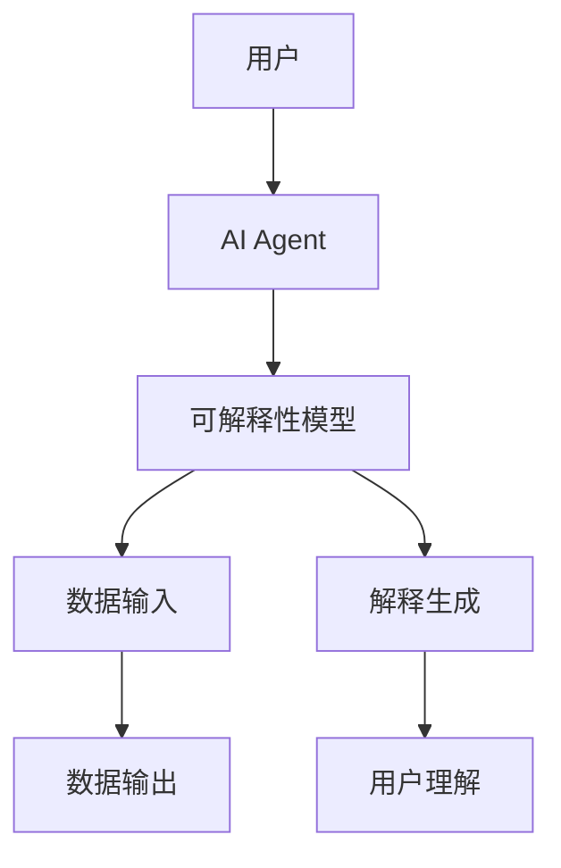
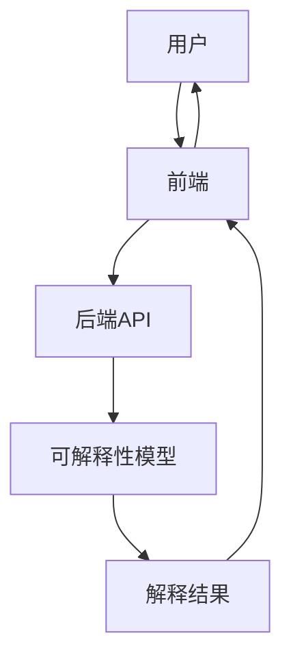
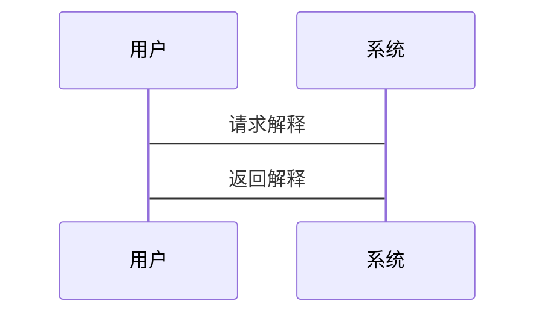

                 


# {{构建可解释的AI Agent：透明度和可信度}}

> 关键词：可解释性AI，AI Agent，透明度，可信度，算法解释，系统架构，项目实战

> 摘要：本文将深入探讨构建可解释的AI Agent的关键技术，重点分析透明度和可信度的重要性。通过详细讲解可解释性AI的核心概念、算法原理、系统架构设计以及项目实战，本文将为读者提供一个全面的视角，帮助他们理解如何在实际项目中实现可解释的AI Agent。从背景介绍到算法实现，再到系统设计和案例分析，本文将一步步引导读者掌握构建透明和可信的AI Agent的技巧。

---

# 第1章: 可解释性AI Agent的背景与核心概念

## 1.1 可解释性AI的定义与重要性

### 1.1.1 什么是可解释性AI（XAI）
可解释性AI（Explainable AI，XAI）是指AI系统能够以人类可理解的方式解释其决策过程和结果。可解释性是构建透明和可信AI系统的核心要素。

### 1.1.2 可解释性在AI Agent中的重要性
AI Agent需要与人类交互，可解释性是用户信任AI Agent的前提。缺乏可解释性会导致用户不信任，进而影响AI Agent的广泛应用。

### 1.1.3 可解释性AI的边界与外延
可解释性AI的边界包括模型的可解释性、算法的可解释性、用户对可解释性的需求。外延则涉及可解释性与不可解释性模型的对比、可解释性与模型复杂度的平衡。

## 1.2 AI Agent的基本概念

### 1.2.1 AI Agent的定义
AI Agent是一种智能体，能够感知环境、自主决策并采取行动以实现目标。

### 1.2.2 AI Agent的核心组成要素
包括感知模块、决策模块、执行模块和学习模块。

### 1.2.3 可解释性与AI Agent的关系
可解释性是AI Agent与人类交互的关键，直接影响用户的信任和系统的接受度。

## 1.3 问题背景与问题描述

### 1.3.1 当前AI Agent面临的挑战
AI Agent在复杂环境中的决策缺乏透明性，导致用户难以理解其行为。

### 1.3.2 可解释性缺失带来的问题
用户不信任、责任追究困难、法律合规性问题。

### 1.3.3 问题解决的目标与方法
通过技术手段提升AI Agent的可解释性，使其决策过程透明化。

## 1.4 本章小结
本章介绍了可解释性AI的定义、重要性和在AI Agent中的应用，明确了构建可解释AI Agent的目标和挑战。

---

# 第2章: 可解释性AI的核心概念与联系

## 2.1 可解释性AI的原理

### 2.1.1 可解释性模型的分类
- 基于规则的模型：如决策树、规则集。
- 基于模型的模型：如线性回归、逻辑回归。
- 基于解释生成的模型：如LIME、SHAP。

### 2.1.2 可解释性与模型复杂度的关系
模型复杂度越高，可解释性越低。

### 2.1.3 可解释性与模型性能的平衡
在保证性能的前提下，尽可能提高可解释性。

## 2.2 可解释性AI的核心概念对比

### 2.2.1 不同可解释性方法的对比分析
| 方法 | 原理 | 解释能力 | 适用场景 |
|------|------|----------|----------|
| LIME  | 局部近似 | 高 | 单样本解释 |
| SHAP  | 增量贡献 | 高 | 全局解释 |
| 映射 | 映射到可解释特征 | 中 | 简单模型 |

### 2.2.2 可解释性与不可解释性模型的对比
- 可解释性模型：如线性回归。
- 不可解释性模型：如深度神经网络。

### 2.2.3 用户需求与模型可解释性的关系
用户对可解释性的需求越高，模型需要越高可解释性。

## 2.3 可解释性AI的ER实体关系图



## 2.4 本章小结
本章详细讲解了可解释性AI的原理、模型分类及核心概念，通过对比分析和ER图展示了系统的构成。

---

# 第3章: 可解释性AI的算法原理

## 3.1 可解释性AI的算法概述

### 3.1.1 基于规则的可解释性算法
- 决策树：通过树状结构展示决策过程。
- 规则集：通过一组规则解释决策。

### 3.1.2 基于模型的可解释性算法
- 线性回归：通过系数解释变量影响。
- 逻辑回归：通过概率解释决策。

### 3.1.3 基于解释生成的可解释性算法
- LIME：通过局部线性近似生成解释。
- SHAP：通过增量贡献值解释决策。

## 3.2 可解释性AI的算法实现

### 3.2.1 LIME算法原理
LIME通过局部线性近似生成可解释的规则，解释单个样本的决策。

### 3.2.2 SHAP值的计算
SHAP值通过模型预测变化的增量贡献，衡量每个特征对决策的影响。

### 3.2.3 算法实现代码示例

```python
import lime
from lime import lime_explanation

# 示例代码：使用LIME解释一个模型的决策
def explain_model(model, instance):
    explainer = lime_explanation.LimeExplainer()
    explanation = explainer.explain_model(model.predict, instance)
    return explanation
```

## 3.3 可解释性AI的数学模型与公式

### 3.3.1 SHAP值的公式
$$ SHAP_{i,j} = f(x_i) - f(x_i - j) $$

### 3.3.2 LIME的解释公式
$$ y = w_1x_1 + w_2x_2 + \dots + w_nx_n + b $$

## 3.4 本章小结
本章详细讲解了可解释性AI的算法原理，包括LIME和SHAP等方法，并通过代码示例和公式展示了算法实现。

---

# 第4章: 系统分析与架构设计方案

## 4.1 问题场景介绍

### 4.1.1 项目介绍
构建一个可解释的医疗AI诊断系统。

## 4.2 系统功能设计

### 4.2.1 领域模型


### 4.2.2 系统架构设计


## 4.3 系统接口设计

### 4.3.1 API接口定义
```http
POST /api/explain
Content-Type: application/json
{
    "input": {...}
}
```

## 4.4 系统交互设计

### 4.4.1 交互流程


## 4.5 本章小结
本章通过医疗AI诊断系统的案例，展示了系统架构设计和交互流程。

---

# 第5章: 项目实战

## 5.1 环境安装

### 5.1.1 安装依赖
```bash
pip install lime
pip install numpy
pip install scikit-learn
```

## 5.2 核心代码实现

### 5.2.1 可解释性模型实现
```python
import lime
from lime import lime_explanation

class ExplainableModel:
    def __init__(self, model):
        self.model = model
        self.explainer = lime_explanation.LimeExplainer()

    def explain_instance(self, instance):
        return self.explainer.explain_model(self.model.predict, instance)
```

## 5.3 案例分析与详细解读

### 5.3.1 案例分析
通过医疗诊断系统的案例，展示如何使用LIME解释模型决策。

### 5.3.2 代码应用解读
```python
# 示例代码：解释一个具体病例的诊断结果
model = ExplainableModel(diagnosis_model)
explanation = model.explain_instance(patient_data)
print(explanation)
```

## 5.4 项目小结
本章通过实际项目展示了可解释性AI的实现过程，包括环境安装、代码实现和案例分析。

---

# 第6章: 最佳实践与总结

## 6.1 小结
构建可解释的AI Agent需要从算法选择、系统设计和用户交互等多个方面综合考虑。

## 6.2 注意事项
- 选择合适的可解释性方法。
- 确保解释的准确性和简洁性。
- 考虑系统的性能和可扩展性。

## 6.3 拓展阅读
- "Explainable AI: A Survey" by Marcos Alvarez
- "Interpretable Machine Learning" by Christoph Molnar

---

# 附录

## 附录A: 术语表
- 可解释性AI（XAI）：指AI系统能够以人类可理解的方式解释其决策过程和结果。
- SHAP值：通过增量贡献值解释决策的可解释性方法。

## 附录B: 工具与库
- LIME：可解释性AI的常用工具库。

## 附录C: 参考文献
- Marcos Alvarez. "Explainable AI: A Survey."
- Christoph Molnar. "Interpretable Machine Learning."

---

# 结束语

构建可解释的AI Agent是一个复杂但重要的任务。通过本文的详细讲解，读者可以掌握构建透明和可信AI Agent的关键技术，并在实际项目中应用这些方法。未来，随着技术的发展，可解释性AI将变得更加重要，我们需要不断探索和优化，以实现更高效、更可信的AI系统。

