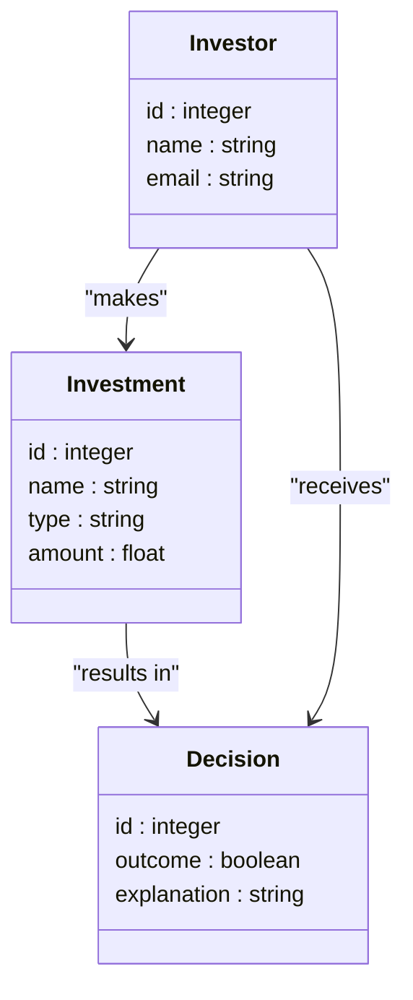

                 


# 构建可解释的AI投资决策支持系统

> 关键词：可解释AI, 投资决策, 机器学习, 系统架构, 金融应用

> 摘要：本文详细探讨了如何构建一个可解释的AI投资决策支持系统，从问题背景、核心概念到算法原理、系统架构，再到项目实战和最佳实践，系统地分析了构建该系统的关键步骤和方法。通过实际案例分析，本文展示了如何在投资决策中实现可解释性AI的应用，为金融领域的决策者提供了理论和实践指导。

---

## 第1章：问题背景与核心概念

### 1.1 问题背景

#### 1.1.1 投资决策的复杂性与挑战
投资决策是金融市场中的核心活动之一，但其复杂性来源于市场的不确定性、信息的不对称性和决策的高风险性。传统的投资决策方法依赖于经验丰富的分析师或专家，但这种方法存在效率低、覆盖面有限的问题。近年来，随着人工智能（AI）技术的快速发展，AI在投资决策中的应用逐渐成为研究热点。

#### 1.1.2 AI在投资决策中的应用现状
AI技术，尤其是机器学习算法，已经在金融领域取得了显著成果。例如，利用自然语言处理（NLP）技术分析财务报表，利用时间序列分析预测股票价格等。然而，这些AI模型通常是一个“黑箱”，缺乏可解释性，这在金融领域是一个严重的问题，因为可解释性是确保合规性和信任的关键。

#### 1.1.3 可解释性AI的重要性
可解释性AI（Explainable AI, XAI）是指AI系统能够清晰地解释其决策过程和结果的能力。在投资决策中，可解释性AI不仅能够帮助投资者理解模型的决策依据，还可以帮助监管机构验证模型的合规性。此外，可解释性AI还能提高投资者的信任度，使其更愿意依赖AI系统做出决策。

### 1.2 核心概念与问题描述

#### 1.2.1 可解释AI的定义与特征
可解释AI是指AI系统能够以人类可理解的方式解释其决策过程和结果的能力。其主要特征包括：
1. **透明性**：模型的决策过程必须是透明的，用户能够理解模型如何得出结论。
2. **可解释性**：模型的决策结果必须能够被解释，用户能够理解模型为何做出这样的决策。
3. **可验证性**：模型的决策过程和结果必须能够被验证，用户能够确认模型的决策是否合理。

#### 1.2.2 投资决策支持系统的功能需求
投资决策支持系统（IDSS）的功能需求包括：
1. **数据采集**：从多种数据源（如财务报表、市场数据、新闻等）获取数据。
2. **数据预处理**：清洗、转换和标准化数据。
3. **特征提取**：从数据中提取有用的特征，用于模型训练。
4. **模型训练**：训练可解释的AI模型，用于投资决策。
5. **结果解释**：将模型的决策结果以用户可理解的方式呈现。
6. **交互与反馈**：用户可以通过交互界面与系统互动，并提供反馈。

#### 1.2.3 系统的边界与外延
投资决策支持系统的边界包括：
1. **数据范围**：系统仅处理与投资相关的数据，如市场数据、公司基本面数据等。
2. **决策范围**：系统仅用于投资决策，不涉及其他领域。
3. **用户范围**：系统主要面向专业投资者和机构投资者。

系统的外延包括：
1. **数据来源扩展**：未来可以接入更多的数据源，如社交媒体数据、宏观经济数据等。
2. **模型优化**：未来可以尝试更复杂的模型，如强化学习模型，但前提是确保模型的可解释性。
3. **应用场景扩展**：未来可以将系统应用于风险管理、资产配置等领域。

### 1.2.4 核心概念的组成与联系

#### 1.2.4.1 可解释AI的原理
可解释AI的核心原理是通过模型的透明性和可解释性，使用户能够理解模型的决策过程和结果。例如，线性回归模型是一个可解释性很强的模型，其系数可以直接解释各个特征对目标变量的影响。

#### 1.2.4.2 投资决策支持系统的模块构成
投资决策支持系统的模块构成包括：
1. **数据采集模块**：负责从多种数据源采集数据。
2. **数据预处理模块**：负责对数据进行清洗、转换和标准化。
3. **特征提取模块**：负责从数据中提取有用的特征。
4. **模型训练模块**：负责训练可解释的AI模型。
5. **结果解释模块**：负责将模型的决策结果以用户可理解的方式呈现。
6. **交互与反馈模块**：负责用户与系统之间的交互和反馈。

#### 1.2.4.3 系统核心要素的ER实体关系图

```mermaid
erDiagram
    investor {
        id : integer
        name : string
        email : string
    }
    investment {
        id : integer
        name : string
        type : string
        amount : float
    }
    decision {
        id : integer
        outcome : boolean
        explanation : string
    }
    investor -> investment : "makes"
    investment -> decision : "results in"
    investor -> decision : "receives"
```

---

## 第2章：可解释AI的核心原理与算法

### 2.1 可解释AI的核心原理

#### 2.1.1 解释性模型的特征对比表

| 模型类型       | 可解释性 | 透明性 | 计算效率 | 精度 |
|----------------|----------|--------|----------|------|
| 线性回归       | 高       | 高      | 高        | 中等 |
| 决策树         | 较高     | 中等     | 中等      | 中等 |
| 随机森林       | 较低     | 低       | 低        | 高   |
| 支持向量机（SVM）| 较低     | 低       | 低        | 高   |
| 神经网络       | 极低     | 极低     | 低        | 高   |

#### 2.1.2 可解释性与黑箱模型的区别
可解释性模型与黑箱模型的主要区别在于：
- **可解释性模型**：模型的决策过程是透明的，用户可以理解模型的决策依据。
- **黑箱模型**：模型的决策过程是不透明的，用户无法理解模型的决策依据。

#### 2.1.3 解释性模型的分类与选择
解释性模型的分类包括：
1. **线性模型**：如线性回归、逻辑回归等。
2. **树模型**：如决策树、随机森林等。
3. **规则模型**：如基于规则的模型。
4. **可解释的神经网络模型**：如使用SHAP值解释的神经网络模型。

### 2.2 核心算法原理

#### 2.2.1 线性回归模型

##### 2.2.1.1 线性回归的数学模型
线性回归的数学模型如下：
$$ y = \beta_0 + \beta_1x_1 + \beta_2x_2 + \cdots + \beta_nx_n + \epsilon $$

##### 2.2.1.2 算法流程图（mermaid）

```mermaid
graph TD
    A[开始] -> B[读取数据]
    B -> C[计算特征]
    C -> D[计算目标变量]
    D -> E[训练模型]
    E -> F[预测结果]
    F -> G[结束]
```

##### 2.2.1.3 Python代码实现

```python
import pandas as pd
import numpy as np
from sklearn.linear_model import LinearRegression

# 读取数据
data = pd.read_csv('investment_data.csv')

# 分离特征和目标变量
X = data.drop('target', axis=1)
y = data['target']

# 训练模型
model = LinearRegression()
model.fit(X, y)

# 预测结果
predictions = model.predict(X)
```

##### 2.2.1.4 线性回归的可解释性
线性回归模型的可解释性体现在其系数上。每个系数表示对应特征对目标变量的影响程度。例如，系数为正的特征表示该特征对目标变量有正向影响，系数为负的特征表示有反向影响。

#### 2.2.2 决策树模型

##### 2.2.2.1 决策树的算法流程图（mermaid）

```mermaid
graph TD
    A[开始] -> B[选择特征]
    B -> C[分割数据]
    C -> D[判断特征值]
    D -> E[创建子节点]
    E -> F[结束]
```

##### 2.2.2.2 决策树的特征重要性分析
决策树模型的特征重要性可以通过树的深度和分裂次数来衡量。特征的重要性越高，树的分支越深，分裂次数越多。

##### 2.2.2.3 Python代码实现

```python
from sklearn.tree import DecisionTreeRegressor
from sklearn.datasets import load_diabetes

# 读取数据
data = load_diabetes()
X = data.data
y = data.target

# 训练模型
model = DecisionTreeRegressor()
model.fit(X, y)

# 特征重要性
importances = model.feature_importances_
```

---

## 第3章：算法原理与数学模型

### 3.1 线性回归模型

#### 3.1.1 线性回归的数学模型
线性回归的数学模型如下：
$$ y = \beta_0 + \beta_1x_1 + \beta_2x_2 + \cdots + \beta_nx_n + \epsilon $$

#### 3.1.2 线性回归的可解释性
线性回归模型的可解释性体现在其系数上。每个系数表示对应特征对目标变量的影响程度。例如，系数为正的特征表示该特征对目标变量有正向影响，系数为负的特征表示有反向影响。

### 3.2 决策树模型

#### 3.2.1 决策树的算法流程图（mermaid）

```mermaid
graph TD
    A[开始] -> B[选择特征]
    B -> C[分割数据]
    C -> D[判断特征值]
    D -> E[创建子节点]
    E -> F[结束]
```

#### 3.2.2 决策树的特征重要性分析
决策树模型的特征重要性可以通过树的深度和分裂次数来衡量。特征的重要性越高，树的分支越深，分裂次数越多。

### 3.3 SHAP值与LIME解释方法

#### 3.3.1 SHAP值的计算公式
SHAP值的计算公式如下：
$$ SHAP_{ij} = \phi_j = \sum_{k} \phi_{ijk} $$

其中，$\phi_{ijk}$表示特征$j$在第$k$个样本上的贡献。

---

## 第4章：系统分析与架构设计

### 4.1 问题场景介绍

#### 4.1.1 系统目标
系统目标是构建一个可解释的AI投资决策支持系统，帮助投资者做出更明智的投资决策。

#### 4.1.2 项目介绍
项目介绍包括：
1. 项目背景
2. 项目目标
3. 项目范围
4. 项目计划

### 4.2 系统功能设计

#### 4.2.1 领域模型（mermaid类图）



#### 4.2.2 系统架构设计（mermaid架构图）


---

## 第5章：项目实战

### 5.1 环境安装

#### 5.1.1 安装Python
安装Python的版本建议为3.6或更高。

#### 5.1.2 安装必要的库
安装以下库：
- pandas
- numpy
- scikit-learn
- xgboost
- matplotlib
- seaborn

### 5.2 系统核心实现

#### 5.2.1 数据预处理代码

```python
import pandas as pd
import numpy as np

# 读取数据
data = pd.read_csv('investment_data.csv')

# 删除缺失值
data = data.dropna()

# 标准化数据
from sklearn.preprocessing import StandardScaler

scaler = StandardScaler()
data_scaled = scaler.fit_transform(data)
```

#### 5.2.2 模型训练代码

```python
from sklearn.ensemble import RandomForestRegressor
from sklearn.metrics import mean_squared_error

# 训练模型
model = RandomForestRegressor()
model.fit(X_train, y_train)

# 预测结果
y_pred = model.predict(X_test)

# 计算均方误差
mse = mean_squared_error(y_test, y_pred)
print(f'均方误差: {mse}')
```

### 5.3 实际案例分析

#### 5.3.1 数据分析与可视化

```python
import matplotlib.pyplot as plt

# 绘制特征重要性图
importances = model.feature_importances_
indices = np.argsort(importances)[::-1]

plt.figure(figsize=(10, 6))
plt.title('特征重要性')
plt.xticks(range(len(indices)), data.columns[indices])
plt.xlabel('特征重要性')
plt.ylabel('特征名称')
plt.show()
```

---

## 第6章：最佳实践与总结

### 6.1 最佳实践

#### 6.1.1 数据质量管理
数据质量管理包括数据清洗、数据标准化和数据增强。

#### 6.1.2 模型选择与优化
模型选择与优化包括选择合适的模型、调整模型参数和验证模型性能。

#### 6.1.3 结果解释与反馈
结果解释与反馈包括解释模型的决策结果、收集用户反馈和优化系统性能。

### 6.2 小结
通过本文的详细讲解，读者可以了解到构建可解释的AI投资决策支持系统的各个方面，包括问题背景、核心概念、算法原理、系统架构、项目实战和最佳实践。

### 6.3 注意事项
在实际应用中，需要注意以下几点：
1. **数据隐私**：确保数据的隐私和安全。
2. **模型解释性**：确保模型的可解释性，以便用户理解模型的决策过程。
3. **系统稳定性**：确保系统的稳定性和可靠性。

### 6.4 拓展阅读
推荐以下书籍和论文：
1.《可解释的人工智能：模型、方法和应用》
2.《可解释的机器学习：指南、工具和资源》

---

通过以上内容，我们详细讲解了如何构建一个可解释的AI投资决策支持系统，从理论到实践，为读者提供了全面的指导。希望本文能够为投资领域的决策者和研究人员提供有价值的参考。

