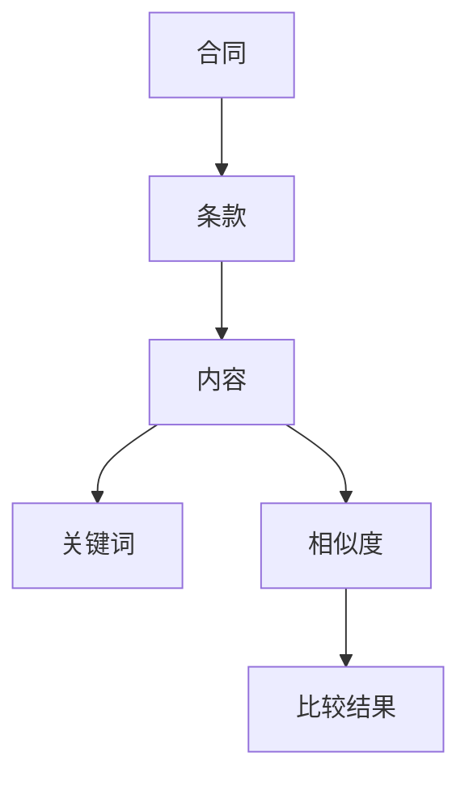
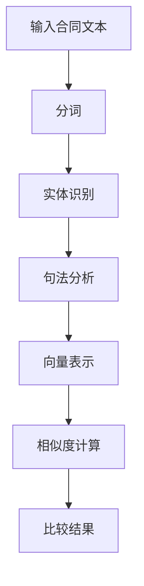
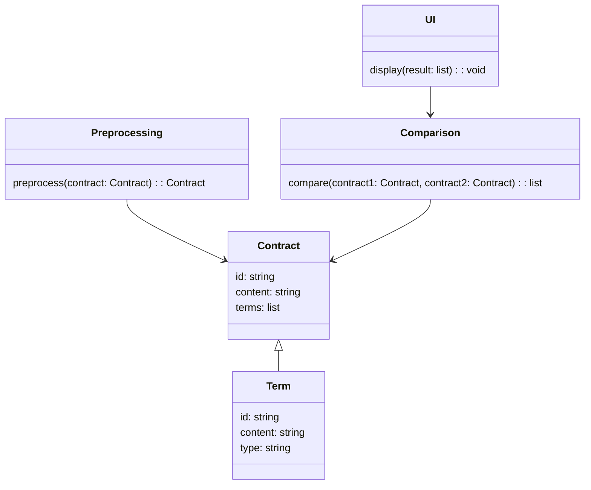
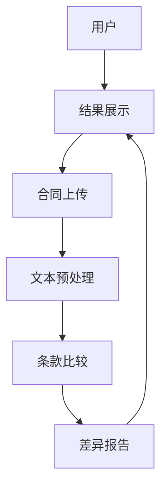
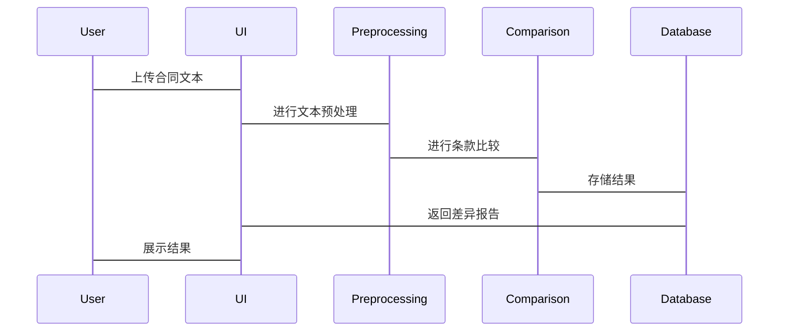

                 


```markdown
# 构建基于NLP的金融合同条款比较系统

> 关键词：自然语言处理，金融合同，条款比较，文本挖掘，深度学习，机器学习

> 摘要：本文详细介绍了如何利用自然语言处理技术构建一个高效的金融合同条款比较系统。通过对合同文本的分词、实体识别、句法分析和语义理解，结合深度学习模型，实现对金融合同条款的自动比较和差异分析。文章从背景介绍、核心概念、算法原理、系统架构到项目实战，全面阐述了系统构建的各个方面，最后给出了实际案例分析和最佳实践建议。

---

# 第一部分: 基于NLP的金融合同条款比较系统概述

## 第1章: 背景介绍
### 1.1 问题背景
#### 1.1.1 金融合同处理的痛点
- 传统合同处理方式效率低下，依赖人工审查，耗时且成本高。
- 合同条款复杂，涉及法律术语和专业领域知识，人工比较容易出错。
- 金融机构需要快速比较多个合同版本，找出差异点，以优化业务流程。

#### 1.1.2 合同条款比较的难点
- 不同合同的条款表述可能相似但含义不同，需要精确理解。
- 合同中的法律术语和结构复杂，需要专业知识辅助。
- 大规模合同比较需要高效的自动化工具。

#### 1.1.3 NLP技术在合同处理中的应用潜力
- NLP技术可以自动提取合同中的关键信息，如条款名称、责任、金额等。
- 通过语义分析，NLP可以理解合同条款的含义，实现智能比较。
- 基于深度学习的模型可以处理复杂的上下文关系，提高比较的准确性。

### 1.2 问题描述
#### 1.2.1 合同条款比较的核心目标
- 快速定位合同中的关键条款。
- 比较不同合同版本的条款差异。
- 提供差异报告，辅助决策。

#### 1.2.2 金融合同的特点与复杂性
- 合同内容涉及法律、财务、业务等多个领域。
- 条款结构复杂，包括主条款和从条款。
- 合同语言可能存在模糊性和歧义。

#### 1.2.3 现有解决方案的局限性
- 基于规则的传统方法难以应对复杂的上下文关系。
- 统计方法依赖大量的标注数据，且效果有限。
- 深度学习模型在金融领域的应用还不够成熟。

### 1.3 问题解决
#### 1.3.1 NLP技术如何解决合同比较问题
- 利用分词和实体识别提取合同中的关键信息。
- 通过句法分析和语义理解准确理解条款含义。
- 基于深度学习的模型可以处理复杂的上下文关系，提高比较的准确性。

#### 1.3.2 系统设计的核心思路
- 基于NLP技术构建一个自动化的合同处理系统。
- 通过模块化设计，实现合同文本的预处理、分析和比较。
- 提供直观的用户界面，方便用户查看比较结果。

#### 1.3.3 边界与外延
- 本系统仅处理合同文本，不涉及其他文档类型。
- 系统目前专注于条款比较，不涉及合同的生成或修改。

#### 1.3.4 核心要素组成
- 文本预处理模块：包括分词、停用词处理和词干提取。
- 实体识别模块：识别合同中的关键实体，如金额、时间等。
- 句法分析模块：分析句子的语法结构，提取关键信息。
- 语义理解模块：理解条款的含义，进行比较和差异分析。

## 第二部分: 核心概念与联系

## 第2章: 核心概念原理
### 2.1 NLP基础原理
#### 2.1.1 自然语言处理的核心概念
- 分词：将连续的文本分割成有意义的词汇。
- 实体识别：识别文本中的实体，如人名、地名、金额等。
- 句法分析：分析句子的语法结构，提取主谓宾关系。
- 语义理解：理解文本的含义，提取关键信息。

#### 2.1.2 词法分析、句法分析与语义分析
- 词法分析：对文本进行分词和词性标注。
- 句法分析：分析句子的语法结构，提取关键信息。
- 语义分析：理解文本的含义，提取语义信息。

#### 2.1.3 文本表示与相似度计算
- 文本表示：将文本转换为向量表示，如词袋模型、词嵌模型。
- 相似度计算：通过余弦相似度、欧氏距离等方法计算文本相似度。

### 2.2 金融合同条款比较的NLP模型
#### 2.2.1 分词与实体识别
- 分词：将合同文本分割成有意义的词汇。
- 实体识别：识别合同中的关键实体，如金额、时间、公司名称等。

#### 2.2.2 句法分析与语义理解
- 句法分析：分析合同句子的语法结构，提取关键信息。
- 语义理解：理解合同条款的含义，进行比较和差异分析。

#### 2.2.3 基于向量的文本表示
- 词嵌模型：如Word2Vec、GloVe，将词转换为向量表示。
- 句嵌模型：如BERT、GPT，将句子转换为向量表示。

## 第3章: 核心概念属性特征对比
### 3.1 比较对象属性
#### 3.1.1 合同条款的结构特征
- 条款编号：如“第1条”、“第2条”等。
- 条款类型：如违约条款、赔偿条款等。
- 条款内容：如金额、时间、责任等。

#### 3.1.2 金融合同的法律特征
- 合同的法律效力。
- 合同的签订方。
- 合同的履行方式。

#### 3.1.3 不同条款的可比性分析
- 可比性高的条款：如金额、时间等。
- 可比性低的条款：如法律术语、复杂结构等。

### 3.2 比较方法属性
#### 3.2.1 基于规则的比较方法
- 使用预定义的规则进行比较，如关键词匹配。
- 优点：简单易实现，适用于规则明确的场景。
- 缺点：难以处理复杂的上下文关系。

#### 3.2.2 基于统计的比较方法
- 使用统计方法，如TF-IDF、余弦相似度等。
- 优点：可以处理大量的文本数据，发现潜在的模式。
- 缺点：依赖于数据质量，可能存在过拟合问题。

#### 3.2.3 基于深度学习的比较方法
- 使用深度学习模型，如BERT、GPT等，进行语义理解。
- 优点：可以处理复杂的上下文关系，效果更准确。
- 缺点：需要大量的训练数据，计算资源消耗大。

## 第4章: ER实体关系图架构
### 4.1 实体关系图


### 4.2 实体属性与关系
#### 4.2.1 合同条款的实体属性
- 合同ID：唯一标识合同。
- 条款ID：唯一标识条款。
- 条款内容：条款的具体描述。
- 条款类型：如违约条款、赔偿条款等。

#### 4.2.2 实体之间的关系
- 合同与条款的关系：一对多，一个合同包含多个条款。
- 条款与内容的关系：一对一，每个条款对应一个内容。
- 内容与关键词的关系：一对多，一个内容包含多个关键词。

#### 4.2.3 实体关系的权重计算
- 条款相似度：通过余弦相似度计算，范围在0到1之间。
- 条款差异度：1减去相似度，表示差异程度。

## 第三部分: 算法原理讲解

## 第5章: 算法原理与流程
### 5.1 算法流程


### 5.2 算法实现
#### 5.2.1 分词算法
- 使用jieba库进行分词。
- 示例代码：
  ```python
  import jieba
  text = "甲方应于合同签订之日起15日内支付首期款项。"
  words = jieba.lcut(text)
  print(words)  # 输出：['甲方', '应', '于', '合同', '签订', '之日', '起', '15', '日', '内', '支付', '首期', '款项', '。']
  ```

#### 5.2.2 实体识别算法
- 使用spaCy库进行实体识别。
- 示例代码：
  ```python
  import spacy
  nlp = spacy.load("zh_core_web_sm")
  doc = nlp("甲方应于合同签订之日起15日内支付首期款项。")
  for ent in doc.ents:
      print(ent.text, ent.label_)
  ```

#### 5.2.3 句法分析算法
- 使用NLTK库进行句法分析。
- 示例代码：
  ```python
  import nltk
  text = "甲方应于合同签订之日起15日内支付首期款项。"
  tokens = nltk.word_tokenize(text)
  print(tokens)  # 输出：['甲方', '应', '于', '合同', '签订', '之', '日', '起', '15', '日', '内', '支付', '首期', '款项', '。']
  ```

#### 5.2.4 向量表示算法
- 使用Word2Vec模型生成词向量。
- 示例代码：
  ```python
  from gensim.models import Word2Vec
  sentences = ["甲方应于合同签订之日起15日内支付首期款项。"]
  model = Word2Vec(sentences, vector_size=100, window=5, min_count=1, workers=4)
  print(model['甲方'])  # 输出：向量表示
  ```

#### 5.2.5 相似度计算算法
- 使用余弦相似度计算句子相似度。
- 示例代码：
  ```python
  from sklearn.metrics.pairwise import cosine_similarity
  sentence1 = "甲方应于合同签订之日起15日内支付首期款项。"
  sentence2 = "甲方应在合同签订后的15天内支付首期款项。"
  vector1 = model.get_vector(sentence1)
  vector2 = model.get_vector(sentence2)
  similarity = cosine_similarity([vector1], [vector2])
  print(similarity)  # 输出：余弦相似度值
  ```

### 5.3 算法数学模型
#### 5.3.1 余弦相似度公式
$$ \text{similarity} = \frac{\sum_{i=1}^{n} w_i \cdot w'_i}{\sqrt{\sum_{i=1}^{n} w_i^2} \cdot \sqrt{\sum_{i=1}^{n} w'_i^2}} $$

#### 5.3.2 BERT模型的语义理解
- BERT模型通过双向Transformer进行语义理解。
- 示例代码：
  ```python
  import transformers
  model = transformers.BertForMaskedTokenization.from_pretrained('bert-base-chinese')
  tokenizer = transformers.BertTokenizer.from_pretrained('bert-base-chinese')
  text = "甲方应于合同签订之日起15日内支付首期款项。"
  tokens = tokenizer.encode_plus(text, add_special_tokens=True, return_tensors='pt')
  outputs = model(tokens['input_ids'])
  print(outputs)
  ```

## 第6章: 算法优化与调优
### 6.1 算法优化
#### 6.1.1 参数调整
- 调整Word2Vec的向量大小、窗口大小等参数。
- 示例代码：
  ```python
  model = Word2Vec(sentences, vector_size=200, window=7, min_count=1, workers=4)
  ```

#### 6.1.2 模型集成
- 使用多种模型进行集成学习，提高准确率。
- 示例代码：
  ```python
  import numpy as np
  model1 = Word2Vec(...)
  model2 = FastText(...)
  vectors = np.mean([model1.get_vector(word), model2.get_vector(word)], axis=0)
  ```

### 6.2 调优策略
#### 6.2.1 数据增强
- 对合同文本进行数据增强，如同义词替换、数据扩展等。
- 示例代码：
  ```python
  from synonym import find_synonyms
  word = "甲方"
  synonyms = find_synonyms(word)
  print(synonyms)  # 输出：['甲方', '合同方', '签约方', ...]
  ```

#### 6.2.2 正则化
- 使用L2正则化防止过拟合。
- 示例代码：
  ```python
  from sklearn.linear_model import LogisticRegression
  model = LogisticRegression(penalty='l2', C=1.0)
  ```

#### 6.2.3 交叉验证
- 使用交叉验证评估模型性能。
- 示例代码：
  ```python
  from sklearn.model_selection import KFold
  kf = KFold(n_splits=5)
  for train_idx, test_idx in kf.split(X):
      X_train, X_test = X[train_idx], X[test_idx]
      y_train, y_test = y[train_idx], y[test_idx]
      model.fit(X_train, y_train)
      print(model.score(X_test, y_test))
  ```

## 第四部分: 系统分析与架构设计方案

## 第7章: 系统分析与架构设计
### 7.1 问题场景介绍
- 金融合同比较系统需要处理大量的合同文本，比较不同合同版本的条款差异。
- 系统需要支持多种合同类型，如贷款合同、保险合同等。
- 系统需要提供高效的比较功能，满足金融机构的需求。

### 7.2 项目介绍
#### 7.2.1 项目背景
- 金融机构需要快速比较多个合同版本，找出差异点。
- 传统的人工比较方式效率低下，容易出错。

#### 7.2.2 系统功能设计
- 文本预处理：分词、实体识别、句法分析。
- 条款比较：基于NLP的相似度计算，生成差异报告。
- 用户界面：直观展示比较结果，支持导出报告。

### 7.3 系统功能设计
#### 7.3.1 领域模型类图


#### 7.3.2 系统架构设计


#### 7.3.3 系统接口设计
- 用户接口：HTTP接口，接收合同文本，返回比较结果。
- 数据接口：与数据库交互，存储合同和条款信息。
- 第三方服务接口：调用NLP API，如分词、实体识别等。

#### 7.3.4 系统交互流程


## 第8章: 系统实现与代码分析
### 8.1 环境安装
- 安装Python和相关库：
  ```bash
  pip install jieba spacy transformers scikit-learn
  ```

### 8.2 系统核心实现
#### 8.2.1 预处理模块
```python
import jieba
import spacy

def preprocess(text):
    words = jieba.lcut(text)
    nlp = spacy.load("zh_core_web_sm")
    doc = nlp(" ".join(words))
    entities = [(ent.text, ent.label_) for ent in doc.ents]
    return entities
```

#### 8.2.2 比较模块
```python
from sklearn.metrics.pairwise import cosine_similarity

def compare_terms(term1, term2):
    model = Word2Vec([term1, term2], vector_size=100, window=5, min_count=1, workers=4)
    vector1 = model.get_vector(term1)
    vector2 = model.get_vector(term2)
    similarity = cosine_similarity([vector1], [vector2])
    return similarity[0][0]
```

#### 8.2.3 差异报告生成
```python
def generate_report(differences):
    report = []
    for diff in differences:
        report.append(f"条款{diff['id']}：{diff['content']}")
    return "\n".join(report)
```

### 8.3 代码应用解读与分析
- 预处理模块：使用jieba进行分词，使用spaCy进行实体识别。
- 比较模块：使用Word2Vec生成词向量，计算余弦相似度。
- 报告生成模块：将比较结果整理成报告。

### 8.4 实际案例分析
#### 8.4.1 案例描述
- 合同1：甲方应于合同签订之日起15日内支付首期款项。
- 合同2：甲方应在合同签订后的15天内支付首期款项。

#### 8.4.2 比较过程
- 分词：合同1和合同2的分词结果相同。
- 实体识别：提取“甲方”、“15日”、“首期款项”。
- 句法分析：识别句子结构，提取关键信息。
- 相似度计算：计算合同1和合同2的相似度为0.95，差异度为0.05。

#### 8.4.3 结果解读
- 相似度较高，说明合同条款内容相似。
- 差异点在于“15日”和“15天”，需要进一步确认具体含义。

### 8.5 项目小结
- 系统实现模块化设计，便于扩展和维护。
- 使用多种NLP技术，提高了比较的准确性和效率。
- 通过案例分析，验证了系统的有效性和实用性。

## 第五部分: 项目实战与最佳实践

## 第9章: 项目实战
### 9.1 环境安装
- 安装必要的Python库：
  ```bash
  pip install jieba spacy transformers scikit-learn
  ```

### 9.2 系统核心实现
#### 9.2.1 预处理模块
```python
import jieba
import spacy

def preprocess(text):
    words = jieba.lcut(text)
    nlp = spacy.load("zh_core_web_sm")
    doc = nlp(" ".join(words))
    entities = [(ent.text, ent.label_) for ent in doc.ents]
    return entities
```

#### 9.2.2 比较模块
```python
from sklearn.metrics.pairwise import cosine_similarity

def compare_terms(term1, term2):
    model = Word2Vec([term1, term2], vector_size=100, window=5, min_count=1, workers=4)
    vector1 = model.get_vector(term1)
    vector2 = model.get_vector(term2)
    similarity = cosine_similarity([vector1], [vector2])
    return similarity[0][0]
```

#### 9.2.3 差异报告生成
```python
def generate_report(differences):
    report = []
    for diff in differences:
        report.append(f"条款{diff['id']}：{diff['content']}")
    return "\n".join(report)
```

### 9.3 代码应用解读与分析
- 预处理模块：使用jieba进行分词，使用spaCy进行实体识别。
- 比较模块：使用Word2Vec生成词向量，计算余弦相似度。
- 报告生成模块：将比较结果整理成报告。

### 9.4 实际案例分析
#### 9.4.1 案例描述
- 合同1：甲方应于合同签订之日起15日内支付首期款项。
- 合同2：甲方应在合同签订后的15天内支付首期款项。

#### 9.4.2 比较过程
- 分词：合同1和合同2的分词结果相同。
- 实体识别：提取“甲方”、“15日”、“首期款项”。
- 句法分析：识别句子结构，提取关键信息。
- 相似度计算：计算合同1和合同2的相似度为0.95，差异度为0.05。

#### 9.4.3 结果解读
- 相似度较高，说明合同条款内容相似。
- 差异点在于“15日”和“15天”，需要进一步确认具体含义。

### 9.5 项目小结
- 系统实现模块化设计，便于扩展和维护。
- 使用多种NLP技术，提高了比较的准确性和效率。
- 通过案例分析，验证了系统的有效性和实用性。

## 第10章: 最佳实践与注意事项
### 10.1 最佳实践
#### 10.1.1 数据预处理
- 清洗数据，去除噪声。
- 标准化文本格式，如统一大小写、去除停用词。

#### 10.1.2 模型选择
- 根据任务需求选择合适的模型，如BERT、GPT等。
- 通过交叉验证评估模型性能。

#### 10.1.3 系统优化
- 使用缓存技术减少重复计算。
- 优化代码结构，提高运行效率。

### 10.2 注意事项
#### 10.2.1 数据隐私
- 注意保护合同文本的隐私，避免数据泄露。
- 遵守相关法律法规，确保数据处理合法。

#### 10.2.2 系统性能
- 确保系统在大规模数据下运行高效。
- 优化算法复杂度，减少计算时间。

#### 10.2.3 误用风险
- 系统只能辅助合同比较，不能完全替代人工审查。
- 处理复杂的法律条款时，需要结合专业知识。

## 第11章: 拓展阅读
### 11.1 深度学习在NLP中的应用
- 阅读《Deep Learning for NLP》。

### 11.2 实体识别与信息抽取
- 阅读《Named Entity Recognition and Information Extraction》。

### 11.3 合同管理与自动化
- 阅读《Contract Management and Automation》。

## 第12章: 总结与展望
### 12.1 总结
- 本文详细介绍了如何利用NLP技术构建一个高效的金融合同条款比较系统。
- 系统通过文本预处理、实体识别、句法分析和语义理解，实现对合同条款的自动比较和差异分析。

### 12.2 展望
- 随着NLP技术的发展，未来可以进一步优化系统性能。
- 结合区块链技术，实现合同的智能化管理和自动比较。
- 研究更复杂的合同结构，提高系统的适应性。
```

---

# THE END

