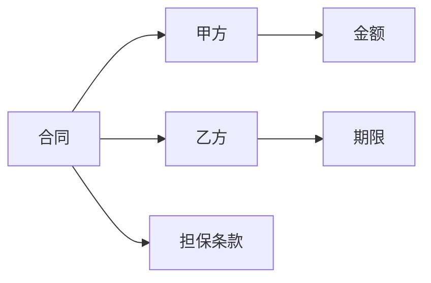
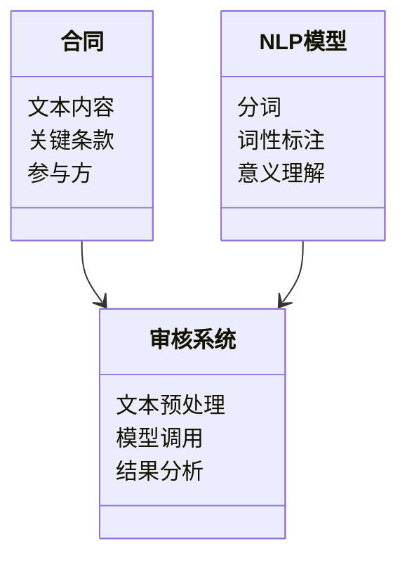
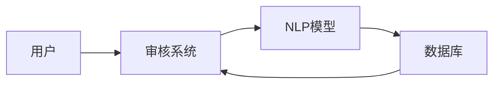
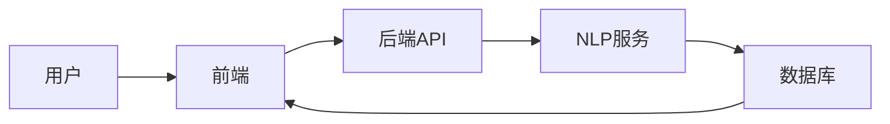
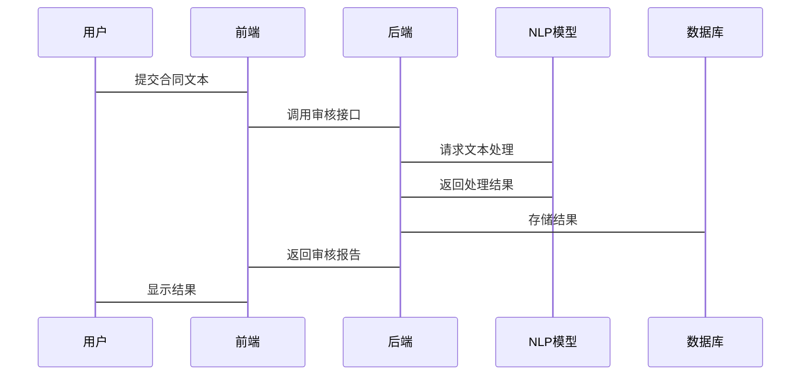

                 


# 构建基于NLP的金融合同自动化审核系统

## 关键词：自然语言处理，金融合同，自动化审核，机器学习，文本挖掘

## 摘要：本文详细介绍如何利用自然语言处理技术构建金融合同自动化审核系统。通过分析合同文本中的关键信息，利用NLP技术实现合同的自动分类、条款识别与合规性检查，从而提高审核效率和准确性。文章涵盖从问题背景、核心概念、算法原理到系统架构设计和项目实战的完整流程，为读者提供系统化的方法和实践指导。

---

# 第1章 问题背景与需求分析

## 1.1 问题背景

### 1.1.1 传统金融合同审核的痛点
- 人工审核耗时长，效率低。
- 容易出现人为疏漏，合规性风险高。
- 数据量大，难以快速提取关键信息。

### 1.1.2 人工审核的效率瓶颈
- 人员成本高，难以应对海量合同。
- 审核标准不统一，主观性强。
- 需要依赖大量经验，新手难以快速上手。

### 1.1.3 NLP技术的应用潜力
- 利用NLP技术自动提取合同中的关键条款和信息。
- 通过机器学习模型进行合同分类和合规性判断。
- 支持多种语言和复杂文本的处理。

## 1.2 问题描述

### 1.2.1 金融合同审核的核心任务
- 提取合同中的关键信息，如金额、期限、担保条款等。
- 检查合同的合法性、合规性。
- 快速分类合同类型，便于后续处理。

### 1.2.2 合同审核的关键要素
- 合同文本的结构化处理。
- 关键条款的识别与分类。
- 合规性检查与风险提示。

### 1.2.3 自动化审核的目标与范围
- 目标：实现合同的自动分类、关键信息提取和合规性检查。
- 范围：覆盖常见金融合同类型，支持多种语言和格式。

## 1.3 问题解决思路

### 1.3.1 NLP技术在合同审核中的应用
- 利用分词、实体识别和情感分析等技术处理合同文本。
- 通过预训练语言模型（如BERT）进行合同分类和条款识别。

### 1.3.2 自动化审核系统的整体架构
- 系统输入：合同文本。
- 中间处理：文本预处理、模型训练与推理。
- 系统输出：分类结果、关键信息提取和合规性报告。

### 1.3.3 系统边界与外延
- 输入边界：支持多种格式的合同文本。
- 输出边界：提供结构化的审核结果和风险提示。
- 外延：支持扩展功能，如多语言处理和动态规则更新。

---

# 第2章 核心概念与联系

## 2.1 NLP与金融合同审核的结合

### 2.1.1 NLP技术简介
- 分词：将文本分割为词语或短语。
- 词性标注：识别词语的语法角色。
- 命题抽取：提取文本中的关键信息。

### 2.1.2 金融合同审核的核心需求
- 快速提取合同中的金额、期限、担保条款等关键信息。
- 检查合同的合法性，识别潜在风险。
- 支持多种合同类型和格式的处理。

### 2.1.3 NLP在合同审核中的应用点
- 自动分类合同类型。
- 识别合同中的实体关系（如甲方、乙方）。
- 提取关键条款并进行合规性检查。

## 2.2 实体关系与领域模型

### 2.2.1 实体关系图（Mermaid）


### 2.2.2 领域模型类图（Mermaid）


## 2.3 系统边界与交互

### 2.3.1 系统边界图（Mermaid）


---

# 第3章 算法原理与数学模型

## 3.1 NLP算法原理

### 3.1.1 预训练语言模型简介
- 使用BERT等预训练模型进行合同文本的特征提取。
- 通过微调模型适应金融合同审核的特定任务。

### 3.1.2 文本表示方法
- 使用词向量（Word2Vec）或句向量（Sentence-BERT）表示合同文本。
- 将文本转换为固定长度的向量表示。

### 3.1.3 分类算法原理
- 使用支持向量机（SVM）或随机森林（Random Forest）进行合同分类。
- 通过训练模型识别合同的关键条款和合规性。

## 3.2 数学模型与公式

### 3.2.1 文本相似度计算
$$\text{余弦相似度} = \frac{\vec{A} \cdot \vec{B}}{|\vec{A}| |\vec{B}|}$$

### 3.2.2 文本分类模型
$$P(y|x) = \text{softmax}(Wx + b)$$

## 3.3 算法流程图（Mermaid）


---

# 第4章 系统分析与架构设计

## 4.1 项目介绍

### 4.1.1 项目目标
- 实现金融合同的自动分类和关键信息提取。
- 提供合规性检查和风险提示功能。

### 4.1.2 项目范围
- 支持多种合同类型和格式。
- 提供高精度的文本处理和分类能力。

## 4.2 系统功能设计

### 4.2.1 领域模型（Mermaid）


## 4.3 系统架构设计

### 4.3.1 系统架构图（Mermaid）


### 4.3.2 系统接口设计
- 前端接口：接收合同文本，返回审核结果。
- 后端接口：调用NLP模型进行文本处理，返回结构化的审核结果。

## 4.4 系统交互设计

### 4.4.1 交互序列图（Mermaid）


---

# 第5章 项目实战

## 5.1 环境安装

### 5.1.1 安装Python
```bash
python --version
pip install --upgrade pip
```

### 5.1.2 安装NLP库
```bash
pip install transformers
pip install sentence-transformers
pip install scikit-learn
```

## 5.2 系统核心实现

### 5.2.1 文本预处理代码
```python
from transformers import BertTokenizer

tokenizer = BertTokenizer.from_pretrained('bert-base-uncased')
text = "This is a sample contract text."
tokens = tokenizer.tokenize(text)
```

### 5.2.2 模型训练代码
```python
from sklearn.feature_extraction.text import TfidfVectorizer
from sklearn.svm import SVC

vectorizer = TfidfVectorizer()
model = SVC()
model.fit(vectorizer.fit_transform(train_texts), train_labels)
```

### 5.2.3 接口代码
```python
from fastapi import FastAPI

app = FastAPI()

@app.post("/api/contract_review")
async def review_contract(text: str):
    processed_text = preprocess(text)
    result = model.predict(processed_text)
    return {"result": result}
```

## 5.3 实际案例分析

### 5.3.1 案例背景
- 合同类型：贷款合同。
- 关键条款：贷款金额、还款期限、担保责任。

### 5.3.2 处理流程
1. 提交合同文本。
2. 系统进行文本预处理。
3. 调用NLP模型进行分类和关键信息提取。
4. 返回审核结果和风险提示。

## 5.4 项目小结

### 5.4.1 实践总结
- 系统实现的关键步骤：文本预处理、模型训练与部署。
- 实战中的常见问题及解决方案：如何处理不同格式的文本，如何优化模型性能。

---

# 第6章 最佳实践与小结

## 6.1 最佳实践

### 6.1.1 数据质量管理
- 确保训练数据的多样性和代表性。
- 定期更新模型以适应新的合同类型和条款变化。

### 6.1.2 模型优化
- 使用更复杂的模型（如BERT）提高准确率。
- 调整超参数，优化模型性能。

## 6.2 小结

### 6.2.1 系统优势
- 提高审核效率，减少人工成本。
- 提高审核准确性，降低合规风险。
- 支持多种合同类型和格式，具有良好的扩展性。

## 6.3 注意事项

### 6.3.1 数据隐私
- 确保合同文本的安全存储和传输。
- 遵守相关法律法规，保护用户隐私。

### 6.3.2 模型维护
- 定期更新模型，保持其准确性。
- 监控系统性能，及时修复问题。

## 6.4 拓展阅读

### 6.4.1 推荐书籍
- 《自然语言处理实战：基于Python的机器学习与深度学习》
- 《金融合同审核与风险控制》

### 6.4.2 推荐博客与资源
- 维基百科：自然语言处理
- Medium：机器学习与NLP应用

---

# 结语

通过本文的详细讲解，读者可以系统地了解如何利用NLP技术构建金融合同自动化审核系统。从问题背景到系统设计，再到项目实战，每一部分都进行了深入的分析和具体的实现。希望本文能够为读者提供有价值的指导和启发，帮助他们在实际应用中更好地利用NLP技术提升金融合同审核的效率和准确性。

